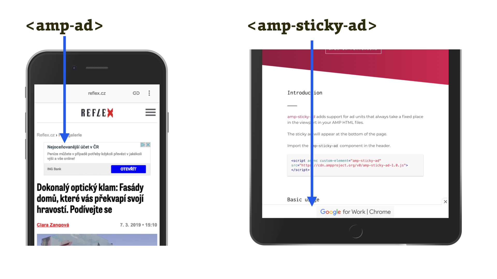

# AMP komponenty pro reklamu a analytiku

Jak asi čekáte, u reklamních komponent půjde o vkládání bannerů do stránky a jejich ovládání:

* `amp-ad` (nebo sémanticky také `amp-embed`) – obstarává vložení reklamy do stránky.
* `amp-ad-exit` – konfigurovatelný proces odchodu uživatele z reklamní plochy.
* `amp-sticky-ad` – zobrazování reklamy na fixní pozici ve viewportu uživatele.
* `amp-auto-ads` – automatické vkládání reklamy na určená místa stránky. Není potřeba je pak definovat pomocí tagů `<amp-ad>`.

[O reklamě v kontextu AMP](https://docs.google.com/document/d/18rnJuIl-BGSa1wjRysuBNN4gset5As4MpN4h5Brjpps/edit#) píšeme v samostatném textu, pokud by vás to zajímalo. Ono to zajímavé je, protože může jít o nemalý evoluční skok v technickém pojetí reklamy.

<figure>

<figcaption markdown="1">
_Obrázek: Reklamní komponenty v akci. amp-ad na webu Reflexu zobrazuje Google Ads. Druhá část ukazuje demíčko pro komponentu amp-sticky-ad. Ano, jde o tu hrůzu přilepenou ke spodní hraně obrazovky._
</figcaption>
</figure>

Další oblastí působnosti je analytika, měření všeho všemi:

* `amp-analytics` — komponenta pro jednotný způsob vkládání analytických skriptů od Google Analytics, ale i dalších poskytovatelů. [V dalším textu](https://docs.google.com/document/d/1wU9f1eK9gfV09AVCkB_zNOAzmMn9IgDB9RWCi_vlGBo/edit) se o ní rozepisujeme více.
* `amp-pixel` — vestavěná komponenta pro jednoduché měření zobrazení stránky.
* `amp-call-tracking` – možnost měření volání na určité telefonní číslo.
* `amp-share-tracking` – měření počtu sdílení na sociálních sítích. V době psaní textu je komponenta ještě ve vývoji.

V dalším textu se podíváme na „prezentační“ komponenty. Co se pod tím asi tak může skrývat?
