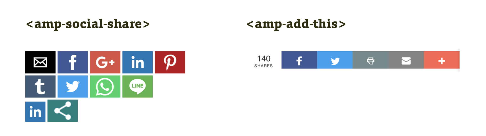

# AMP komponenty pro sociální sítě

Sdílecí tlačítka. Ani bez nich nedokáže spousta webů existovat. I pro ně má proto AMP vlastní komponenty.

<figure>

<figcaption markdown="1">
_Obrázek: Základní sdílecí komponenty, jedna univerzální a jedna specifická, využívající službu AddThis.com._
</figcaption>
</figure>

V rozumné formě jednotícího obalu pro všechny poskytovatele je navržená například následující komponenta.

## amp-social-share

Přidává tlačítka pro sdílení stránky. Od e-mailu přes klasiky jako Facebook, Twitter až po sdílení e-mailem.

Musíme začít vložením skriptu komponenty, jako vždycky:

```html
<script async custom-element="amp-social-share"
  src="https://cdn.ampproject.org/v0/amp-social-share-0.1.js">
</script>
```

Pak už je možné přidávat sdílecí tlačítka o sto šest. Buď vyloženě jednoduše…

```html
<amp-social-share type="facebook">
</amp-social-share>
```

… nebo s nastavením, jako například v následujícím kousku kódu:

```html
<amp-social-share type="linkedin" width="60" height="44"
  data-param-text="Tenhle blog je fakt boží, děcka!"
  data-param-url="https://www.vzhurudolu.cz/">
</amp-social-share>
```

Tentokrát detaily vysvětlovat nebudeme, jsou dost zřejmé. Vývojářská přívětivost je jedna ze silných stránek AMP.

Autoři mysleli i na podporu sdílecích tlačítek pro sítě, které v AMP vestavěné nejsou. Takhle například do stránky přidáte možnost sdílet text do Messengeru od Facebooku:

```html
<amp-social-share type="facebookmessenger"
  data-share-endpoint="fb-messenger://share"
  data-param-text="TITLE - CANONICAL_URL">
</amp-social-share>
```

Kapitálky u `TITLE` a `CANONICAL_URL` nejsou v ukázce úplně náhodou. Je to přesně to, jak to vypadá – proměnné. K náhradám proměnných na AMP Cache se dostaneme [hned v dalším textu](amp-predavani.md), takže knížku ještě neodkládejte a neutíkejte na Facebook sdílet něco užitečného.

## Další komponenty pro sociální sítě

Projděme si i další komponenty. Našince budou zajímat hlavně tyto:

* `amp-addthis` – sdílení na všech možných sítích přes službu AddThis.
* `amp-facebook-comments` – komentáře z Facebooku.
* `amp-facebook-like` – tlačítko „To se mi líbí“.
* `amp-facebook-page` – vloží obsah facebookové stránky.
* `amp-facebook` – vkládá konkrétní příspěvek: post, video nebo obrázek.
* `amp-instagram` – vyšpulené rty a jiné důležité příspěvky z Instagramu.
* `amp-twitter` – vkládání konkrétního tweetu nebo momentu.

Je jich ale k dispozici daleko více:

* `amp-beopinion` – vkládá rychlé dotazníky služby BeOpinion.
* `amp-gfycat` – animované kočky a jiné důležité věci z „gifové“ služby Gfycat.
* `amp-pinterest` – příspěvek z Pinterestu, ale také tlačítko „Save“ nebo „Pin“ z téhle v našich končinách nepříliš využívané sociální sítě.
* `amp-reddit` – vložený příspěvek nebo komentář z Redditu.
* `amp-riddle-quiz` – možnost vložení dotazníku, ankety atd. ze služby Riddle.
* `amp-vine` – video ze služby Vine.
* `amp-vk` – příspěvek nebo anketa ze sociální sítě VK, která je populární hlavně na východ od Košic.

## A co další sociální sítě?

Když se  díváme na seznam patnácti komponent v téhle kategorii, nemuseli bychom se divit lidem, kteří AMP zazlívají výlučnost a neotevřenost. Do seznamu se dostaly nejdůležitější sítě jako Facebook, Twitter, Pinterest nebo ruské VK, jenže spousta jiných – například LinkedIn – zde v době, kdy vzniká teto text, vlastní komponenty nemá.

Jak už jsme psali v části první kapitoly [o kritice AMP](amp-kritika-myty.md), pevně doufáme, že i zde se povede vymyslet jednotný framework požadavků na tento typ prvků stránky a přidání nového poskytovatele nebude vyžadovat tvorbu nové komponenty.

Autoři AMP ovšem umožňují přidání komponenty komukoliv. Stačí vytvořit pull request do repozitáře na Githubu.

Sekce o komponentách je u konce. Jak jste asi pochopili, už jen ony by vydaly na samostatnou knížku. Mohla by se jmenovat „Vzhůru do AMP komponent“ a mohla by vyjít na apríla.

Ptáte se proč? Protože by nejpozději v druhé polovině dubna přestala být aktuální. AMP komponenty se vyvíjí velmi rychle, a tak bude lepší, když se pro potřeby referenční příručky obrátíte na oficiální dokumentaci.

* Dokumentace: [amp.dev/documentation/components/](https://amp.dev/documentation/components/)
* Pískoviště pro zkoušení příkladů: [playground.amp.dev](https://playground.amp.dev/)

Nebo ještě počkejte, podíváme se na velmi ožehavé téma. Předávání informací mezi AMP a non-AMP verzí vašeho webu.
