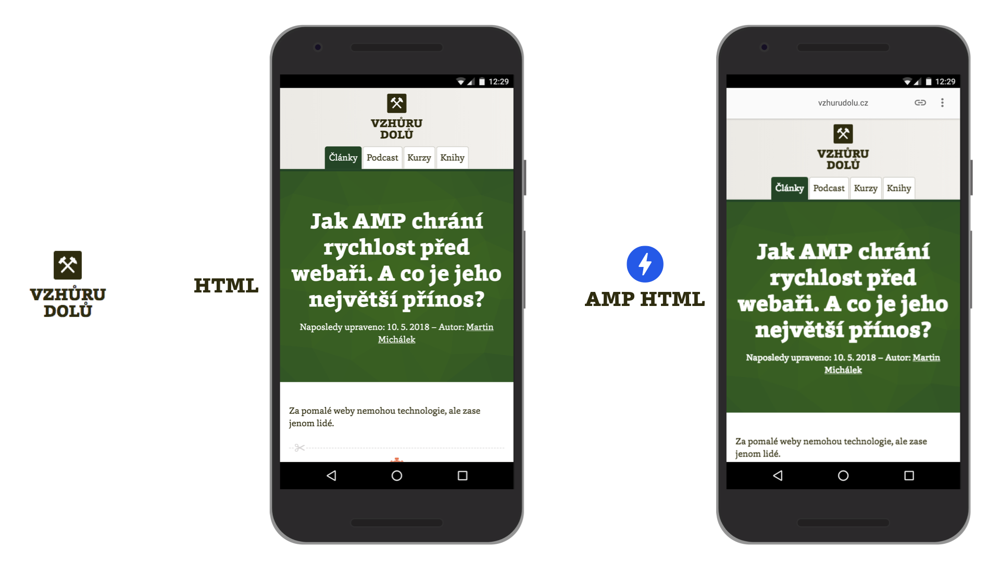

# Kritika a časté mýty kolem AMP

_„AMP je pro budoucnost webu dobré asi tak jako Trump pro zeměkouli,“_ napsal nám jeden z kritiků.

AMP budí někdy až přehnaně emotivní reakce. Některým bodům kritiky příliš rozumět není, některé jsou ale zajímavé a s některými dokonce souhlasíme.

<div class="web-only" markdown="1">
V dnešní ukázce z e-booku [Vzhůru do AMP](https://www.vzhurudolu.cz/ebook-amp/) se pozastavíme u tohoto důležitého tématu.
</div>

Následující texty cílíme hlavně na ty z vás, kteří máte k této technologii větší výhrady. Doporučujeme je ale pozornosti všem. Příběh téhle technologie a reakcí na ni je totiž v řadě věcí poučný nebo alespoň zajímavý.

<div class="ebook-only" markdown="1">

Pokud ale o AMP nemáte pochyby a už se těšíte, co nového se dozvíte, doporučujeme přeskočit rovnou na druhou kapitolu, [popisující AMP technicky](2-uvod.md), nebo na text páté kapitoly zjišťující, [zda je AMP vhodné pro vás](amp-je-pro-vas.md).

</div>

## 1) Start projektu a komunikace: Tohle se fakt nepovedlo {#1}

Z dřívějších textů už víme, čeho chtěli autoři AMP dosáhnout: Výrazně zlepšit uživatelský prožitek na co největším množství webů, hlavně prostřednictvím rychlosti.

Zvolili cestu zcela jiné formy distribuce ([AMP Cache](amp-cache.md)) a úpravy [HTML](amp-html.md), [CSS](amp-css.md) a [JavaScriptu](amp-javascript.md), technologií zavedených a standardizovaných. Až čas ukáže, jestli to byla správná cesta. Jednu věc ale podle všeho neudělali dobře hned na samém začátku.

<!-- AdSnippet -->

Autoři se dopustili dvou taktických chyb: Založili AMP jako projekt jedné firmy – která se ještě ke všemu jmenuje Google, což samo o sobě u spousty lidí znamená spuštění režimu _silná nedůvěra_. A pak přidali ještě jednu chybu: Nepostavili se jasně k webovým standardům.

### AMP od Googlu: Pro mnohé je to důkaz, že „Don't be evil“ už neplatí

První veřejné oznámení technologie proběhlo 7. října 2015 a mluví jasně: AMP je projekt Googlu. Dávalo to smysl. Vždyť která jiná firma by měla mít zájem na dramatickém vylepšení uživatelského prožitku z otevřené části webu než ta, která na něm vydělává nejvíce? Jak jinak reagovat na právě spuštěný konkurenční projekt od Facebooku, Instant Articles?

Personální základy AMP tedy položil Google. Už v úvodních oznámeních se ale mluví o partnerství s poskytovateli obsahu, jako jsou Twitter, Pinterest nebo BuzzFeed. Google nicméně projekt vedl a navazoval na něj své další projekty.

<p class="video web-only">
Video: <a href="https://www.youtube.com/watch?v=a9E-gL8NOqs">AMP: Základy technologie pro rychlé weby</a> ~ Proč AMP potřebujeme a z čeho je vlastně tahle technologie složená?
</p>

Tady někde se zrodila ta názorová vlna, že jde o skupinu technologií jedné firmy. Klasický „vendor lock“, uzamčení uživatelů v technologiích jedné firmy, ze kterého není úniku.

Až po čase se v procesu rozhodování o směru vývoje AMP začaly objevovat další firmy. Jak píšeme dále, dnes sedí ve vedení projektu lidé z Microsoftu, The Washington Post, AliExpressu, Cloudflare a dalších společností. Jenže onen negativní nádech „vendor lock od Googlu“ na AMP u mnohých zůstává.

### Start bez W3C, vstup do OpenJS Foundation

Google založil AMP mimo standardizační organizaci World Wide Web (W3C). I to dávalo smysl. Konsorcium W3C je skvělé, ale takto komplexní technologii by standardizovalo přinejlepším léta. Když se standardizuje, musí se přesně vědět co. Rychlé experimentování je totiž jedním z cílů AMP.

Ta nejpodstatnější část AMP – kešování stránek na serverech velkých firem – je navíc zcela mimo záběr takovéto organizace. Prosazování myšlenky zrychlení celého webu musí z principu přicházet z jedné nebo více velkých firem, které na tom mají zájem a zároveň je netrápí nedostatek prostředků pro realizaci.

<div class="related web-only" markdown="1">
- [AMP weby: Co to je](amp.md)
- [Případové studie: 80 % konverzí navíc](amp-co-je-pripadovky.md)
</div>

Autoři si svůj standardizační dluh uvědomují a některé z novinek, které se poprvé objevily v AMP už nyní rostou pod křídly standardizační organizace, viz například text „Standardizing lessons learned from AMP“. [vrdl.in/ampless](https://blog.amp.dev/2018/03/08/standardizing-lessons-learned-from-amp/)

V říjnu 2019 pak AMP vstoupil do OpenJS Foundation, organizace, která řídí a hradí vývoj také jQuery, ale i Node.js, Webpacku, frameworku Electron a dalších více než třiceti pro dnešní webovou vývojařinu nepostradatelných projektů.

Ony velké „standardizační problémy“ AMP dnes už tedy podle nás neexistují nebo je přinejmenším na cestě řešení. Jenže nálepky zůstaly, což je skutečně škoda. Proč udělali autoři AMP takové chyby, ptáte se?

### „Prostě jsme komunikovali jako idioti“

Klíč k pochopení chyby je ve sdělování úmyslů a v pořadí provedení jednotlivých kroků. I David Besbris, viceprezident pro engineering v Googlu, v rozhovoru pro The Verge na rovinu říká:

„Byli jsme prostě v komunikaci téhle věci idioti?“ ptá se a sám si odpovídá: „Ano, byli.“

Ke čtení doporučujeme celý text „Inside Google’s plan to make the whole web as fast as AMP“. [vrdl.in/ampverge](https://www.theverge.com/2018/3/8/17095078/google-amp-accelerated-mobile-page-announcement-standard-web-packaging-urls)

Pojďme si ale projít i další body kritiky, která se k AMP váže.

## 2) AMP jako nefér výhoda ve vyhledávání na Googlu? Jak se to vezme {#2}

AMP vám sice samo o sobě nezaručí lepší pozice a vyšší návštěvnost, stránky vyrobené touhle technologií jsou ovšem v přirozených výsledcích vyznačené symbolem AMP loga. Je tedy pravděpodobné, že dříve či později na ně začnou lidé více klikat.

Vyšší míra prokliku pak může znamenat lepší pozice, protože jde o jeden ze signálů, podle nichž Google řadí výsledky.

<figure>

<figcaption markdown="1">
_Výsledky vyhledávání Googlu. Zvýšený výskyt AMP je možné sledovat hlavně v místech, která se týkají aktuálních událostí._
</figcaption>
</figure>

Co je ale důležitější – AMP stránky dostávají přednost v oblasti Hlavních události (Top Stories), místě o kterém se mluví jako o „AMP karuselu“, ale i na jiných místech platformy Googlu.

Tady nevoli části odborníků rozumíme – aby se váš web mohl vyskytoval na exkluzivním místě výsledků hledání na populární zpravodajské fráze, musí být vyrobený touto technologií.

Z pohledu kritika to vypadá jasně: Jde o protlačováním technologie, která je vnímána jako vyráběná Googlem. Technologie, která nutí webaře vyrábět zvláštní verze webů. Nic z toho už dnes není v plné míře pravda.

Lidé stojí o kvalitní a rychlý uživatelský prožitek, proto Google vždy nějak upřednostňoval weby, které mu dokážou něco takového garantovat. Například uvedený „AMP karusel“ spoléhá právě na to, že stránky v něm obsažené budou velmi rychlé a bezpečné, protože je po načtení mezi nimi nutno přecházet „swipováním“ zprava doleva. Garance rychlosti a bezpečnosti ale bohužel u dnešních běžných webů není možné dosáhnout, jak za chvíli uvidíte.

Když tento bod kritiky sečteme a podtrhneme, „AMP karusel“ je z důvodu vyžadování určité technologie s potřebou nemalé investice do vývoje problematický. Martinův názor je, že Google měl s implementací této vlastnosti vyhledávání počkat, až zde dokáže umísťovat i běžné weby.

„AMP karusel“ udělal téhle užitečné technologii z pohledu renomé poměrně medvědí službu a zbytečně vyvolal bouře nevole.

## 3) Přednačítání běžných webů? Pracuje se na tom, ale potřebujeme nové technologie {#3}

Přednačtení je jedna z hlavních architektonických výher AMP a také jeden z hlavních důvodů, proč jsou stránky postavené touto technologií tak rychlé.

Možná vás překvapí, že sami autoři AMP píší o tom, že by rádi zajistili tuto vlastnost jakékoliv webové stránce. V už zmíněném textu „Standardizing lessons learned from AMP“ píší, že by to mělo být možné díky technologii Web Packaging. [vrdl.in/ampless](https://blog.amp.dev/2018/03/08/standardizing-lessons-learned-from-amp/)

### Proč ale přednačítání běžných webů není možné už dnes?

Obecně je to otázka důvěry a rizika. Přidat _nějakou_ ikonku a _nějak_ přednačíst lze každou stránku. Pokud by ale Google přednačítal každou stránku, neexistují technické prostředky, kterými by se mohl chránit před nebezpečným nebo třeba jen pomalým kódem. O co se třeba jedná?

V první řadě o JavaScript. Jakmile je ve hře, nelze se na nic spolehnout. Stránky by se mohly chovat pokaždé jinak. Přímo ve výsledcích vyhledávání, aniž by na ně uživatel klikl, by mohly sledovat citlivá data, či se dokonce pokoušet využít bezpečnostních chyb.

### Bezpečnost

Možných rizik při umístění běžných webů na doméně Googlu není málo. Zde jsme o vyjádření poprosili bezpečnostního experta Michala Špačka: „Umístění normálních webů na doménu Google.com by napomohlo útokům Cross-Site Scripting (XSS), které přesně takto fungují: na cizí doménu dostane útočník svůj JavaScript. Ten se pak spustí v kontextu dané stránky (anglický výraz _origin_ je přesnější, ale do češtiny špatně přeložitelný) a může mít přístup ke cookies a dalším věcem, které zvenčí dostupné nejsou.“

### Výkon

V neposlední řadě by také weby s vlastním JavaScriptem mohly nechtěně zaměstnat procesor (nebo chtěně třeba těžením kryptoměn), až by se ta jednoduchá, čistá stránka s výsledky vyhledávání Googlu stala nepoužitelně pomalou. Koho by asi uživatelé vinili?

<figure>

<figcaption markdown="1">
_První vykreslení obsahu je u skutečných uživatelů na Vzhůru dolů slušné. Google by si mohl začít myslet, že jde o rychlý web. Co když tu rychlost ale z minuty na minutu pokazíme? Zdroj: Chrome UX Report Dashboard._
</figcaption>
</figure>

### Jak poznat rychle se vykreslující stránku?

Pak je tu otázka, jak poznat, že je stránka rychlá. Jistě, Google má svá data o rychlosti většiny webů u reálných uživatelů z Chrome UX Reportu. Víme také, že Google nějak  zohledňuje rychlost při řazení výsledků. Problém je v tom, že se na to nedá spolehnout. Web, který je v jedné minutě rychlý, může být v minutě druhé velmi pomalý. Kvůli problémům na serveru, kvůli nedostupnosti souboru, který kriticky potřebuje k vykreslení stránky, kvůli chybě marketéra v Google Tag Manageru… Rozpoznat AMP je naproti tomu hračka. A validní AMP dokáže jistou rychlost garantovat.

<!-- AdSnippet -->

A dále: Všechny tyto metriky nám ukazují rychlost načítání nebo vykreslování, ale neříkají nic o rychlosti během dalšího používání, například u animací. Abychom dokázali měřit uživatelský prožitek při používání stránky, potřebujeme nové metriky a nástroje. Validní AMP stránka to však opět určitým způsobem (zákazem JavaScriptu) garantuje.

Sečteno, podtrženo: Jeden z autorů AMP, Paul Bakaus, k tomu Martinovi v rozhovoru řekl „Měření rychlosti stránky je neuvěřitelně komplexní problém“. [vrdl.in/amppaul](https://www.vzhurudolu.cz/blog/149-amp-paul-bakaus)

Posledním trumfem AMP stránek při přednačítání je, že umí spolupracovat s AMP Viewerem způsobem, který by nebyl možný u běžných stránek. Viewer si díky statickému layoutu AMP stránek umí vypočíst, která část bude viditelná, a stáhnout zdroje jen pro ni. Se stažením zbytku pak čeká až na skutečný přechod uživatele na tuto stránku. Díky tomu je přednačtení extrémně úsporné a Google může přednačíst více stránek, čímž zvýší šance, že bude přednačtená ta správná.

Šéf vývoje AMP Malte Ubl k tomu říká: „Hádání je o dost jednodušší, když můžete hádat vícekrát.“ Více je v článku „Why AMP HTML does not take full advantage of the preload scanner“.  [vrdl.in/ampscan](https://medium.com/@cramforce/why-amp-html-does-not-take-full-advantage-of-the-preload-scanner-7e7f788aa94e)

### Výhody AMP s běžným webem? Ano, vypadá to, že to půjde

Autoři AMP z Googlu se už v roce 2018 nechali slyšet, že s rozvojem webových standardů vycházejících z této technologie by velmi rádi dopřáli stejné výhody i běžným webovým stránkám.

„Cílem Googlu je rozšířit podporu na místech, jako je karusel Top Stories, také pro obsah, který zhruba odpovídá AMP. Ale takový, který za prvé splňuje určitá kritéria rychlosti a uživatelské zkušenosti a za druhé také implementuje sadu připravovaných webových standardů.“

AMP tedy bude podle Googlu tou nejjednodušší, ale jen jednou z možných cest, jak zařídit současné výhody této technologie. Píše se to opět v důležitém textu „Standardizing lessons learned from AMP“. [vrdl.in/ampless](https://blog.amp.dev/2018/03/08/standardizing-lessons-learned-from-amp/)

## 4) „AMP zase tak rychlé není. Zrychlíme responzivní web a je to“ {#4}

Ano, zrychlení webu vždycky pomůže, ale na uživatelskou zkušenost člověka přicházejícího z výsledků vyhledávání na AMP stránku se nikdy nedostanete. Nic nenahradí hostování na Googlu a přednačtení stránky. A to dostanete (zatím) jen u AMP.

<figure>
<div class="rwd-scrollable"  markdown="1">
|                    |Běžný web|AMP po přednačtení|
|--------------------|--------:|-----------------:|
|Lékárna.cz (produkt)|   7 s|0,21 s|
|Vzhůru dolů (článek)| 4,4 s|0,24 s|
</div>  
<figcaption markdown="1">
*Tabulka: Přidáním třídy můžeme nastavit vzhled tlačítka na jakýkoliv element*
</figcaption>
</figure>

Samozřejmě se může stát, že mimo tento optimální způsob zobrazení stránky s přednačtením bude AMP verze pomalejší než původní web. Ale pro přednačtení je potřeba mít dvě věci – validní AMP stránku umístěnou v AMP Cache. Nic z toho zatím není běžným webům dostupné.

<div class="ebook-only" markdown="1">

Více jsme se tomu věnovali v textu [o rychlosti AMP stránek v různých fázích distribuce](amp-faze.md).

</div>

## 5) „AMP je práce navíc, spravovat dvě verze je drahé“ {#5}

Autoři technologie v jednom ze svých materiálů píší, že 80 % týmů, které kontaktovali, vyrobilo AMP verzi během týdne a méně. To je docela rychlé. Může to tak být i u vás, ale nemusí.

Pro každého vývojáře je výroba a správa dvou verzí otrava. Někteří máme ještě v neblahé paměti opletačky s údržbou desktopových a „m tečka“ webů. Stejně jako u responzivních webů vám proto i tady radíme: Pokud můžete, vyrobte jen jednu verzi. Udělejte AMP stránku, je to běžný web, který můžete publikovat všemi současnými kanály.

<figure>

<figcaption markdown="1">
_Vzhůru dolů má také AMP verzi. Ve skutečnosti je ovšem naprostá většina kódu pro obě stránky shodná._
</figcaption>
</figure>

Je samozřejmě pravděpodobné, že současný stav věcí na vašich projektech tuhle ideální variantu znemožňuje. Weby mohou být už hotové, navíc technologicky komplexní nebo používající hodně interaktivních javascriptových prvků a tak dále.

<div class="ebook-only" markdown="1">

Různými přístupy k tvorbě AMP se zabýváme [ve třetí kapitole](3-uvod.md). Z pohledu správy je nejefektivnější právě přístup [AMP-only (pouze AMP)](amp-implementace-jen-amp.md), ale je dobré vědět i o existenci kompromisních variant. Zmiňme ještě řadu [pluginů do populárních redakčních systémů](amp-implementace-pluginy.md), jako je WordPress. Ty mohou pomoci.

</div>

<div class="web-only" markdown="1">

Z pohledu správy je nejefektivnější právě přístup AMP-only (pouze AMP), ale je dobré vědět i o existenci kompromisních variant. Zmiňme ještě řadu pluginů do populárních redakčních systémů, jako je [WordPress](https://amp-wp.org/). Ty mohou pomoci.

</div>

Možnosti pro zvýšení efektivity výroby a správy AMP verze tady prostě jsou. Přesto je nutné říct to na rovinu: Pokud chcete AMP pojmout kvalitně a plnohodnotně, u většiny projektů se neobejdete bez nemalého úsilí a většinou také výrazné změny myšlení v celém širším týmu, přinejmenším v dlouhodobém horizontu.

## 6) „AMP je jenom pro statický obsah“ {#6}

Slovo „Pages“, dříve používané v názvu technologie, zní dost jednoznačně, že? Původním záměrem AMP opravdu bylo vyřešit problém s pomalým načítáním článků. Nějak se to ale vymklo – protože od textu je to jen kousek třeba k takovému detailu produktu v e-shopu, kde už nějakou interaktivitu očekáváme. Technologie s bleskem v logu dnes už tyhle věci umí podchytit.

<figure>

<figcaption markdown="1">
_Některé z e-shopů, které mají alespoň částečnou AMP verzi. Prostředky ze strany AMP tady jsou._
</figcaption>
</figure>

Dave Besbris na AMP Conf 2018 prohlásil, že přes 60 % stránek vyrobených touto technologií odkazovaných z výsledků vyhledávání Googlu nejsou zpravodajské weby. [youtu.be/TX3sFXHwXjo](https://youtu.be/TX3sFXHwXjo)

<div class="ebook-only" markdown="1">

Chcete důkaz? Podívejte se do druhé kapitoly, jaká kouzla [umí dynamické komponenty z AMP](amp-komponenty-dynamicke.md).

</div>

<div class="web-only" markdown="1">

[Dynamické komponenty AMP](https://amp.dev/documentation/components/) dnes umí naprostou většinu věcí, které běžné weby potřebují: stažení dat z externího API, interakce na stránce, živé přenosy zpráv… S AMPem dnes experimentuje také [řada českých e-shopů](https://www.reshoper.cz/datablog/studie-amp-hlasi-u-ceskych-e-shopu-narust-o-300-je-cas-ho-nasadit/), včetně například Alzy.

</div>

## 7) „AMP je jenom pro mobily“ {#7}

Také to „Mobile“ v názvu technologie zní jednoznačně, že?

Jenže limitování technologie na mobily by popíralo aktuální stav věcí. Vždyť v AMP se dají tvořit celé responzivní weby a my vám to v textech ještě ke všemu doporučujeme.

AMP je však zamýšleno jako „mobile first“. Odcitujme Paula Bakause, jednoho z propagátorů technologie:

„Podstata AMP není omezená na mobily. AMP je navrženo tak, aby bylo přívětivé pro mobilní zařízení s pomalým hardwarem a internetovými připojeními. Zvýšení výkonu, které s AMP získáte u smartphonů, bude mnohem větší než u počítačů. AMP však není mobilní – je ,mobile first‘.“

Více informací je v textu „About that ‘mobile’ in Accelerated Mobile Pages“. [vrdl.in/ampmobile](https://paulbakaus.com/2016/07/01/about-that-mobile-in-accelerated-mobile-pages/)

Buďme ale féroví – plné výhody distribuce v AMP Cache a přednačtení ocení zatím opravdu jen mobilní uživatelé.

## 8) „AMP omezuje grafickou kreativitu a stránky jsou si navzájem velmi podobné” {#8}

Ve srovnání s běžným webem jsou tvůrci skutečně limitováni. Musejí využívat karusely, lightboxy, navigace a další komponenty pouze z nabídky AMP. Na lákavé jQuery pluginy prostě tentokrát musejí zapomenout. Velikost CSS je omezená na 75 kilobajtů, JavaScript je silně omezený.

Limitace to je, ale nelze říct, že by zabíjela kreativitu. K dispozici zde máme všechny podstatné příměsi  grafického designu.

Nový je zde výraznější tlak na to, aby se designéři, designérky, grafici a grafičky naučili framework a jeho omezení. Možná si říkáte, že to už tady bylo například s frameworkem Bootstrap. Z naší zkušenosti se ale často na omezení ze strany vizuálních tvůrců (a často ani vývojářů a vývojářek) moc ohledy nebraly.

Jenže AMP stránka je buď validní, nebo ne. V druhém případě nedostane benefity symbolizované ikonou blesku. Proto je zde tlak na dodržení možností frameworku daleko silnější.

<div class="web-only" markdown="1">
Může se zdát, že některé AMP stránky jsou si podobné. Obvykle je to využitím pluginů do redakčních systémů, konkrétně nejčastěji původní verze [pluginu pro WordPress](https://amp-wp.org/), které umožňují rychlé vytvoření AMP verzí stránek pouhým zmáčknutím tlačítka. Výstupní šablony je často možné si jen barevně upravit, jinak jsou jedna druhé podobné.
</div>

<div class="ebook-only" markdown="1">
Může se zdát, že některé AMP stránky jsou si podobné. Obvykle je to využitím [pluginů do redakčních systémů](amp-implementace-pluginy.md), které umožňují rychlé vytvoření AMP verzí stránek pouhým zmáčknutím tlačítka. Výstupní šablony je často možné si jen barevně upravit, jinak jsou jedna druhé podobné.
</div>

Tento způsob tvorby AMP obsahu ale obecně nepovažujeme za šťastný, protože vede k uživatelskému prožitku odlišnému od původního webu.

## 9) Centralizovaná distribuce a umístění stránek na google.com {#9}

AMP stránky používají jednotné knihovny servírované z jednoho místa. I tohle mnozí kritizují:

```html
<script async src="https://cdn.ampproject.org/v0.js"></script>
```

Co když dojde k hackerskému útoku? Co když distribuční cesta k takovýmto souborům prostě selže? Tady je potřeba si uvědomit, že soubory z nějakého CDN dnes stahuje každý druhý web. V této úrovni se tedy nejedná o nový problém – nové je pouze množství webů, které využívají komponentu z jednoho zdroje.

Předmětem kritiky je samozřejmě i společná adresa začínající `https://www.google.com/amp/s/…` Lidé si představují, jak by bylo pro autoritářské režimy na světě snadné omezit přístupy na tyto adresy a novináři by měli po ptákách. Ano, možné to je, ale v textu [o AMP Cache](amp-cache.md) jsme zmínili, že „problém s URL“ se možná brzy dočká svého řešení.

Kritika centralizovanosti je postavená na křehkosti takovéhoto systému: Jeden dodavatel frameworku, omezený počet distribučních sítí (AMP keší). Je ovšem nutné zmínit to, že každá AMP stránka má svou kanonickou verzi. I ve chvíli teoretického výpadku celé AMP sítě dál běží původní weby.

AMP je tedy vlastně „progressive enhancement“, nepovinné vylepšení distribuce webů.

## 10) Uzavřenost ekosystému komponent třetích stran {#10}

Když jsme se zamýšleli, co na AMP vadí nám, kromě nehezkých URL a exkluzivního výskytu v některých místech vyhledávání Googlu bychom do party vybrali ještě jednu málo známou věc – místy nesystémovou tvorbu komponent.

V některých oblastech se přidávání obsahu nebo funkčnosti od externích dodavatelů řídí vcelku jasnými pravidly. Pokud chci servírovat reklamu do AMP stránek, musím je splnit. Pokud chci dodat analytický nástroj, opět je musím splnit.

<div class="related web-only" markdown="1">
- [HTML v AMP](amp-html.md)
- [CSS v AMP](amp-css.md)
- [JavaScript v AMP](amp-javascript.md)
</div>

Až se ale časem podíváme na komponenty pro mediální obsah, uvidíte, že kromě obecných (`amp-img`, `amp-video`) existují i komponenty pro konkrétní externí dodavatele (`amp-youtube`, `amp-vimeo`). A to je škoda.

AMP pak totiž působí dojmem uzavřenosti, exkluzivity pro velké dodavatele kódu třetích stran. Bylo by skvělé, kdyby se časem povedlo – podobně jako u reklamy – nastavit jednotná pravidla, ta automaticky kontrolovat a otevřít ekosystém všem, kteří jej dodržují. Namísto zmíněných komponent pro YouTube a Vimeo by tak mohla vzniknout obecná komponenta (například `amp-video-embed`), která by byla dostupná komukoliv, kdo dodržuje přísná pravidla pro rychlost a způsob servírování videí z externích serverů.

## Shrňme si všechny body kritiky {#shrnuti}

1. To, že AMP vznikl jako projekt jedné firmy, zcela mimo webové standardy byla chyba. A my si myslíme, že si to uvědomili i samotní autoři.
2. Použití technologie není nefér výhoda v běžných výsledcích vyhledávání, ale trochu nefér to možná je v karuselu Top Stories.
3. Google zatím nemůže přednačítat běžné weby, ale v dlouhodobé perspektivě to je v plánu.
4. Při dodržení doporučené distribuční cesty bude AMP stránka vždy rychlejší než ta bez AMP.
5. Nemusíte spravovat dvě oddělené verze webu.
6. AMP není určena jen pro statický obsah, stále víc jej používají i e-shopy.
7. Technologii sice využijete dnes jen na mobilech, ale lze na ní tvořit kompletní responzivní weby.
8. AMP stránky nemusí vypadat stejně.
9. Centralizovaná distribuce jisté riziko obnáší, ale AMP je „progressive enhancement“ běžného webu, který stále existuje na vlastním URL.
10. Uzavřenost ekosystému kolem AMP může být problematická, protože ne každá komponenta se do AMP dostane.

AMP bohužel, i díky několika nešťastným krokům autorů, získal řadu nálepek, které dnes už neplatí. Některé z nich neplatily nikdy. Ale tak už v mezilidské komunikaci bývá a také proto jsme napsali tento text.

<div class="ebook-only" markdown="1">

Tady se už ale pojďme rozloučit s kritikou a zároveň s první kapitolou.

Své znalosti si ještě můžete prověřit v testu a pak už si povíme něco o možnostech implementace AMP.

</div>

<!-- AdSnippet -->
