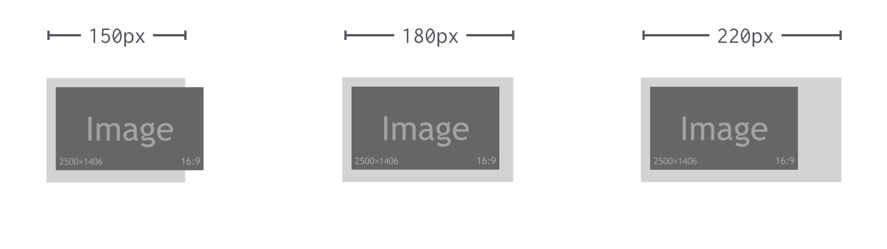
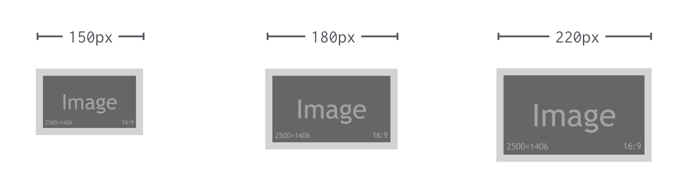
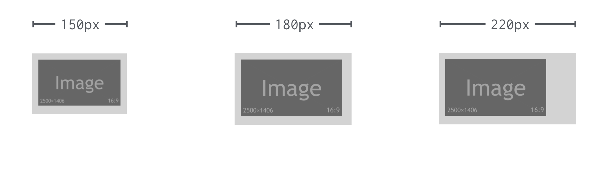
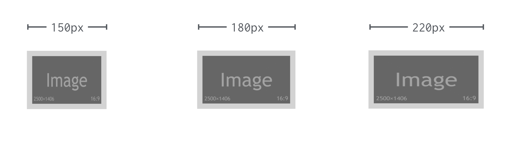
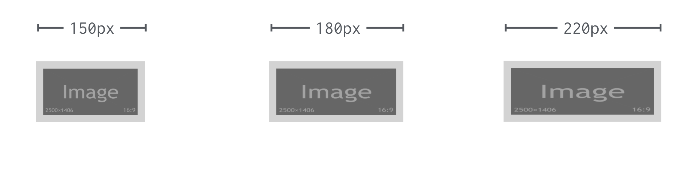
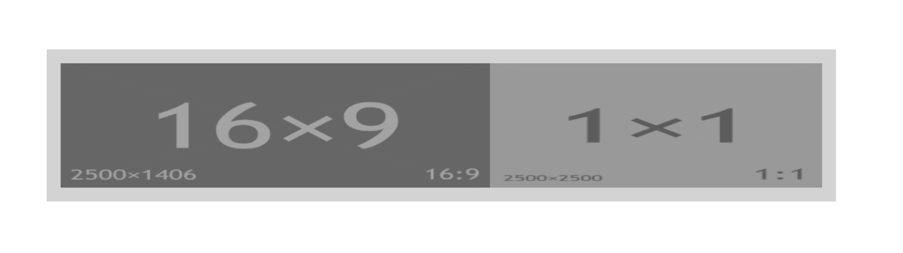

# Atribut layout a komponenta amp-layout

Atribut `layout` v AMP HTML definuje způsob, jakým se má při vykreslování stránky rezervovat prostor externímu obsahu – obrázkům, videím, ale i složitějším komponentám, jako je karusel.

Následuje vysvětlení na ukázkách kódu, které najdete na adrese [jsbin.com/cenujus](https://output.jsbin.com/cenujus).

HTML kód příkladu s obrázkem vypadá následovně:

```html
<div class="container">
  <div class="container-in">
    <amp-img src="placeholder-green-16-9.jpg"
      layout="…" width="160" height="90" alt="">
    </amp-img>
  </div>
</div>
```

Atribut `layout` pak v demu plníme všemi možnými hodnotami, kterých může nabývat. Už za chvíli je všechny uvidíte.

CSS kód pro kontejner vypadá následovně:

```css
.container {
  padding: 10px;
  background: lightgrey;
}
```

Jak vidíte, slouží hlavně pro vizualizaci okolí obrázku. Mrkněme se teď už na jednotlivé hodnoty atributu `layout`.

Na následujících schématech si ukážeme, jak vypadá obrázek (`<amp-img>` v ukázce) s danou hodnotou atributu uvnitř šedivého kontejneru (`<div class="container">`) ve třech různých šířkách.

## layout="fixed"

Fixní rozměry prvku.



Element s `layout="fixed"` bude mít fixní výšku a šířku definovanou v povinných atributech `width` a `height`. Nic na světě jej nepřesvědčí, aby něco z toho změnil.

## layout="responsive"

Klasický responzivní element. Při zvětšování a zmenšování rodičovského prvku drží poměr stran definovaný v povinných atributech `width` a `height`.



Ale pozor, klidně se zvětší i nad rozměry definované v těchto parametrech. Prostě vždy podle rodiče. Ideální je samozřejmě pro obsahové obrázky, které máte v dostatečném rozlišení.

## layout="intrinsic"

_Intrinsic_ nebo také „vlastní rozměr“. Chová se úplně stejně jako v případě hodnoty `responsive`. Jen s tím rozdílem, že se vám nikdy nezvětší za velikosti definované v atributech `width` a `height`.



Maximální šířku jde ovlivnit také hodnotou CSS vlastnosti `max-width`.

Je vhodná pro všechny možné prvky, které obsahují obrázky, jež nemáte v kvalitě dostatečné na to, aby se mohly zvětšovat donekonečna. Týkat se to bude například komponent `amp-img` nebo `amp-carousel`.

## layout="fixed-height"

Jak už název naznačuje, element se chová pružně podle rodiče, ale vždy si drží fixní výšku.



Na ilustraci je vidět, že pro obrázky tohle moc vhodné nebude. Skvěle se ale hodí pro prvky jako `amp-carousel`.

Povinný je atribut `height`. Výšku ve `width` nemá smysl uvádět, ale pokud chcete, je možné ji nastavit na hodnotu `auto`.

## layout="fill"

Výškou i šířkou vždy vyplní rodičovský element.



Jak asi vidíte z ilustrace, obrázkům zde pšenka nekvete.

Atributy `width` a `height` uvádět nemusíte. Je ovšem potřeba definovat pozicovací kontejner pomocí `position:relative` nebo `position:absolute`.

Netušíte, proč by se měl element potomka přizpůsobovat výškou i šířkou rodiči a tím pravděpodobně deformovat? Vítejte v klubu. I my jsme byli jeho členem, dokud jsme nepřišli na možnost kombinace s CSS vlastností `object-fit`. Podívejte se na obrázek a všechno vám snad bude jasnější.

<figure>

<figcaption markdown="1">
_Když se layout="fill" dá dohromady s hodnotami CSS vlastnosti object-fit._
</figcaption>
</figure>

Tahle vlastnost je tedy skvělá pro různé typy vyplnění rodičovského elementu:

* v kombinaci s `object-fit:cover` pro překrytí celé plochy i za cenu ořezu vnitřního elementu
* s `object-fit:contain` pak dává přednost viditelnosti celé plochy vnitřního elementu.

To vše si můžete vyzkoušet online: [jsbin.com/bafajez](https://output.jsbin.com/bafajez).

Snad už vám to dává smysl. Příkladem praktického užití může být přizpůsobení zástupného obrázku („placeholderu“) rozměru videa:

```html
<amp-youtube width="358" height="204"
  layout="responsive">
  <amp-img src="obrazek.jpg"
    placeholder layout="fill">
  </amp-img>
</amp-youtube>
```

V kombinaci s `object-fit:cover` aplikovaným na samotný obrázek dosáhnete toho, že ať už zvolíte zástupný symbol s jakýmkoliv poměrem stran, vždy vám vyplní rodičovský kontejner.

Podrobněji je to vše rozebrané v textu „How to support Images with unknown Dimensions?“ na webu amp.dev. [vrdl.in/ampiud](https://amp.dev/documentation/examples/style-layout/how_to_support_images_with_unknown_dimensions/)

## layout="flex-item"

Chová se jako položka flexboxu a také že jí je. Prvky s tímto layoutem dostanou po spuštění AMP runtime následující CSS:

```css
flex: 1 1 auto
```

Pokud snad flexboxu nerozumíte: Znamená to, že se prvek bude automaticky zvětšovat i zmenšovat rovnoměrně s ostatními prvky, vyplňujícími prostor flexboxového rodiče.  Výchozí velikost má nastavenu na `auto`, takže se přizpůsobí rozměrům definovaným v atributech `width` a `height`.

Podmínkou pro toto zobrazení je přidání `display:flex` na rodičovský element.

<figure>

<figcaption markdown="1">
_Dva ošklivě deformované amp-img, které mají nastavený layout="flex-item"._
</figcaption>
</figure>

Možná se ptáte, k čemu je to dobré. Odpověď zní: Pro zobrazení dvou a více externě načítaných prvků vedle sebe. Obrázky přitom nejsou nejlepším příkladem, protože flexbox je nehezky zdeformuje. Obrázkům je potřeba přidat rodičovský prvek. Podobně je na tom pokus o zalomení textu pomocí tohoto typu layoutu. To je jen připomínka toho, že layout v AMP má pouze držet místo externě načítanému obsahu stránky a nenahrazuje rozvržení v CSS. Více se `layout="flex-item"` bude hodit v `amp-carousel` nebo třeba při pozicování tlačítek pro sdílení na sociálních sítích vedle sebe. Víc uvidíte v demu na [jsbin.com/qezutac](https://output.jsbin.com/qezutac).

Vraťme se ale zpět k atributu `layout`. Jsou zde ještě speciální hodnoty: kontejnerové zobrazení a nezobrazení.

## layout="container"

Toto je výchozí hodnota atributu `layout`. Chová se to jako běžný `<div>` v běžném HTML. Atributy `width` a `height` není potřeba uvádět. V AMP je `layout="container"` vlastně jen pro pořádek, aby celý systém layoutu dával smysl.

## layout="nodisplay"

Jak jste asi pochopili, elementy s `layout="nodisplay"` jsou schované. Objevit se ale mohou na základě akce uživatele. To je třeba případ `amp-lightbox`. Nebo mají být schované trvale, jako měřicí `amp-pixel`.

Atributy `width` a `height` zde není potřeba uvádět.

## Co když není atribut layout uvedený?

Abyste o layoutu v AMP věděli opravdu všechno, musíte znát také jednu skrytou pravdu: Na prvku se zapomenutým atributem `layout`, `width` či `height` můžete nechtěně spustit jeden z uvedených režimů layoutu. Ať se vám to líbí, nebo ne, je to takhle:

* `layout="container"` – všechny elementy, bez uvedených atributů rozvržení (`width`, `height`, `sizes`, `heights`)
* `layout="fixed"` – pokud uvedete oba dva atributy `width` a `height`
* `layout="fixed-height"` – pokud uvedete jen atribut `height` a zároveň neuvedete `width`, nebo jej nastavíte na `auto`
* `layout="responsive"` – pokud uvedete jeden ze dvojice `width` či `height` a zároveň `sizes` nebo `heights`

## Komponenta amp-layout

V předchozím textu jsme tvrdili, že atribut `layout` je možné aplikovat jen na externí obsah, jako je ten dodávaný komponentami `amp-img`, `amp-iframe`, `amp-carousel` a dalšími. To je pravda.

Ty pěkné věci, které atribut dokáže, můžeme ovšem aplikovat i na běžné HTML elementy. Pomůže nám komponenta `amp-layout`.

Uvažme třeba, že se nám moc líbí možnost definovat zachování poměru stran jediným atributem. A že ji chceme aplikovat na responzivní SVG vložené přímo do HTML kódu:

```html
<amp-layout layout="responsive" width="1" height="1">
  <svg viewBox="0 0 100 100">
    <circle cx="50%" cy="50%" r="40%"
      stroke="black" stroke-width="3" />
  </svg>
</amp-layout>
```

Aby se totiž vektorový obrázek zobrazoval „responzivně“, tedy zvětšoval a zmenšoval ve všech prohlížečích stejně, musíme pro to vždy něco udělat. Více si o tom přečtěte na Vzhůru dolů, ale stručně řečeno: Bez několika řádků CSS se neobejdeme. [vrdl.cz/p/responzivni-svg](https://www.vzhurudolu.cz/prirucka/responzivni-svg)

V AMP stačí v případě potřeby responzivního chování (tedy přizpůsobení velikosti nadřazeného prvku) nastavit hodnotu atributu `layout="responsive"`.

Rodičovským elementem `<amp-layout>` si můžeme pomoci u prvků, do kterých parametr `layout=""` nelze přidat, například proto, že je vkládáme na backendu pro AMP i non-AMP verzi.

Snad je už důvod pro použití i způsob fungování layoutu v AMP jasnější. Pojďme si to teď trochu zkomplikovat dalšími atributy. Některé z nich už můžete znát z běžného HTML.
