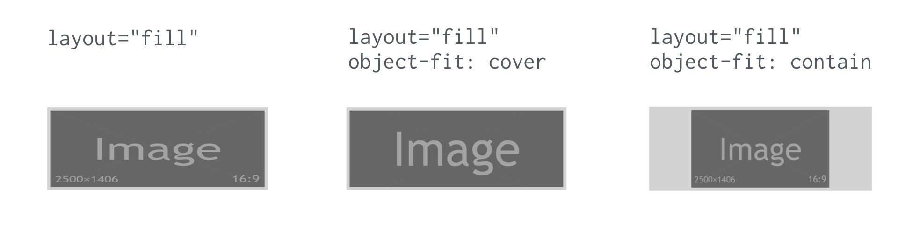

# Atributy width, height, sizes, heights, media

Podívejme se teď na další důležitou součást layoutu externího obsahu v AMP – atributy, které definují rozměry prvků mezi jednotlivými breakpointy v responzivním layoutu.

## Atributy width a height

Stejně jako v běžném HTML slouží k definici výšky a šířky elementu. Jak už ale padlo v textu o atributu `layout`, v AMP HTML jsou navíc pro většinu typů layoutů povinné.

Dává to smysl. Právě ony totiž určují, jak velký prostor nechává prohlížeč prvku, který se načítá z externích zdrojů.

V případě dvou komponent není potřeba oba parametry definovat:

* `amp-pixel` – atributy `width` a `height` jsou ve výchozím nastavení nulové.
* `amp-audio` – výchozí hodnota atributů se dědí z vykreslení prvku v prohlížeči.

## Atribut sizes

Ano, jde o totéž, co znáte z prvku ``. Ale na steroidech… Většině čtenářů a čtenářek Vzhůru dolů asi není třeba funkci atributu u obrázků dlouze představovat, protože právě my jsme s ním dlouze otravovali všechny, kdo se zajímají o webový vývoj a umí česky. Ale pro jistotu:

```html
<amp-img src="obrazek.png" alt="…"
  width="400" height="300"
  layout="responsive"
  sizes="(min-width: 320px) 320px, 100vw">
</amp-img>
```

Hodnoty atributu `sizes` zde prohlížeči přikazují:

* Na šířkách okna od `320px` výše vykresli obrázek v šířce `320px`.
* Na všech ostatních šířkách okna (tedy do `319px`) vykresli obrázek do celé šířky okna (`100vw` je sto procent šířky okna).
* Zápisem  `layout="responsive"` jsme pak řekli, že obrázek bude vždy usilovat o dodržení poměru stran (4 : 3 vychází z hodnot v atributech `width` a `height`) a přizpůsobení šířce rodičovského prvku.

Více informací o atributu `sizes` ve starém dobrém HTML najdete na Vzhůru dolů. [vrdl.cz/p/srcset-sizes](https://www.vzhurudolu.cz/prirucka/srcset-sizes)

Proč ale mluvíme o steroidech? `sizes` je totiž, na rozdíl od našeho milého běžného HTML, možné použít u jakéhokoliv elementu. S  jeho pomocí můžete definovat šířky na rozmezích designu klidně i pro `amp-carousel`. S následujícím atributem to ale bude ještě užitečnější.

## Atribut heights

Jde o totéž jako `sizes`, jen pro výšku elementu. Tady už bude využití na karuselu dávat smysl, co myslíte?

```html
<amp-carousel type="slides" width="160" height="160" layout="responsive"
  heights="(min-width: 600px) 400px, 200px">
  <amp-img src="placeholder-green-1-1.jpg"
    width="160" height="160" layout="responsive"
    alt="…"></amp-img>
  <amp-img src="placeholder-green-1-1.jpg"
    width="160" height="160" layout="responsive"
    alt="…"></amp-img>
</amp-carousel>
```

Vysvětleme ten důležitý atribut – `heights="(min-width: 600px) 400px, 200px"`:

* Na šířce okna od `600px` a více bude mít karusel výšku `400px`.
* Na menších oknech bude mít výšku `200px`.

Z parametrů `width` a `height` asi vidíte, že jinak by karusel držel poměr stran jedna ku jedné a přizpůsoboval se šířce rodičovského prvku.

Oba atributy – `sizes` a `heights` – je možné aplikovat jen na prvky, které mají layout nastavený na hodnotu `responsive`.

## Atribut media

Zajistí viditelnost prvku stránky na základě podmínky definované v media query. Autoři AMP tomu říkají „element media queries“.

Představme si například, že na různě velkých obrazovkách chceme zobrazovat různé verze obrázku:

```html
<amp-img src="image-1.png"
  width="160" height="90" layout="responsive"
  media="(max-width: 599px)" alt="…"></amp-img>
<amp-img src="image-2.png"
  width="160" height="90" layout="responsive"
  media="(min-width: 600px)" alt="…"></amp-img>
```

V prohlížeči to bude vypadat následovně:



Možná jste si tady vzpomněli na značku `<picture>` z běžného HTML. Ano, ta mj. slouží ke stejnému účelu – zobrazování různých verzí obrázků na různě velkých displejích zařízení. Na Vzhůru dolů si o tomto tagu můžete přečíst podrobnější text. [vrdl.cz/p/picture](https://www.vzhurudolu.cz/prirucka/picture)

V AMP bohužel není možné `<picture>` použít mimo náhradní řešení pro roboty, které se umísťuje do značky `<noscript>`:

```html
<amp-img>
  <noscript>
    <picture>…</picture>
   </noscript>
</amp-img>
```

Pro spoustu scénářů nasazení `<picture>` si ovšem v AMP vystačíte s komponentou `amp-img`, jak už jste mohli vidět v předchozí ukázce kódu.

Navíc platí, že v AMP HTML jej můžete aplikovat na všechny elementy, nejen na obrázky. Je tedy snadnější mít dvě verze struktury prvků v HTML pro různá rozlišení obrazovky. Ovšem pozor, zneužití se trestá. Složitý DOM strom může mít za následek pomalejší vykreslování stránky. Takže velmi doporučujeme takové věci nepřehánět.

Zbývají nám ještě poslední dva atributy. S jejich pomocí pořešíme dva stavy, které na webu nastávají naprosto běžně, ale málokteří vývojáři jsou ochotní přiznat si to: stav, kdy se něco rozbije, nebo stav, kdy se na něco čeká.
