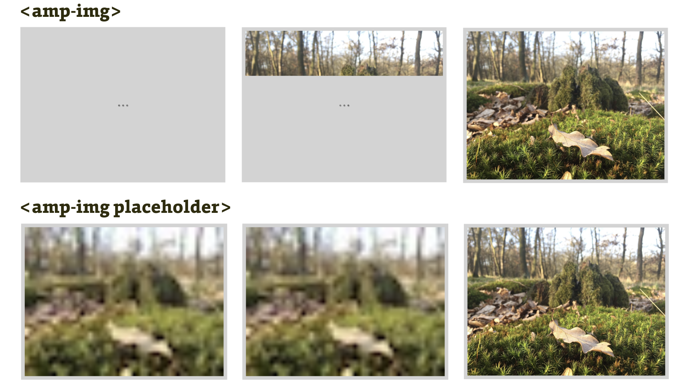

# Atributy placeholder a fallback

Z nekonečného počtu opakování ve zdejších textech už víme, že AMP rovná se rychlost. Jenže rychlost je široký pojem.

Kromě toho, že se _rychlá_ stránka měřitelně rychle zobrazuje, mluvíme často také o „vnímané rychlosti“ (perceived performance). Ze studií totiž kromě jiného vyplývá, že uživatelé berou jako rychlejší takový způsob vykreslování stránky, který je nezatěžuje animovanými indikátory pro průběh stahování jednotlivých prvků.

A právě proto vznikly „placeholdery“, zástupné symboly, které připomínají skutečný obsah, ale zobrazí se rychle. Právě placeholdery (říká se jim také _skeletony_) nakonec podle studií _vnímají_ uživatelé jako rychlejší, i když se třeba zobrazují stejně dlouho jako animovaný indikátor načítání. Více informací najdete v článku „Everything you need to know about skeleton screens“ od Billa Chunga. [vrdl.in/skelux](https://uxdesign.cc/what-you-should-know-about-skeleton-screens-a820c45a571a)

Podívejme se na obrázek, ten to snad osvětlí.

<figure>

<figcaption markdown="1">
_Obrázek: Standardní vykreslování obrázku s indikátorem načítání v AMP (tři animované tečky) a pak vykreslení se zástupným symbolem._
</figcaption>
</figure>

V technologii pro weby rychlé jako blesk je možné zařídit tyto věci pomocí specifického atributu.

## Atributy placeholder a noloading

Tyto atributy udělají z obrázku zástupný symbol, jak vidíte v kódu.

```html
<amp-img src="img/les.jpg"
  width="400" height="300" layout="responsive"
  alt="List v lese"
  noloading>
  <amp-img src="img/les-placeholder.jpg"
    layout="fill" alt="List v lese"
    placeholder>
</amp-img>
```

Všechno vysvětlíme, žádné strachy:

* Hlavní obrázek má atribut `noloading`, který AMP sděluje, že nemá vykreslit výchozí animovaný indikátor načítání, neboli ty tři nervózně blikající tečky.
* Obrázek vložený v obrázku (výhoda párových značek, všimli jste si?) pak obsahuje atribut `placeholder`, který jej označuje jako zástupný symbol.

Obrázek `les-placeholder.jpg` vznikl zmenšením původního na šířku 50 pixelů. Tedy žádná věda a skoro okamžité zobrazení, protože má jen 2 kilobajty. V praxi bychom to ale dokázali zařídit lépe. Je tady prostor pro vyšší obrazovou kvalitu, použití vektorového zástupného symbolu a tak dále.

Chcete si to vyzkoušet? Tenhle soubor najdete v [vrdl.cz/vdampd/amp-placeholder.html](https://www.vzhurudolu.cz/files/vdamp/demo/amp-placeholder.html).

Atribut `placeholder` a zástupné symboly jsou vhodné nejen u datově objemnějších obrázků, ale také například u videí, karuselů, grafů a dalších prvků složitějších k vykreslení.

### Více než jeden zástupný symbol

Je také dobré vědět dvě věci: Ta první je, že jako zástupný symbol se chová jakýkoliv vnitřní element mediálních komponent. A druhá? Zástupných symbolů může být více:

```html
<amp-youtube
  data-videoid="6sdcrsotee4"
  layout="responsive"
  width="16" height="9" noloading>
  <amp-img src="image.png" alt="Test image"
    layout="fill" noloading>
    <h2>
      Video is loading…
    </h2>
  </amp-img>
</amp-youtube>
```

Na pomalých připojeních se zde nejprve zobrazí text „Video is loading…“, pak teprve obrázek a nakonec video z YouTube. V ukázce je možné vidět, že jsme nemuseli použít atribut `placeholder`. Výsledek najdete zde: [jsbin.com/kolulow](https://output.jsbin.com/kolulow).

Zatímco tedy `placeholder` popisuje, jak má prvek vypadat, než se finálně stáhne a vykreslí, atribut `fallback` slouží k popisu toho, jak má prvek vypadat, když se něco pokazí.

## Atribut fallback

Fallback, nebo také náhradní řešení pro danou komponentu.

Příkladem může být situace, kdy uživatelský prohlížeč neumí zobrazit používaný formát videa, anebo kdy třeba původní autor smazal obsah načítaný zvenčí (video z YouTube, tweet).

Vytváření náhradních řešení není ve webdesignu nic nového. Na Vzhůru dolů například najdete text, který se tím zabýval v kontextu ve své době nových CSS vlastností, jež nefungovaly ve všech prohlížečích. [vrdl.cz/p/fallback](https://www.vzhurudolu.cz/prirucka/fallback)

U příkladu s videem to bude jistě velmi snadno pochopitelné:

```html
<amp-video controls src="video.mp4"
  width="640" height="360" layout="responsive">
  <div fallback>
    <p>Video nelze přehrát.</p>
  </div>
</amp-video>
```

Zajímavější je ale použití atributu `fallback` pro obrázky. Řekněme, že chceme použít moderní formát WebP, který je datově velmi úsporný, ale nemá podporu ve všech prohlížečích (nezvládá ho konkrétně Safari a Internet Explorer). Náhradní řešení by vypadalo takto:

```html
<amp-img alt="Obrázek"  src="image.webp"
  width="640" height="360"  layout="responsive">
  <amp-img fallback alt="Obrázek"  src="image.jpg"
    layout="fill"></amp-img>
</amp-img>
```

Připomeňme, že v běžném HTML by zápis (bez ošetření layoutu) vypadal následovně:

```html
<picture>
  <source srcset="image.webp" type="image/webp">
  
</picture>
```

Aktuální řešení tohoto problému v AMP je trochu ošemetné, protože například Safari stáhne oba obrázky: WebP i JPEG. Jak víte [z předchozí podkapitoly](amp-layout-dalsi-atributy.md), značku `<picture>`, která tyto nevýhody nemá, není možné v AMP používat. Doufáme, že se tento problém podaří autorům AMP vyřešit.

Pokud by vás čirou náhodu zajímal formát WebP více, jděte na Vzhůru dolů. [vrdl.cz/p/webp](https://www.vzhurudolu.cz/prirucka/webp)

Náhradní řešení i zástupné symboly je samozřejmě možné použít najednou. Jako třeba u reklamy:

```html
<amp-ad width="300" height="250" …>
  <p placeholder>Nahrávám reklamu…</p>
  <p fallback>Reklamu se nepodařilo nahrát.</p>
</amp-ad>
```

Tolik tedy k atributům `placeholder` a `fallback`. Shrňme vše zvoláním: Používejte je!

V AMP jsou sice nepovinné, ale jejich používáním zlepšíte na webu uživatelský prožitek. Jejich implementace je zde navíc o fous jednodušší než v běžných, non-AMP stránkách.

Pojďme teď vše použít v krátkém tutoriálu, v němž převedeme jednoduchou HTML stránku do AMP.
