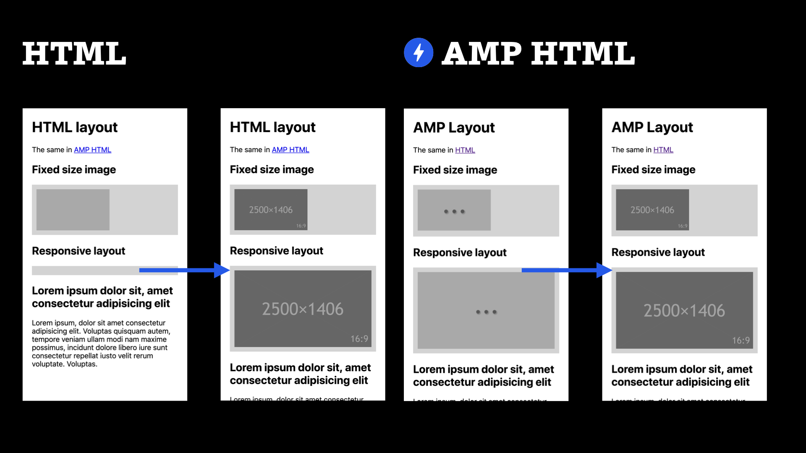

# Systém rozvržení v AMP

Layout se v AMP dělá trochu jinak než na běžných stránkách. Každá AMP stránka totiž používá dva různé layouty:

* _CSS layout pro rozvržení stránky_  
Pro layout stránky nadále používáme flexbox, grid, floaty a další vlastnosti pro rozvržení stránky i jejích komponent. Tady se nic nemění.
* _AMP layout nebo také „vykreslovací layout“_  
Jde o nástroje, jejichž pomocí prohlížeči sdělíme, jak má stránku zobrazovat ještě předtím, než stáhne externí zdroje, jako jsou obrázky nebo data.

## AMP layout, nebo také „statický layout“

Autoři této technologie říkají, že jde o „systém statického layoutu“. To v důsledku znamená, že se základní kostra stránky vykreslí jen jednou.

Nebo jinak – že vám nebude při načítání ani používání „poskakovat“ před očima. Obrázek snad napoví.

<figure>

<figcaption markdown="1">
_Rozdíly ve vykreslování běžné HTML stránky a AMP stránky._
</figcaption>
</figure>

Zatímco u obrázku s fixními rozměry definovanými v CSS není ve vykreslování rozdíl, druhý (responzivní) už průběh zobrazování stránky pokazí. Pro určení potřebné výšky a šířky jej totiž musí prohlížeče stáhnout.

U AMP tohle neplatí. Pomocí atributu `layout` a hodnoty `responsive` si knihovna (runtime) dokáže vypočíst rozměry, které bude responzivní obrázek potřebovat. Stránka (a zejména text pod obrázky) tedy nemění během stahování a vykreslování své rozvržení.

Pokud si chcete uvedené vyzkoušet, jděte na následující odkazy:

* HTML stránka: [jsbin.com/purobob](https://output.jsbin.com/purobob)
* AMP stránka: [jsbin.com/dozogak](https://output.jsbin.com/dozogak)

Obrázky ve stránkách mají nastavené zpožděné načtení. Responzivní obrázek v HTML verzi po vykreslení odsune textový obsah pod ním, což se v AMP verzi nestane. Layout v AMP prostě neposkakuje.

## AMP layout je určený pro externí obsah

Asi to už vyplynulo z výše uvedeného, ale proč vůbec nějaký nový layout potřebujeme?

Layout v AMP se týká hlavně prvků dotahovaných do stránky zvenčí:

* Typickým příkladem je obrázek v `<amp-img>`. Prohlížeč jeho rozměry kvůli flexibilní šířce rodičovského prvku většinou nezná, dokud jej nestáhne a nezpracuje.
* Podobně je na tom obsah zpracovávaný externími skripty, jako je `<amp-carousel>`.
* Nesmíme zapomenout ani na prvky, jejichž obsah ovlivňují data stažená z externího API, jako třeba `<amp-list>`.

Jinak řečeno: AMP layout prostě není náhražkou rozvržení v CSS. Doplňuje jej o možnost určení layoutu i pro případ, kdy se čeká na externí prvek stránky.

## Atributy tvořící statický layout v AMP

Jak to AMP zařídí? Objevily se zde nové atributy nebo je upravený význam těch existujících. Více se dozvíte v následujících třech sekcích:

* `layout`  
V atributu se uvádí, jakým způsobem se bude prvek přizpůsobovat šířce a výšce rodiče. Je o tom hned [další text](amp-layout-atribut.md).
* `width`, `height`, `sizes`, `heights` a `media`  
[Atributy](amp-layout-dalsi-atributy.md), které zajišťují prostor pro vykreslení nebo jen poměr stran. Určují, jaké šířky nebo výšky může prvek mít na různě velkých obrazovkách.
* `placeholder`, `fallback`  
Tyto [atributy](amp-layout-placeholder.md) definují dočasný nebo alternativní obsah pro případ krátkodobé nebo i dlouhodobé nepřítomnosti zmíněných prvků v HTML.

Uváděné atributy pak zpracuje AMP runtime, onen kousek JavaScriptu, který musíte vložit do každé stránky. Ve výsledku se uvedené atributy překládají do sady CSS vlastností a HTML prvků, aby tomu rozuměly dnešní prohlížeče.

Nejdůležitější součástí tvorby rozvržení  v AMP je – tramtadadá – atribut `layout`. Ten musíme pochopit. Takže neváhejme a něco si o něm řekněme.
