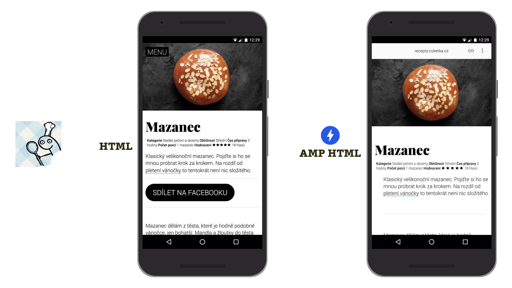
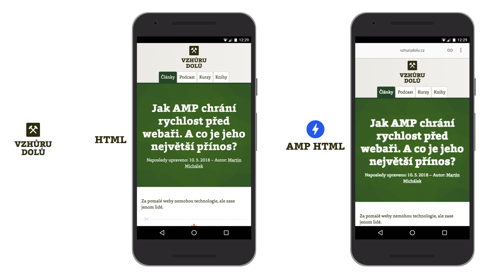

# Blogy

Článek je úplně ideální formát obsahu pro nasazení AMP. Ostatně – rychlá distribuce textového obsahu je prapůvodní důvod, proč naše oblíbená technologie vůbec vznikla.

Díky pluginům je navíc docela snadné AMP do redakčních systémů nasadit. V Česku máme hned několik ukázek, takže na co ještě čekat?

## Cuketka.cz

Jeden z prvních blogerů, který v Česku nasadil AMP, byl pan Cuketka, uznávaný český foodbloger. Jeho non-AMP i AMP stránky jsou téměř totožné.

<figure>

<figcaption markdown="1">
_Obrázek: Recepty pana Cuketky._
</figcaption>
</figure>

Když jsme se to dozvěděli, říkali jsme si, že by bylo skvělé tady ukázat nějaká čísla. Ta ale nemáme, protože se stala vtipná věc: Až když jsme si psali, Martin Kuciel si uvědomil, že AMP verzi nijak neměří. To je ale docela příznačné pro jeho postoj k AMP.

Na AMP se pan Cuketka dívá strategicky. Google je pro něj zásadním zdrojem návštěvnosti. A Google AMP doporučuje. Recepty na vaření jsou navíc v Googlu enormně konkurenční prostředí. AMP tedy znamená pro weby pana Cuketky konkurenční výhodu.

Odkazy k vyzkoušení:

* HTML: [recepty.cuketka.cz/mazanec/](https://recepty.cuketka.cz/mazanec/)
* AMP: [recepty.cuketka.cz/amp/mazanec/](https://recepty.cuketka.cz/amp/mazanec/)

## Vzhůru dolů

Bylo by samozřejmě trapné, kdyby technologie AMP nebyla nasazená na webu autora těchto řádek.

<figure>

<figcaption markdown="1">
_Obrázek: Nevěřili byste tomu, ale také Vzhůru dolů má vlastní AMP…_
</figcaption>
</figure>

AMP verzi mají v polovině roku 2019 šablony detailu článku, detailu školení a některé další. Vzhledem k tomu, jak této technologii Martin věří, rád by viděl AMP prakticky na všech veřejných stránkách.

Pokud jste to nestihli v rámci knížky už dříve, podívejte se na detail článku:

* HTML: [vzhurudolu.cz/prirucka/css-grid](https://www.vzhurudolu.cz/prirucka/css-grid)
* AMP: [vzhurudolu.cz/amp/prirucka/css-grid](https://www.vzhurudolu.cz/amp/prirucka/css-grid)

Jak už víte, na Vzhůru dolů je v tuto chvíli aplikována architektura „[nejprve HTML, potom AMP](https://docs.google.com/document/d/1c1Rf5sfu9rTTh9taijEnO-gn6WlCRBDYKdZpzWAxsJQ/edit#)“.

## Bella Rose

E-shop s designovými doplňky do domácnosti byl mezi klienty autora této knížky první, který AMP nasadil. Martinovou zásluhou to ale nebylo.

Může za to Pavel Ungr, odborník na optimalizaci pro vyhledávače. Ten měl také na své akci SEOloger naživo 2018 hezkou přednášku o tom, jak nasazení nové verze blogu vylepšilo byznysová čísla. Přístupy z organického vyhledávání například vyrostly o 568 %, bounce rate se snížila o 24 %. Jen pozor, blog prošel kompletním redesignem a „zapnutí AMP“ pomocí jednoduchého pluginu pro WordPress byl jen jednou z mnoha inovací.

Více najdete v jeho prezentaci na Slideshare. [vrdl.in/ampbella](http://vrdl.in/ampbella)

* HTML: [atmosfera.bellarose.cz/6-tipu-na-to-jak-pri-cestovani-usetrit/](https://atmosfera.bellarose.cz/6-tipu-na-to-jak-pri-cestovani-usetrit/)
* AMP: [atmosfera.bellarose.cz/6-tipu-na-to-jak-pri-cestovani-usetrit/amp/](https://atmosfera.bellarose.cz/6-tipu-na-to-jak-pri-cestovani-usetrit/amp/)

Blogů využívajících naši preferovanou technologii bychom v české internetové kotlině našli opravdu hodně. Pojďme se ale podívat na ještě zajímavější kategorii – větší obsahové weby a mezi nimi i první velkou českou implementaci AMP. Víte, která to je?
