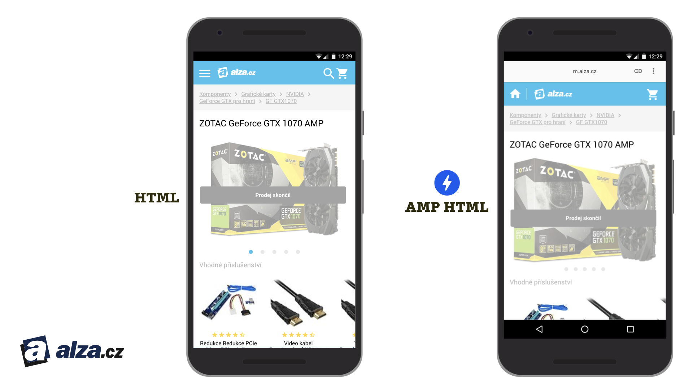

# České a slovenské e-shopy

Jak už padlo na jiných místech, ono „Pages“ v AMP ukazuje na původní záměr nasazení hlavně na statické obsahové stránky.

Elektronický obchod je ovšem – přinejmenším z pohledu interakcí a potřebného vývojářského přístupu – směsicí statického webu a aplikace. Na e-shopech narazíme na statický obsah (například šablona produktu) s aplikačními prvky (filtrování produktů) a plně aplikační rozhraní (košík a nákupní proces).

Mimochodem: O téhle definici webů a webových aplikací psal Martin v textu pro knihu „Vzhůru do (responzivního) designu“. [vrdl.cz/p/weby-vs-aplikace](https://www.vzhurudolu.cz/prirucka/weby-vs-aplikace)

Z pohledu vývojáře je tedy e-shop místem, kde se mísí „starý svět“ HTML stránek generovaných na straně serveru (a ideálních pro nasazení AMP) s novým světem rozhraní vytvářených čistě na frontendu pomocí frameworků jako React.js nebo Vue.js (a tedy pro nasazení AMP ne až tak vhodných).

Nasazení AMP zde tudíž může být pořádnou výzvou. Jenže pokud přistoupíme na to, že právě pro e-shopy je rychlost velkou konkurenční výhodou, nedivme se žádným pokusům o nasazení zrychlovací technologie.

Navíc – české e-shopy, které s AMP experimentují, nejsou žádní pidižvíci.

## Lékárna.cz

Velký český e-shop s léčivy má AMP verzi nasazenou asi nejdéle ze všech tuzemských elektronických obchodů.

<figure>

<figcaption markdown="1">
_Obrázek: Zatím nejpropracovanější implementaci na českých elektronických obchodech nabízí Lékárna.cz._
</figcaption>
</figure>

Bohužel se nám nepodařilo zjistit, jak jsou s experimentem spokojení nebo nespokojení.

Ve výsledcích vyhledávání Googlu se ale jejich AMP stránky zobrazují už rozhodně více než rok a dále je vylepšují, takže v Lékárna.cz jistě nespokojení nebudou.

## Alza.cz

S AMP experimentuje i největší značka českého e-commerce. AMP zkoušeli nasadit na méně navštěvovaný typ stránek – šablonu produktu, který už není v prodeji.

<figure>

<figcaption markdown="1">
_Obrázek: Také náš největší e-shop to zkouší s AMP._
</figcaption>
</figure>

Platí zde, že se v původní verzi nepodařilo docílit stejného designu a v AMP verzi je řada kompromisních řešení. Podle našich posledních informací ale Alza v experimentování s AMP hodlá pokračovat.

Porovnejte si obě verze experimentů:

* Klasická verze: [vrdl.in/alzaneamp](https://m.alza.cz/apple-iphone-4-16gb-cerny-d173925.htm)
* AMP: [vrdl.in/alzaamp](https://m.alza.cz/apple-iphone-4-16gb-cerny-d173925.htm?amp=1)

## Relaxos.sk

Prodejce zájezdů Relaxos.sk (v české verzi na Relaxos.cz) nasadil AMP v roce 2018 na 80 % vstupních stránek.

<figure>

<figcaption markdown="1">
_Obrázek: Velmi podobné, ale stále ne totožné pojetí HTML a AMP HTML varianty na Relaxos.sk._
</figcaption>
</figure>

U nich ale platí, že AMP verze vykazuje velmi podobnou míru okamžitého opuštění, konverzní poměr i další ukazatele jako non-AMP verze. Každopádně – dopad zrychlení zobrazení stránky by bylo možné měřit jen u totožné verze.

## Případové studie ze světa

AMP nasadily a používají i velké značky světového elektronického obchodu jako eBay nebo Eventbrite.

Autoři uvádějí případovou studii e-shopové platformy Fastcommerce, což je obdoba českého Shoptetu. Na AMP jim běží dva miliony stránek, které díky němu zrychlili 2,5krát. A výsledek? Udávají o 15 % vyšší konverzní poměr. [amp.dev/success-stories/fastcommerce](https://amp.dev/success-stories/fastcommerce)

I další případová studie je zajímavá. Francouzský online prodejce biopotravin Greenweez takřka zdvojnásobil konverzní poměr na mobilech. [success-stories/greenweez](https://amp.dev/success-stories/greenweez)

To nezní špatně, že? Přítomnost AMP v e-commerce je každopádně téma, o kterém toho ještě hodně uslyšíme.

Zde ukončíme čtvrtou kapitolu. Dostali jste zde chuť vytvářet vlastní web na AMP? Po testu a jeho vyhodnocení vám doporučíme jak na to.
