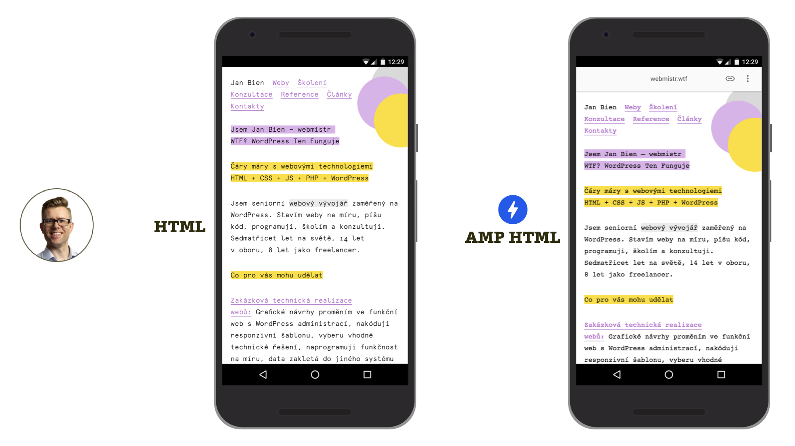

# Malé prezentační weby

Všichni víme, že z několikastránkových webů průkazné případové studie nedostaneme. Na druhou stranu se na nich nové technologie zkouší nejlépe. Pojďme tedy začít s nimi.

## Webmistr.wtf, osobní web Honzy Biena

Nejzajímavější příklad nasazení na českém osobním webu pochází od Honzy Biena, experta na WordPress.

Honza se rozhodl jít cestou [exkluzivního využití AMP](amp-implementace-jen-amp.md), tedy architektury postavené čistě na technologii modrého blesku a jeho komponentách. Navíc byl tak hodný a nasdílel své zkušenosti.

<figure>

<figcaption markdown="1">
_WTF?! Na téhle doméně najdete „AMP Only“ web experta na WordPress Honzy Biena._
</figcaption>
</figure>

Jaká jsou pozitiva tohoto řešení? Honza oceňuje komponenty uživatelského rozhraní  předpřipravené v AMP: „Takhle to dělej, nad ničím nešpekuluj a můžeš být v klidu, že to bude fungovat.“

A nevýhody? „Nechtěl jsem použít žádný plugin, všechno si pořádně osahat a nakódovat si vlastní šablonu v čistém AMP, což byla nakonec docela fuška.“ Nedivme se – Honza vyráběl web někdy v první polovině roku 2018, tedy v době, kdy práce s AMP nebyla v šablonách WordPressu ještě tak flexibilní jako [s novou verzí pluginu](amp-implementace-pluginy.md), který uvádíme v předchozí kapitole.

Výsledek Honzova křížení AMP s WordPressem je moc fajn. [webmistr.wtf](https://www.webmistr.wtf/)

## Robin Pokorný a jeho dva miniwebíky

Také spoluautor tohoto e-booku a podcastový parťák Robin si AMP zkoušel nejprve na svém osobním webu. Je to jednoduchá textová stránka, takže ji můžete využít jako startovní bod pro průzkum této technologie. [robinpokorny.com](https://robinpokorny.com/)

Robin ve zrychlovací technologii vytvořil také prezentační stránku pro svůj projekt Git3Moji, specifikaci krátkých zkratek pro vkládání emoji pro vývojáře. Na projektu je zajímavé použití generátoru statických stránek Jekyll a jeho přizpůsobení pro generování AMP validního výstupu. Na výsledek se podívejte sami: [robinpokorny.github.io/git3moji](https://robinpokorny.github.io/git3moji/)

I architektura obou Robinových webů je navržená jako „[jen AMP](amp-implementace-jen-amp.md)“.

Ačkoliv na vyzkoušení a snadné naučení základů AMP jsou malé jednostránkové weby ideální, větší přínos bude mít pro blogery.
