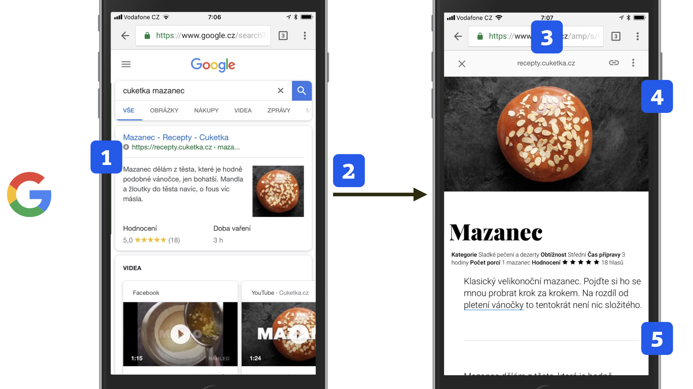
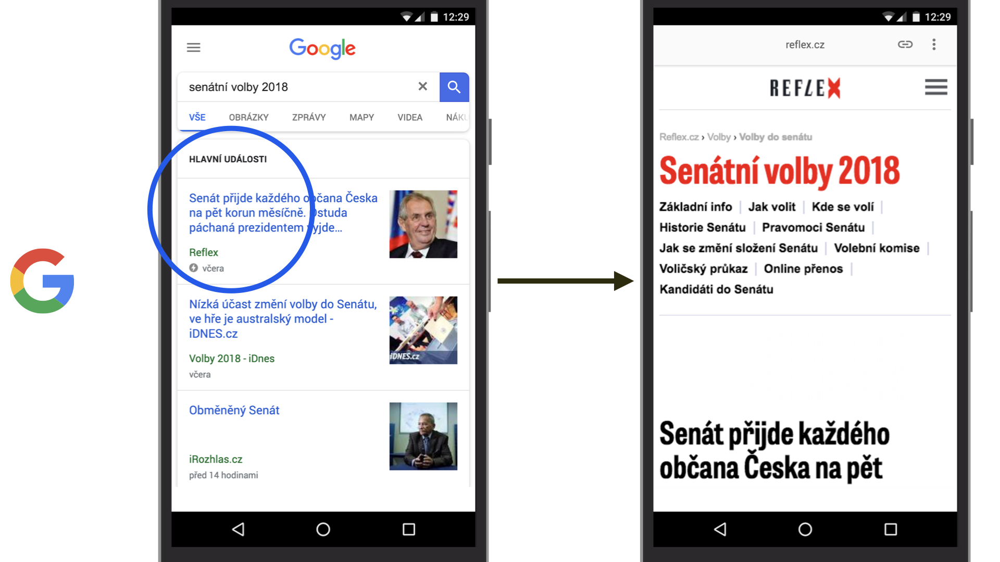
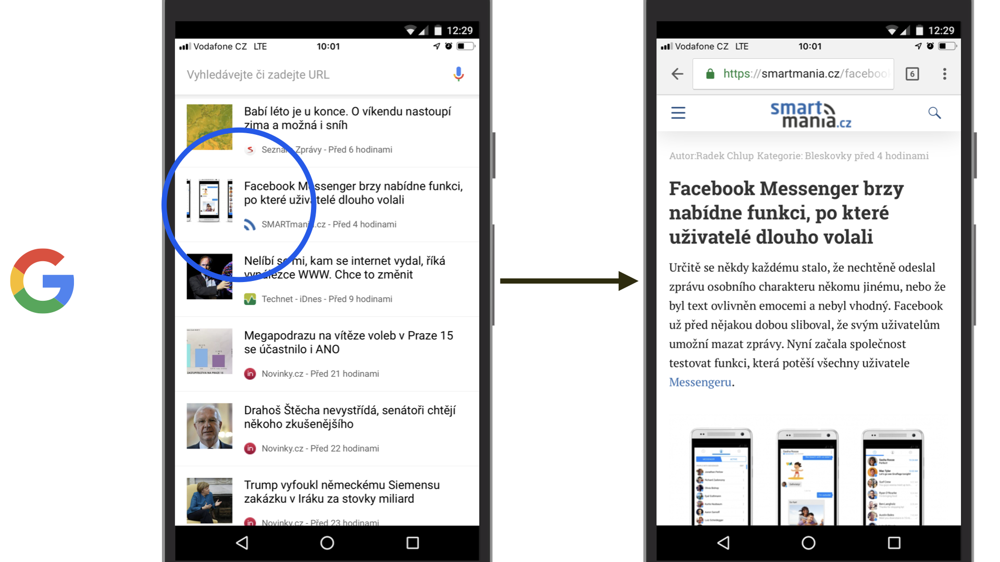
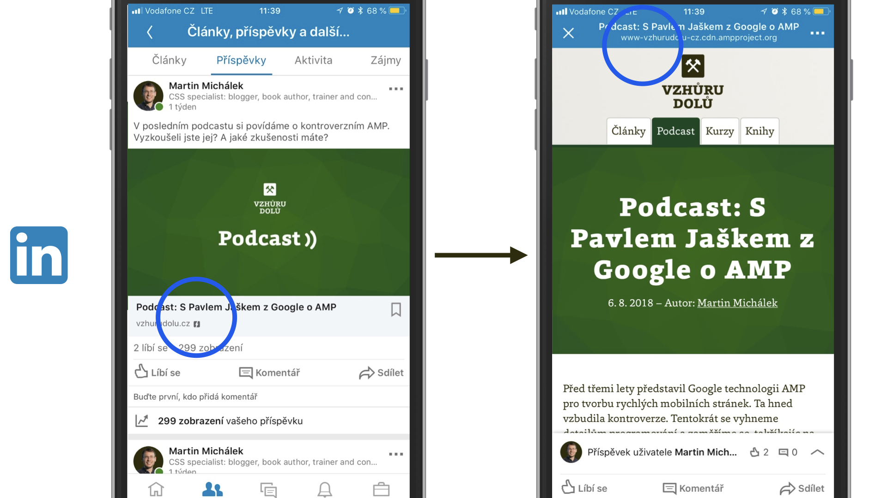
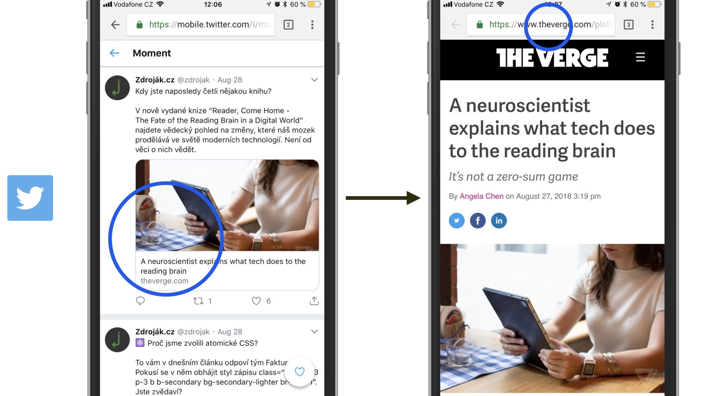
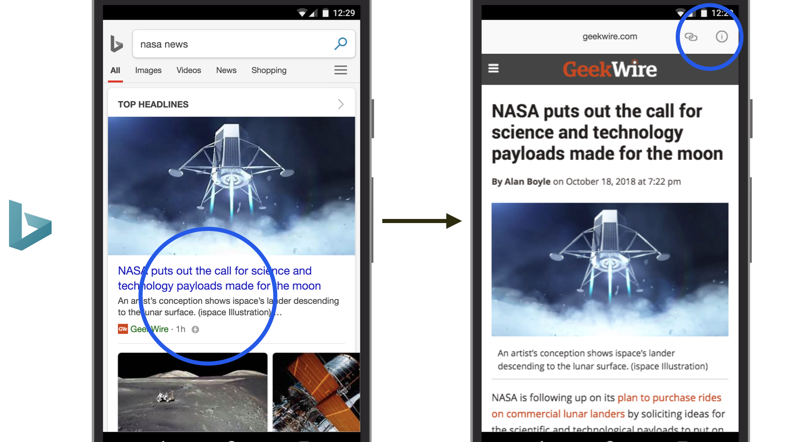

# Kde je možné potkat AMP stránky?

AMP využívá hlavně Google, ale také třeba LinkedIn, Pinterest, Bing a trochu i Twitter.

Podívejme se, kde všude vám pomůže vytvoření rychle se načítající stránky pomocí téhle technologie.

## 1) Google: Výsledky vyhledávání

Nejznámější a pro provozovatele webu v Česku určitě nejzajímavější oblast využití. Pokud má stránka AMP verzi, roboti ji nahrají na servery Googlu. Pak to celé vypadá jako na následujícím obrázku.

<figure>

<figcaption markdown="1">
_AMP verze receptu z Cuketka.cz ve vyhledávání Googlu._
</figcaption>
</figure>

Vysvětlíme si to na číslech, která vidíte na schématu:

1. AMP stránka je zvýrazněná ikonkou. U určité části uživatelů to zvyšuje pravděpodobnost prokliknutí.
2. Výsledky s AMP stránkami, u kterých je pravděpodobné, že na ně uživatelé kliknou, se přednačítají, což razantně zvyšuje rychlost jejich zobrazení.
3. Po kliknutí se stránka zobrazí uživateli na adrese začínající `https://www.google.cz/amp/s/….`
4. Horní lišta, která obsahuje původní adresu a možnost sdílet. Součást AMP Vieweru.
5. Uživateli se může zobrazit také informace o přihlášení do Googlu, což může být opět matoucí, ale nevíme o tom, že by ji šlo nějak vypnout.

V tomto kontextu se tedy AMP stránky míchají s běžnými stránkami. Přítomnost této technologie ale podle nás pozice vašich stránek ve výsledcích vyhledávání nijak nezlepšuje.

Jak si to vyzkoušet? Hledejte na Googlu třeba „flexbox“. Mezi výsledky by mělo být i Vzhůru dolů, označené ikonkou AMP. Ke dni psaní tohoto textu to takto funguje na mobilním vyhledávání.

## 2) Google: News OneBox

News OneBox je označení pro různé grafické prvky. Ve výsledcích vyhledávání se zobrazí v odpovědi na dotaz týkajícího se aktuálního zpravodajství.

<figure>

<figcaption markdown="1">
_AMP z Reflex.cz při vyhledávání zpravodajské události v Hlavních událostech ve výsledcích Googlu._
</figcaption>
</figure>

Jsou zde dvě možnosti zobrazení:

* Karusel: V západní Evropě a USA je kolem 90 % tam zobrazovaných stránek vytvořeno právě v AMP.
* Hlavní události (Top Stories): V anglicky mluvícím světě to vypadá na 20% podíl obsahu vytvořeného pomocí AMP.

Čísla pocházejí z článku „How do AMP articles perform in the mobile SERP for Google News OneBoxes?“ od NewsDashboard. [vrdl.in/ampnewsbox](https://newsdashboard.com/en/how-do-amp-articles-perform-in-the-mobile-serp-for-google-news-oneboxes/)

Jak to vyzkoušet? Zadejte si název nějaké aktuální zpravodajské kauzy do mobilního vyhledávání Googlu. Zřejmě uvidíte jen onen karusel, ale je možné, že tam budou prakticky jen výsledky ze stránek AMP. Tohle je mimochodem častým [terčem kritiky](amp-kritika-myty.md). Ještě se k tomu dostaneme.

## 3) Google: Navrhované články v novém okně mobilního Chromu

Jde o výběr článků zobrazovaných na výchozí stránce prohlížeče Google Chrome (Discovery Feed, česky jako „kanál Objevit“). Stránky AMP se zde opět míchají s běžnými stránkami.

Podobně jako u Twitteru, který uvádíme v dalším textu, nevede odkaz na optimalizovanou verzi stránky na CDN, ale na AMP stránku hostovanou na vašem serveru.

<figure>

<figcaption markdown="1">
_AMP verze článku ze SmartMania.cz je k dispozici v doporučených článcích mobilního Google Chrome._
</figcaption>
</figure>

V českém prostředí jsme se odtud několikrát na AMP dostali. Na Západě může být kolem tří čtvrtin zde zobrazených článků v AMP verzi. Naším zdrojem je článek „Optimizing for Chrome’s “Articles for You” Content Suggestions“ z ClickSeed. [vrdl.in/ampartsugg](https://www.clickseed.com/chrome-articles-for-you-content-suggestions/)

## 4) LinkedIn: Články v mobilní aplikaci

Pokud si na webu zprovozníte AMP, dostanete se na Google AMP Cache i z mobilních aplikací LinkedIn.

<figure>

<figcaption markdown="1">
_V příspěvcích na profesionální sociální síti LinkedIn je možné dostat se na AMP stránku hostovanou na Google CDN._
</figcaption>
</figure>

V ČR je tahle sociální síť samozřejmě hluboko ve stínu Facebooku, ale v profesionálních komunitách je vcelku hojně používaná, takže nasazení AMP není od věci i pro publikování obsahu na LinkedIn.

## 5) Pinterest: Odkazy v mobilní aplikaci

I v mobilních aplikacích od Pinterestu můžete jít rovnou na AMP. V Česku je ovšem tahle sociální síť využívána jen velmi málo.

Více informací se dozvíte přímo od autorů Pinterest Engineering v článku „Building a faster mobile web experience with AMP“. [vrdl.in/amppin](https://medium.com/@Pinterest_Engineering/building-a-faster-mobile-web-experience-with-amp-a73c651ded7)

## 6) Twitter: Moments v mobilní aplikaci

Twitter naši milou technologii rychlých stránek používá zatím jen na nepříliš honosném místě – dostanete se na ně z mobilní verze Moments.

<figure>

<figcaption markdown="1">
_Odkaz na AMP verzi článku z The Verge v Twitter Moments._
</figcaption>
</figure>

Stránky se navíc bohužel nenačítají z mezipaměti u Googlu, dostanete se jen na původní verzi AMP stránky přímo na serveru autora obsahu. Což je z pohledu potenciálu této technologie dost o ničem, jak už víte.

## 7) Bing: Výsledky vyhledávání

Vyhledávač od Microsoftu má v Česku jen miniaturní podíl na trhu, ale například v USA je důležitý. Nové využití AMP je vlastně velmi podobné tomu ve vyhledávání Googlu.

<figure>

<figcaption markdown="1">
_Bing má vlastní servery upravující a hostující AMP stránky. Pro cílovku například v USA je to dost významné._
</figcaption>
</figure>

Jak už víte, Bing má vlastní AMP Viewer, s doplněním horní lišty, která vypadá podobně jako ta od Googlu.

Autoři doporučují přidat robota Bingu (Bingbot) a doménu `bing-amp.com` do CORS (Cross-Origin Resource Sharing), které povoluje sdílení obsahu z jedné domény na jiné. Pokud je pro vás Bing zajímavý, doporučujeme vám ho na serveru povolit. Podívejte se například na návody z [enable-cors.org](https://enable-cors.org/server.html).

## Jak najít AMP a testovat stránky?

Pokud používáte Google Chrome, je možné testovat AMP stránky z počítače takto:

* _Rozšíření AMP Validator_  
Ukazuje, které navštívené stránky mají AMP verzi s možností přejít na ni.
* _Developer Tools a emulace_  
Zobrazte si vývojářské nástroje pomocí Ctrl (Cmd) + Alt + I. Zapněte „Device Toolbar“ pomocí Ctrl (Cmd) + Shift + M. Nahoře zvolte mobilní zařízení, např. „Galaxy S5“, přejděte na Google.com a vyhledejte si například „Vzhůru dolů Flexbox“. Jako první by na vás měla vyskočit AMP verze článku.

Na mobilu je to jednodušší. Většina míst, kde se zobrazují stránky AMP, souvisí právě se zobrazením na mobilech. Stačí si prostě zadat nějaké fráze do vyhledávání Googlu a na nějaký výsledek s ikonkou blesku dříve či později narazíte.

Známe už tedy všechna aktuální místa výskytu AMP stránek. Každá technologická knížka by teď přešla do implementačních detailů. V případě naší technologie bychom se ale měli zabývat ještě jedním specifickým fenoménem – silnou kritikou z mnoha různých stran. Tohle důležité téma bychom přeskočili neradi.
