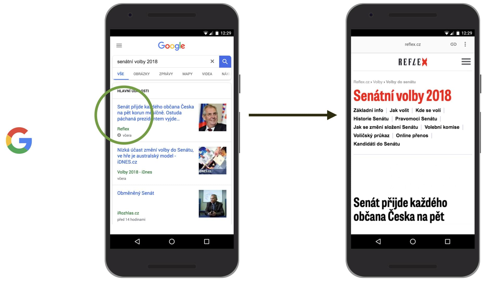

# Kde je možné potkat AMP stránky?

Těch míst je docela hodně. A ne všechny obstarává Google. AMP využívá třeba LinkedIn, Pinterest, Bing a trochu i Twitter.

Podívejme se, kde všude vám pomohou rychle se načítající stránky vytvořené touto technologií.

1. [Google: Výsledky vyhledávání](#1)
2. [Google: News OneBox](#2)
3. [Google: Články na homepage Chrome](#3)
4. [LinkedIn: Články v mobilní aplikaci](#4)
5. [Pinterest: Odkazy v mobilní aplikaci](#5)
6. [Twitter: Moments v mobilní aplikaci](#6)
7. [Bing: Výsledky vyhledávání](#7)

## 1) Google: Výsledky vyhledávání {#1}

Nejznámější a pro provozovatele webu v Česku určitě nejzajímavější oblast využití. Pokud má stránka AMP verzi, roboti ji nahrají na servery Google. Pak to celé vypadá jako na následujícím obrázku.

<figure>

<figcaption markdown="1">
*Obrázek: AMP verze receptu z Cuketka.cz ve vyhledávání Google*
</figcaption>
</figure>

Vysvětlíme si to na číslech, která vidíte na schématu:

1. AMP stránka je zvýrazněná ikonkou. To myslím u velké části uživatelů zvyšuje pravděpodobnost prokliknutí.
2. První AMP stránka se na pozadí přednačítá, což zvyšuje rychlost jejího zobrazení.
3. Po klinutí se uživateli stránka zobrazí na adrese začínající `https://www.google.cz/amp/s/…`.
4. Všimněte si horní lišty, která obsahuje původní adresu a možnost sdílet (opět s původní URL adresou stránky). Dále nějakou navigaci, která se ale podobná navigaci prohlížeče, takže ji považuji mírně za matoucí. Její obsah? Vysvětlení, co to ten AMP je.
5. Uživateli se může zobrazit také informace o přihlášení do Google, což může být opět matoucí, ale nevím o tom, že by to šlo nějak vypnout.

V tomto kontextu se tedy AMP stránky míchají s běžnými stránkami. Pokud vím, v tuhle chvíli ale přítomnost téhle technologie pozice vašich stránek nijak nezlepšuje.

<!-- AdSnippet -->

Jak si to vyzkoušet? Hledejte na mobilním vyhledávání Google třeba „flexbox“. Mezi výsledky by mělo být i Vzhůru dolů, označené ikonkou AMP.

## 2) Google: News OneBox {#2}

News OneBox je označení pro různé grafické prvky, který se ve výsledcích vyhledávání zobrazí na frázi týkají se aktuálního zpravodajství.

<figure>

<figcaption markdown="1">
*Obrázek: AMP z Reflex.cz při vyhledávání zpravodajské události v Hlavních událostech ve výsledcích Google*
</figcaption>
</figure>

Jsou zde tři možnosti:

- Karusel: V českém Google jsem tam zatím na stránku vytvořenou dotčenou technologií nenarazil. V západní Evropě a USA je kolem 90 % zde zobrazovaných stránek právě AMP.
- Hlavní události (Top Stories): Na Západě to vypadá na 20 % podíl obsahu vytvořeného pomocí AMP.
- Headline: Z ČR zatím neznám. Na Západě se zdá, že zde se AMP moc nevyskytuje.

Čísla mám z článku [How do AMP articles perform in the mobile SERP for Google News OneBoxes? od NewsDashboard](https://newsdashboard.com/en/how-do-amp-articles-perform-in-the-mobile-serp-for-google-news-oneboxes/).

<!-- AdSnippet -->

Jak to vyzkoušet? Zadejte si název nějaké aktuální zpravodajské kauzy do Google. Zřejmě ale uvidíte jen Karusel a zřejmě zatím bez výsledků používajících AMP.

## 3) Google: Navrhované články v novém tabu mobilního Chrome {#3}

Jde o výběr článků zobrazovaných na výchozí stránce prohlížeče Google Chrome. Opět se zde Accelerated Mobile Pages míchají s běžnými stránkami. 

Podobně jako u Twitteru nevede odkaz na optimalizovanou verzi stránky na CDN, ale na vašem serveru hostovanou AMP stránku.

<figure>

<figcaption markdown="1">
*Obrázek: AMP verze článku ze SmartMania.cz je k dispozici v doporučených článcích mobilního Google Chrome*
</figcaption>
</figure>

V českém prostředí jsem se odtud několikrát na AMP dostal. Na Západě může být kolem tří čtvrtin zde zobrazených článků v AMP verzi. Můj zdroj je článek [Optimizing for Chrome’s “Articles for You” Content Suggestions“](https://www.clickseed.com/chrome-articles-for-you-content-suggestions/) z ClickSeed.

## 4) LinkedIn: Články v mobilní aplikaci {#4}

Pokud si na webu zprovozníte AMP, dostanete se na Google cache i z mobilních aplikací LinkedIn.  

<figure>

<figcaption markdown="1">
*Obrázek: V příspěvcích na profesionální sociální síti LinkedIn je možné dostat se na AMP stránku, hostovanou na Google CDN*
</figcaption>
</figure>

## 5) Pinterest: Odkazy v mobilní aplikaci {#5}

I v mobilních aplikací od Pinterestu, můžete jít rovnou na AMP.

Více informací můžete dostat přímo od autorů Pinterestu v článku [Building a faster mobile web experience with AMP](https://medium.com/@Pinterest_Engineering/building-a-faster-mobile-web-experience-with-amp-a73c651ded7) od Pinterest Engineering.

## 6) Twitter: Moments v mobilní aplikaci {#6}

Twitter naši milou technologii rychlých stránek používá zatím jen na nepříliš honosném místě - dostanete se na ně z mobilní verze Moments.

<figure>

<figcaption markdown="1">
*Obrázek: Odkaz na AMP verzi článku z The Verge v Twitter Moments*
</figcaption>
</figure>

Bohužel se stránky navíc nenačítají z mezipaměti u Google, ale dostanete se jen na původní verzi stránky přímo na server autora obsahu. Vzhledem k tomu, že už [víte jak AMP funguje](amp-fungovani.md), budete asi souhlasit, že tyhle způsoby použití trochu kouzlo.

## 7) Bing: Výsledky vyhledávání {#7}

Vyhledavač od Microsoftu má Česku jen miniaturní podíl na trhu, ale například v USA důležitý je. Nové využití Accelerated Mobile Pages je vlastně velmi podobné tomu ve vyhledávání Google.

<figure>

<figcaption markdown="1">
*Obrázek: Bing má vlastní servery upravující a hostující AMP stránky. Pro cílovku na Západě je to dost významné*
</figcaption>
</figure>

Jak vidíte z obrázku, Bing má vlastní AMP prohlížeč (AMP Viewer), s doplněním horní lišty, která vypadá podobně jako ta od Google.

Stránky samozřejmě běží přímo na doméně vyhledavače od Microsoftu – adresy začínají `https://www.bing.com/amp/s/…`. 

Autoři doporučují přidat robota Bingu (Bingbot) a doménu `bing-amp.com` do CORS – Cross-Origin Resource Sharing. Pokud je pro vás Bing zajímavý, doporučuji si to na serveru povolit. Podívejte se například na návody z [enable-cors.org](https://enable-cors.org/server.html).

<!-- AdSnippet -->
