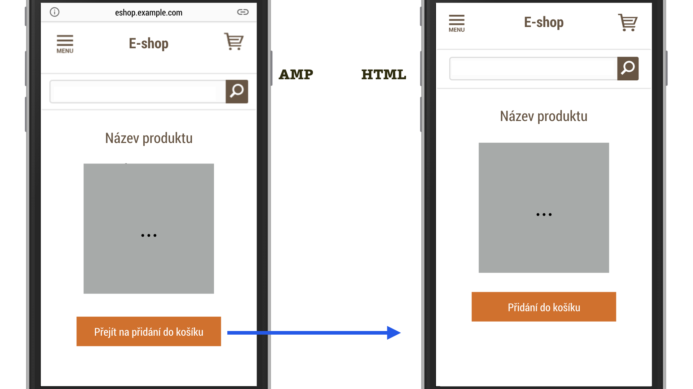
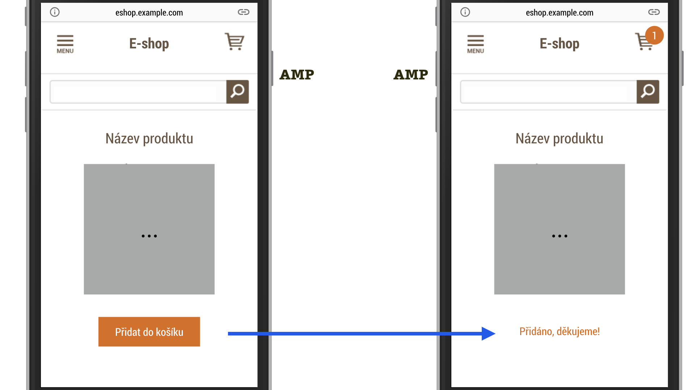

# Předávání stavu mezi AMP a non-AMP

Jak už víte, AMP stránky děláme hlavně proto, aby se dostaly do AMP Cache. Budou tedy „sedět“ na jiných adresách, než je původní URL webu.

Snad také alespoň trochu tušíte, že do téhle zrychlovací technologie pravděpodobně nebudete mít hned převedený celý současný nebo plánovaný web. Říkejme mu kanonický, nebo jednoduše non-AMP web. Pravděpodobně vám tedy uživatelé budou přecházet z AMP stránek na non-AMP a možná i naopak.

Navíc – co čert nechtěl – dnešní weby jsou sakramentsky dynamické potvory. Stále někde potřebujete aktualizovat data, personalizovat je, uchovávat stavy a předávat je mezi stránkami.

## Případ nákupního košíku

Vezměme chování košíku v e-shopech. Uživatelka navštíví stránku s produktem a šup – uloží si jej do košíku.

Ona i vy chcete, aby odteď bylo na košík spolehnutí. Aby byl jeho obsah k dispozici i na dalších stránkách vašeho webu. Aby byl k dispozici třeba i zítra, aby byl k dispozici za týden.

Prostě jinak než jako u většiny dnešních e-shopů využívajících AMP.

<figure>

<figcaption markdown="1">
_Funkcionalita přidání do košíku na AMP stránce obvykle chybí. Tlačítko slouží pouze pro přechod na non-AMP verzi. To bolí! Takhle prosím ne…_
</figcaption>
</figure>

Zkusme to vymyslet jinak. AMP pro to prostředky má.

## Komunikace s vaším backendem přes API

Jak už víte z dřívějších částí této kapitoly, [většina dynamických komponent](amp-komponenty-dynamicke.md) umí přebírat data z koncových bodů na vašem serveru.

Zhruba takhle by vypadalo vypsání aktuálního seznamu článků do AMP stránky pomocí komponenty `amp-list`:

```html
<amp-list width="auto" height="100" layout="fixed-height"
  src="https://example.com/clanky.json">
  <template type="amp-mustache">
    <div class="url-entry">
      <a href="{{url}}">{{title}}</a>
    </div>
  </template>
</amp-list>
```

Dobře, získání dat je asi jasné. Co když chci ale data zapsat? Jasně, pomocí formuláře to půjde, klasika. Následující ukázka ale odesílá ajaxový požadavek na pozadí, takže uživatel zůstane na původní adrese. Všimněte si atributu `action-xhr`:

```html
<form method="post" target="_top"
  action-xhr="https://example.com/api/zapsat-email">
  <input type="email" name="email" required>
  <input type="submit" value="Subscribe">
</form>
```

Fajn, takhle můžeme ukládat data, která vložil uživatel. Co kdybychom ale chtěli na server odeslat informace, které můžeme vypočíst jen kódem na straně klienta? Nemáme k dispozici JavaScript, takže výsledkem je jedno velké rozmrzení? Nikoliv, je tu ještě jedna věc.

## Náhrady proměnných v AMP

AMP umožňuje vkládat hodnoty proměnných z prostředí, v němž běží, na místa v kódu, která definujeme. Hodí se to nejen pro formuláře a odkazy, ale třeba také pro různá měření uživatele, nejčastěji komponentami `amp-pixel` nebo `amp-analytics`.

Řekněme, že chceme „pixelem“ měřit šířku viewportu uživatele. V AMP pro to máme k dispozici proměnnou `VIEWPORT_WIDTH`. Zápis kódu pro měření by pak mohl vypadat takto:

```html
<amp-pixel
  src="https://example.com/api/mereni?
    vw=VIEWPORT_WIDTH">
</amp-pixel>
```

Do měřicího kódu se ale pošle skutečný údaj, například:

```html
<amp-pixel
  src="https://example.com/api/mereni?
    vw=360">
</amp-pixel>
```

Tohle začíná být docela zajímavé, co myslíte? Můžete to použít pro odesílání i získávání dat:

* Odesílání dat v prvcích `<a>` a `<input>` nebo měřicími komponentami `amp-analytics` nebo `amp-pixel`.
* Získávání dat komponentami `amp-list` a `amp-state`.

V dokumentaci jsme napočítali kolem osmdesáti proměnných, které si můžete s AMP vyměňovat. Uvedeme alespoň ty nejzajímavější:

* _Stránka a obsah_ – URL adresy pro všechny možné výskyty AMP stránky (např. `AMPDOC_URL` vrátí adresu AMP dokumentu), odkazující stránky, HTML atributy nebo obsah prvku `<title>`.
* _Rychlost webu_ – docela dost čísel kolem rychlosti načtení a zobrazení stránky. Proměnná `CONTENT_LOAD_TIME` například vrátí dobu, kterou zabralo zobrazení obsahu webu.
* _Informace o zařízení a prohlížeči_ – velikost okna, viewportu, jazyk, čas a například i `USER_AGENT`, tedy typ zařízení a prohlížeč.
* _Interakce uživatele_ – informace o délce interakce, například `TOTAL_ENGAGED_TIME` ukazuje čas na stránce.
* _Viditelnost stránky a prvku_ – proměnné o viditelnosti jednotlivých prvků, vhodné zejména pro měření uživatelů.
* _Ostatní_ – nemálo zajímavé informace typu `AMP_GEO` (geolokace uživatele), `AMP_VERSION` (verze AMP) nebo `QUERY_PARAM` (předání parametru z URL adresy).

Detailní přehled je už nad rámec tohoto textu, najdete jej však online v dokumentu „AMP HTML URL Variable Substitutions“. [vrdl.in/ampvarsub](https://github.com/ampproject/amphtml/blob/master/spec/amp-var-substitutions.md)

Pokračujme ale dál, protože tu nejzajímavější proměnnou jsme si nechali na závěr.

## Client ID a uchovávání informací o uživateli napříč AMP stránkami

`CLIENT_ID` je proměnná, která jednoznačně identifikuje uživatele AMP stránky. Uchovává se klasicky přes lokální úložiště, jako je cookie nebo `localStorage`. O způsobu ukládání rozhoduje AMP, my do toho mluvit nemůžeme, podobně jako nemůžeme uživateli a prohlížečům mluvit do toho, zda a kdy tato úložiště promazávají.

Existence jednoznačného identifikátoru nám ale umožňuje leccos o uživateli našich AMP stránek ukládat. Tady je příklad se zobrazením seznamu článků pro konkrétního uživatele, který již dříve stránky navštívil:

```html
<amp-list
  width="auto" height="100" layout="fixed-height"
  src="https://example.com/clanky.json?
    clientId=CLIENT_ID(mojeCookie)">
  <template type="amp-mustache">
    <div class="url-entry">
      <a href="{{url}}">{{title}}</a>
    </div>
  </template>
</amp-list>
```

Dvě poznámky:

* `mojeCookie` je náš vlastní prefix, pod kterým chceme informace ukládat.
* `CLIENT_ID(mojeCookie)` se, jak už víte, na straně AMP přeloží do nějakého čísla, například `mojeCookie-123456`.

Podobným způsobem je možné uložit košík našeho AMP uživatele:

```html
<form method="post" target="_top"
  action-xhr="https://example.com/api/zapsat-kosik">
  <input name="clientId" type="hidden"
    value="CLIENT_ID(cart)"
    data-amp-replace="CLIENT_ID">
  <input type="hidden" name="name"
    value="Dětské boty Fare">
  <input type="hidden" name="price"
    value="1313">
  <input type="submit"
    value="Přidat do košíku">
</form>
```

Více informací a ukázky implementací najdete v ukázkovém tutoriálu „AMP for E-Commerce Getting Started“. [vrdl.in/ampecomm](https://amp.dev/documentation/examples/e-commerce/product_page/index.html)

Raději upozorníme na to, že veškerá komunikace s naším serverem vyžaduje povolení z jeho strany. Děje se to pomocí Cross-Origin Resource Sharing (CORS). [vrdl.in/ampcors](https://amp.dev/documentation/guides-and-tutorials/learn/amp-caches-and-cors/amp-cors-requests)

Situace už je tedy lepší. Pro přidání do košíku nemusíme uživatele poslat na kanonickou verzi stránky, ale akci vykonáme přímo z AMP stránky.

<figure>

<figcaption markdown="1">
_Tohle je lepší. Produkt přidáme do košíku už na AMP stránce a taky nám tady vydrží. Díky za „AMP Client ID“!_
</figcaption>
</figure>

Uživatele poznáme na jakémkoliv místě výskytu: na AMP stránce umístěné na našem serveru, v AMP Cache nebo přímo v AMP Vieweru.

Problémem ale zůstává identifikace uživatele při přechodu mezi AMP a naším běžným webem.

## Jak na sdílení informací mezi AMP a non-AMP verzí?

Rovnou říkáme, že to jde, ale v tuto chvíli to není zcela triviální. Pes je zakopaný v tom, že stránky nemohou nahlížet do cookies nebo jiných lokálních úložišť stránek běžících na jiné adrese. Přestože  z našeho pohledu jde o tytéž stránky, jen jinde umístěné.

Trochu jiná situace je u analytiky nebo přihlášeného uživatele. Google Analytics jsou na tuto situaci připravené, a tak stačí drobně nastavit měření na kanonické i AMP stránce a uživatele přecházejícího tam i zpět identifikují jednotně. Více o tom píšeme v části „Měření v jednom profilu“ textu [o Google Analytics](amp-analytics.md).

Podobné je to u komponent pracujících s přihlášením uživatele – `amp-access` i `amp-subscriptions`. U nich je možné pracovat s přihlášením třetí strany, například Googlu, a uživatele tak identifikovat na straně AMP i non-AMP webu. Nebo pomocí konceptu „Reader ID“ dovolují mapovat uživatele obou webů do jednoho profilu.

Více ostatně najdete online v dokumentace komponenty `amp-access`. [vrdl.in/ampaccess](https://amp.dev/documentation/components/amp-access)

V případě, že uživatel přihlášený není, je nutné párovat Client ID od AMP s vaším interním identifikátorem. Celý postup je složitější a nad rámec našich textů, takže vás odkážeme na pojednání „Managing non-authenticated user state with AMP“ od autorů AMP. [vrdl.in/ampuser](https://github.com/ampproject/amphtml/blob/master/spec/amp-managing-user-state.md)

Teď už máme dost informací, abychom dokázali nakódovat funkčnost stránky detailu produktu e-shopu.
