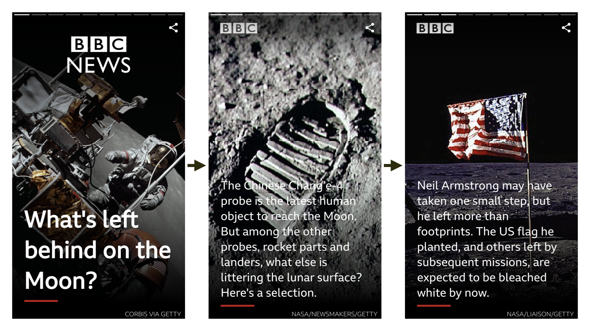
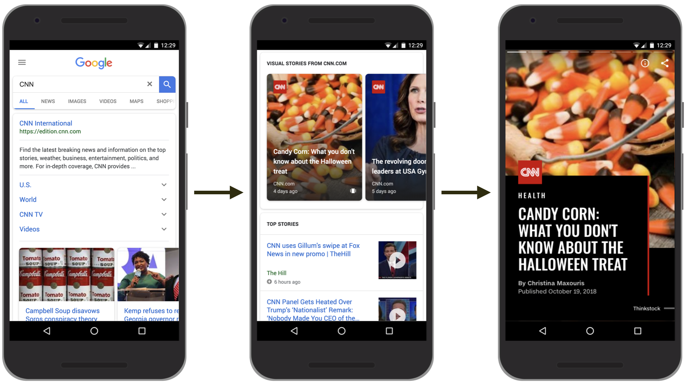
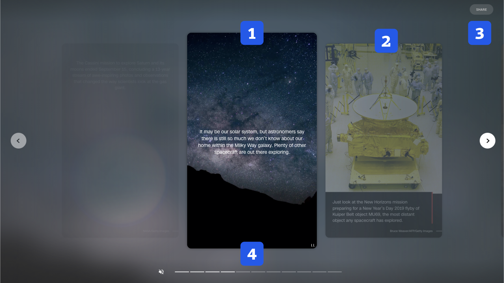

# AMP Stories: Příběhy ve výsledcích vyhledávání

Je možné, že formát Stories nebo prostě příběhů znáte z mobilního Instagramu a Facebooku nebo původně ze Snapchatu.

Ano, máme na mysli ty mizející příspěvky, které se aktivují kliknutím na avatara člověka nebo firmy. Zobrazují se na celou plochu displeje zařízení, animují se a umožňují také drobnou interaktivitu. Taková powerpointová prezentace pro éru sociálních sítí.

<figure>

<figcaption markdown="1">
_Obrázek: AMP Story od BBC o věcech, které nechali zapomnětliví kosmonauti na Měsíci. Zdroj: [amp.dev](https://amp.dev/about/stories)_
</figcaption>
</figure>

Stories prostě vyprávějí krátké příběhy. A pokud autor nebo autorka vyprávět umí, jsou poutavé. Jako příběhy. Je to formát, který spojuje texty, fotky, videa do formy interaktivních prezentací. Výsledek je zábavný a efektivní.

Není divu, že se koncept líbil v Googlu a že si tamní osazenstvo přálo mít tohle ve výsledcích vyhledávání, ale i dalších kontextech.

Však si představme, že hledáme recept na jednodušší jídlo nebo aktuální politickou kauzu a dostaneme je v jednoduché a atraktivní formě příběhu. Za nás palec nahoru. Formátu věštíme budoucnost, hlavně na mobilech.

## Jak se AMP Stories zobrazují?

<figure>

<figcaption markdown="1">
_Obrázek: Story o důležité zpravodajské kauze v Google Search._
</figcaption>
</figure>

Do Google.com stačí zadat jméno vydavatele a jeho „homepage na Googlu“ vám zobrazí seznam všech příběhů, které jsou aktuálně k dispozici. Kromě technologických vydavatelů jako Wired nebo Mashable si můžete nechat vyprávět příběhy také například od The Washington Post nebo CNN.

Video: [Introducing AMP Stories](https://www.youtube.com/watch?v=6zcYgQhH5TE) – představení formátu přímo od jeho autorů.

V Česku ke dni psaní textu bohužel o žádném využití příběhů významnějším médiem nevíme. Předpokládáme ale, že ke dni vydání už tomu bude jinak. Každopádně – pokud o nějakém využití v ČR nebo na Slovensku víte, sem s ním.

<figure>

<figcaption markdown="1">
_Obrázek: Anatomie AMP příběhu._
</figcaption>
</figure>

Pojďme si teď zapitvat. Vnitřní struktura AMP Story vypadá následovně:

1. Aktuální „slajd“
2. Posun vpřed a vzad
3. Možnost sdílení
4. Navigace

Jak je z obrázku vidět, jde o koncept „Mobile First“. Příběhy jsou vymyšlené primárně pro mobily, ale jakž takž se zobrazí i na počítačích.

* Vyzkoušejte si to (odkaz funguje jen na mobilu): [g.co/ampstories](https://g.co/ampstories)
* Další ukázky: [amp.dev/about/stories](https://amp.dev/about/stories)

Několik vybraných existujících příběhů:

* People.com: Grammys Red Carpet: [people.com/amp-stories/red-carpet-grammys](https://people.com/amp-stories/red-carpet-grammys/)
* People.com: Harry & Meghan: [people.com/amp-stories/royal-a-to-z/](https://people.com/amp-stories/royal-a-to-z/)
* Mashable.com: Black Panter: [vrdl.in/ampspanther](https://mashable.com/2018/02/13/reels-guide-to-black-panther.amp/?europe=true)
* WashingtonPost.com: Trump's wall: [vrdl.in/ampstrump](https://www.washingtonpost.com/graphics/2018/national/amp-stories/border-wall/??noredirect=on)

## Kde se to zobrazuje?

Google v první polovině roku 2019 oznámil, že pro „Visual Stories“ vytvoří speciální blok ve výsledcích vyhledávání. Stories bude zobrazovat v oblasti cestování a dále je plánuje „zapnout“ také pro následující oblasti: hry, filmy, televizi a módu.

Pokud bychom chtěli vyzkoušet AMP Stories přímo ve vyhledávání Googlu, postupovat budeme následovně:

1. Přepnout si vyhledávač do angličtiny (odkaz dole v patičce).
2. Hledat vydavatele jako například „CNN“, „Wired“ nebo „The Washington Post“.

O dostupnosti pro české vyhledávání nemáme v době psaní informace.

## Naklikejme si svou Story

AMP Stories mají tu výhodu, že pro jejich tvorbu nemusíme vládnout technologiím. Je zde řada nástrojů, které umožňují vizuální tvorbu:

* MakeStories, nástroj zdarma, který je již dnes k dispozici. [makestories.io](https://makestories.io/)
* Unfold, známý nástroj pro tvorbu příběhů, na podpoře pracuje. [unfoldstori.es](https://unfoldstori.es/)
* I plugin pro WordPress obsahuje vizuální editor pro příběhy. [amp-wp.org](https://amp-wp.org/)

## Technikálie: Jak to funguje uvnitř?

Jde o rozšíření HTML stejného typu, jaké se používá v „běžném“ AMP:

```html
<body>
  <amp-story standalone
    title="Co je to AMP?"
    publisher="Vzhůru dolů"
    publisher-logo-src="logo.svg"
    poster-portrait-src="obrazek.jpg">
  </amp-story>
</body>
```

`<amp-story>` je kontejner pro celý příběh. Z názvu atributů je zde asi jasné, k čemu slouží.

Dovnitř pak vkládáme jednotlivé stránky příběhu:

```html
<amp-story standalone …>
  <amp-story-page id="cover">
    <amp-story-grid-layer template="fill">
      <amp-img src="obrazek.jpg"
          width="720" height="1280"
          layout="responsive">
      </amp-img>
    </amp-story-grid-layer>
  </amp-story-page>
</amp-story>
```

Tohle už si pojďme vysvětlit podrobněji:

### Stránka

`<amp-story-page>` je stránka, která by měla mít unikátní `id`. Možná je lepší si to představit jako „slajd“ v prezentaci. Tedy jedno okno v PowerPointu nebo Keynote. Ve stránce ale ještě potřebujeme mít nějaký obsah. Ten vytvoříme vrstvami.

### Vrstva

`<amp-story-grid-layer>` je jako vrstva v grafickém editoru (ostatně i v editorech máme prezentační vrstvy). Parametr s hodnotou `template="fill"` říká, že se má použít šablona, která roztáhne obsah do celé plochy stránky.

Předpřipravených šablon je zde více, jejich layout asi lze odhadnout z názvů hodnot: `vertical`, `horizontal` nebo `thirds`. Vrstva je tedy mj. nositelem layoutu. Chybí nám tam ale ještě obsah.

### Obsah

`<amp-image>`, tedy obrázek, už většinou známe z AMP Websites. V tomto příkladu tvoří samotný obsah. Můžeme použít ale běžné HTML značky pro text (`<h1>`, `<p>`).

V základu bychom tady mohli skončit. Formát AMP Stories je samozřejmě daleko bohatší.  Dále je zde možnost například přidání animace nebo závěrečného „slajdu“ s možnostmi sdílení a zobrazením podobného obsahu.

I tady by to mohlo na úvod stačit. Ještě si ale přiložme několik odkazů:

* Tutoriál na amp.dev: [vrdl.in/ampst](https://amp.dev/documentation/guides-and-tutorials/start/visual_story/)
* Dokumentace komponent: [vrdl.in/ampsc](https://amp.dev/documentation/components/?format=stories)

A teď nastává to, co jednou muselo přijít. Konec povídání o AMP Stories, závěr šesté kapitoly a také finále celé knížky.
