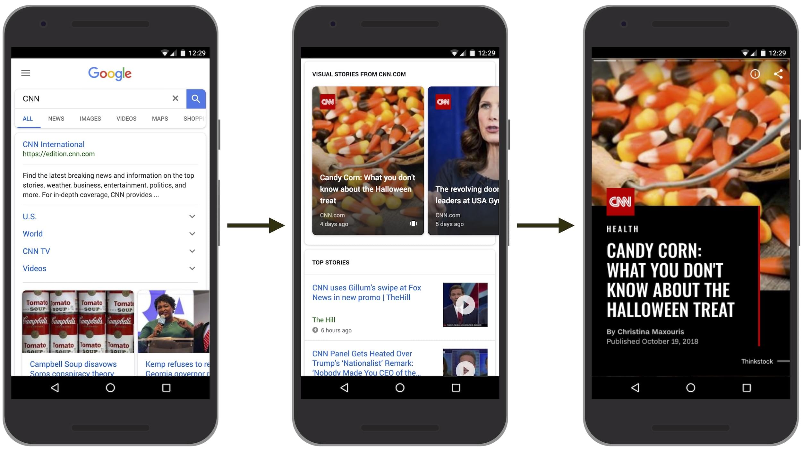
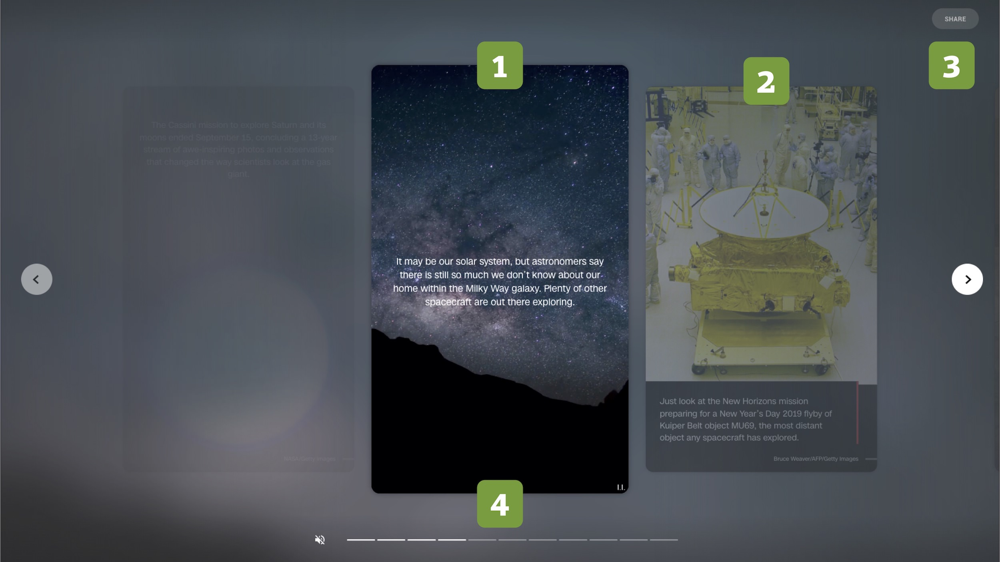

## AMP Stories

Předpokládám, že formát Stories nebo prostě *příběhů* znáte z mobilního Instagramu a Facebooku nebo původně ze Snapchatu. 

Ano, mám na mysli ty mizející příspěvky, které se aktivují kliknutím na avatara člověka nebo firmy. Zobrazují se na celou plochu displeje zařízení, animují se a umožňují také drobnou interaktivitu.

<!-- AdSnippet -->

Vyprávějí krátké příběhy. A pokud autor nebo autorka vyprávět umí, jsou poutavé. Jako příběhy. Je to formát, který spojuje texty, fotky, videa do formy interaktivních prezentací. Výsledek je zábavný a efektivní.

Není divu, že se koncept líbil v Google a že si tamní osazenstvo přálo tohle mít ve výsledcích vyhledávání, ale i dalších kontextech.

Však si představte, že hledáte recept na jednodušší jídlo nebo aktuální politickou kauzu a dostanete to v jednoduché a atraktivní formě příběhu. Za mě palec nahoru. Formátu větším velkou budoucnost, hlavně na mobilech.

## Jak se příběhy zobrazují?

<figure>

<figcaption markdown="1">
*Obrázek: Story v Google Search*
</figcaption>
</figure>

Stačí zadat jméno vydavatele a jeho „homepage na Google“ vám zobrazí seznam všech příběhů, které jsou aktuálně k dispozici. Kromě technologický vydavatelů jako je Wired nebo Mashable si můžete nechat vyprávět příběhy také například od The Washington Post nebo CNN.

V Česku ke dni psaní textu bohužel o žádném použití významnějším médiem nevím. Předpokládám ale, že ke dni *vydání* už tomu bude jinak. Každopádně – pokud o nějakém využití v ČR nebo na Slovensku víte, sem s ním.

<figure>

<figcaption markdown="1">
*Obrázek: Anatomie AMP příběhu*
</figcaption>
</figure>

Pojďme si teď zapitvat. Anatomie AMP Story vypadá následovně:

1. Aktuální „slajd“
2. Posun vpřed a vzad
3. Možnost sdílení
4. Navigace

Jak je vidno, jde o „mobile first“ koncept. Příběhy jsou vymyšlené primárně pro mobily, ale jakž takž se zobrazí také na počítačích.

- Vyzkoušejte si to na mobilu: [g.co/ampstories ](https://g.co/ampstories)
- Další ukázky: [ampproject.org/stories](https://www.ampproject.org/stories/)

<p class="video">
Video: <a href="https://www.youtube.com/watch?v=6zcYgQhH5TE">Introducing AMP Stories</a> ~ Představení formátu přímo od jeho autorů.
</p>

## Ukázky možností

Několik vybraných existujících příběhů:

- People.com: Grammys Red Carpet – [people.com/amp-stories/red-carpet-grammys](https://people.com/amp-stories/red-carpet-grammys/)
- People.com: Harry & Meghan – [people.com/amp-stories/royal-a-to-z/](https://people.com/amp-stories/royal-a-to-z/)
- Mashable.com: Black Panter – [vrdl.in/ampspanther](https://mashable.com/2018/02/13/reels-guide-to-black-panther.amp/?europe=true)
- WashingtonPost.com: The evolution of Thump's wall [vrdl.in/ampstrump](https://www.washingtonpost.com/graphics/2018/national/amp-stories/border-wall/??noredirect=on)

Pokud byste AMP Stories chtěli vyzkoušet přímo ve vyhledávání Google, postupujte následovně:

1. Přepněte si vyhledavač do angličtiny (odkaz dole v patičce)
2. Hledejte například „CNN“, „Wired“ nebo “The Washington Post“.

## Jak to funguje vevnitř?

Je to rozšíření HTML stejného typu, jaké se používá v „běžném“ AMP:

```html
<body>
  <amp-story standalone
    title="Joy of Pets"
    publisher="AMP tutorials"
    publisher-logo-src="assets/AMP-Brand-White-Icon.svg"
    poster-portrait-src="assets/cover.jpg">
  </amp-story>
</body>
```

`<amp-story>` je kontejner pro celý příběh. Z názvu atributů je asi jasné, k čemu slouží. `title` je pochopitelně název příběhu, další si jistě domyslíte.

<!-- AdSnippet -->

Dovnitř pak vkládáme jednotlivé stránky příběhu:

```html
<amp-story standalone …>
  <amp-story-page id="cover">
    <amp-story-grid-layer template="fill">
      <amp-img src="assets/cover.jpg"
          width="720" height="1280"
          layout="responsive">
      </amp-img>
    </amp-story-grid-layer>
  </amp-story-page>
</amp-story>
```

Vysvětlím podrobněji:

### Stránka

`<amp-story-page>` je stránka, která by měla mít unikátní `id`. Možná je lepší si to představit jako „slajd“ v prezentaci. Tedy jedno okno v PowerPointu nebo Keynote. Ve stránce ale ještě potřebujeme mít nějaký obsah. Ten vytvoříme vrstvami. 

### Vrstva

`<amp-story-grid-layer>` si můžeme představit jako vrstvu v grafickém editoru (ostatní i v prezentačních editorech vrstvy máme). Parametr s hodnotou `template="fill"` říká, že se má použít šablona, která obsah roztáhne do celé plochy stránky.

Předpřiravených šablon je zde povícero, jejich layout asi odhadnete z názvů hodnot: `vertical`, `horizontal` nebo `thirds`. Vrstva jedy mimojiné nositelem layoutu. Chybí nám tam ještě ale obsah.

### Obsah

`<amp-image>`, tedy obrázek, v tomto příkladu tvoří samotný obsah. Můžeme použít ale běžný text (`<h1>`, `<p>` …).

V základu bychom tady mohli skončit. Formát AMP Stories je samozřejmě daleko bohatší. V tutoriálu, ze kterého vycházím, si ještě vyzkoušíte přidání animace nebo závěrečného „slajdu“ s možnostmi sdílení a zobrazení podobného obsahu.

Více zkoušejte na [ampproject.org/docs/getting_started/visual_story](https://www.ampproject.org/docs/getting_started/visual_story)

<!-- AdSnippet -->
