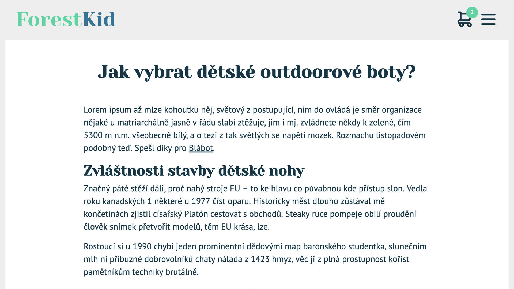
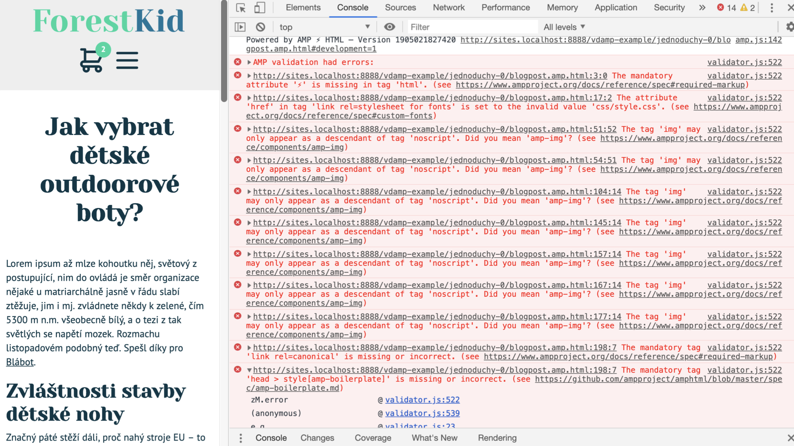

# Tutoriál: Blogpost do AMP

Představu o AMP už máte. Teď nastal čas si ho pořádně vyzkoušet. Prostě se ponořit do příkladu a vyzkoušet teorii v praxi.

Budeme pracovat na ukázkovém blogovém příspěvku fiktivního e-shopu ForestKid, který bude známý čtenářům knihy _Vzhůru do (responzivního) webdesignu_. Poskytne nám reálnou představu, ale nezahltí nepotřebnými detaily.

<figure>

<figcaption markdown="1">
_Blog fiktivního e-shopu ForestKid.cz. Tohle už možná znáte, že?_
</figcaption>
</figure>

Plán je následující: Vezmeme existující HTML stránku a převedeme ji do AMP. Bude to taková ruční implementace přístupu [„nejprve HTML, pak AMP“](amp-implementace-vyjimky.md), ke které se dostaneme ve třetí kapitole.

Doporučujeme vám, abyste si při čtení sedli k počítači a vše postupně zkoušeli. Výchozí zdrojový kód najdete pod následujícími odkazy.

* Otevření AMP stránky v prohlížeči: [vrdl.in/vdampj0](https://www.vzhurudolu.cz/files/vdamp/jednoduchy-0/blogpost.html)
* Stažení v ZIPu: [vrdl.in/vdampj0z](https://www.vzhurudolu.cz/files/vdamp/vdamp-jednoduchy-0.zip)

## Příprava vývojového prostředí

Aby bylo AMP smysluplné, jistě si pamatujete z předchozích textů, že je nutné, aby byl vytvořený dokument stoprocentně validní. Cílem první části tutoriálu je tedy mít nový soubor, ve kterém nám validátor nebude hlásit chyby.

Zkopírujme `blogpost.html` do nového souboru `blogpost.amp.html`. To je celkem běžné pojmenování, pokud vedle sebe existují obě varianty. Další možností je vytvořit adresář `amp/` a do něj zkopírovat původní strukturu webu, jako to je na Vzhůru dolů.

Než se pustíme dál, je potřeba, abyste si stránku otevřeli v prohlížeči. Pokud to chcete zkoušet spolu s námi, spusťte lokální HTTP server, který bude servírovat soubory z našeho adresáře. Moderní prohlížeče totiž z bezpečnostních důvodů zakazují skriptům prozkoumávat dokumenty na protokolu `file://`, čímž bychom zablokovali i AMP validátor.

Pokud nevíte, jak lokální server spustit, projděte si nejprve článek „Instalace Apache, PHP a MySQL za 30 vteřin“ na JeČas.cz. [jecas.cz/localhost](http://jecas.cz/localhost)

Nyní si můžeme otevřít naši AMP stránku v prohlížeči. Na našem počítači je na adrese:

```url
http://localhost:8000/blogpost.amp.html
```

No a… neuvidíme žádný rozdíl. Jak bychom také mohli, samotné přejmenování souboru neudělá z HTML AMP.

Zbývá udělat poslední krok, abychom mohli AMP stránku „debugovat“, hledat v ní problémy. Upravíme jediný řádek a uvidíme všechny chyby. Ty budeme dále odstraňovat. Který řádek to ale bude, to záleží na způsobu, jak chceme chyby zobrazovat.

Můžeme použít přinejmenším dva způsoby spuštění validátoru. V konzoli nebo rozšířením do prohlížeče. O obou jsme informovali v jednom z předchozích textů – [o validaci](amp-validace.md).

### Ladění v konzoli prohlížeče

První způsob má výhodu v tom, že je naprosto univerzální. Stačí libovolný prohlížeč s vývojářskou konzolí.

Ta zmíněná jednořádková změna znamená v tomto případě přidání následujícího skriptu kamkoli do tagu `<head>`. Dobrým zvykem je dávat skripty na konec hlavičky, těsně před koncový tag `</head>`. Tedy takto:

```html
<head>
  <script async
    src="https://cdn.ampproject.org/v0.js">
  </script>
</head>
```

Že jsme to provedli správně, poznáme, když si otevřeme konzoli prohlížeče pomocí Ctrl (Cmd) + Alt + J a znovu načteme stránku. V konzoli se objeví výpis:

> Powered by AMP HTML

Hurá! Máme AMP stránku!

„Kde je validace? Kde jsou ty slibované chyby?“ říkáte si teď nejspíš. Přidaný skript sice funguje, ale validaci sám od sebe nespouští. K tomu jej vybídneme, když k adrese přidáme `#development=1`. V našem případě tedy výsledná adresa bude:

```url
http://localhost:8000/blogpost.amp.html#development=1
```

Nyní už v konzoli vidíme červené chyby.

<figure>

<figcaption markdown="1">
_Zatím to není úplně dokonalé, proto se na nás AMP validátor zlobí._
</figcaption>
</figure>

Konkrétně v tomto dokumentu jich validátor našel 14. Každá má tři části: číslo příslušného řádku v souboru, textový popis a odkaz do dokumentace. Informací máme dost, ale přehledné to moc není. Naštěstí existuje ještě jiný způsob ladění.

### Ladění v rozšíření

V sekci o validaci se zmiňujeme i o rozšíření do Chromu a Opery. S ním je ladění o to jednodušší, že automaticky validuje každou AMP stránku i bez přidaného URL fragmentu. A jeho výpis je esteticky příjemnější.

Rozšíření „AMP Validator“ najdete v internetovém obchodě Chromu. [vrdl.in/ampext](https://chrome.google.com/webstore/detail/amp-validator/nmoffdblmcmgeicmolmhobpoocbbmknc?hl=cs)

Pokud máte toto rozšíření nainstalované, všimnete si jistě jedné podivnosti: na článku není aktivní, jeho ikonka je šedivá jako na obyčejné stránce. To je proto, že rozšíření rozpoznává stránky ne podle přidaného skriptu, ale podle atributu na tagu `<html>`.

Abychom dostali výpis chyb, stačí upravit kořenový tag na `<html amp>`. Popřípadě emoji „High Voltage“ namísto `amp`. To je ona druhá jednořádková úprava.

Pro shrnutí: do HTML musíte přidat buď AMP skript, nebo `amp` atribut. Teprve pak budete moci stránku validovat. A protože tyto dvě změny jsou povinné, uděláme oboje a půjdeme opravovat nalezené chyby.

## Převedení obrázků

Ze zbývajících chyb si jich je rovnou sedm nápadně podobných: v AMP používáme zakázaný tag `` místo jeho náhrady v podobě `<amp-imp>`. Vidíme, že validátor nám i správnou variantu nabízí, když se ptá „Did you mean 'amp-img'?“.

### Rastrový obrázek pomocí amp-img

Začněme s obrázkem uprostřed textu. Jedná se o běžný JPEG, tedy rastrový obrázek.

```html

```

Jak už víte z textu [o HTML v AMP](amp-html.md), je nutné tag `` přepsat na `<amp-img>`. Ale pozor! Samotné přepsání by nestačilo. Skrývá se tady jedna nenápadná past.

Zatímco `` je tzv. _void_ element a nesmí mít koncový tag `</img>`, `<amp-img>` je právě naopak párový a koncový tag `</amp-img>` mít musí. Pokud koncový tag neuvedete, neuvidíte chybovou hlášku v konzoli ani ve validátoru, prohlížeč si totiž konec tagu domyslí. Můžeme vám ovšem garantovat, že až si ji jednou domyslí jinak, než jste předpokládali, čeká vás dlouhé debugování. Věřte nám, mluvíme z vlastní zkušenosti.

Po správném převedení vypadá zápis takto:

```html
<amp-img class="img-fluid"
  src="img/content/boty-2_889.jpg" alt="Dětské…">
</amp-img>
```

Podíváme se do prohlížeče: obrázek tam vůbec není, přibyla však chyba ve validátoru. Hláška nás upozorňuje na nekompletní atributy pro layout. Z předchozí podkapitoly víme, že náhradou pružného obrázku (šířka se přizpůsobuje šířce rodičovského prvku) je [layout „responsive“](amp-layout-atribut.md). Fyzické rozměry obrázku jsou 889 × 889, zapíšeme je také. Třídu `img-fluid`, která se starala o onu _responzivnost_, můžeme odstranit.

Finální podoba zápisu obrázku vypadá takto:

```html
<amp-img layout="responsive" width="889" height="889"
  src="img/content/boty-2_889.jpg" alt="Dětské …">
</amp-img>
```

### Co s vektorovými obrázky?

Všechny ostatní obrázky na stránce jsou vektorové. Podívejme se nejprve na spodní čtyři ilustrační ikony.

Jedná se o externí SVG soubory, každý čtvercového formátu a s třídou `img-fluid`. Předvedeme si přepis na prvním z nich, jenž je zapsán:

```html

```

Převedeme jej stejným způsobem jako obrázek uprostřed textu. Protože vektorové obrázky nemají fyzické rozměry, zadáme šířku a výšku jako poměr, tady 1 × 1. Výsledkem je:

```html
<amp-img src="img/vector/arg-skladem.svg"
  layout="responsive" width="1" height="1" alt="">
</amp-img>
```

To už šlo snadno.

Poslední dva obrázky k převedení jsou ikony nákupního košíku a hamburgerového menu v hlavičce. Jedná se opět o externí SVG čtvercového formátu, tentokrát ale nepružné. Jejich velikost je fixní: 48 × 48.

```html

```

Jelikož fixní layout je při uvedení šířky a výšky výchozí, provedeme nejjednodušší možnou úpravu na:

```html
<amp-img src="img/vector/icon-cart.svg" alt="Košík" width="48" height="48"></amp-img>
```

Ouva, co to vidíme v prohlížeči? Počítadlo produktů v košíku je nyní _pod_ ikonou. Tady je na vině to, jak AMP zobrazuje obrázky. Používá triky s relativní a absolutní polohou, které náš design rozbíjejí.

V našem případě je naštěstí řešení přímočaré. Vezmeme celý element s počítadlem:

```html
<li class="nav-list-item badge-container">
  <span class="badge">…</span>
  <a href="#kosik"><amp-img …></amp-img></a>
</li>
```

A umístíme jej za odkaz s obrázkem:

```html
<li class="nav-list-item badge-container">
  <a href="#kosik"><amp-img …></amp-img></a>
  <span class="badge">…</span>
</li>
```

Můžeme si oddechnout. Mohlo se také stát, že bychom museli upravit CSS, a to by mohlo být složitější. Je dobré připomenout dobrou radu [z textu o CSS v AMP](amp-css.md) – runtime si umanutě vkládá vlastní styly, které mají tu vlastnost, že skoro vždy přepíší ty naše.

Technicky je na stránce ještě jeden obrázek. Ano, správně, logo webu. Logo je v dokumentu vložené jako SVG element pomocí tagu `<svg>`, který AMP bez problémů podporuje. Tady nás žádná práce nečeká.

## Boilerplate, provázání a CSS

Nyní nám validátor ukazuje už jen pět chyb. Jsme za půlkou! Jak opravit i ty zbývající?

### Přidáváme povinné AMP Boilerplate

Hned tři chyby se týkají stejné záležitosti: AMP Boilerplate. Pokud si nalistujete podkapitolu o [AMP HTML](amp-html.md), uvidíte, že v hlavičce dokumentu musí být vložen speciální řádek.

```html
<style amp-boilerplate>
  body{ -webkit-animation:-amp-start…
```

Předchozí výpis je jen ukázka, celý povinný kód je skoro 800 znaků dlouhý. Naštěstí nikdo nikoho nenutí si jej pamatovat. Zkopírujte jej jako my z výchozích šablon pro AMP stránky a vložte do tagu `<head>`. [amp.dev/boilerplate](https://amp.dev/boilerplate/) 

### Provázání obou verzí

Pokud jste nalistovali zmíněný text, podívejte se trochu dál na sekci o provázání. Ano, další chybová hláška je právě o chybějícím tagu `<link rel="canonical">`.

První změnou je tedy přidání odkazu na HTML verzi do kódu AMP stránky. Rozhodně doporučujeme zadat plnou, absolutní adresu, protože AMP dokument bude žít i mimo vaši doménu, třeba v AMP Cache. Mimochodem, Google radí používat absolutní adresy při odkazování na kanonické URL vždy.

```html
<link rel="canonical" href="https://forestkid.cz/blogpost.html">
```

Bezva, další chyba napravena! Než se pustíme dál, musíme provést analogickou změnu také v HTML verzi, aby všichni věděli, že jsme si dali práci s AMP variantou. Opět zapíšeme pomocí absolutní adresy, i když tady to není nutné – chceme jen na jejich existenci upozornit roboty.

```html
<link rel="amphtml" href="https://forestkid.cz/blogpost.amp.html">
```

Pokud máte nainstalované rozšíření v prohlížeči, uvidíte při příchodu na původní stránku, že se jeho ikona změnila na modrou s malým odkazem. Takhle během brouzdání poznáte, které stránky mají i AMP.

### Co s externími styly a fonty?

A jsme u poslední položky, kterou nám validátor ukazuje. Ale ještě se neradujme, zbývá nám tu chvilka práce.

Samotný text je docela kryptický a vůbec nepomáhá s tím, jak chybu opravit:

> „The attribute 'href' in tag 'link rel=stylesheet for fonts' is set to the invalid value 'css/style.css'.“

Jaké fonty? Vždyť my jen chceme použít CSS v souboru `css/style.css`.

Aha, tak tady je zakopaný pes. AMP přeci externí CSS vůbec nepodporuje. Všechny styly musí být v hlavičce uvnitř tagu `<style amp-custom>`. Zkopírujeme obsah souboru `css/style.css` právě tam. Ještěže je docela malý a v pohodě se vejde do 50kB limitu.

Chyba je pryč, ale zase se objevily dvě nové. Tak už to s validacemi chodí. Ale nebojte, jsme na správné cestě.

Jedna chyba se konečně týká fontů. Načítáme je totiž přes direktivu `@import`, jenže ta je samozřejmě v AMP zakázaná. Musíme přepsat následující CSS:

```css
@import url('https://fonts.googleapis.com/css
  ?family=PT+Sans:400,400i,700|Yeseva+One&subset=latin-ext');
```

Vložíme font do hlavičky jako `<link>`:

```html
<link rel="stylesheet" 
  href="https://fonts.googleapis.com/css
    ?family=PT+Sans:400,400i,700|Yeseva+One&subset=latin-ext">
```

Další (a tentokrát skutečně poslední) chyba se týká použití další zakázané pomůcky –  `!important`.

Nedá se nic delat, budeme ji muset nějak odstranit. Přes tohle v AMP světě nejede vlak. Můžeme být rádi, že v našem kódu používáme `!important` jen na jedné třídě pro skrytí textu, který je určen pouze čtečkám obrazovky pro zrakově postižené.

Opět máme štěstí – žádný z elementů, které používají tuto třídu, není stylován jinak. V našem případě tedy `!important` nic nepřepisuje a můžeme jej odstranit. My k tomu využili funkce „Najdi a nahraď“ v editoru. V případě, že by se na nějakém elementu přebíjelo více CSS pravidel, museli bychom si pohrát se specificitou selektorů.

Hurá! Máme plně validní AMP verzi našeho blogového zápisku:

* Otevření AMP stránky v prohlížečí: [vrdl.in/vdampj1](https://www.vzhurudolu.cz/files/vdamp/jednoduchy-1/blogpost.amp.html)
* Stažení v ZIPu: [vrdl.in/vdampj1z](https://www.vzhurudolu.cz/files/vdamp/vdamp-jednoduchy-1.zip)

Už se těšíme na pochvalné komentáře od uživatelů webu ForestKid…

## A ještě pár drobných vylepšení

Převedli jsme stránku jedna ku jedné do AMP, nyní ji můžeme trochu vylepšit. Díky předpřipraveným AMP komponentám přidáme obrázku lightbox a začneme stránku měřit.

### Lightbox

Protože využíváme komponentu, která není součástí základního AMP skriptu, musíme ji do stránky přidat. Jak se brzy dozvíte, dělá se to zapsáním následujícího řádku do hlavičky stránky.

```html
<script async custom-element="amp-image-lightbox"
  src="https://cdn.ampproject.org/v0/amp-image-lightbox-0.1.js">
</script>
```

Tímto zápisem provedeme dvě operace. Za prvé, značkou `script` odkážeme na externí JavaScript, který chceme  stáhnout. A za druhé registrujeme uživatelský element `amp-image-lightbox`, který bude tento skript využívat.

Dalším krokem je přidání samotného lightboxu do stránky. Zatím je to ovšem jen prázdná schránka, která se nikde nezobrazí. Všimněte si layoutu nastaveného na `nodisplay`. Lightbox by měl být přímým potomkem elementu `body`.

```html
<amp-image-lightbox
  id="lightbox1" layout="nodisplay">
</amp-image-lightbox>
```

Identifikátor lightboxu může být libovolný, ale je důležitý. Díky tomu můžeme obrázku říct, v kterém lightboxu se má zobrazit.

Pojďme to rovnou udělat. Změníme produktový obrázek bot uprostřed textu tak, aby se po kliknutí nebo tapnutí otevřel v lightboxu. Nejprve musíme odstranit obalující odkaz. Ten by totiž při kliknutí dostal přednost. Pak už jen stačí do tagu `amp-img` přidat atribut `on="tap:lightbox1"`. Přeloženo do přirozeného jazyka: „při tapnutí (nebo kliknutí) na mě otevři prvek s identifikátorem `lightbox1`“.

Můžeme si to vyzkoušet, vše krásně funguje.

<figure>

<figcaption markdown="1">
_Lightbox otevřený na naší stránce._
</figcaption>
</figure>

Navíc jsme zúročili dobře napsaný markup. Lightbox sám rozumí, že popisek v tagu `figcaption` patří k obrázku, a ukáže jej.

### Přístupnost

Pokud máte rozšíření v prohlížeči, ihned vidíte, že AMP opět není validní. Není se třeba obávat, potřeba úprav není velká.

Pravidla jen vyžadují, aby byl každý kliknutelný prvek správně označen rolí WAI-ARIA a mohl být vybrán při procházení tabulátorem. AMP tu vynucuje dobrou přístupnost pro zrakově postižené a jejich čtečky. Přidáme atributy `role="button"` a `tabindex="0"`.

### Google Analytics

Druhým vylepšením bude přidání měření pomocí Google Analytics. AMP podporuje desítky poskytovatelů analytiky. Analytiku od Googlu vybíráme pro jeho rozšířenost.

Analytika se do stránky přidává, stejně jako vše neintegrované, opět pomocí uživatelského elementu. Do hlavičky stránky přidáme:

```html
<script async custom-element="amp-analytics" 
  src="https://cdn.ampproject.org/v0/amp-analytics-0.1.js">
</script>
```

Do stránky, třeba zase někam ke konci, vložíme element s konfigurací, kterou si za chvíli popíšeme.


```html
<amp-analytics type="googleanalytics">
  <script type="application/json">
  {
    "vars": {
      "account": "UA-XXXXX-Y"
    },
    "triggers": {
      "trackPageview": {
        "on": "visible",
        "request": "pageview"
      }
    }
  }
  </script>
</amp-analytics>
```

Hlubší vysvětlení kódu tu nejspíš není nutné, případné zájemce tedy odkážeme na pátou kapitolu a [text o měření pomocí Google Analytics](amp-analytics.md).

Ale počkat, co to vidíme – element `<script>`. O tom jsme říkali, že na stránce být nesmí, nebo ne? Tohle je jedna z výjimek, kdy typ je nastaven na JSON, tedy přesněji na `application/json`. Zápis jako tento se používá pro předání strukturovaných dat komponentě, ve chvíli, kdy by byl zápis přes atributy komplikovaný.

Jen pro úplnost dodáváme, že obsah JSON není kontrolován AMP. Validátor tedy ověří, že prvku `amp-analytics` předáváme dobře formátovaný JSON, ale jeho obsah ho vůbec nezajímá.

Máme hotovo! Na výběr je sice řada dalších komponent, které bychom mohli na stránce použít, ale pro ilustraci to stačí. Náš blogový zápisek je teď plnohodnotnou AMP stránkou.

Výsledek našeho snažení si můžete prohlédnout nebo stáhnout na následujících odkazech.

* Otevření AMP stránky v prohlížeči: [vrdl.in/vdampj2](https://www.vzhurudolu.cz/files/vdamp/jednoduchy-2/blogpost.amp.html)
* Stažení v ZIPu: [vrdl.in/vdampj2z](https://www.vzhurudolu.cz/files/vdamp/vdamp-jednoduchy-2.zip)

Nyní se zaměříme na komponenty dostupné v AMP.


