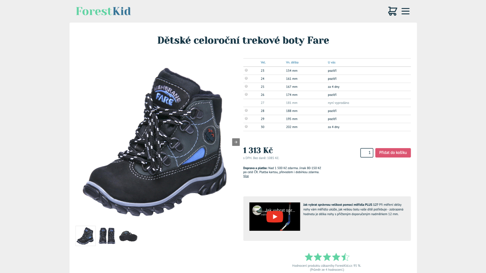
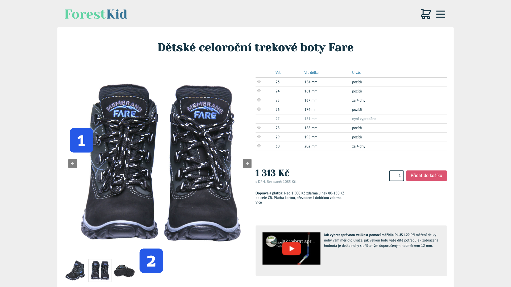
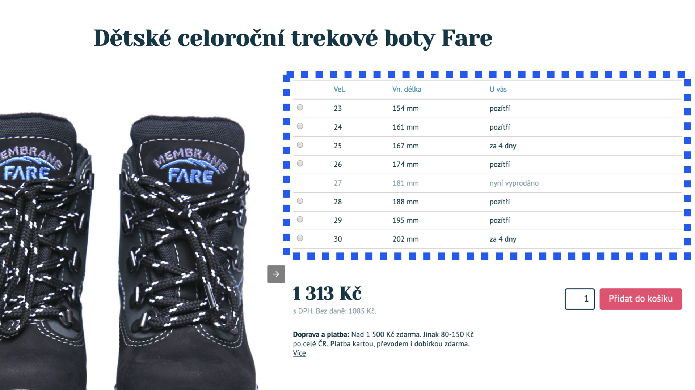
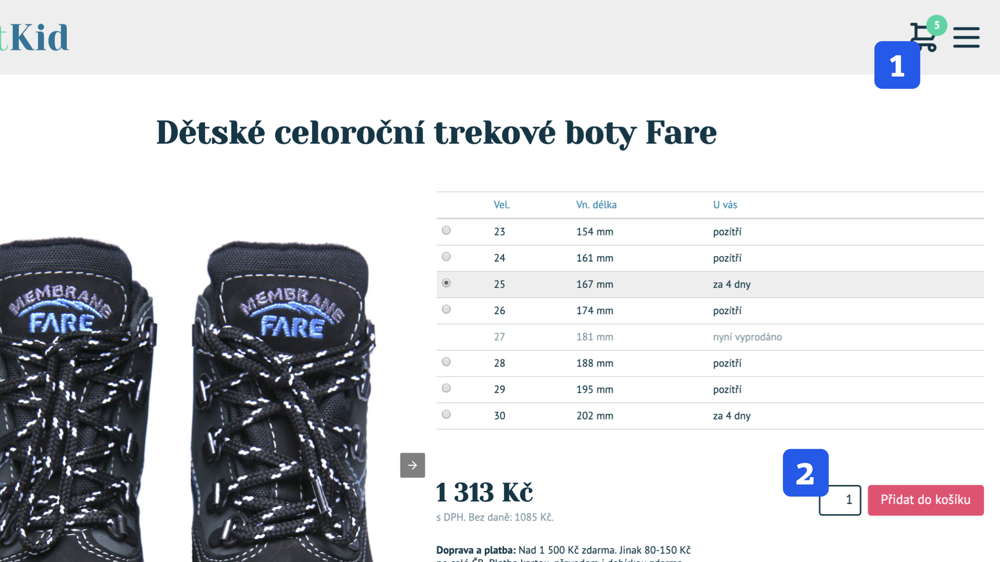

# Tutoriál: Detail produktu e-shopu

Na tuhle část knížky jsme se obzvlášť těšili. Ukazuje dynamickou část AMP, tu, která je zatím vývojářům málo známá.

Připravili jsme zde jednoduchou šablonu produktu v e-shopu navazující [na blogpost z předchozího tutoriálu](amp-tutorial-blogpost.md).

<figure>

<figcaption markdown="1">
_To je ona, stránka smyšleného e-shopu ForestKid.cz._
</figcaption>
</figure>

Je viditelná online nebo si ji můžete stáhnout:

* Otevření AMP stránky v prohlížeči: [vrdl.in/vdampp0](https://www.vzhurudolu.cz/files/vdamp/pokrocily-0/product.amp.html)
* Stažení v ZIPu: [vrdl.in/vdampp0z](https://www.vzhurudolu.cz/files/vdamp/vdamp-pokrocily-0.zip)

Zprovoznění lightboxu nad obrázkem už jsme se naučili, ale ještě neumíme ovládat galerii fotografií a provázat ji s malými náhledy. Stáhneme si data z externího JSON souboru a vypíšeme je do stránky. A pak si ukážeme, jak přidávat produkty do košíku.

## Fotogalerie s náhledy

Na galerii s náhledy, kterou vidíte na obrázcích, už nám jedna komponenta AMP stačit nebude. Ale poradíme si, uvidíte.

<figure>

<figcaption markdown="1">
_Fotogalerie v detailu produktu. Velký obrázek v karuselu (1) je doplněný náhledy (2)._
</figcaption>
</figure>

Rádi bychom zde měli možnost brouzdat fotografiemi pomocí šipek (číslo 1 v obrázku) a také zobrazení konkrétní fotky kliknutím na náhled dole (číslo 2). To první je _slajder_, že? Nebo univerzálněji _karusel_. Použijeme proto komponentu `amp-carousel`.

### 1) Karusel s amp-carousel

Zjednodušený kód karuselu (číslo 1 v obrázku) vypadá asi takto:

```html
<amp-carousel id="image-carousel" class="gallery-pane"
  width="600" height="600" layout="responsive"
  controls type="slides">
  <amp-img
    src="boty-1_md.jpg"
    width="1" height="1" layout="responsive"
    on="tap:lightbox1" role="button"
    tabindex="0" alt="…">
  </amp-img>
  <amp-img
    src="boty-2_md.jpg"
    width="1" height="1" layout="responsive"
    on="tap:lightbox1" role="button"
    tabindex="0" alt="…">
  </amp-img>
</amp-carousel>
```

Pojďme si to vysvětlit:

* `<amp-carousel>` je komponenta sloužící k zobrazení karuselů, slajderů, prezentací… Je to všechno podobné, ale každý tomu říká trochu jinak. Atribut `controls` zajistí stálé zobrazení ovládacích prvků – postranních šipek. `type="slides"` označuje, že tohle je ze všech typů karuselů právě _slajder_. Prostě taková ta věc, kde je vidět vždy jen jeden _slajd_.
* Layout v AMP [už umíme](amp-layout-atribut.md), takže jen pro jistotu vysvětlím, že `width="1" height="1"` u jednotlivých obrázků značí poměr stran 1 : 1 a přizpůsobení šířce rodičovského elementu máme ošetřeno pomocí `layout="responsive"`.
* `on="tap:lightbox1"` čeká na „tapnutí“ uživatele, načež spustí `lightbox1`, což je název zde registrované komponenty `amp-lightbox`. Základy fungování akcí a událostí v AMP jsme načrtli v textu [o JavaScriptu v AMP](amp-javascript.md).
* Nesmíme zapomenout ani na přístupnost ve čtečkách obrazovky pro zrakově postižené. `role="button"` deklaruje, že jde o aktivní prvek. `tabindex="0"` jej umožní zaměřit při ovládání z klávesnice. Obojí musíme udělat u všech „klikatelných“ AMP komponent, protože na rozdíl od `<a>` nebo `<button>` je prohlížeče neznají, a tudíž jim nepřisoudí správné chování ve čtečkách. Z podobného důvodu nezapomínejme ani na obsah atributu `alt=""`, který jsme kvůli čitelnosti vynechali.

Bezva! Tohle nám zajistí zobrazení karuselu a možnost překlikávání mezi fotografiemi pomocí šipek.

Pro jistotu si ještě připomeňme, že všechny zde používané komponenty je potřeba instalovat. Děje se tak prostým přidáním vyžadovaného skriptu do hlavičky dokumentu. U karuselu například takto:

```html
<script async custom-element="amp-carousel"
  src="https://cdn.ampproject.org/v0/amp-carousel-0.1.js">
</script>
```

Pojďme se teď podívat na výběr náhledů pod velkou fotografií.

### 2) Malé náhledy fotografií pomocí amp-selector

To, co v obrázku vidíme pod číslem 2, je v kódu zapsáno zhruba následovně:

```html
<amp-selector class="gallery-thumbs" layout="container"
  on="select:image-carousel.
    goToSlide(index=event.targetOption)">
  <amp-img
    src="boty-1_sm.jpg"
    width="88" height="88" layout="fixed"
    role="button" tabindex="0"
    alt="…" class="photo"
    option="0" selected>
  </amp-img>
  <amp-img
    src="boty-2_sm.jpg"
    width="88" height="88" layout="fixed"
    role="button" tabindex="0"
    alt="…" class="photo"
    option="1">
  </amp-img>
</amp-selector>
```

Pro zájemce opět následuje komentovaná prohlídka:

* Komponenta `amp-selector` obstará jakýkoliv výpis položek, kde nás pro další použití zajímá výběr jedné z nich. Už jsme ji naťukli [v textu o dynamických komponentách](amp-komponenty-dynamicke.md). Zde má na starosti výpis náhledů fotek a výběr jedné z nich kliknutím.
* `on="select:image-carousel.goToSlide(index=event.targetOption)"` čeká na událost `select`, aby na prvku `image-carousel` (to je `id` výše uvedeného karuselu) provedl akci `goToSlide()`, která obstará přesun na konkrétní „slajd“ odpovídající hodnotě parametru option vybraného prvku (`event.targetOption`). (Uf! Snad jste tohle megasouvětí zvládli i vy, méně programátorsky zdatní. Ubezpečujeme vás ale, že složitější větu už ve „Vzhůru do AMP“ nepotkáte.)

Tenhle kód zajistí, že se nám po klikání na položky komponenty `amp-selector` budou zobrazovat odpovídající obrázky v horní části.

Další kousky v uvedené ukázce kódu jsou podobné jiným, které jsme už společně rozebírali dříve. Namísto toho, co zde _je_, se proto budeme věnovat tomu, co zde _není_. Pravděpodobně bychom totiž chtěli, aby interakce fungovaly i opačně – po změně velkého obrázku v karuselu by se měl zvýraznit odpovídající malý náhled v selektoru, že ano?

To je něco, co naše řešení neumí. Demonstrujeme si zde totiž propojení komponent s vědomím, že hotové řešení nebude dokonalé z pohledu uživatelského. Pokud bychom něco takového nasazovali na reálném projektu, mohli bychom cíle dosáhnout po použití `amp-bind` ze sady [dynamických komponent](amp-komponenty-dynamicke.md).

Pojďme probrat další zajímavé věci. Co takhle stahovat aktuální obsah z vašeho serveru do AMP stránky sídlící na AMP Cache?

## Stahování obsahu ze serveru

Asi si vzpomenete, že [AMP Cache](amp-cache.md) používá model „stale-while-revalidate“, který zajišťuje, že starou verzi obsahu vidí vždy jen první uživatel. Ten zároveň vyvolá aktualizaci a druhý už dostane aktuální verzi.

Jenže u některých typů obsahu může být i tento docela fajn způsob zneplatnění mezipaměti příliš pomalý. Vždyť kdo by chtěl mít na telefonu například rozhořčeného prvního uživatele „aktuálních informací z newyorské burzy“, že?

Stahovat aktuální data pro každého uživatele lze například pomocí komponenty `amp-list`, jak víte právě z textu o [dynamických komponentách](amp-komponenty-dynamicke.md). A není to zajímavé jen pro zobrazování aktuální ceny akcií. Můžete například chtít informace personalizovat přes [AMP Client ID](amp-predavani.md).

V našem případě stahujeme celou tabulku s aktuálními rozměry bot a jejich dostupností. Řekněme, že to není nejlepší příklad použití, ale vy nám jistě toto zjednodušení pro potřeby demonstrace následující techniky prominete.

<figure>

<figcaption markdown="1">
_Tabulka velikostí je stahována z externího zdroje, takže i v AMP Cache bude vždy čerstvá._
</figcaption>
</figure>

„Mlč a ukaž mi kód!“ říkají praktici. Dobře – nejprve si připravíme soubor ve formátu  JSON, který pojmenujeme `boty.json`. Ten bude obsahovat jednotlivé položky velikostí i se všemi souvisejícími informacemi:

```javascript
{
  "items": [
    {
      "size": 23,
      "width": 154,
      "delivery": "pozítří",
      "available": true
    },
    {
      "size": 24,
      "width": 161,
      "delivery": "pozítří",
      "available": true
    }
  ]
 }
```

Tady asi není co vysvětlovat. V dalším kroku už budeme data zpracovávat a zobrazovat. Všimněte si, jak je to v AMP jednoduché, žádné velké programování není potřeba:

```html
<amp-list src="boty.json">
  <template type="amp-mustache">
    <tr>
      <td>
        <input type="radio" name="size"
          id="size-{{size}}" value="{{size}}">
      </td>
      <td>
        <label for="size-{{size}}">{{size}}</label>
      </td>
      <td>
        {{width}} mm
      </td>
      <td>
        {{delivery}}
      </td>
    </tr>
  </template>
</amp-list>
```

Tady už _je_ co vysvětlovat, takže vzhůru do toho!

* Komponenta `amp-list` vypisuje seznam položek, nejčastěji z externího zdroje (např. `example.com/api/vypis-bot?id=fare01` pro konkrétní model). V našem případě ze souboru `boty.json`.
* `<template type="amp-mustache">` se stará o výpis v jednoduchém šablonovacím jazyku Mustache, který je známý i mimo svět AMP. Zde probíhá cyklus, který vytáhne všechny položky ze souboru JSON a vypíše hodnoty pro jednotlivé klíče. Mustache je vypisuje na místa uzavřená do dvou složených závorek – `{{size}}`.

Připomínáme, že výsledek můžete vidět v živé ukázce. [vrdl.in/vdampp0](https://www.vzhurudolu.cz/files/vdamp/pokrocily-0/product.amp.html)

Sledujte, že stránka se nejprve vykreslí bez oblasti s tabulkou. Na jejím místě se vykreslují tři „nervózní tečky“, charakteristický načítací symbol pro externí komponenty AMP. Jakmile se však externí data stáhnou a zpracují, dostaneme požadovanou tabulku.

Pojďme ale už na poslední bod rozboru naší stránky.

## Stav aplikace a přidávání do košíku

Ano, ForestKid.cz je jen imaginární e-shop. Ale co by to bylo za e-shop, pokud by v něm nebylo možné přidávat zboží do košíku. I tohle zde máme naprogramováno.

<figure>

<figcaption markdown="1">
_Vizualizace přidávání zboží do košíku. Košík ukazuje počet vložených kusů (1) a uživatel přes formulář přidává položky (2)._
</figcaption>
</figure>

Ještě než se dostaneme k oběma číslovaným položkám, musíme si ukázat věc, která je viditelná pouze ve zdrojovém kódu.

### Evidence stavu

Stav je hezká věc, která je v moderních frontendových frameworcích naprosto nepostradatelná. AMP v tom není výjimkou. Pomocí komponenty `amp-state`, kterou už také znáte [z textu o dynamických komponentách](amp-komponenty-dynamicke.md), si na téhle naší pidistránce budeme ukazovat jen ty nejzákladnější vlastnosti:

```html
<amp-state id="myState">
  <script type="application/json">
    {
      "cart": 0,
      "count": 1
    }
  </script>
</amp-state>
```

V `cart` je uložený výchozí počet položek v košíku, v `count` pak počet přidávaných položek.

### 1) Indikátor počtu položek v košíku

Stav nám sám o sobě k ničemu není. Ale pokud bychom ho změnili například už v HTML, tedy na výstupu z našeho backendu, můžeme s jeho pomocí ovlivňovat další části stránky. Například tyrkysovou ikonku uvádějící počet položek v košíku, která je na obrázku u čísla (1):

```html
<span class="hidden"
  [class]="(myState.cart != 0 ? 'badge' : 'hidden')">
  <span class="sr-only">
    V košíku je nyní produktů:
  </span>
  <strong class="badge-count"
    [text]="myState.cart">
    0
  </strong>
</span>
```

Ničeho se nelekejme:

* Ikona je standardně schovaná, to obstarává `class="hidden"`.
* Do `[class]`, atributu s dynamickou vazbou, se pak vloží hodnota názvu třídy `badge` nebo `hidden`. Rozhodne se podle toho, zda je výchozí počet položek nulový, nebo ne (`myState.cart != 0`).
* V samotné ikonce (`<strong class="badge-count">`) pak díky dynamickému vkládání textu (`[text]="myState.cart"`) zobrazujeme aktuální počet položek.
* Neradi bychom zapomněli na přístupnost. `<span class="sr-only">` vypisuje obsah určený pro slepecké čtečky. Pojmenování `sr-only` je nepovinný úzus. Pokud třídu a její účel neznáte, určitě si ji vygooglujte.

Dynamické to stále není, v tom máte pravdu. Teď bychom ještě mohli obstarat přidávání položek na základě uživatelského vstupu, že?

### 2) Formulář, který přidává položky do košíku

K přidávání položek do košíku slouží prvek `input` omezený pro vkládání čísel. Na posledním obrázku je schovaný pod číslem (2).

```html
<input
  type="number" name="count"
  value="1" [value]="myState.count"
  on="change:AMP.setState({
    'myState': { 'count': +event.value }
  })">
```

Detaily:

* Výchozí hodnota je „1“ (`value="1"`), ale ta se přebíjí vypsáním stavu do dynamického atributu (`[value]="myState.count"`).
* Počet položek přidávaných do košíku, a tedy změnu ikony, obstarává nastavení stavu (`AMP.setState()`). Do hodnoty `count` uložíme hodnotu atributu `value` aktuálního prvku. Pomocí `+` pak převedeme řetězec na číslo.

Teď to ještě nějak potřebujeme odeslat na server. Pro jistotu upozorňujeme, že by výše uvedený prvek `input` měl být uvnitř formuláře, jehož zjednodušený kód vypadá následovně:

```html
<form
  target="_top" method="post"
  action-xhr="https://example.com/api/ulozit-stav-kosiku"
  on="submit-success: AMP.setState({
    myState: {
      'cart': myState.cart + myState.count,
      'count': 1
    }})">
</form>
```

`amp-form` je důležitá komponenta, kterou jsme v předchozích textech ještě nerozebírali. Pojďme na to:

* Atribut `action-xhr` specifikuje serverový endpoint, čili URL adresu, která čeká vstupy v určitém formátu. Na ní mají data z formuláře odejít pomocí AJAXu, tedy na pozadí. Backendová implementace už v příkladu zahrnutá není, ale za běžného provozu bychom právě tímto způsobem ukládali data košíku pro další použití. Asi si vzpomenete, že jsme to řešili v předchozím textu [o ukládání dat z webů AMP](amp-predavani.md). Cílová adresa musí mít povolený přístup z AMP Cache pomocí bezpečnostní instrukce CORS.
* Pokud se povede data úspěšně odeslat (`on="submit-success: …"`), změníme navíc hodnoty `cart` i `count` v našem stavu. Pojmenovali jsme jej prozaicky `myState`, ale vězte, že to je stav určený nám všem.

Tak! Máme to hotové. Leccos jsme vynechali, leccos zjednodušili, ale snad je z toho patrný alespoň směr, kterým může jít efektivní implementace dynamických vlastností šablony produktu v e-shopu.

Chcete si to zkusit? K vašim službám:

* Otevření AMP stránky v prohlížeči: [vrdl.in/vdampp0](https://www.vzhurudolu.cz/files/vdamp/pokrocily-0/product.amp.html)
* Stažení v ZIPu: [vrdl.in/vdampp0z](https://www.vzhurudolu.cz/files/vdamp/vdamp-pokrocily-0.zip)

Tady se rozloučíme s druhou kapitolou a psaním kódu. Dále se zamyslíme nad možnostmi implementace AMP do vašeho webu. Ale nejprve kapitolu shrneme prostřednictvím kvízu.
