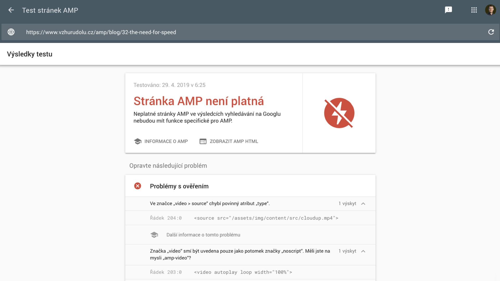

# Validace AMP stránek

„AMP stránka musí být validní“ není ani zdaleka ekvivalentem starého „HTML stránka musí být validní“.

Není to _taková ta věc_, kterou bychom my webaři _měli_ zařídit, protože to prohlížeče, vyhledávače a další roboti chtějí. Chtějí to i klienti, uživatelé, naše maminky a snad i prezident USA – všichni, kdo jsou vybavení nebezpečným HTML validátorem. Jehož výsledky my rozhodně vidět nechceme, protože na platnost kódu stránky z pohledu standardů z vysoka… víte co.

Tolik k popisu reality validace na poli tvorby běžných stránek. Ať už si o přístupu ignorování platnosti kódu podle standardů myslíte, co chcete (my k němu máme výhrady, pokud vás to zajímá), u AMP o tom nedostanete šanci přemýšlet.

AMP stránka totiž _musí_ být validní. Jinak nemáte šanci ji dostat do AMP Cache od Googlu a dalších provozovatelů. A to by bylo „blbé“.

<figure>

<figcaption markdown="1">
_Ajaj, tady někdo něco pokazil. AMP validátor je neúprosný a tahle stránka může na umístění v Google AMP Cache zapomenout._
</figcaption>
</figure>

AMP určitě kontrolujte a validujte. Když to neuděláte vy, udělají to provozovatelé AMP Cache a to už bude pro vás jako autory a autorky stránek otrava.

Podívejme se na možnosti, jak AMP stránku validovat.

## Online validátor

AMP má svůj validátor, stačí jít na [validator.amp.dev/](https://validator.amp.dev/).

Svět je zachráněn…

## Validace v prohlížeči

AMP runtime, ten kousek javascriptového kódu, který musí obsahovat každá stránka, umí zařídit validaci přímo ve vašem prohlížeči.

Na konci URL stačí přidat `#development=1` a ve vývojářské konzoli se dozvíte, co přesně děláte špatně.

## Validace v rozšíření do prohlížeče

Prohlížeče Chrome a Opera nabízejí rozšíření s překvapivým názvem „AMP Validator“.

Kromě indikace toho, zda je AMP stránka validní, či ne, vám umožní objevovat, které weby nabízejí AMP verzi. V takovém případě svítí modře.

Adresa k instalaci: [vrdl.in/ampext](https://chrome.google.com/webstore/detail/amp-validator/nmoffdblmcmgeicmolmhobpoocbbmknc?hl=cs)

## NPM balíček

Pro spouštění na příkazové řádce. Výhodou tohoto způsobu ověření je, že je možné jej pouštět strojově a pravidelně. Nebo například pomocí automatizačních nástrojů, jako je Gulp, či v nástrojích pro průběžnou integraci (CI, Continuous Integration) během vydávání nové verze webu.

Tady je jeho adresa: [npmjs.com/package/amphtml-validator](http://npmjs.com/package/amphtml-validator)

## Google Search Console

V Search Console, nástroji, kterým Google informuje majitele webů mj. o možných problémech, je pro AMP vyhrazená celá sekce. Pro nás je to v kontextu AMP nejmilejší nástroj, protože jeho hlášení chodí automaticky do e-mailu.

Vývojářům velmi doporučujeme nechat se přidat do hlášení ze Search Console, protože reportované chyby mohou opravit hlavně oni. Více informací o Google Search Console je na Vzhůru dolů. [vrdl.cz/p/google-search-console](https://www.vzhurudolu.cz/prirucka/google-search-console)

Samotný nástroj pak naleznete zde: [search.google.com/search-console](https://search.google.com/search-console/about?hl=cs)

## Co když je AMP stránka neplatná?

Buďte v klidu, svět se nezboří. Váš web z výsledků vyhledávání Googlu nevypadne. Nadále si podržíte původní pozice, jen s běžnou stránkou, která se prostě uživatelům zobrazí o něco (nebo o _velké něco_) pomaleji.

Detailní informace k jednotlivým možnostem validování jsou v dokumentaci AMP, pokud byste to náhodou potřebovali. [vrdl.in/ampvalidace](https://amp.dev/documentation/guides-and-tutorials/learn/validation-workflow/validate_amp)

Po HTML, CSS, JavaScriptu a králi všeho, validaci, teď zamíříme ke konkrétnějším technickým aspektům. Úplně první věc, která nám na AMP nešla do hlavy, je způsob, jakým se tu pracuje s rozvržením stránky. Nejspíš to budete mít podobně i vy. Pojďme na layout.
