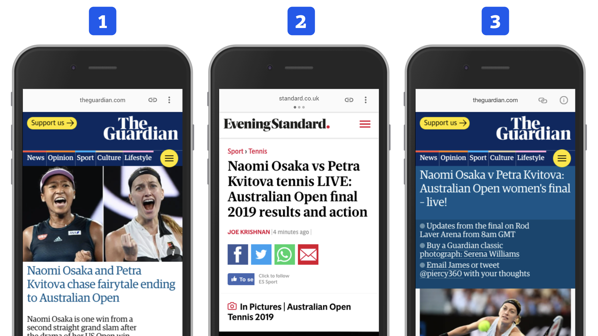

# AMP Viewer: Co je zač ten „zobrazovač“ AMP stránek?

Když to zjednodušíme, AMP Viewer je vlastně HTML stránka, která zobrazuje AMP stránky. Je to zkrátka něco jako lightbox, ale pro AMP stránky.

Jde o hybridní prostředí, kde platí zčásti váš kód a zčásti kód Googlu, Bingu nebo jiného majitele AMP Cache. Cílem zobrazovače AMP stránek je – kromě zobrazování, že ano – také pomoci prohlížeči s rychlým vykreslením.

Pojďme si tu věc ukázat. Nejlépe na obrázku.

<figure>

<figcaption markdown="1">
_Obrázek: Každý zpracovatel AMP si vytváří vlastní Viewer. První dva jsou od Googlu, poslední vytvořil Microsoft pro svůj Bing._
</figcaption>
</figure>

Čísla v následujícím seznamu odpovídají číslům v obrázku:

1. Standardní Google AMP Viewer, dostupný například z výsledků vyhledávání.
2. Google AMP Viewer s karuselem. Všimněte si teček v horní liště. Mezi jednotlivými zprávami se přechází krásně plynulým gestem přetažení zprava doleva. Vy mladší to znáte z Instagramu a vy svobodní z Tinderu. A většina Čechů z nativní mobilní aplikace Novinky.cz. Za nás palec nahoru, jde o moc fajn uživatelský prožitek.
3. Bing AMP Viewer poznáte podle jinak navržených ikonek v horní liště, funkčně je ale velmi podobný.

Na obrázku je pozoruhodné i leccos dalšího.

## URL na cizí doméně

Adresa webu zde neodpovídá adrese autora obsahu. Obvykle sídlí na doméně `google.com` nebo `bing.com`, jak píšeme [v textu o AMP Cache](https://docs.google.com/document/d/155OVlQsp8SBCFOT5qmvwnpgbN42TJ4FtqE5ZVs59thI/edit#).

## Ošklivá šedivá horní lišta

Kvůli cizímu URL je v horní části prohlížeče poměrně otravná lišta s názvem původní domény, odkazem na původní adresu (první ikona) a informací o tom, proč zde není původní adresa (druhá ikona).

S postupem technologií snad toto zmizí a obsah bude možné zobrazit na původní adrese. Opět vás odkazujeme na technologii Signed HTTP Exchange zmíněnou v předchozí podkapitole.

Jen připomínáme, že na všechny pohledy z obrázku jsme se dostali z výsledků vyhledávání Googlu nebo Bingu. Jsou ale i [jiná místa](https://docs.google.com/document/d/1W57NJXoq7-EFpKOvdnelft4Qg3xl9KAjp5aFBExlmqc/edit#heading=h.d9jm85p3nf2t), odkud je možné potěšit AMP stránku svou návštěvou.

## AMP Viewer a prerendering

Kromě výše uvedeného zobrazení má Viewer na starosti také vykreslení stránky, nebo lépe řečeno předvykreslení (prerendering).

Ve chvíli, kdy procházíte výsledky vyhledávání Googlu (nebo Bingu), snaží se AMP zobrazovač uhodnout, kam kliknete, a cílovou stránku přednačte a předvykreslí.

Interně si stáhne celý AMP HTML kód cílové stránky z AMP Cache, přednačte javascriptové knihovny, které bude stránka potřebovat, zjistí si velikost viewportu a stáhne obrázky, které by mohl uživatel potřebovat v prvním zobrazení nad zlomem stránky.

Nabízelo by se, že toto učiní s první AMP stránkou, kterou najde ve výsledcích vyhledávání. Tak tomu ale není.

Předvykreslení Vieweru je postaveno tak, aby neškodilo uživatelům, kteří o něj z nějakého důvodu nemusejí stát. Například proto, že ještě nedokončili jinou interakci se stránkou nebo jim neskončila nějaká animace. Prerendering také probíhá vždy jen pro jeden dokument za druhým, nikdy pro víc najednou. Zároveň je určen jen pro dostatečně rychlá zařízení a podle Googlu i pro „levná připojení“.

Mluví o tom produktová manažerka Vyhledávání Google Ranna Zhou ve videu „Building the perfect AMP Viewer, with Google Search“. [youtu.be/hyd84z_qX8Q](https://youtu.be/hyd84z_qX8Q)

Je tam také velmi pěkně popsáno, že bez AMP by předvykreslení dělat nemohli. Běžné HTML stránky totiž mají přinejmenším dvě omezení:

* Většinou nevíme, jak velké budou části layoutu obsahující externí prvky – obrázky nebo iframe. V AMP máme statický layout, který drží plochu, i když se externí prvek ještě nestáhl do prohlížeče.
* Máme zde klientský JavaScript, který může layout překreslit. A předvykreslovat stránku až po stažení stovek kilobajtů skriptů nedává smysl. Tady se ten zákaz vlastního JavaScriptu začíná docela vyplácet, co říkáte?

## Důsledky hybridního prostředí na soukromí

Jen malá douška, pokud už to nevyplynulo z dříve uvedeného. Uživatel, který si zobrazí AMP stránku hostovanou na Cache od Googlu (nebo například Bingu), vstupuje nejen na vaše „území“, na váš web, ale také na území vlastníka Cache a Vieweru, který může samozřejmě sbírat analytická data, stejně jako je může získávat vaše stránka.

Takový uživatel by si tedy měl přečíst dvoje zásady ochrany osobních údajů a možná by měl vidět dvě „cookie lišty“. Ehm…

Raději si to nepředstavujme a spokojme se s konstatováním, že z pohledu soukromí a bezpečnosti vstupujeme obrazně na dvě domény najednou. I to je důvod, proč je zde tak přísně omezováno cokoliv javascriptového.
