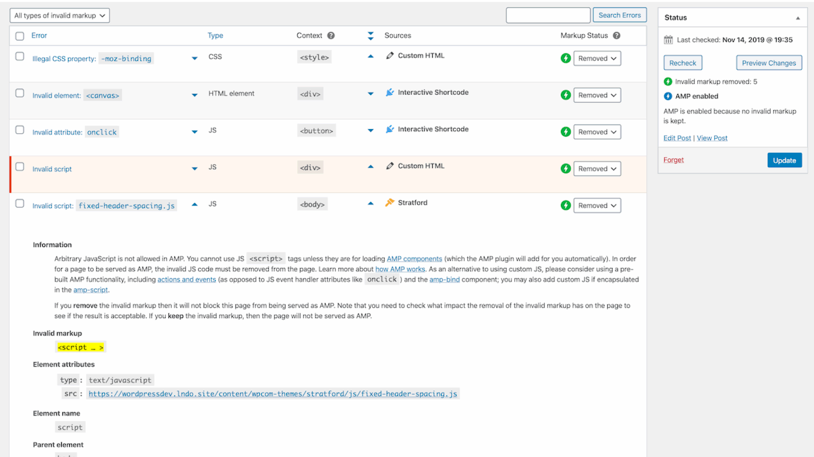

# AMP ve WordPressu s oficiálním pluginem: Bleskurychlé stránky za málo práce

Na [WordCampu 2020](https://2020.prague.wordcamp.org/session/bleskurychle-nacteni-webovych-stranek-na-mobilu-i-bez-rychleho-pripojeni-s-technologii-amp-to-neni-sci-fi/) jsem povídal o AMPu ve WordPressu a konkrétně o oficiálním pluginu „AMP for WordPress“.

Podívejte se na video „AMP ve WordPressu“.

YouTube: [youtu.be/9k75XDh_0fE](https://www.youtube.com/watch?v=9k75XDh_0fE)

Velmi příjemně mě překvapilo, jak dobře je AMP ve WordPressu vyřešený a jak snadno implementovatelný.

Jde o oficiální plugin „AMP“, sídlící na [amp-wp.org](https://amp-wp.org/). (Nepleťte prosím s jiným, pojmenovaným „AMP WP – Google AMP For WordPress“, a mnoha dalšími jinými pluginy a pseudopluginy.).

<figure>

<figcaption markdown="1">
*Obrázek: To je on, wordpressistův nejlepší přítel, když jde o AMP.*
</figcaption>
</figure>

Na úvodní stránce webu se ale nedozvíte tolik důležitého, jako [v jedné prosté větě](https://amp-wp.org/documentation/frequently-asked-questions/) schované v sekci Frequently Asked Questions. Ta zní:

„Converts your existing content to AMP valid content where possible.“

Převádí váš existující web na AMP. To zní skvěle, ne? AMP for WordPress skutečně není jen tak obyčejný plugin. O AMP toho totiž nemusíte příliš vědět, i tak vám ale z WordPressu kromě HTML obsahu vypadne AMP verze.

<!-- AdSnippet -->

Jaká kouzla k dosažení takové věci plugin AMP for WordPress používá?

* [Tři módy fungování](#tri-mody).
* [Validaci AMP kódu](#validace).
* [Sanitaci CSS a Tree Shaking](#sanitace).
* [Převod HTML](#prevod-html).

Mrkněme se na ně teď trochu podrobněji.

## Tři módy fungování {#tri-mody}

AMP je z WordPressu možné dostat třemi způsoby, které jsou zároveň hlavním nastavením pluginu.

<figure>

<figcaption markdown="1">
*Obrázek: Tři základní módy publikování AMP verze. Řazeno je od toho nejlepšího k tomu, co… stojí za starou bačkoru.*
</figcaption>
</figure>

Tvůrci pluginu tyto možnosti také nazývají jako strategie servírování ([Serving Strategies](https://amp-wp.org/documentation/how-the-plugin-works/amp-plugin-serving-strategies/)).

### Standard (občas jako „Native“) {#mod-standard}

Výchozí režim, ve kterém se jako AMP publikuje veškerý obsah webu je „Standard“. Nevznikají zde tedy dvě verze URL adres (non-AMP a AMP).

O této strategii [v knížce](https://www.vzhurudolu.cz/ebook-amp/) píšeme jako o „pouze AMP (AMP-only)“. Za nás jde o nejefektivnější způsob práce s AMP, protože webař vždy udržuje jen jednu verzi webu.

Tento režim si také můžete zapnout na konkrétních místech aplikace v PHP kódu:

```php
add_theme_support( 'amp' );
```

Pokud to něčemu nevadí, dělejte své weby takto, jen ve frameworku AMP. Ušetříte tím dost energie na správu dvou verzí.

### Transitional (dříve také Paired) {#mod-transitional}

Režim, o kterém píšeme jako o „nejdříve HTML“. V „Transitional“ vám WordPress publikuje běžné HTML výstupy a k tomu ještě jejich AMP verze. Konkrétní stránky pak budou zveřejněny na dvou adresách, v případě tohoto pluginu v následující podobě:

```
example.com/clanek
example.com/clanek?amp
```

Samozřejmostí je zde automatické prolinkování pomocí `<link rel="amphtml">`.

Jak se píše v obrazovce nastavení, jde o variantu přechodovou. Předpokládá se, že AMP zatím vůbec nepoužíváte, ale rádi byste jej postupně nasadili.

I tento režim lze zapnout na úrovni PHP kódu:

```php
add_theme_support( 'amp', array(
  'paired' => true,
  'template_dir' => 'amp-templates',
) );
```

Pojďme ještě na poslední režim, i když ten bychom nejraději… No, však uvidíte.

### Reader (dříve také Classic) {#mod-classic}

Vaše HTML stránky budou v režimu „Reader“ převedeny do AMP na samostatné adrese jako u „Transitional“. Navíc ale WordPress nasadí jednu z předpřipravených šablon vzhledu, takže AMP verze bude vypadat jinak než HTML.

<!-- AdSnippet -->

Musíme vám ale říct jednu věc — tohle nechcete. Tento, původně jediný možný režim práce s AMP ve WordPressu, nadělal více škody než užitku. Jak už víte, [AMP je jen zvláštní distribuční verze](amp.md) vašeho webu, nemá vypadat a fungovat jinak.

Díky tomu, že původně nešlo AMP z WordPressu dostat jinak než tímto způsobem, vznikla o předmětné technologii [celá hromada mýtů](amp-kritika-myty.md), počínaje tím, že „AMP vynucuje tvorbu dvou verzí webu“ a konče tím, že „AMP stránky vypadají jedna jako druhá“.

Tenhle režim je nám, v jinak výborném pluginu, trnem v oku, ale chápeme, že zde z důvodu zpětné kompatibility nějaké místo má.

### Kombinace režimů a nastavení pro konkrétní stránky {#mod-kombinace}

Je potřeba zmínit, že výše uvedené globální nastavení módů ve vlastnostech pluginu, je jen jednou z možností, jak způsob publikování AMP obsahu ovlivňovat.

Možné je také puštění AMP jen pro určité šablony, jak je vidět na obrázku.

<figure>

<figcaption markdown="1">
*Obrázek: Zapněte si export do AMP pro začátek jen pro konkrétní šablony, pokud si nejste jistí, co vám to vyvede s webem.*
</figcaption>
</figure>

V šablonách je pak možné přidávat konkrétní HTML kód určený jen pro AMP verzi díky existenci následující podmínky:

```php
<?php if ( is_amp_endpoint() ) : ?>
<!-- HTML jen pro AMP -->
<?php endif; ?>
```

Více je v textu „Serving Strategies“ v dokumentaci pluginu. [vrdl.in/ampwpserv](https://amp-wp.org/documentation/how-the-plugin-works/amp-plugin-serving-strategies/)

## Validace AMP kódu {#validace}

Už víte, že AMP stránky musí být pro potřeby zveřejnění [na AMP Cache](amp-cache.md) validní podle specifikace AMP HTML, tudíž také to, že validátor je nezbytnou součástí „vercajku“ každého vývojáře.

AMP validátor je součástí WordPress pluginu. To by mohlo znít fajn. Jeho přítomnost je ale v pluginu „AMP for WordPress“ vymyšlena tak, že posunuje kontrolu kódu o úroveň výše.

<figure>

<figcaption markdown="1">
*Obrázek: Seznam chyb v kódu, které zobrazuje AMP plugin. Tímhle to ale nekončí.*
</figcaption>
</figure>

Plugin vám jisto jistě vypíše chyby, stejně jako jiné AMP validátory. Umí také ale detekovat jejich zdroje (shortcode, plugin…) pro snadnější nápravu. Co je ale nejlepší – umí dodat podklady pro automatický převod HTML do AMPu.

Pro hlubší ponor do tématu validace AMP ve WordPressu vás odkážeme na patřičnou stránku dokumentace. [vrdl.in/ampwpval](https://amp-wp.org/documentation/how-the-plugin-works/amp-validation/)

Vzpomínáte si na větu „Převádí váš existující web na AMP?“. Tak teď ji trochu rozeberme.

## Sanitace CSS a Tree Shaking {#sanitace}

[CSS v AMPu](amp-css.md) trošku bolí, to ne, že by ne. A nejde jen o limit 75 kB na stránku a nemožnost používání `!important`. Vytváření zvláštní distribuce CSS pro AMP na Vzhůru dolů dalo autorovi dost zabrat, mohl by vám vyprávět.

<div class="related web-only" markdown="1">
- [Co je AMP?](amp.md)
- [HTML v AMP](amp-html.md)
- [CSS v AMP](amp-css.md)
- [JavaScript v AMP](amp-javascript.md)
- [Případové studie k AMP](amp-co-je-pripadovky.md)
</div>

Ve WordPressu jste s tímto pluginem zbavení starostí s CSS. Většinu jich pořeší za vás, což obnáší například následující kroky:

* Vymění direktivy `!important` za zvýšenou specificitu selektoru.
* U deklarací `url()` vymění relativní cesty za absolutní (aby se obrázky nerozbily na AMP Cache)
* Všechny externí styly minifikuje, spojí a vloží je do HTML značky `<style amp-custom>`.
* Pokud je výsledek větší než 75 kB, pokusí se o automatický tree-shaking, tedy odstranění kódu, který se na dané stránce nepoužívá.

Vypadá to tedy, že – až na menší výjimky – můžete tvorbu zvláštní verze kaskádových stylů pro AMP distribuci pustit z hlavy. Boží.

## Převod HTML {#prevod-html}

Automatická konverze HTML do AMP HTML je další skvělou funkcí, která ušetří čas. Tohle obstarává část, které autoři pluginy říkají Post Processor.

<figure>

<figcaption markdown="1">
*Obrázek: Post Processor je mašina, která na lince produkující AMP weby upravuje HTML tak, aby vyhovovalo specifikaci AMP.*
</figcaption>
</figure>

Které komponenty tento převodník v kódu automaticky zpracuje? Vezměme pár příkladů:

* Z `` udělá `<amp-img>` nebo `<amp-anim>`, podle typu vloženého obrázku.
* `<video>` a `<audio>` převede nepřekvapivě do `<amp-video>` a `<amp-audio>`.
* `<iframe>` změní na `<amp-iframe>` nebo účelové pluginy, jako je `<amp-youtube>`, `<amp-twitter>` a další.

Můžete si ale také naprogramovat vlastní převodník pro vložené prvky (Embed Handler), více je v části „Content Rendering“ dokumentace pluginu. [vrdl.in/ampwpcon](https://amp-wp.org/documentation/how-the-plugin-works/amp-content-rendering-in-wordpress/)

Na výše uvedené adrese také najdete působivé seznamy nativních widgetů, embedů, shortcodes a core blocks, které plugin podporuje. Působivé jsou proto, že až na nízké jednotky zlobících je umí převést úplně všechny.

Vlastní shortcodes je možné pro potřeby AMP upravit s pomocí již zmíněné podmínky `is_amp_endpoint()`.

## Blednutí na závěr {#zaver}

Jakožto člověk, který WordPress nepoužívá, můžu na konci textu o AMP pluginu pro WordPress udělat už jen jednu věc. Zblednout závistí.

Všechny ty krásné fíčury, o kterých tu byla řeč, jsem si totiž musel na svém blogu s pomocí kolegů naprogramovat složitě a draze sám.

Při vší skromnosti, ale s vědomím toho, že na rozdíl od WordPressu o AMP už něco vím, bych rád prohlásil, že plugin „AMP for WordPress“ je navržený pozoruhodně dobře a umožňuje lidem publikovat weby v této technologii, aniž by ji museli dopodrobna znát.

<!-- AdSnippet -->
