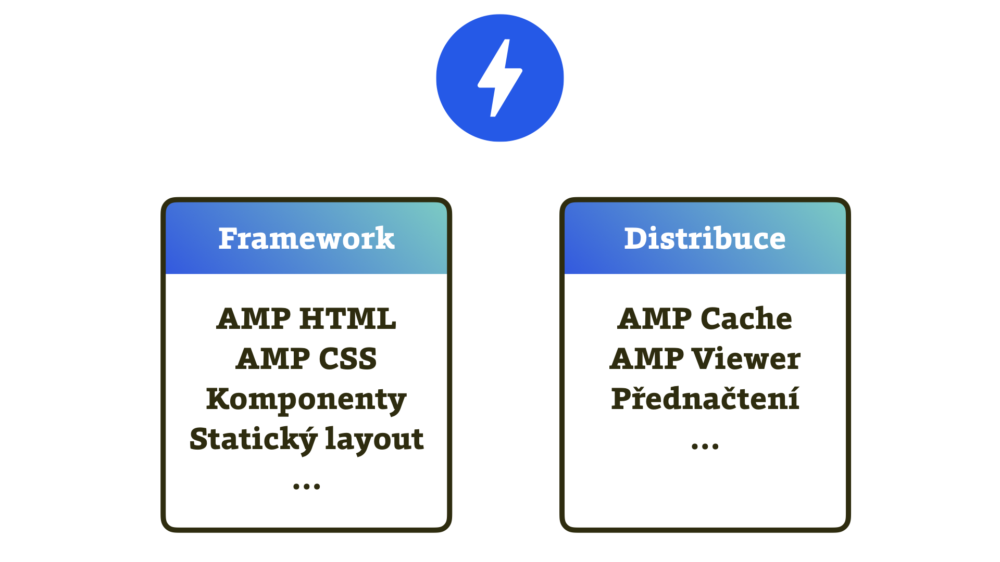
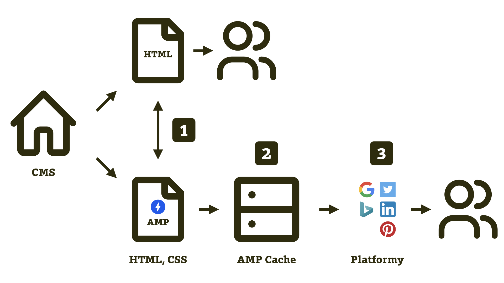
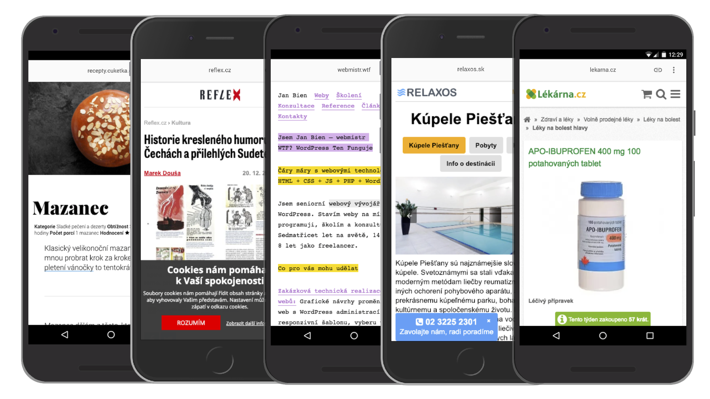

# AMP weby: Co to je a proč nás to má vůbec zajímat?

Delší, hlubší a propracovanější odpověď na otázku „Co je AMP a proč mě má zajímat?“ samozřejmě najdete [v e-booku](https://www.vzhurudolu.cz/ebook-amp/). V tomhle textu se pokusím o úvod pro ty z vás, kteří AMP zatím moc neznáte.

Dozvíte se, že AMP je technologie pro bleskurychlé zobrazení stránek. Jde o frontendový framework a zároveň způsob distribuce stránek, který se vyhýbá pomalé síti a pomalým serverům.

## Obsah článku {#obsah}

- [Co je AMP?](#co)
- [Proč nás má AMP zajímat?](#proc)
- [Nevýhody AMP](#nevyhody)

AMP je pro webaře zajímavé především proto, že jeho bezkonkurenční rychlost má pozitivní dopad na konverzní poměr webů. Nerad bych také vynechal možnost efektivní tvorby webů, která se v AMP skrývá.

Pojďme si to teď všechno rozebrat.

## Co je AMP? {#co}

Začneme pohledem uživatele: AMP stránky jsou rychlé jako blesk.

<p class="video">
Video: <a href="https://www.youtube.com/watch?v=a9E-gL8NOqs">AMP: Základy technologie pro rychlé weby</a> ~ Proč AMP potřebujeme a z čeho je vlastně tahle technologie složená?
</p>

### Rychlé stránky

Stránky vyrobené pomocí AMP jsou ve výsledcích vyhledávání Google (a na jiných místech) vyznačené ikonou blesku v kolečku.

<figure>

<figcaption markdown="1">
_S AMP stránkami se můžete potkat ve výsledcích vyhledávání Google, v mobilní aplikaci LinkedIn a na řadě dalších míst._
</figcaption>
</figure>

Stránka se pak za ideálních podmínek načte prakticky okamžitě:

<div class="rwd-media">
<iframe width="560" height="315" src="https://www.youtube.com/embed/elHr8-MPUwA" frameborder="0" gesture="media" allow="encrypted-media" allowfullscreen></iframe>
</div>

V další části textu se také zaměřuji na číselné vyjádření této rychlosti. Jak ale AMP funguje technicky?

### AMP z technického pohledu

Z pozice technika by definice AMP mohla znít následovně: Je to [HTML](amp-html.md), [CSS](amp-css.md) a JS framework určený ke zrychlení načítání webových stránek prostřednictvím jejich umístění na [AMP Cache](https://amp.dev/documentation/guides-and-tutorials/learn/amp-caches-and-cors/how_amp_pages_are_cached), což je sada optimalizovaných serverů. Takové specificky nastavené [CDN](http://jecas.cz/cdn).

<figure>

<figcaption markdown="1">
_AMP jsou dvě věci. Frontendový framework a distribuce, která se vyhýbá pomalé síti a pomalým serverům. Rozmísťuje stránky po optimalizovaných serverech (CDN)._
</figcaption>
</figure>

V textu nebudeme zacházet do detailů a vysvětlovat si pojmy z obrázku. AMP je slušně komplexní technologie, ale pro potřeby tohoto článku její jednotlivé prvky znát nemusíme. Zůstaneme u dělení na _Framework_ a _Distribuce_.

### Framework

Z pohledu frontendisty je základní kostra AMP stránky skoro stejná jako její HTML verze:

```html
<!doctype html>
<html ⚡ lang="cs">
  <head>
    <meta charset="utf-8">
    <meta name="viewport"
      content="width=device-width,minimum-scale=1">
    <script async src="https://cdn.ampproject.org/v0.js">
    </script>
    <style amp-custom> </style>
    <style amp-boilerplate>…</style>
    <link rel="canonical" href="…">
    <title>Ahoj světe</title>
  </head>
  <body>
    <h1>Ahoj světe, tady AMP</h1>
  </body>
</html>
```

Je zde však několik rozdílů. Jednak označení AMP stránky pomocí blesku (`⚡`nebo slovem `amp`). Pak AMP vyžaduje několik povinných prvků:

* Odkaz na hlavní AMP knihovnu: `https://cdn.ampproject.org/v0.js`
* Místo pro vložení vlastních stylů: `<style amp-custom>`
* Základní povinné styly pro AMP: `<style amp-boilerplate>`

Více informací [o AMP HTML](amp-html.md) je na Vzhůru dolů. Plnohodnotnou dokumentaci frameworku najdete na [amp.dev](https://amp.dev/).

<p class="video">
Video: <a href="https://www.youtube.com/watch?v=_vp-BVgYU98">AMP pro frontendisty</a> ~ HTML, CSS a přes 100 komponent v jednom frameworku.
</p>

Čím se liší vývoj v AMP oproti vývoji běžných webů? Je toho více, ale zůstaňme u těch nejdůležitějších rozdílů:

* V [AMP HTML](amp-html.md) jsou zakázané některé obvyklé značky – jako třeba ``. Nahrazují je nové tagy. V tomto případě `<amp-img>`. Je to proto, že technologie vycházející z webových standardů zatím neobsahují věci důležité pro rychlé zobrazení stránek, jako třeba [statický layout](https://amp.dev/documentation/guides-and-tutorials/learn/amp-html-layout/) nebo inteligentní prioritizaci stahování zdrojů.
* [CSS](amp-css.md) se vkládá dovnitř HTML, nesmí být větší než 50 kB a je zakázáno používat oblíbenou direktivu `!important`, která je rezervována pro styly vkládané frameworkem AMP. Webfonty z cizích domén jsou povolené jen od některých dodavatelů.
* Stránka musí projít [validací](https://amp.dev/documentation/guides-and-tutorials/learn/validation-workflow/validate_amp) AMP formátu a nejde jinak, než aby běžela na protokolu HTTPS.
* A co JavaScript? Ten náš, autorský, je řešený specificky – komponentou [amp-script](https://amp.dev/documentation/components/amp-script/). A navíc – máme k dispozici zhruba stovku hotových [komponent](https://amp.dev/documentation/components/).

Tolik k pohledu frontendisty. Pojďme se ale také zabývat už zmíněnou distribucí AMP stránek od autora obsahu k uživateli.

### Distribuce

AMP stránka je nejčastěji upravená verze už existující stránky vašeho webu. Abyste robotům, kteří web prohledávají za účelem nalezení AMP stránek, dali vědět, stačí do hlavičky HTML přidat následující odkaz. Pokud máte stránku `example.html`, řekněme, že odkaz bude vypadat následovně:

```html
<link rel="amphtml" href="example.amp.html">
```

Za pár hodin až dní bude stránka `example.amp.html` umístěná v AMP Cache, na zvláštní adrese. AMP Cache poskytuje Microsoft pro svůj vyhledávač Bing, dále Cloudflare nebo samozřejmě Google. U toho posledního jmenovaného bude adresa vaší AMP stránky začínat řetězcem `https://google.com/amp/s/…`.

<p class="video">
Video: <a href="https://www.youtube.com/watch?v=l751Or7iZCA">AMP ekosystém</a> ~ Co je AMP Cache, co Optimizer a co Viewer?
</p>

Díky tomu má vaše AMP stránka adresu na jiné doméně, což je terčem poměrně oprávněné kritiky. Autoři AMP pro toto nabízejí řešení v podobě standardu [Signed HTTP Exchanges](https://digichef.cz/signed-http-exchanges-aneb-vyuzivejte-amp-s-originalni-url), který zajistí zobrazení stránky pod vaší adresou, i když je fyzicky umístěná jinde. Uvidíme, zda se standard ujme.

Model distribuce pro AMP stránku je tedy jiný než pro běžnou HTML stránku:

<figure>

<figcaption markdown="1">
_Čím se liší distribuce běžné stránky od AMP?_
</figcaption>
</figure>

Roboti se o AMP stránce dozví prostřednictvím odkazu v HTML stránce (1), pak ji umístí na celosvětovou síť optimalizovaných serverů AMP Cache (2), kde je k dispozici platformám, které AMP dokáží využít (3).

Mezi [platformy](amp-platformy.md) využívající AMP patří kromě Googlu také Bing, LinkedIn, Pinterest nebo  Twitter.

## Proč nás má AMP zajímat? {#proc}

Jsou zde dva hlavní důvody, proč by si webaři o AMP měli něco zjistit. Rychlost webu a efektivita jeho vývoje.

### Bezkonkurenčně rychlé zobrazení

AMP dokáže razantně zrychlit zobrazení stránky, pokud na ni uživatel přichází způsobem, pro který je tato technologie optimalizována. To obnáší umístění na serverech AMP Cache a zároveň zajištění přednačtení stránky ještě před její návštěvou. Výsledek už jste viděli na videu výše. Teď se podívejme na nějaká čísla:

<figure>
<div class="rwd-scrollable"  markdown="1">
|             |Běžný web|AMP po přednačtení|
|-------------|--------:|-----------------:|
|Cuketka.cz   |     13 s|            0,16 s|
|VzhuruDolu.cz|    4,4 s|            0,24 s|
</div>
<figcaption markdown="1">
_Tabulka: Porovnání metriky Speed Index pro články na obou webech. Měřeno pomocí WebpageTest na rychlosti „3G Slow“._
</figcaption>

</figure>

Aktuálně je takto na stránky AMP možné vstoupit z výsledků vyhledávání Google nebo Bingu, dále pak například z mobilních aplikací LinkedIn nebo Pinterestu.

Častá otázka zní: Nebyly by takto rychlé i běžné webové stránky, pokud by jim Google a spol. zajistil přednačtení? Stručná odpověď: Mohly by být, ale většina by nebyla a byla by s tím spojena nemalá rizika. Zatím to prostě nejde, i když na tom autoři AMP [dlouhodobě pracují](https://blog.amp.dev/2019/05/21/contributing-back-lessons-learned-part-1/).

### Efektivita vývoje

AMP je také framework pro vývoj webů. Obsahuje zhruba [stovku komponent](https://amp.dev/documentation/components/?format=websites) určených pro snadné poskládání obsahových webů nebo také e-shopů.

Komponenty suplují to, že autoři webů v AMP nemohou psát JavaScript tak jak jsou zvyklí. To se ale změnilo s nástupem komponenty `amp-script`:

<div class="rwd-media">
<iframe width="560" height="315" src="https://www.youtube.com/embed/sYXkVOiz77I" frameborder="0" gesture="media" allow="encrypted-media" allowfullscreen></iframe>
</div>

Mezi současnými komponentami nesmí chybět klasické prvky uživatelského rozhraní jako je [lightbox](https://amp.dev/documentation/examples/components/amp-lightbox-gallery/?referrer=ampbyexample.com) nebo [karusel](https://amp.dev/documentation/examples/components/amp-carousel/). Ten se do stránky vkládá podobně jako to děláte u pluginů pro jQuery:

```html
<script async
  custom-element="amp-carousel"
  src="https://cdn.ampproject.org/v0/amp-carousel-0.1.js">
</script>
```

Pak už karusel jen stačí vložit a konfigurovat na úrovni HTML:

```html
<amp-carousel height="300"
  layout="fixed-height" type="carousel">
  <amp-img src="image1.jpg"
    width="400" height="300"
    alt="První obrázek"></amp-img>
  <amp-img src="image2.jpg"
    width="400" height="300"
    alt="Druhý obrázek"></amp-img>
</amp-carousel>
```

Jak vidíte, nic složitého na tom není. V AMP autoři webů často vůbec nemusí psát v JavaScriptu, takže jde o technologii přívětivou i pro začátečníky a méně programátorsky zdatné. Autoři frameworku si to uvědomují a v poslední době vzniká hodně materiálu [právě pro začátečníky](https://blog.amp.dev/2019/06/20/learn-web-development-with-amp/).

<!-- AdSnippet -->

Ani pokud na stránce potřebujete programovat, nemusíte AMP vzdávat. Ostatně, na AMP se už stavějí i e-shopy, kde by to bez klientského programování nešlo. Jsou zde [amp-bind](https://amp.dev/documentation/examples/components/amp-bind/), [amp-list](https://amp.dev/documentation/examples/components/amp-list/) a další komponenty pro dynamickou práci s obsahem. Druhá jmenovaná například umožňuje stahování dat z vašeho backendového API. Zde například pro seznam souvisejících článků:

```html
<amp-list width="auto" height="100" layout="fixed-height"
  src="https://example.com/clanky.json">
  <template type="amp-mustache">
    <div class="url-entry">
      <a href="{{url}}">{{title}}</a>
    </div>
  </template>
</amp-list>
```

AMP je také možné použít jako základ pro technologicky pokročilý web napsaný v JavaScriptu. O kombinaci AMP [s progresivními webovými aplikacemi (PWA)](pwa.md) se v poslední době dost píše. AMP se prostě použije jako základ, PWA rozšiřuje možnosti pro stránky, které nemusí být v AMP Cache jako je nákupní košík nebo proces nákupu.

AMP tímto v poslední době rozšířilo pole působnosti směrem k dynamičtějším webům z oblasti e-commerce. Příkladem budiž česká Lékarna.cz.


<figure>

<figcaption markdown="1">
_Zatím nejpropracovanější implementaci na českých elektronických obchodech nabízí asi Lékárna.cz._
</figcaption>
</figure>

Je také potřeba zmínit, že řada firem začíná AMP využívat jako hlavní framework pro vývoj webů. AMP je kompatibilní s webovými standardy a všemi prohlížeči. V přístupu „jen-AMP“ se pak nevytváří dvě verze webu. Tímto způsobem je vyrobený web [Tasty.co](https://tasty.co/) a jde o dlouhodobý cíl i pro moje Vzhůru dolů.

Poslední velký důvod pro využití AMP vychází z toho prvního. Rychlé weby vykazují lepší obchodní metriky.

### Vynikající výsledky

Už víme, že [rychlý web zlepšuje konverze](rychlost-nacitani-proc.md). Francouzský online prodejce biopotravin _Greenweez_ nasazením AMP [takřka zdvojnásobil konverzní poměr](https://amp.dev/success-stories/greenweez) na mobilech.

_BMW.com_ nasadilo AMP a na novém webu díky tomu získalo o 49 % vyšší návštěvnost z vyhledávačů. Zajímavé jsou ale i [další případové studie](amp-co-je-pripadovky.md).

<p class="video">
Video: <a href="https://www.youtube.com/watch?v=miNJbjfffPs">Weby postavené na AMP</a> ~ Proč AMP používají weby jako The Washington Post, BMW.com, Reflex.cz nebo Vzhůru dolů?
</p>

V Česku AMP používá například _Reflex.cz_, anebo _Seznam Zprávy_ či _ProŽeny.cz_ z dílny _Seznam.cz_. Z větších e-shopů je to kromě _Lékárna.cz_ také například cestovka _Relaxos.cz_, s technologií ale experimentuje i _Alza.cz_.

<figure>

<figcaption markdown="1">
_Cuketka.cz, Reflex.cz, Webmistr.wtf, Relaxos a Lékarna.cz – některé z českých webů, které AMP využívají._
</figcaption>
</figure>

Ale samozřejmě – AMP nemusí fungovat všem. Je to vcelku nevídaná technologie a je tedy netriviální ji správně zasadit do velkých projektů, tak aby přinesla kýžený výsledek. Díky specifikům AMP je také netriviální [měření vlivu na konverze](https://blog.amp.dev/2018/11/08/so-your-amp-test-doesnt-perform%E2%80%8A-%E2%80%8Anow-what/), ale výukový materiál pro správné nasazení i vyhodnocení [zde už je](https://www.vzhurudolu.cz/ebook-amp/). 

## Nevýhody AMP {#nevyhody}

1. *URL na AMP Cache*  
Lidem často vadí adresa ve formátu `google.com/amp/s`, na které visí jejich obsah. Google má dobře vymyšlené problémy se sdílením – prostě přesměrovává na původní web. Umístění obsahu na cizí doméně je ale obecně problematické. Měl by to vyřešit standard [Signed HTTP Exchanges](https://digichef.cz/signed-http-exchanges-aneb-vyuzivejte-amp-s-originalni-url?).
1. *Nutnost vytvářet a spravovat zvláštní verzi webu*  
To platí především pro dopracování AMP verze do existujících webů. Nové obsahové weby a e-shopy je ale možné stavět jen na AMP a vyhnout se nepříjemné správě dvou verzí.
1. *Jiný vývoj*  
AMP HTML framework, takže se pro vývojáře nejedná o nic nového. Ale v rovině JavaScriptu se věci v AMP dělají více či méně jinak.
1. *Omezený výběr komponent*  
Designéři si musí vystačit s vestavěnými komponentami. Například [karusel](https://amp.dev/documentation/examples/components/amp-carousel/) je zde jen jeden. Dle názoru autora textu to je v zásadě dobře, ale můžete narazit na vlastnosti, které vám AMP komponenty neposkytnou.
1. *Jednodušší analytika*  
Některým analytikům vadí poněkud omezenější možnosti měření – například čísel z e-commerce. Něco z problému už ale jde [jakžtakž vyřešit](https://teahouse.fifty-five.com/en/amp-how-to-collect-advanced-e-commerce-data-part-2/).

Shrnutí na závěr:

* AMP je frontendový framework a optimalizovaná distribuční cesta pro obsah mezi autorem a uživatelem.
* Přináší razantní zrychlení stránek díky možnosti jejich přednačtení.
* Zajímavá je také efektivita vývoje, zajištěná frontendovým frameworkem.
* Správně navržená a změřená AMP verze dokáže vylepšit byznys provozovatele.

Kam dále?

* E-book [Vzhůru do AMP](https://www.vzhurudolu.cz/ebook-amp/)
* Všechny videa [v jednom playlistu](https://www.youtube.com/watch?v=a9E-gL8NOqs&list=PLIdlKRR9lxIerO6Y3-_RxhB0fp0W3Je5J)
* [Kde všude](amp-platformy.md) se AMP stránky zobrazují?
* [Případové studie](amp-co-je-pripadovky.md) k nasazení AMP

<!-- AdSnippet -->
