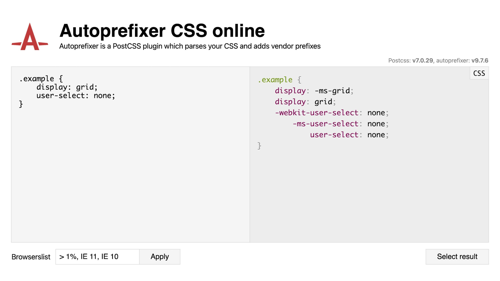

# Autoprefixer

<div class="book-index" data-book-index="Autoprefixer"></div>

Autoprefixer je – jak z názvu vyplývá – automatizační nástroj, který přidává prohlížečové prefixy do CSS kódu.

<div class="ebook-only" markdown="1">

V knížce se o něj celou dobu otíráme, takže se mu konečně pojďme věnovat.

</div>

Autoprefixer například z následujícího kódu…

```css
.box {
  hyphens: auto;
}
```

… udělá tento kód:

```css
.box {
  -webkit-hyphens: auto;
  -ms-hyphens: auto;
  hyphens: auto;
}
```

Tím pádem budou kódu rozumět všechny prohlížeče, i když vlastnost `hyphens` neznají a podporují jen prefixované varianty.

<figure class="figure-thirds">

<figcaption markdown="1">
*Autoprefixer v celé kráse své online verze.*
</figcaption>
</figure>

<div class="web-only" markdown="1">

→ *Co jsou [prohlížečové prefixy](prefix.md)?*

</div>

## Jak Autoprefixer funguje? {#jak-funguje}

Autoprefixer je balíček, který si můžete do projektu nainstalovat jako plugin pro PostCSS, což je nástroj sloužící k jakémukoliv automatickému zpracovávání CSS kódu.

<!-- AdSnippet -->

Používat můžete Autoprefixer mnoha různými způsoby, o těch bude za chvíli řeč. Nejprve ale k nastavení.

<div class="web-only" markdown="1">

→ *Nástroj [PostCSS](postcss.md)?*

</div>

## Nastavení pomocí Browserslistu {#browserslist}

Browserslist je způsob, jak Autoprefixeru a podobným nástrojům (jakým je například Babel pro zpracování JavaScriptu) určit, které prohlížeče v projektu podporujete.

Nejlepším způsobem, jak poskytnout toto nastavení, je soubor `.browserslistrc` v kořenovém adresáři projektu. Alternativně můžete přidat klíč `browserslist` do souboru `package.json` nebo přímo v nastavení Autoprefixeru.

<div class="web-only" markdown="1">

→ *Soubor [`package.json`](package-json.md)?*

</div>

Výchozí nastavení vypadá asi takto:

```text
last 1 version, >1%
```

Potom tento kód…

```css
.box {
  display: flex;
}
```

… bude mít totožný zápis i po zásahu Autoprefixeru. Zápisem `last 1 version, >1%` jsme řekli, že budeme podporovat jen poslední verzi prohlížečů a takovou verzi, která má ve světě rozšíření více než jedno procento.

Pojďme ale změnit zápis konfigurace takto:

```text
> 1%, IE 11, IE 10
```

Pak bude výsledek jiný:

```css
.box {
  display: -ms-flexbox;
  display: flex;
}
```

V konfiguraci Browserslistu je `IE 10`, takže Autoprefixer přidá zápis pro tento stařičký prohlížeč: `display:-ms-flexbox`.

## Použití Autoprefixeru {#pouziti}

Možností využití je celá řada, podívejme se na ně.

### Online {#pouziti-online}

Pokud si chcete jen hrát nebo přidat pár prefixů, zajděte na online pískoviště. [autoprefixer.github.io](https://autoprefixer.github.io/)

### Příkazová řádka {#pouziti-cli}

Využijte balíček postcss-cli. [vrdl.in/96mcu](https://github.com/postcss/postcss-cli).

```terminal
npm install postcss-cli autoprefixer
npx postcss *.css --use autoprefixer -d build/
```

### Gulp {#pouziti-gulp}

Pro kombinování s Gulpem je k dispozici balíček gulp-postcss. [vrdl.in/2a70d](https://github.com/postcss/gulp-postcss)

```js
gulp.task('autoprefixer', () => {
  const autoprefixer = require('autoprefixer')
  const sourcemaps = require('gulp-sourcemaps')
  const postcss = require('gulp-postcss')

  return gulp.src('./src/*.css')
    .pipe(sourcemaps.init())
    .pipe(postcss([ autoprefixer() ]))
    .pipe(sourcemaps.write('.'))
    .pipe(gulp.dest('./dest'))
})
```

### Webpack {#pouziti-webpack}

<div class="web-only" markdown="1">

postcss-loader je balíček vhodný pro vaši práci ve [Webpacku](webpack.md). [vrdl.in/lcpb5](https://github.com/webpack-contrib/postcss-loader)

</div>

<div class="ebook-only" markdown="1">

postcss-loader je balíček vhodný pro vaši práci ve Webpacku. [vrdl.in/lcpb5](https://github.com/webpack-contrib/postcss-loader)

</div>


`webpack.config.js`:

```js
module.exports = {
  module: {
    rules: [
      {
        test: /\.css$/,
        use: ["style-loader", "css-loader", "postcss-loader"]
      }
    ]
  }
}
```

`postcss.config.js`:

```js
module.exports = {
  plugins: [
    require('autoprefixer')
  ]
}
```

Použití Autoprefixeru s dalšími nástroji a více nápovědy najdete na oficiálním webu. [vrdl.in/ptaqs](https://github.com/postcss/autoprefixer)

<!-- AdSnippet -->
