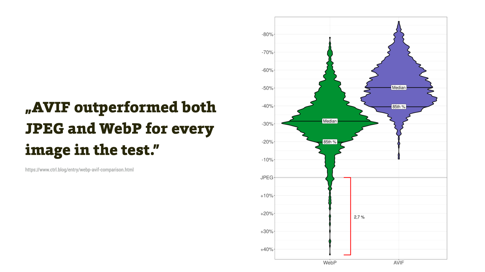

# Obrázkový formát AVIF

Chrome [od verze 85](https://developers.google.com/web/updates/2020/08/nic85) začal vcelku překvapivě a bez velkých oslav ze strany Googlu podporovat nový obrázkový formát AVIF.

Nové obrázkové formáty nás webaře zajímají hlavně z pohledu datové efektivity a nových vlastností. Obojí je zde splněno, protože AVIF obvykle ušetří oproti JPEG výrazně více dat než dřívější alternativa, [formát WebP](webp.md).

<figure>

<figcaption markdown="1">
*Obrázek: Datové úspory AVIF leckoho zaskočí, i ve srovnání s formátem WebP. Toto jsou výsledky pro sadu několika obrázků, v článku jsou ale ještě podrobnější srovnání.*
</figcaption>
</figure>

Nový formát AVIF je ostatně s WebP příbuzný. Oba jsou založeny na video kodeku z rodiny VPx. WebP používá starou verzi VP8, zatímco AVIF je založen na AV1, což je nová generace po VP10. Formát WebP už je starý více než 10 let a tak AVIF přináší opravu největších nedostatků svého staršího příbuzného.

AVIF disponuje také zajímavými a pro web užitečnými vlastnosti. Jeho velkou výhodou je například je, že i při vysoké kompresi zachovává ostré hrany barevných přechodů.

## Odkud se AVIF vzal {#odkud}

AVIF má kořeny v těžko překonávaném, ale velmi málo rozšířeného [formátu HEIF](obrazky-formaty.md#heif) a novém úsporném formátu videa AV1 od skupiny [Alliance for Open Media](https://aomedia.org/).

<!-- AdSnippet -->

Mezi členy skupiny počítáme například Google, Amazon, Facebook, Intel, Microsoft, Mozillu, Netflix, Samsung Electronics — a Apple. Tohle si zapamatujme jako velmi důležité, ještě se k tomu vrátíme.

## Výhody AVIF {#vyhody}

Na formátu je znát desetiletý rozdíl oproti předchozímu WebP a 26 let (!) inovací oproti době vzniku JPEG.

### Datová úspora {#vyhody-uspora}

Množství ušetřených dat je velké a leckomu může u konkrétních obrázků vyrazit dech. Pojďme se ale podívat na studii, která používá širší datovou základnu než jednotlivé obrázky.

Daniel Aleksandersen na Ctrl.blog spravuje nezávislou sadu 600 obrázků v šířkách 96 až 1080 pixelů. Porovnával sady původních JPEG obrázků s jejich variantami ve WebP a AVIF.

<figure>

<figcaption markdown="1">
*Obrázek: AVIF překonal nejen JPEG, ale i WebP a to v každém jednotlivém obrázku. Zdroj [Daniel Aleksandersen, Ctrl.blog](https://www.ctrl.blog/entry/webp-avif-comparison.html).*
</figcaption>
</figure>

Výsledky jsou velmi zajímavé:

- Medián datové úspory AVIF je kolem 50 % oproti JPEG. (U WebP je to kolem 30 %).
- AVIF ukázal lepší výsledek komprese než JPEG a WebP pro každý jednotlivý obrázek v jeho testu. (U WebP je z grafu vidět, že některé typy obrázků mohou být i datově větší než původní JPEG.)

Tyto výsledky potvrzují i další. [Ve studii Netflixu](https://netflixtechblog.com/avif-for-next-generation-image-coding-b1d75675fe4) se potvrdila úspora poloviny dat oproti JPEG.

Výsledky ale mohou být pro konkrétní obrázky i výrazně lepší. Mám sadu pěti různorodých obrázků, na kterých si nové formáty zkouším. V původní, nepříliš efektivní JPEG variantě, mají dohromady 3,2 MB. Převod do WebP stáhl velikost na 1 MB. AVIF na 0,37 MB.

### Nový typ komprese a nové vlastnosti {#vyhody-komprese}

Datovou velikostí to ale nekončí:

- AVIF přichází s novým typem komprese, které [říkají „chroma-from-luma“](https://blog.cloudflare.com/generate-avif-images-with-image-resizing/).
- AVIF podporuje 10- a 12bitové barvy v plném rozlišení a vysoký dynamický rozsah (HDR). Formát WebP je omezen na 8bitovou barevnou hloubku.

Celkově vzato to znamená, že nový formát „nekostičkuje“ jako JPEG a AVIF a „nerozmazává“ ostré hrany.

<figure>

<figcaption markdown="1">
*Obrázek: AVIF nekazí hrany. Zdroj: [Kornel Lesiński, The Cloudflare Blog](https://blog.cloudflare.com/generate-avif-images-with-image-resizing/).*
</figcaption>
</figure>

Z toho také vychází nové možnosti využití.

### Rozšířené možnosti použití {#vyhody-pouziti}

Bylo by ke škodě věci zapamatovat si AVIF jako alternativu pro JPEG.

Ano, pro zobrazování fotografií na webu se velmi dobře hodí. Už formát WebP ale přišel s podporou bezeztrátové komprese a alfa-průhledností (a podporou animací), takže se stal téměř plnohodnotnou náhradou formátu PNG.

Problém u WebP ale zůstával s „rozmazáváním“ ostrých hran, jak jste mohli vidět v předchozím obrázku. Trochu to eliminuje [vlastnost „sharp YUV“](https://www.ctrl.blog/entry/webp-sharp-yuv.html), ale ne zcela.

<!-- AdSnippet -->

AVIF ale díky novému algoritmu ostré hrany téměř nijak nedeformuje. Dělá to z něj výbornou alternativu také pro obrázky s ostrými hranami – například typografické bannery nebo produktové obrázky na jednobarevném pozadí.

[Jake Archibald](https://jakearchibald.com/2020/avif-has-landed/) ve svém skvělém článku o AVIF také experimentoval s náhradou AVIFu za vektory (!) a mělo to slušný úspěch, zejména u komplexnějších [SVG obrázků](svg.md).

## Nevýhody AVIF {#nevyhody}

Dva hlavní problémy AVIFu jsou nepřítomnost postupného vykreslování a rychlost.

### Progressive AVIF neexistuje {#nevyhody-progressive}

[Progresivní vykreslování](https://www.liquidweb.com/kb/what-is-a-progressive-jpeg/) (progressive rendering) je velkou výhodou formátu JPEG. Už v první várce renderingu prohlížeč vykreslí celou plochu obrázku. Jde tedy o jakýsi přirozený placeholder, zástupný symbol, než se obrázek načte celý.

<figure>
<div class="rwd-media">
  <video muted controls width="1600" height="900">
    <source src="https://res.cloudinary.com/vzhurudolu-cz/video/upload/v1605595269/vzhurudolu-video/progressive-avif-jake-archibald_ptmo7w.mp4"
      type="video/mp4">
  </video>
</div>
<figcaption markdown="1">
*Obrázek: Potupné vykreslení AVIFu. Zdroj: [Jake Archibald](https://jakearchibald.com/2020/avif-has-landed/).*
</figcaption>
</figure>

AVIF bohužel touto funkcí nedisponuje. Je to „levoboček“ video-formátu, takže se nelze divit. O téhle nevýhodě se ale obecně ví a [řeší se](https://github.com/AOMediaCodec/av1-avif/issues/102) v rámci dalšího vývoje formátu.

Pro nás webaře to znamená, že v případě nasazení AVIFu na místa, kde by se hodilo postupné vykreslení, musíme vymýšlet alternativy. Například vložení menšího obrázku, [BlurHashe](https://blurha.sh/) a tak dále.

### Rychlost kódování {#nevyhody-rychlost}

Pokud jste si AVIF zkoušli generovat například přes [Squoosh](https://squoosh.app/), znáte i další nevýhodu. Rychlost. Nebo spíše pomalost.

Důležitým parametrem tam je „effort“, tedy úsilí, které enkodér vynakládá na poměr kvality a datové velikosti. Pro úroveň 2 trvá kódování AVIF dobrých pár sekund. Effort 3 je výrazně lepší, ale to může trvat několik minut. Při úrovni 10 může vytvoření jednoho obrázku trvat více než 10 minut.

<!-- AdSnippet -->

Daleko lepší výsledky samozřejmě budete mít při spouštění konverze na příkazové řádce.

Tenhle fakt je problematický zejména pro obrázkové CDN, které generují obrázky na vyžádání v reálném čase. Proto například [Cloudinary uvádí](https://cloudinary.com/documentation/image_transformations#avif_note), že podpora AVIF je aktuálně v beta-režimu.

Nicméně pro jednotlivé kusy obrázků toto problém není. A předpokládám, že se to časem bude zlepšovat, protože na podobné problémy jsme naráželi v úvodu podpory WebP.

## Podpora v prohlížečích {#podpora}

Problémem formátu WebP byla pomalá adopce prohlížeči. Ano, díváme se na tebe, Safari. Apple přidal podporu WebP až nedávno, 10 let po Chrome.

Jak je to u WebP?

- [Chrome 85](https://developers.google.com/web/updates/2020/08/nic85) již AVIF podporuje. V jiných prohlížečích založených na Chromu práce probíhá.
- [Ve Firefoxu](https://bugzilla.mozilla.org/show_bug.cgi?id=1443863) na podpoře pracují.
- Apple zatím neoznámil, zda bude v Safari AVIF podporovat. Tentokrát je však Apple jednou ze společností v Alliance for Open Media, tvůrců AVIF.

<figure>

<figcaption markdown="1">
*Obrázek: Podpora AVIF v prohlížečích. Zdroj: [CanIUse Embed](https://caniuse.bitsofco.de/) a [CanIUse](https://caniuse.com/avif).*
</figcaption>
</figure>

Kodek AV1 si již nyní připisuje rychlejší přijetí než předchozí kodeky bez licenčních poplatků. Nejnovější GPU od Nvidia, AMD a Intel již mají hardwarové dekódování pro AV1. Takže to s přístupem Apple tentokrát teoreticky vypadá dobře a 10 let čekat nemusíme.

## Nasazení na web {#nasazeni}

Technické možnosti tady jsou. Máme [značku `<picture>`](picture.md), takže můžeme realizovat nasazení i s fallbackem do WebP či JPEG:

```html
<picture>
  <source srcset="obrazek.avif" type="image/avif">
  <source srcset="obrazek.webp" type="image/webp">
  
</picture>
```

V takovém případě se nám AVIF ke dni psaní článku stáhne v Chrome a Opeře, WebP ve všech prohlížečích kromě starších Safari a Internet Explorerů. No a JPEG právě tam, v jámě lvové.

Vzhledem k podpoře zatím nepředpokládám masivní nasazení na všechny obsahové obrázky některých webů. Ale pro jednotlivé obrázky se mě to zdá je výborný nápad, který jsem si několikrát ověřit, například zde, na Vzhůru dolů.

→ *Související: [Záznam z webináře: WebP, AVIF nebo JPEG?](https://www.vzhurudolu.cz/video/webinar-variabilni-fonty) – rozšiřuje znalosti o nasazení WebP, AVIF, detailní srovnání těchto tří nástrojů a tipy na praktické nasazení.*
