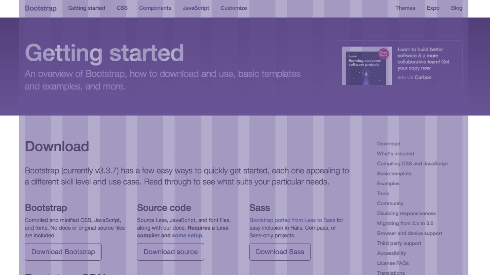

# Detailně: layout v Bootstrapu 4

Pojďme se spolu podívat na nový systém pro tvorbu rozvržení stránky v chystané verzi Bootstrapu. Pořádně do hloubky. 

Ten [flexbox](css-flexbox.md)! grid systém nového Bootstrapu je na něm postavený a dost to pomáhá. Evolučně ale vychází z předchozí verze, takže tutoriál vlastně využijete i vy, trojkaři. Ve čtyřce je možné stáhnout CSS soubor s gridem samostatně, což je další plus. 

Ano, Bootstrap 4 je stále v alfa verzi. Nicméně, změny grid systému [chystané do první bety](https://github.com/twbs/bootstrap/issues/21568) jsou jen malinké, takže si troufnu napsat, že tahle stránka zůstane beze změn i po vydání betaverze a jednou i verze finální. Samotný grid systém bych se prostě už nebál používat.

<!-- AdSnippet -->

Rychlá navigace po stránce: [kontejner](#container), [řádka](#row), [sloupec](#col), [sloupec do mřížky](#col-mrizka), [responzivní sloupec](#col-breakpoint), [posuny](#offset), [push a pull](#push-pull), [změna pořadí](#poradi) a [zarovnávání](#zarovnavani).


## Úplné základy

Základní struktura kódu je stále složená z kontejneru (třída `.container`), řádky (`.row`) a sloupce layoutu (`.col`):

```html
<div class="container">
  <div class="row">
    <div class="col"> <!-- Sloupec rozvržení --> </div>
    <div class="col"> <!-- Sloupec rozvržení --> </div>
  </div>
</div>
```

Struktura zůstává stejná s trojkou, jen se to chová jinak. Uvidíte. A v trojce jsme nemohli používat samostatnou třídu `.col`.


## Kontejner rozvržení {#container}

Kontejner je obal pro váš layout. Bootstrap má dva typy obalů:

- `.container` je kontejner fixní šířky: má stupně omezené maximální šířkou. Jeho maximální šířky jsou 540px na *small* šířkách okna, 720px (*medium*) 960px (*large*) a 1140px (*extra large*). 
- `.container-fluid` je pružný, takže se roztahuje do plné šířky okna prohlížeče. Ten asi budete využívat méně často.

Kontejnerů můžete mít na stránce samozřejmě víc. V ukázce je porovnání pružného i fixního kontejneru: [cdpn.io/e/RpYqwK](https://codepen.io/machal/pen/RpYqwK?editors=1000).

<!-- AdSnippet -->

Tohle zůstává stejné. Ve verzi 4 ale přibyl jeden [breakpoint](breakpointy.md) pro mobilní zařízení. Psal jsem o tom v článku [o chystaných novinkách](https://www.vzhurudolu.cz/blog/39-bootstrap-4#nova-mrizka-a-flexbox) ve čtyřce.

V dalších ukázkách kódu už budu `.container` pro zjednodušení vynechávat.

## Řádek rozvržení {#row}

Řádky jsou vodorovná seskupení sloupců rozvržení. Na třídu `.row` nesmíte zapomenout, má totiž dvě funkce:

1. Spuštění layoutu. `.row` je [flexboxový kontejner](css3-flexbox-kontejner.md), rodič layoutu.
2. Zarovnávání layoutu. Má totiž nastavený záporný vnější okraj.

Při používání Bootstrapu 3 se na `.row` často zapomínalo. Ve čtyřce už bez řádky není možné udělat layout. To je docela účinná tabletka proti zapomnětlivosti. 

Do ukázky se podívejte, co se stane, když řádek omylem vynecháte: [cdpn.io/e/VpGVKm](https://codepen.io/machal/pen/VpGVKm?editors=1000).


## Sloupec: `.col` {#col}

Sloupec je základní stavební jednotka layoutů v Bootstrapu. Nově je ve verzi 4 možné zapsat sloupec jednoduše pomocí prvku s třídou `.col` bez přípony. 

```html
<div class="row">
  <div class="col"> <!-- Sloupec rozvržení --> </div>
  <div class="col"> <!-- Sloupec rozvržení --> </div>
</div>
```

`.col` má nastaveno `flex-grow: 1`, takže sloupečky budou stejně široké. Viz [vlastnosti položky flexboxu](css3-flexbox-polozky.md). To je prima.

Jen pozor, layout neuvidíte na menších velikostech okna. Flexbox vlastnosti v `.col` jsou nastavené tak, aby zohledňovaly obsah okna. Zažijete to i v ukázce, když si okno zmenšíte pod 260 pixelů: [cdpn.io/e/ZeMmJg](https://codepen.io/machal/pen/ZeMmJg?editors=1000).


## Sloupec zarovnaný do mřížky: `.col-{číslo}` {#col-mrizka}

Bootstrap používá pravidelnou mřížku. Zarovnání do ní je z pohledu uživatele, designéra, ale i kodéra výhodné. Věřím, že tyhle třídy použijete velmi často.

Výchozí mřížka je dvanáctisloupcová. K dispozici tedy máte třídy `.col-1` až `.col-12`. 



*Vizualizace rozvržení layoutu webu do dvanáctisloupcové mřížky. [getbootstrap.com](http://getbootstrap.com/)*

```html
<div class="row">
  <div class="col-4"> <!-- 1/3 šířky --> </div>
  <div class="col-8"> <!-- 2/3 šířky --> </div>
</div>
```

Jde kombinovat mřížku se sloupečky bez přípony? Jistě:

```html
<div class="row">
  <div class="col"> <!-- 1/4 šířky --> </div>  
  <div class="col-6"> <!-- 1/2 šířky --> </div>  
  <div class="col"> <!-- 1/4 šířky --> </div>
</div>
```

`.col` třídy se pak díky `flex-grow:1` dělí rovným dílem o prostor, který zůstává po „mřížkových“ sloupečcích. Opět se tady ale musíte smířit se vzdorovitostí `.col` tříd, které poslouchají pnutí obsahu a ne vždy vám udělají layout tak, jak si ho představujete. [cdpn.io/e/BWOGvq](https://codepen.io/machal/pen/BWOGvq?editors=1000).

[Pokročilým použitím s preprocesorem Sass](https://v4-alpha.getbootstrap.com/layout/grid/#customizing-the-grid) je samozřejmě možné výchozí počet sloupců změnit. Stačí přenastavit proměnnou `$grid-columns`.


## Sloupec responzivní: `.col-{breakpoint}` {#col-breakpoint}

Abychom mohli udělat různé layouty na různě velkých šířkách okna, nemůžeme žít bez responzivních přípon:

<div class="rwd-scrollable font-size-08em" markdown="1">

| Body zlomu | Extra small  |  Small  | Medium | Large | Extra large |
| -----------| ------------ |  -----  | ------ | ----- | ----------- |
| Šířka okna od | 0px | 576px | 768px | 992px | 1200px |
| Třída      | `.col-` | `.col-sm-` |  `.col-md-` |  `.col-lg-` |  `.col-xl-` |

</div>

Třídy platí vždy od aktuálně platného bodu zlomu výše. `.col-sm` pak bude například platit od oken šířky 576 pixelů a výše.

<!-- AdSnippet -->

Třída `.col-` je vlastně synonymum pro trojkovou `.col-xs-`. Tedy layout, který platí na všech breakpointech. Tahle změna se mi ale líbí. Pro nováčky je to jednodušší na přemýšlení.


```html
<div class="row">
  <div class="col-sm-4"> 
    <!-- třetina od „sm“ výše --> 
  </div>  
  <div class="col-sm-8"> 
    <!-- dvě třetiny od „sm“ výše --> 
  </div>
</div>
```

Třídy je samozřejmě možné úplně v pohodě kombinovat a dělat různé layouty pro různá rozlišení:

```html
<div class="row">
  <div class="col-6 col-sm-4"> 
    <!-- polovina na „xs“, třetina od „sm“ výše --> 
  </div>  
  <div class="col-6 col-sm-8"> 
    <!-- polovina na „xs“, dvě třetiny od „sm“ výše --> 
  </div>
</div>
```

Nejlépe to všechno uvidíte v další mé ukázce: [cdpn.io/e/zZJyGN](https://codepen.io/machal/pen/zZJyGN?editors=1000)


## Posuny: `.offset-{breakpoint}` {#offset}

Sloupečky můžete posunovat směrem doleva přidáním vnějšího okraje třídami z rodiny posunů. V ukázce třeba mám sloupec třetinové délky `.col-md-4`, který posouváme o třetinu zleva `offset-md-4`. 

```html
<div class="row">
  <div class="col-md-4 offset-md-4"> 
    <!-- posunutý obsah --> 
  </div>  
</div>
```

Ve výsledku bude tedy centrovaný. [cdpn.io/e/jBvXmP](https://codepen.io/machal/pen/jBvXmP?editors=1000)


## Push a pull {#push-pull}

Třída `.push-` funguje podobně jako offsety. Prostě v daném bodu zlomu posune prvek o daný počet sloupečků mřížky doprava. `.pull-` dělá pravý opak – posouvá doleva.

Jde to hezky využít pro změnu pořadí prvků:

```html
<div class="row">
  <div class="col-md-9 push-md-3"><!-- 1. --></div>  
  <div class="col-md-3 pull-md-9"><!-- 2. --></div>      
</div>
```

V příkladu se díky tomu na `md` breakpointu, tedy od šířky okna 768 pixelů, oba sloupce prohodí. `1.` je v kódu první, ale v layoutu bude až na druhém místě. [cdpn.io/e/xqamPp](https://codepen.io/machal/pen/xqamPp?editors=1000)


## Změna pořadí {#poradi}

Kromě výše uvedených způsobů lze měnit pořadí sloupců layoutu pomocí třídy `.flex-first`: 

```html
<div class="row">
  <div class="col-4"><!-- … --></div>
  <div class="col-4"><!-- … --></div>
  <div class="col-4 flex-first"><!-- V prohlížeči bude první --></div>  
</div>
```

Vychází to z flexboxí [vlastnosti `order`](css-order.md). Ukázka: [cdpn.io/e/dvqrZv](https://codepen.io/machal/pen/dvqrZv?editors=1000)

To je věc nová pro čtvrtou verzi. Ale jak sami vidíte, pro změnu pořadí je to daleko příjemnější než metoda pomocí tříd `.pull` a `.push`.


## Zanořování {#zanorovani}

Velmi užitečné je, že layout můžete zanořovat. Přidejte další řádku layoutu, třídu `.row`, a je to:

```html
<div class="row">
  <div class="col-9">
    <div class="row">
      <div class="col-sm-6"><!-- … --></div>  
      <div class="col-sm-6"><!-- … --></div>            
    </div>
  </div>  
</div>
```

Každá nově vytvořená řádka layoutu se řídí šířkou rodiče. Takže se vám může stát, že zanořený layout opustí celostránkovou dvanáctisloupcovou mřížku. Nemusí vám to vadit, ale raději na to upozorňuji. [cdpn.io/e/xqamzW](https://codepen.io/machal/pen/xqamzW?editors=1000)


## Zarovnávání {#zarovnavani}

Použití flexboxu otevřelo v mřížce Bootstrapu 4 kromě jiného také výborné možnosti zarovnání obsahu. Samozřejmě v obou směrech a jak pro celý layout, tak jeho jednotlivé položky.

Zarovnání na vodorovné ose:

<div class="rwd-scrollable font-size-08em" markdown="1">

| Zarovnání             | Celý layout (`.row`)       |
| ----------------------| ---------------------------|
| Doleva                | `.justify-content-start`   |
| Na střed              | `.justify-content-center`  |
| Doprava               | `.justify-content-end`     |
| Mezery kolem sloupců  | `.justify-content-around`  |
| Mezery mezi sloupci   | `.justify-content-between` |

</div>

Vychází to z vlastnosti flexboxového kontejneru [`justify-content`](css3-flexbox-kontejner.md#justify-content). Následuje příklad použití:

```html
<div class="row justify-content-between">
  <div class="col-3"> <!-- … --> </div>
  <div class="col-3"> <!-- … --> </div>
</div>
```

Pro tenhle kód se první sloupec přilepí doleva a druhý doprava. Volný prostor se totiž rozdělí mezi jednotlivé sloupce (`.justify-content-between`). [cdnp.io/ZeMPbP](https://codepen.io/machal/pen/ZeMPbP?editors=1000)

Zarovnání na svislé ose:

<div class="rwd-scrollable font-size-08em" markdown="1">

| Zarovnání | Celý layout (`.row`)       |  Sloupec (`.col`)    |
| ----------| ---------------------------|----------------------| 
| Doleva    | `.align-items-start`       |  `.align-self-start` |
| Na střed  | `.align-items-center`      |  `.align-self-center`|
| Doprava   | `.align-items-end`         |  `.align-self-end`   |

</div>

Vychází to z vlastností flexboxového kontejneru [`align-items`](css3-flexbox-kontejner.md#align-items) a položky flexboxu [`align-self`](css3-flexbox-polozky.md#align-self). Příklad použití:

```html
<div class="row align-items-center">
  <div class="col-3"> <!-- … --> </div>
  <div class="col-3"> <!-- … --> </div>
  <div class="col-3"> <!-- … --> </div>
  <div class="col-3 align-self-end"> <!-- … --> </div>
</div>
```
Všechny sloupce layoutu jsou na svislé ose zarovnané doprostřed (`.align-items-center`). Jen tomu poslednímu jsme dopřáli výjimku. Je zarovnaný dole, ke konci svislé osy layoutu (`.align-self-end`). [cdnp.io/XMPGjv](https://codepen.io/machal/pen/XMPGjv?editors=1100)

<!-- AdSnippet -->

To je vše. Děkuji za pozornost a ať vám mřížka v Bootstrapu 4 dobře slouží. 

Odkazy na závěr:

- Sada [ukázek na CodePenu](https://codepen.io/collection/XMjRJk/).
- Dokumentace gridu [na webu Bootstrapu 4](https://v4-alpha.getbootstrap.com/layout/grid/).
- Samostatný [Bootstrap 4 grid ke stažení](https://github.com/twbs/bootstrap/tree/v4-dev/dist/css).
- Naše [školení pokročilého využití Bootstrapu](https://www.vzhurudolu.cz/kurzy/bootstrap).
