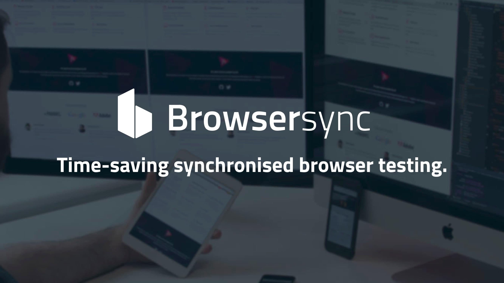
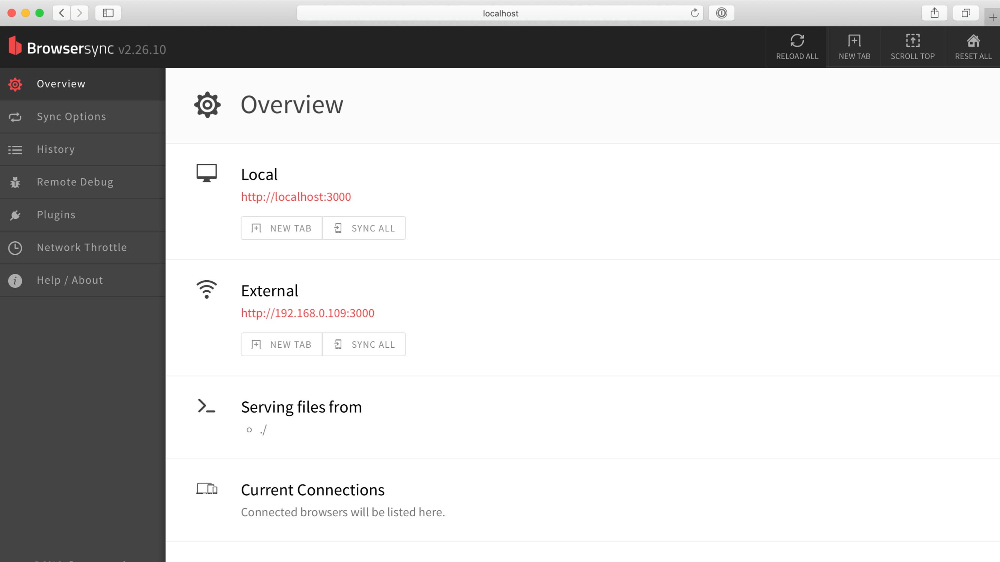
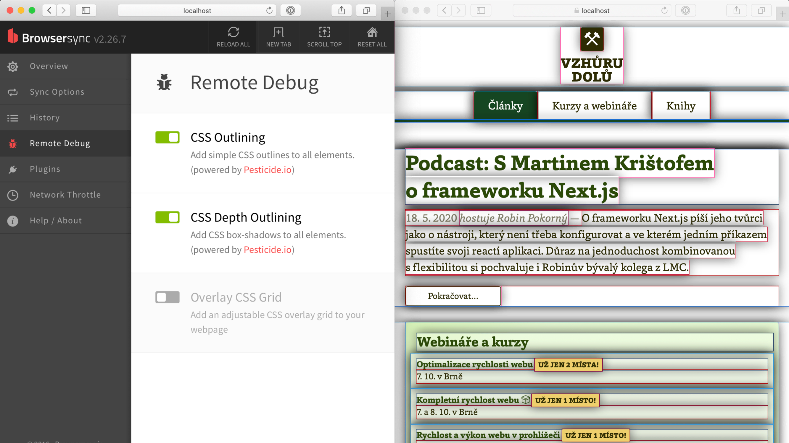

# Browsersync

Browsersync je velmi užitečný nástroj pro lokální vývoj webů. Pomáhá se dvěma důležitými úkoly:

1. Živé promítání změn ze zdrojových souborů do prohlížeče.
2. Synchronizace interakcí napříč prohlížeči.

Browsersync je Node.js komponenta, takže může běžet na příkazové řádce, ale je kompatibilní také s [s Gruntem](grunt.md), Gulpem, [Webpackem](webpack.md) a dalšími nástroji tohoto ekosystému.



Je opensource a zdarma: [browsersync.io](https://www.browsersync.io/).

Čím se budeme v tomto textu zabývat?

<div class="f-6" markdown="1">
- [Co Browsersync umí?](#co-umi)
- [Browsersync a automatizace](#automatizace)
- [Instalace](#instalace)
- [Pokročilejší tipy](#tipy)
</div>

## Co Browsersync umí? {#co-umi}

Tenhle prográmek zvládá řadu věcí, ale začneme dvěma nejdůležitějšími.

### Živé promítání změn do prohlížeče {#co-umi-live}

Upravíte CSS nebo HTML soubor a změny se vám hned projeví v prohlížeči bez obnovení stránky. Možná už to znáte z jiných nástrojů. Původně s tím přišlo rozšíření [LiveReload](http://livereload.com/).

Pokud živý náhled neznáte nebo nevěříte, že to nějak zásadně pomáhá, opravdu (ale *opravdu*) si to zkuste. Pomáhá to totiž *hodně*.

<div class="rwd-media">
  <video autoplay muted controls width="1920" height="1200">
    <source src="https://res.cloudinary.com/vzhurudolu-cz/video/upload/v1595830619/vzhurudolu-video/browsersync_nkrnoo.mov"
      type="video/mp4">
  </video>
</div>

Změny se hned projeví v prohlížeči. Obnovení stránky dělat nemusíte.

Úplně nejlepší je nastavit si editor, aby ukládal změny v otevřených souborech hned po přepnutí do jiné aplikace. Pak stačí přepínat mezi editorem a prohlížečem. Šetří to hrozně energie, fakt že jo.

### Synchronizace interakcí při testování webu {#co-umi-sync}

Browsersync vám během spuštění do příkazové řádky vypíše něco takového:

```bash
[BS] Access URLs:
------------------------------------
     Local: http://localhost:3000
  External: http://192.168.0.2:3000
------------------------------------
        UI: http://localhost:3001
UI External: http://192.168.0.2:3001
------------------------------------
```

Co je to za adresy?

- `Local` –  tam najdete svůj web.
- `External` – kde svůj web uvidíte na všech zařízeních připojených do stejné sítě.
- `UI` – rozhraní s nastavením Browsersync.
- `UI External` – rozhraní s nastavením na připojených zařízeních.

Vezměte mobil připojený do stejné wifi a vyťukejte do tamního prohlížeče `External` adresu.  Teď když budete provádět uživatelské interakce v jednom zařízení, druhé bude dělat totéž za vás. Pěkné, ne? Browsersync to umí s klikáním, rolováním stránky nebo taky vyplňováním formulářů.

<!-- AdSnippet -->

Proč vám o takové *blbině* vyprávím? Protože ušetří vaši energii při testování responzivních webů na reálných zařízeních. [vrdl.cz/p/jak-testovat-responzivni-weby](https://www.vzhurudolu.cz/prirucka/jak-testovat-responzivni-weby)

<p class="video">
Video: <a href="https://www.youtube.com/watch?v=2DTP8MuW9rw">Browsersync: živý náhled webu a synchronizace prohlížení </a> ~ Obě vlastnosti rozebrány ve videu. Podívejte se.
</p>

### Ladění webu na mobilních zařízeních (odstraněno) {#co-umi-mobily}

Ve verzi 1 uměl Browsersync také vzdáleně ladit kód na mobilních zařízení a to také multiplatformně. Používal se pro to nástroj Weinre: [vrdl.in/abmfz](https://people.apache.org/~pmuellr/weinre/docs/latest/Home.html).

Dnes už není potřeba, protože se počet použitelných mobilních platforem zmenšil na dvě a obě nabízejí vlastní velmi slušné debugovací nástroje.

## Instalace Browsersync pro použití na příkazové řádce {#instalace}

Na lokální mašině předtím potřebujete rozchodit [Node ekosystém](node-instalace.md).

### 1) Instalujte Browsersync globálně {#instalace-1}

```text
npm install -g browser-sync
```

[Správci balíčků NPM](npm.md) jsme tímto řekli, aby Browsersync instaloval globálně (parametr `-g`).

Vrátit by se mělo info, že máme nástroj instalovaný v systému v aktuální verzi:

```text
+ browser-sync@2.26.10
```

Ověřit, že máme nainstalováno, můžeme také příkazem `browser-sync help`, který vrátí jednoduchou nápovědu.

### 2) Spustíme Browsersync {#instalace-2}

V základu můžeme sledovat CSS soubor a změny v něm pak rovnou vkládat do prohlížeče.

HTML a CSS soubor pro základní vyzkoušení si můžete stáhnout nebo naklonovat z mého [Gistu](https://gist.github.com/machal/05ed82cafb7644ff35c207dfbbcf5c8f).

V adresáři si pak spustíte Browsersync:

```text
browser-sync start --server --files "*.css"
```

Spouštíme server (parametr `--server`), který sleduje všechny soubory, jež mají koncovku CSS (`--files "*.css"`).

Browsersync nám teď náš `index.html` otevře ve výchozím prohlížeči na `http://localhost:3000/` a čeká na naše změny v CSS.

Takto bychom řešili jednoduchou obsluhu statického webu. Většinou ale nám ale už nějaký server běží, například Apache, když projekt funguje na PHP. Pak bychom Browsersync pouštěli jen jako proxy nad už fungujícím lokálním serverem:

```text
browser-sync start --proxy "myproject.dev" --files "*.{css,js}”
```

Tímto startujeme Browsersync jako proxy k už běžícímu serveru `myproject.dev` a říkáme, že chceme sledovat soubory s koncovkou CSS a JS.

Další možnosti práce na příkazové řádce jsou [v dokumentaci](https://www.browsersync.io/docs/command-line).

<figure>

<figcaption markdown="1">
*Obrázek: Uživatelské rozhraní Browsersync, které běží na http://localhost:3001/*
</figcaption>
</figure>

Předpokládám ale, že na příkazové řádce tenhle užitečný nástroj většinou používat nebudete. Podívejme se na jeho integraci s populárními spouštěči.

## Browsersync a automatizační nástroje {#automatizace}

Výše uvedeným postupem jsme si Browsersync nainstalovali do příkazové řádky, takže jej můžeme volat z jakýchkoliv prográmků, které to používají.

- *NPM skripty*  
Nástroj, který je asi pro webaře nejblíže k příkazové řádce. Není potřeba nic dalšího instalovat. Mrkněte se jen na [nápovědu BrowserSync k příkazové řádce](https://www.browsersync.io/docs/command-line) a tady [návod na zprovoznění](https://maheshwaghmare.com/browser-sync/).
- *Gulp*  
Je potřeba instalovat BrowserSync a Gulp: `npm install browser-sync gulp --save-dev` a pak už vám asi vystačí [dokumentace BrowserSync pro Gulp](https://www.browsersync.io/docs/gulp).
- *Grunt*  
Instalujte plugin pro Grunt: `npm install grunt-browser-sync --save-dev` a pak mrkněte na [můj postup níže](#automatizace-grunt) nebo [dokumentaci BrowserSync](https://www.browsersync.io/docs/grunt).
- *Webpack*  
[V dokumentaci dole](https://www.browsersync.io/docs/recipes) je pár receptů pro [Webpack](webpack.md).
- *Parcel*  
Parcel ve výchozím nastavení nějaké automatické obnovování stránky dělá, ale pokročilé vlastnosti je možné dodat pomocí pluginu [parcel-browser-sync](https://www.npmjs.com/package/@zartsoft/parcel-browser-sync).

Dřívější verze tohoto textu byla postavena na konfiguraci v nejstarším automatizačním nástroji – [Gruntu](grunt.md). Dneska už se moc nepoužívá, ale nechávám to zde pro případné zájemce. Vy ostatní můžete tuto část přeskočit.

### Grunt: Instalace ukázky a nastavení {#automatizace-grunt}

Vezmeme tento příklad z ukázek využití Browsersync, kterým říkají Recipes: [git.io/vKfhs](https://github.com/Browsersync/recipes/tree/master/recipes/grunt.html.injection).

1. Na lokální mašině předtím potřebujete rozchodit [Node ekosystém](node-instalace.md) – hlavně [NPM](npm.md) a [Grunt](grunt.md). Volitelně také Git v příkazové řádce.
2. Naklonujte repozitář (nebo stáhněte v ZIPu: [git.io/vKfhc](https://github.com/BrowserSync/recipes/archive/master.zip)):  
`git clone https://github.com/Browsersync/recipes.git bs-recipes`
3. Skočte do adresáře s první ukázkou:  
`cd bs-recipes/recipes/grunt.html.injection`
4. Nainstalujte NPM závislosti:  
`npm install`
5. Pusťte příklad:  
`npm start`
6. Ve výchozím prohlížeči se vám otevře okno s adresou podobného tvaru:  
`http://localhost:3000/`

Pak stačí přidat konfiguraci podobnou této:

```javascript
browserSync: {
  dev: {
    bsFiles: {
      src : 'assets/css/*.css'
    },
    options: {
      watchTask: true,
      proxy: 'vzhurudolu.localhost'
    }
  }
},
```

Co jsem tím nastavil?

- V `bsFiles` je cesta k souborům, které se budou naživo vkládat do prohlížeče, jakmile je změníte.
- `watchTask: true` v nastavení úlohy říká, že soubory sledujete ještě `watch` pluginem. Pravděpodobně totiž po změně souboru provádíte ještě další operace nad nimi – minifikaci, spojování atd. BrowserSync tomuto procesu nesmí stát v cestě.
- V `proxy: 'vzhurudolu.localhost'` je adresa, na které mi projekt už na lokále běží. Využívám tedy jiný server (v mém případě Apache z MAMP balíčku). Je ale dobré vědět, že Browsersync nabízí vlastní server. Více v další části.

## Pokročilejší tipy pro práci s Browsersync {#tipy}

Naučíme se spouštět vlastní server, do živého náhledu reflektovat změny v HTML, odladit si CSS nebo přiškrtit rychlost připojení.

### Vlastní server {#tipy-server}

V nastavení Grunt nebo Gulp tasku stačí uvést parametr a cestu k souborům. Browsersync vám spustí  jednoduchý lokální server:

```javascript
server: {
  baseDir: "./"
}
```

<!-- AdSnippet -->

Viz také [browsersync.io/docs/grunt#grunt-server](https://www.browsersync.io/docs/grunt#grunt-server).

### Živý náhled HTML {#tipy-zivy}

Pokud chcete vkládat změny v HTML souboru do všech připojených zařízení, použijte plugin HTML Injector. V demíčku ukazovaném v tomto textu je to už nastavené. Viz také [github.com/shakyShane/html-injector](https://github.com/shakyShane/html-injector).

### Recipes - příklady použití {#tipy-recipes}

Recipes jsou sada funkčních příkladů s předpřipravenými obvyklými nastaveními Browsersync. Pěkný zdroj inspirace i pro pokročilejší uživatele. Viz také [github.com/Browsersync/recipes](https://github.com/Browsersync/recipes).

### Přiškrcení rychlosti připojení {#tipy-rychlost}

Pokud nepoužíváte Chrome, kde je možnost zpomalení rychlosti připojení vestavěná, bude se vám tahle vlastnost hodit. V demíčku jděte na `http://localhost:3001/network-throttle`. Výborné pro testování responzivních webů na mobilních internetových připojeních.

### Rychlé ladění CSS layoutu {#tipy-css}

Zobrazení obrysů prvků kvůli testování CSS layoutu můžete nastavit na `http://localhost:3001/remote-debug`.

<figure>

<figcaption markdown="1">
*Obrázek: Ladění layoutu pomocí funkce „Remote Debug“ v Browsersync.*
</figcaption>
</figure>

 Layout je také možné testovat oproti  mřížce vykreslené na pozadí. Používá technologii Pesticide. [Pesticide.io](http://pesticide.io/).

To by mohlo být všechno. Browsersync vám  pomůže zefektivnit práci na webech. Patří k mým nejoblíbenějším nástrojům. Zkuste ho.

<!-- AdSnippet -->
