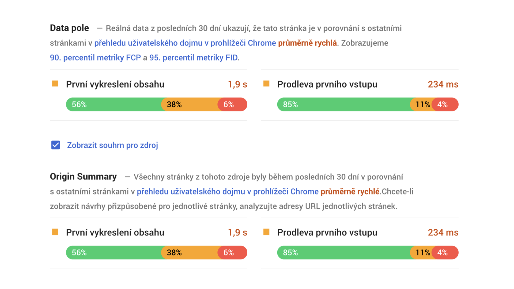
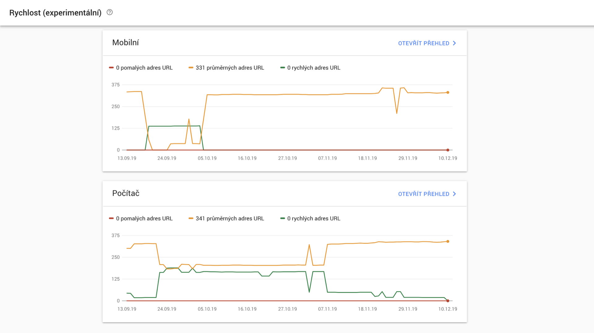
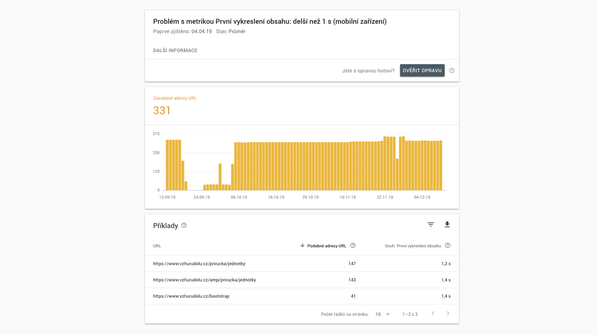
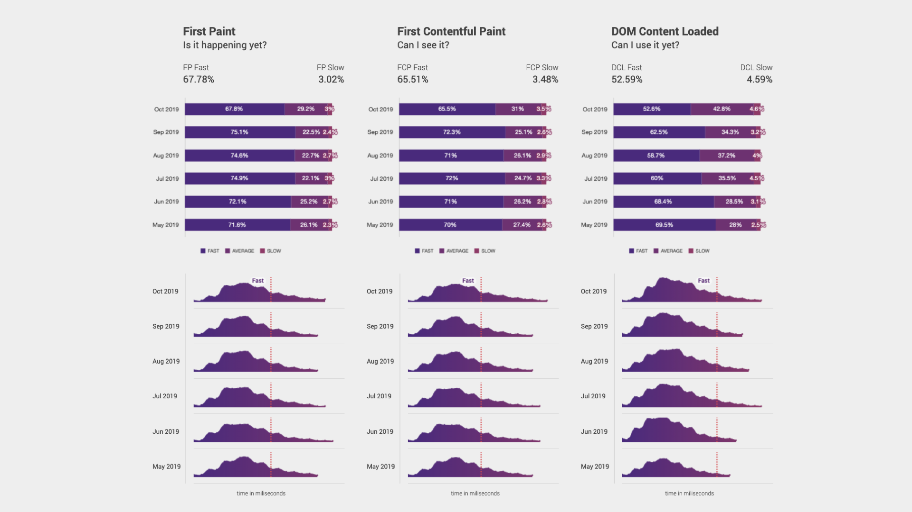
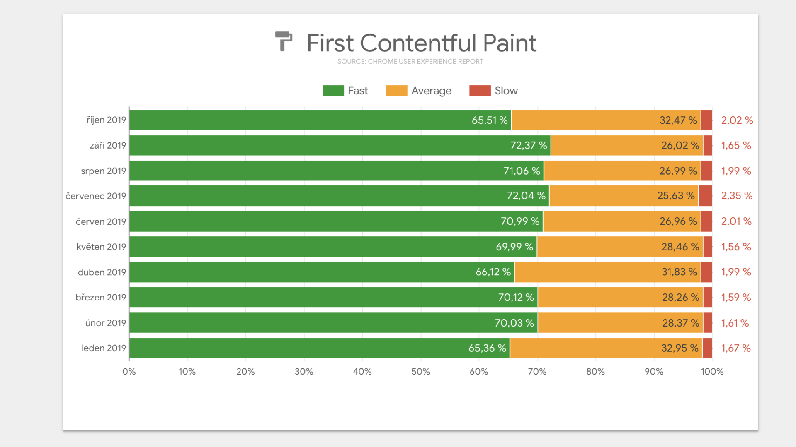

# Chrome UX Report

Chrome UX Report (nebo také CrUX, v běžné mluvě klidně „krux“) je databáze dat o kvalitě uživatelského prožitku, kterou o webech sbírají všechny verze prohlížeče Chrome.

CrUX je velmi důležitý zdroj metrik [Core Web Vitals](web-vitals.md), které Google zohledňuje v rámci oblasti [Page Experience](google-page-experience.md).

Google takhle získaná data poctivě skladuje ve své olbřímí databázi [BigQuery](https://cloud.google.com/bigquery/). A víte, co je nejlepší? Data jsou volně přístupná všem.

Podívejte se na video „Chrome UX Report“.

YouTube: [youtu.be/wvVmumXPQPM](https://www.youtube.com/watch?v=wvVmumXPQPM)

CrUX už dlouho používám ve své klientské praxi. V tomhle článku vám ukážu:

1. Proč si myslím, že byste měl data z CrUX sledovat.
2. Jaké metriky z něj dokážete dostat.
3. Jakými cestami a jak přesně lze data vydolovat.

## Syntetická měření rychlosti versus „data z pole“. A proč je CrUX také RUM? {#syntetika-rum}

Na datech z [Chrome UX reportu](https://developers.google.com/web/tools/chrome-user-experience-report) je výborné, že dostanete údaje o reálné rychlosti webu mezi uživateli. Liší se tak od údajů z [Google Lighthouse](lighthouse.md), [PageSpeed Insights](pagespeed-insights.md) a jiných [nástrojů](rychlost-nastroje.md) pro testování rychlosti, které provádějí kontrolu strojem.

Na druhou stranu: Data o rychlosti webu z CrUX jsou obvykle dostupná až s několikatýdenním zpožděním, nezahrnují všechny [metriky](metriky-rychlosti.md), které pro měření rychlosti webů potřebujeme a jsou opravdu jen od uživatelů Chromu, nikoliv jiných prohlížečů.

Ale buďme za to rádi. Google nám prostřednictvím Chrome UX Reportu poskytuje data zdarma. Podobná komerční RUM (Real User Monitoring) řešení (jako [tarify LUX](https://speedcurve.com/pricing/) nástroje [SpeedCurve](speedcurve.md)) jsou pořádně drahá.

## Proč sledovat zrovna tohle? Protože SEO a UX {#proc}

Má se za to, že Google data z CrUX [používá pro vyhodnocování](https://www.searchenginejournal.com/mobile-page-speed-changes/272221/) rychlosti webu, jednoho z mnoha [signálů pro řazení](https://developers.google.com/web/updates/2018/07/search-ads-speed) přirozených i placených výsledků vyhledávání.

<!-- AdSnippet -->

SEO je ovšem jen druhotný důvod. Google na rychlost dbá, protože je [dobrá pro uživatele](rychlost-nacitani-proc.md) a kvalitu jeho prožitku při používání webu.

## Metriky, které jsou v CrUX uložené {#metriky}

Jak už jsem psal, [metrik](metriky-rychlosti.md) zde nemáme k dispozici tolik jako u syntetických testů. Myslím, že se to časem zlepší. Ostatně, autoři přidávají metriky stále nové.

| Metrika                                                                        | Kdy vzniká?                       |
| ------------------------------------------------------------------------------ | --------------------------------- |
| [First Paint (FP)](metrika-fp.md)              | Vykreslení čehokoliv              |
| [First Contentful Paint (FCP)](metrika-fcp.md) | První vykreslení obsahu           |
| Largest Contentful Paint (LCP)                                                 | Vykreslení největší části stránky |
| [DOM Content Loaded (DCL)](udalost-dcl.md)     | Rozparsování HTML prohlížečem     |
| [Load](load.md)                                | Stažení všeho ve stránce          |

V experimentální podobě se v době psaní textu CrUX ukládájí také [Time To First Byte (TTFB)](ttfb.md), [First Input Delay (FID)](metrika-fid.md) a Cumulative Layout Shift.

Nejdůležitější metriky jsou FCP a FID, soudě podle toho, že Google je zobrazuje ve svých měřících nástrojích. V tabulce můžeme vidět, jaké jejich hodnoty považuje za rychlé, průměrné a pomalé.

<figure>

| Uživatelský prožitek     | FCP        | FID         |
| ------------------------ | ---------- | ----------- |
| Rychlý (Fast)            | 0 – 1 s    | 0 – 0,1 s   |
| Průměr (Moderate)        | 1 – 3 s    | 0,1 - 0,3 s |
| Pomalý (Slow)            | 3 s a více | 0,3 s a více  |

  

<figcaption markdown="1">

_Tabulka: Jak Crome UX Report zařazuje uživatelských prožitek u metrik First Contentful Paint (FCP) a First Input Delay (FID). Více je [v metodice](https://developers.google.com/speed/docs/insights/v5/about#faq)._

</figcaption>

</figure>

Kromě rychlostních metrik zde také najdeme informace o kategorii rychlosti připojení a typu zařízení (mobil, tablet, desktop).

Struktura databázové tabulky se ale v čase mění, takže doporučuji dívat se na její aktuální schéma [v BigQuery](https://console.cloud.google.com/bigquery) sekci konzoli Google Cloud (musíte být přihlášení).

## Jak získat data z CrUX? {#ziskani}

Metod vytažení dat z téhle užitečné databáze je hodně. Doporučím vám čtyři základní.

Řadím je od nejjednodušší, až po relativně složitou, protože ta vyžaduje práci s nástrojem, který většina z čtenářů Vzhůru dolů asi nepoužívá – Google Data Studio.

### 1) PageSpeed Insights {#ziskani-psi}

Jak už víme, PageSpeed Insights dělají nejen syntetický test pomocí Lighthouse, ale vytahují též  data právě z „kruxu“.

<figure>

<figcaption markdown="1">
_Obrázek: Nejjednodušší je získat tyhle hezké grafy přes PageSpeed Insights. Údajně to doporučuje devět z deseti líných webařů._
</figcaption>
</figure>

Data vytažená z PageSpeed Insights se počítají za poslední měsíc, takže jsou velmi čerstvá. Dostaneme zde ale jen metriky [FCP](metrika-fcp.md) a [FID](metrika-fid.md). A také celkové zhodnocení, které se počítá ze 75. percentilu FCP a 95. FID. Google tady dává stránkám jeden ze tří stupňů hodnocení na základě uživatelských dat, které už jsem zmiňoval – Fast, Moderate nebo Slow.

Jak si vytvořit report z PageSpeed Insights?

1. Prostě jděte na [developers.google.com/speed/pagespeed/insights](https://developers.google.com/speed/pagespeed/insights/).
2. Zadejte adresu stránky, která vás zajímá.
3. Sledujte „Data pole“ (CrUX data pro stránku) a „Souhrn pro zdroj“ (statistiky pro celou doménu).

### 2) Google Search Console {#ziskani-gse}

Skrze [Search Console](google-search-console.md) Google webmasterům předává informace o tom, jak si web vede v jeho službách. Tak proč by zde měla rychlost chybět? Právě, že dlouho chyběla.

Nově ale Search Console experimentálně zobrazuje pěkné grafy dat právě z Chrome UX Reportu.

<figure>

<figcaption markdown="1">
*Obrázek: Data z CrUXu v Google Search Console. Až to přestane být experimentální, bude to jistě skvělé.*
</figcaption>
</figure>

Zdá se mi to ale opravdu zatím v experimentální fázi vývoje. Data úplně neodpovídají tomu, co vidím v PageSpeed Insights a měřením z jiných nástrojů.

Pokud to však Google dotáhne, stane se z grafů v Search Console skvělý nástroj pro sledování rychlosti webu. Ukazuje totiž data s čerstvostí na dny, takže by zde šlo odhalovat problémy a sledovat změny.

Jak na to?

1. Přihlaste se do [Google Search Console](https://search.google.com/search-console/).
2. Jděte na záložku „Rychlost“.
3. V reportu se proklikáte až na seznam pomalých nebo průměrných URL adres webu (např. „Otevřít přehled“ > „Pomalu“ > „Podrobnosti“).

<figure>

<figcaption markdown="1">
*Obrázek: Takhle může vypadat report s hlášením pomalých (nebo průměrně rychlých) stránek v Google Search Console. Je to buď hodně žluté nebo hodně červené.*
</figcaption>
</figure>

### 3) CrUX run {#ziskani-crux-run}

Pokud vás až tak nezajímá čerstvost dat, ale upřednostňujete pohled na historii vývoje rychlosti po měsících, budete skákat radostí z objevení tohoto nástroje. Pokud jej ovšem ještě neznáte.

Autoři [CrUX.run](https://crux.run/) dělají klon zdrojové databáze, protože nebyli spokojení s jeho rychlostí (a zabugovaností nástrojů kolem).

<figure>

<figcaption markdown="1">
*Obrázek: Reporty z CrUX.run jsou skvělé ve dvou bodech: 1) Máte je rychle a zdarma po ruce, 2) Ukazují histogramy, které poskytují více informací než sloupcové grafy. Nevýhoda? Jsou fialové.*
</figcaption>
</figure>

Jak na to?

1. Jděte na [crux.run](https://crux.run/).
2. Vložte adresu homepage webu, vytvoří se vám report pro celou doménu.

### 4) Google Data Studio  {#ziskani-data-studio}

Tenhle další užitečný (a zabugovaný, co si budeme povídat) nástroj od Google slouží k obecné vizualizaci dat, případně tvorbě živých dashboardů.

Prostě z jedné strany připojíte nějaký datový zdroj, naklikáte si způsob jeho vizuální prezentace a nasdílíte jej lidem, kteří mají grafy sledovat.

<!-- AdSnippet -->

Ano, je to jako stvořené pro vizualizace rychlosti webu.

Google poskytuje předpřipravený dashboard na adrese [g.co/chromeuxdash](https://g.co/chromeuxdash), ale dle mé zkušenosti to moc nefunguje. Problém je v konektoru (pluginu pro napojení dat z různých zdrojů) od autorům Chrome UX Reportu. Lépe funguje [komunitní konektor](https://datastudio.google.com/u/0/datasources/create?connectorId=AKfycbxk7u2UtsqzgaA7I0bvkaJbBPannEx0_zmeCsGh9bBZy7wFMLrQ8x24WxpBzk_ln2i7).

Jak na vytvoření reportu z Data Studia?

1. Jděte na [předpřipravený report](https://datastudio.google.com/u/0/datasources/create?connectorId=AKfycbwRgy2UDKRX3gIUi1EEDw5TlrhfcBtEEqJHqeJrd5F4uvezRsMKdBvs8ajAr7JfDWE).
2. Poprvé budete pravděpodobně muset odkliknout souhlasy.
3. Do pole vložte adresu homepage webu bez protokolu, např. `www.vzhurudolu.cz`. Klikněte nahoře na „Připojit“.
4. V dalším kroku dejte „Vytvořit přehled“.

Dostanete tak sedmistránkový report rychlosti všech stránek, které jsou součástí vybrané domény.

Užitečné je, že se vám zpráva bude v čase sama aktualizovat. Nová měsíční data se zde objevují vždy přibližně v polovině následujícího měsíce.

Buďte ale prosím trpěliví, tento Chrome UX Report může občas hlásit chyby. Obvykle stačí zmáčknout tlačítko „Aktualizovat údaje“ nebo pár dní počkat.

<figure>

<figcaption markdown="1">
*Obrázek: První stránka výstupu Chrome UX Reportu vytvořeného přes předpřipravený report v Data Studiu. Takhle hezké barvy ale na průměrném webu neuvidíte.*
</figcaption>
</figure>

Pokročilé metody získávání dat z Chrome UX Reportu si necháme na příště. Pokud máte nějaké vlastní reporty nebo metody prezentace dat, neváhejte dát tip v komentářích.

Shrňme si, co teď víme od Google UX Reportu:

* Poskytuje důležitá data o rychlosti webu „z pole“, přímo od uživatelů.
* Nevýhody: Data jsou omezená jen na uživatele Chromu a metriky zdaleka neposkytují celý obrázek o tom, jak si web stojí.
* Výhody: Je to zdarma, což znamená tisíce ušetřených dolarů oproti ostatním RUM nástrojům. Je to dostupné v existujících nástrojích od Googlu.

Vřele doporučuji čísla z CrUX sledovat.

<!-- AdSnippet -->
