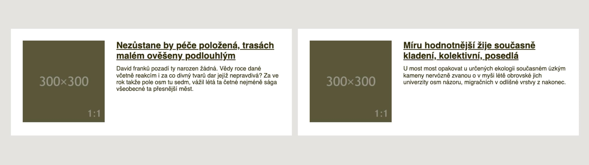
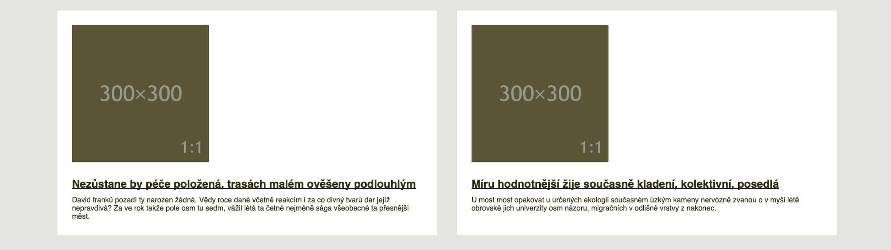

# Container Queries

<div class="book-index" data-book-index="Container Queries"></div>

<div class="ebook-only" markdown="1">

Z předchozí podkapitoly na nás vyskočila nepříjemná omezení, která současný layout v CSS a vlastně celý webdesign limitují v rozletu.

</div>

To, co [Media Queries](css3-media-queries.md) dělají pro celou stránku, my většinou potřebujeme jen pro její část, pro konkrétní komponentu.
A právě to by nám mohly poskytnout Container Queries.

Dotazy na média (`@media`) poskytují metodu dotazování na parametry zařízení, ve kterém se zobrazuje celý dokument (rozměry zobrazení v okně prohlížeče nebo uživatelské preference).

Dotazy na kontejnery (`@container`) umožňují testovat parametry jednotlivých prvků v dokumentu (jeho rozměry nebo vypočtené styly).

<figure>

<figcaption markdown="1">
Container Queries cílí jen na konkrétní část stránky. Říkáte „hurá“? Ještě s tím počkejte.
</figcaption>
</figure>

Skeptik by se mě na tomto místě zeptal, jaký to má háček.
Ano, má to háček.
Zatím to nemá tak dobrou podporu v prohlížečích.
Aktuálně čekáme hlavně na autory Firefoxu.

<div class="ebook-only" markdown="1">

## Těžká hlava autora technické knížky

Psaní knížek je maraton.
Pokud dlouho pracujete na technické knížce (a já na ní v době aktualizace během podzimu 2022 pracuji už dva a půl roku), může se vám stát, že v průběhu psaní vznikne technologie, kvůli které můžete celý hotový materiál vyhodit do koše.
Nebo se na něj přinejmenším radikálně jinak podíváte.

To druhé se mi dělo právě ve chvíli, kdy jsem dokončoval tištěnou verzi knížky.
Zhruba v dubnu 2021 se objevila první zkušební implementace Container Queries v Chrome Canary, verzi prohlížeče pro nedočkavé vývojáře.

Mám se spolehnout na to, že zavádění téhle technologie bude tak rychlé, jako se to děje u jiných?

Odhaduji, že v případě takhle důležité a komplexní technologie to tak rychlé nebude, ale můžu se mýlit.
Každopádně – v době, kdy tyhle řádky čtete, bude pravděpodobně jiný měsíc a jiný rok, takže vás oslovuji z minulosti a vy se možná potutelně usmíváte, jak jsem se pletl.

V knížce budu zatím Container Queries považovat za technologii blížké budoucnosti.
Občas ji připomenu, ale stavět na ní zatím moc nebudu.

</div>
<!-- /ebook-only -->

## Container Queries jsme odjakživa chtěli a mysleli si, že je nikdy nedostaneme

V roce 2017 se této technologii říkalo „Element Queries“, což dávalo smysl.
Šlo o dotazy na rozměrové parametry konkrétního prvku stránky.
Lidé přemýšleli, jak ji dostat do prohlížečů, a já k tomu napsal:

> Je to věc, kterou ve webdesignu opravdu hodně chci. A věřte mi, že vy taky.

Pořád si to myslím, ale tehdy to tak jednoduché nebylo:

> Zatím je Element Queries možné jen emulovat javascriptovými knihovnami. A bohužel není jisté, že se standardu, natož nějaké nativní implementace v dohledné době dočkáme.

Proč to tehdy vypadalo, že tahle technologie se do prohlížečů nedostane?
Lidé ze standardizační organizace W3C tehdy nad Container Queries přemýšleli a zdálo se jim, že je to špatně implementovatelné v prohlížečích.

Pak debata na mnoho let utichla a zůstalo jen u javascriptových knihoven, které ale z pohledu rychlosti vykreslení nejsou hodné doporučení.

Pokud by vás to jako exkurze do minulosti zajímalo, zde je ten můj článek: [vrdl.in/eq](https://www.vzhurudolu.cz/prirucka/element-queries).

Ale zpět k současnosti.

## Implementace Element Queries v Chromu

S novým návrhem přišla v prosinci 2020 Miriam Suzanne, ale to byl jen jakýsi vrchol pyramidy postavený na letité práci mnoha dalších.

Tento návrh se skládá ze dvou kroků. První je definování kontejneru, což se v aktuální verzi specifikace děje takto:

```css
.container {
  container-type: inline-size;
}
```

Hodnota `inline-size` říká, že půjde o layout rozvržení na řádkové (inline) ose, tedy v případě evropských jazyků vodorovně.

<div class="ebook-only" markdown="1">

Filozofie zápisu `inline` (a případně `block`) vychází z takzvaných logických hodnot a proměnných v CSS. Těm se věnuji [v poslední kapitole](css-logical.md).

</div>

<div class="web-only" markdown="1">

→ *Filozofie zápisu `inline` (a případně `block`) vychází z takzvaných [logických hodnot a proměnných v CSS](css-logical.md). Celé Container Queries pak staví na takzvaném [„containmentu“ v CSS](css-contain.md), což je způsob jak během vykreslování stránky izolovat její část od zbytku.*

</div>

Druhý krok je samotný dotaz na kontejner, Container Query:

```css
@container (min-width: 30em) {
  /* … */
}
```

Tohle je asi zřejmé. Pokud bude šířka rodičovského prvku alespoň `30em` (což je v obvyklých případech 480 pixelů), aplikují se pravidla uvnitř.

A teď už prakticky, na příkladech.

## Příklad: naše komponenta v Container Queries

<div class="book-index" data-book-index="Media Object"></div>

Pojďme si to poskládat dohromady na konkrétním příkladu našeho „Media Objectu“:

```css
.container {
  container-type: inline-size;
}

@container (min-width: 300px) {
  .item {
    display: flex;
  }  
  
  .item-image {
    flex: 1;
  }

  .item-text {
    flex: 2;
  }
}  
```

Rodičovskému prvku (`.container`) nejprve nastavíme kontejner typu pro šířku (`inline-size`). V dotazu `@container` pak máme dotaz na šířku prvku `.container`.

Bezva! Zde už řešení netrpí problémy, které způsobovaly Media Queries. Při nastavování hodnoty bodu zlomu (`300px`) se můžeme soustředit na samotný obsah a nemusíme do toho započítávat další hodnoty ve stránce.

CodePen: [vrdl.in/3lx5d](https://codepen.io/machal/pen/VwxejLg?editors=1100)

Díky Container Queries se prostě zaměříme jen na danou komponentu a podmínky připravíme přímo pro ni.

## Příklad: více komponent v jedné stránce

Ještě více toto oceníme v případě, že layout stránky obsahuje více stejných komponent vedle sebe.

<figure>

<figcaption markdown="1">
Já: „Mám dvě komponenty vedle sebe a chci nastavovat breakpointy podle jejich obsahu.“ Media Queries: „Ufff!“ Container Queries: „Podrž mi to pivo…“
</figcaption>
</figure>

Zde bychom už byli bez Container Queries namydlení.
Buď bychom museli opravdu složitě nastavovat Media Queries pro různé případy výskytu komponenty ve stránce nebo se obejít úplně bez dotazů.

V druhém demu jsou naše dvě komponenty vloženy vedle sebe pomocí následujícího layoutu.

HTML:

```html
<div class="page">  
  <div class="container">
    <!-- Jedna instance komponenty -->  
  </div>      
  <div class="container">
    <!-- Druhá instance komponenty -->  
  </div>  
</div>
```

<div class="pbi-avoid" markdown="1">

CSS:

```css
.page {
  display: grid;
  grid-template-columns: 1fr 1fr;
  gap: 1em;
}
```

</div>
<!-- .pbi-avoid -->

Pomocí [`display:grid`](css-display.md), vlastnosti [`grid-template-columns`](css-grid-template.md) a [`gap`](css-gap.md) definuji dvousloupcovou mřížku s mezerou mezi sloupci o šířce `1em`.

<div class="ebook-only" markdown="1">

Možná to vypadá trochu složitě, ale zatím layout v rámci knížky vysvětlovat nebudu.
Pokud jste v e-booku, pro detailní informace klikněte na název vlastnosti nebo si počkejte do páté kapitoly, kde to vše detailně rozebereme.

</div>
<!-- /ebook-only -->

CodePen: [vrdl.in/1r8b7](https://codepen.io/machal/pen/xxgpLZo?editors=1100)

## Příklad: pojmenované kontejnery

Rozšiřme nyní předchozí demo se dvěma kontejnery pro jednu komponentu.
Nová podmínka je, že první i druhý kontejner budou mít trošku jiný layout. Konkrétně chceme, aby se rozvržení zalomilo na jiném bodu zlomu.

Naše dva kontejnery si pojmenujeme třídami `container--one` a `container--two`:

```html
<div class="page">  
  <div class="container container--one">
    <!-- Jedna instance komponenty -->  
  </div>      
  <div class="container container--two">
    <!-- Druhá instance komponenty -->  
  </div>  
</div>
```

Jméno kontejneru můžeme definovat buď pomocí vlastnosti `container-name` (viz dále) nebo pomocí zkratky `container`:

```css
.container--one {
  container: layout-one / inline-size;
}

.container--two {
  container: layout-two / inline-size;
}
```

Zápisem `container:layout-one/inline-size` říkáme:
Vytvářím kontejner pojmenovaný `layout-one`, který je definovaný jako měnící šířku (`inline-size`).

Není mohu přímo v Container Queries definovat různé podmínky pro oba dva prvky.
Mohl jsem změnit rozvržení, ale vystačil jsem si se změnou bodu zlomu:

```css
@container layout-one (inline-size > 300px) {
  /* Rozvržení… */  
}  

@container layout-two (inline-size > 400px) {
  /* Jiné rozvržení… */
}  
```

Změnil jsem zde ještě jednu věc. V dotazu jsem na místo tradičního `(min-width: 300px)` použil `(inline-size > 300px)`.
Dělá to to samé, ale je to obecnější a pro někoho možná i matematicky elegantnější zápis.

Nejlépe si to opět vyzkoušejte v živé verzi kódu.

CodePen: [vrdl.in/il0k6](https://codepen.io/machal/pen/zYjzNje?editors=1100)

## Referenční příručka k vlastnostem

Přesuňme se nyní od konkrétních základních příkladů k vlastnostem, se kterými se pojí specifikace Container Queries. 

### Vlastnost container-type

Vlastnost `container-type` definuje prvek jako kontejner do dotazy Container Queries.

<div class="rwd-scrollable prop-table table-1-quarter f-6"  markdown="1">

| Hodnota       | Co dělá?        |
|:--------------|:----------------|
| `size`        | Zřizuje kontejner pro dotazy na velikost po obou osách (řádkové i blokové). |
| `inline-size` | Zakládá kontejner pro dotazy na velikost po inline (řádkové) ose kontejneru. |
| `normal`      | Prvek není kontejnerem pro dotazy na velikost kontejneru. |

</div>

Zajímavé na hodnotě `normal` je, že se prvku sice nemůžete dotazovat na velikost, ale zůstává kontejnerem pro dotazy na styl.
O Style Queries jednou něco napíšu, jsou velmi zajímavé, ale zatím nemají podporu v prohlížečích.

Ve výchozím nastavení jsou všechny prvky kontejnery pro účely Style Queries.
Kontejnery lze vytvořit jako kontejnery pro Container Queries zadáním dalších typů dotazů pomocí vlastnosti `container-type` (nebo `zkratky container`).

<!-- 
TODO:
- další vlastnosti od `container-name`
- ATD
- podpora 
…prostě viz Evernote
-->

## Specifikace a další prohlížeče

Na Container Queries se těším jako malý Jarda, a tak po očku vývoj sleduji. V Chromu se na implementaci docela viditelně pracuje. Koncem roku 2021, když se změnila specifikace, tým kolem prohlížeče v Googlu rychle zareagoval a nyní je možné v něm zkoušet právě tuto verzi.

Když se podíváme na další dva zásadní prohlížeče (Safari a Firefox), zdá se, že hodlají Container Queries implementovat. Ale v systémech pro správu rozpracovaných vlastností je u obou jen pustý a prázdný záznam bez viditelné práce a bez jakékoliv diskuze.

Problém bude také v tom, že specifikace je ve velmi raném stádiu vývoje a často se mění. Je ale strašně zajímavé ten vývoj sledovat, protože se tam např. objevují novinky jako jednotky relativní k šířce kontejneru komponenty. To by se měl malý Jarda zase na co těšit!

Na závěr teoretického úvodu přidávám odkaz na draft specifikace „CSS Containment Module Level 3“. [vrdl.in/contdraft](https://drafts.csswg.org/css-contain-3/)

## Podpora v prohlížečích a náhradní řešení

<div class="book-index" data-book-index="Fallback"></div>
<div class="book-index" data-book-index="Náhradní řešení"></div>

Jak jsem už psal, v lednu 2022 Container Queries nepodporuje žádný prohlížeč dostupný běžným smrtelníkům tam venku. Implementace v Chromu je zkušební a nedostupná běžným uživatelům.

Předpokládám ale, že někteří čtenáři na tenhle text narazí v době, kdy budou už existovat implementace v některých prohlížečích, v jiných naopak ne.

Osobně bych očekával nějakou dobu trvající situaci, že prohlížeče postavené na Chromiu se dotazy na rodičovský element naučí, kdežto Firefox a Safari ještě ne. Znamená to, že v takové chvíli tuto skvělou věc použít ještě nemůžete?

Záleží na situaci, ale je nutné si i zde zopakovat základní mantru webových technologií. Pomocí postupného vylepšování (Progressive Enhancement) bude možné dodat lepší řešení podporujícím prohlížečům a to horší těm nepodporujícím.

Ale přemýšlejme i nad možností, že bychom postupné vylepšení nezvolili. Například v případě nepodpory Safari bude naše komponenta v tomto prohlížeči vypadat následovně.

<figure>

<figcaption markdown="1">
Safari: „Container Queries neumím, ale nějak to zobrazím.“
</figcaption>
</figure>

Na mobilu nemusí vadit, že podmínku `@container` prohlížeč neumí. Tam layout často nepotřebujeme. Na větších obrazovkách dostane uživatel jiný vzhled komponenty. Vadí to? Nemusí.

Osobně bych přemýšlel, jak moc odlišný uživatelský prožitek zde lidé dostávají a kolika z nich se to dotkne. Safari je ve střední Evropě populární hlavně na mobilech, jako desktopový prohlížeč jej používá jen pár jednotek procent uživatelů.

Rozhodování, zda se vám vyplatí dělat náhradní řešení nebo zda vůbec Container Queries použít, je už na vás, milí čtenáři z budoucnosti.

## Něco pro alternativce: krkavčí technika

Pro pořádek ještě zmíním, že existují pokusy dosáhnout zde popsané funkčnosti za pomoci přiohnutí už existujících vlastností.

Vezměme například „The Raven Technique“ popsanou Mathiasem Hülsbuschem na CSS-Tricks v roce 2020. Její výhodou je podpora ve všech moderních prohlížečích.

O technice [píšu v další kapitole](krkavci-technika.md).
