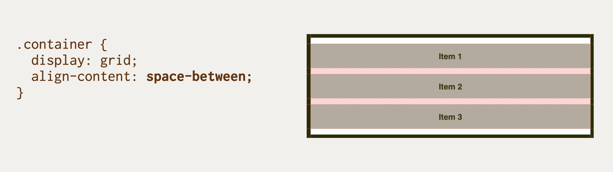
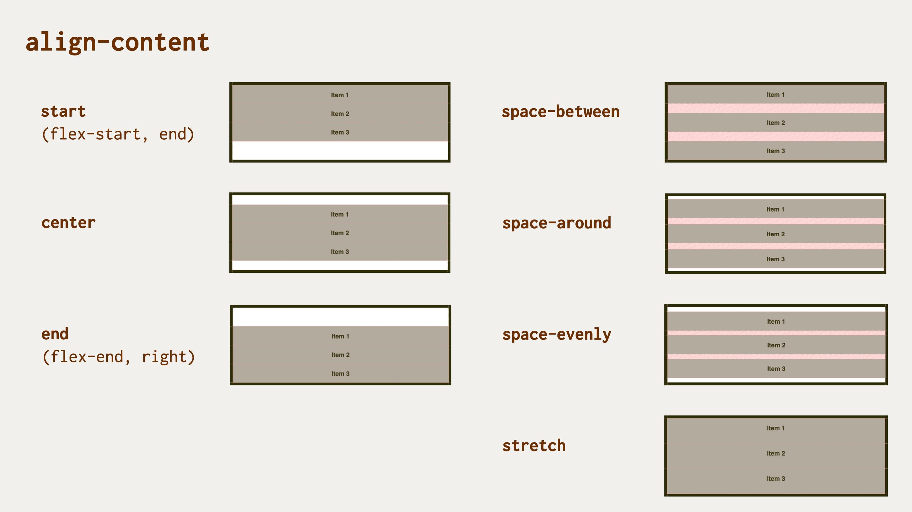

# Vlastnost align-content: Rozdělení prostoru mezi položkami na příčné ose

Vlastnost `align-content` definuje, jak prohlížeč distribuuje prostor mezi položkami obsahu podél příčné (nebo blokové) osy kontejneru layoutu.

<div class="book-index" data-book-index="align-content"></div>

<div class="connected" markdown="1">


<div class="web-only" markdown="1">

Vlastnost `align-content` patří do specifikace pro zarovnání boxů – [CSS Box Alignment](css-box-alignment.md).

Počítá se však s použitím pro [flexbox](css-flexbox.md), [grid](css-grid.md), ale také [vícesloupcový layout](css-multicolumn.md).

</div>

<div class="ebook-only" markdown="1">

→ [vrdl.in/cssac](https://www.vzhurudolu.cz/prirucka/css-align-content)

</div>

</div>

Ve specifikaci se počítá s použitím pro flexbox, grid, vícesloupcový layout, ale taky pro blokové prvky, kde to ale zatím použít nejde.

Tato vlastnost zarovnává ve svislém směru, a tak nemá pochopitelně vliv na jednořádkové flexboxové kontejnery (tj. kontejnery s `flex-wrap:nowrap`).

## Jednoduchý příklad {#priklad}

V naší ukázce definujeme třířádkový kontejner gridu:

```html
<div class="container">
  <div class="item item--1">
    Item 1
  </div>
  <div class="item item--2">
    Item 2
  </div>
  <div class="item item--3">
    Item 3
  </div>  
</div>
```

```css
.container {
  display: grid;
  grid-template-rows: repeat(3, 3em);
  height: 12em;
  align-content: space-between;
}
```

<figure>

<figcaption markdown="1">
Pomocí zápisu align-content:space-between se volný prostor hezky distribuuje na výšku mezi jednotlivé položky.
</figcaption>
</figure>

CodePen: [vrdl.in/2bhd9](https://codepen.io/machal/pen/ZEWKPvr?editors=1100)

Můžete si vyzkoušet ještě jedno demo. Je totožné, jen tentokrát pro flexbox a má jinou hodnotu `align-content`.

CSS:

```css
.container {
  border: 5px solid black;
  display: flex;
  flex-wrap: wrap;
  height: 12em;
  align-content: space-around;
}
```

<figure>

<figcaption markdown="1">
Zápis align-content:space-around rozdělí volný prostor na polovinu a přidá ji před a za buňku.
</figcaption>
</figure>

CodePen: [vrdl.in/ngjor](https://codepen.io/machal/pen/zYqwbpL?editors=1100)

Víte co? Raději se podívejte na všechny možné hodnoty, i tuhle mezi nimi najdete.

## Možné hodnoty {#hodnoty}

<figure>

<figcaption markdown="1">
Hodnoty vlastnosti align-content.
</figcaption>
</figure>

Vlastnosti `align-content` můžete předávat všechny hodnoty z jednotlivých obecných kategorií klíčových slov:

### Základní

- `normal` (výchozí)  
  V CSS gridu odpovídá hodnotě `start`, ve flexboxu je to zase `stretch`.

### Zbylý prostor

- `space-between`  
  Volné místo se rovnoměrně rozdělí mezi položky, přičemž první a poslední je zarovnaná s hranou kontejneru.
- `space-around`  
  Volné místo se rovnoměrně rozdělí mezi položky a polovina mezery mezi položkami se vloží mezi hrany kontejneru a první a poslední položku.
- `space-evenly`  
  Volné místo se rovnoměrně rozdělí mezi položky i mezi první a poslední položku a okraje kontejneru. Tato vlastnost není v kombinaci s flexboxem podporována v MSIE 11.
- `stretch`  
  Položky rozšíří své rozměry tak, aby v kontejneru nezbylo žádné volné místo. Pokud jsou položky menší než kontejner, jejich velikost se zvětší rovnoměrně (nikoliv proporcionálně), přičemž stále respektují omezení uložená vlastnostmi jako `max-width`/`max-height`. Tato vlastnost není v kombinaci s flexboxem podporována v MSIE 11.  

### Poziční

- `center`  
  Položky se centrují doprostřed kontejneru.
- `start`  
  Položky se zarovnají k hraně začátku kontejneru, nefunguje ve flexboxu.
- `end`  
  Položky se zarovnají k hraně konce kontejneru, nefunguje ve flexboxu.
- `flex-start`  
  Chová se jako `start`, použitelné jen ve flexboxu.
- `flex-end`  
  Chová se jako `end`, použitelné jen ve flexboxu.

### Podle účaří

- `first baseline`  
  Zarovnání na účaří prvního řádku. Pokud hodnotu v daném kontextu nelze použít, zarovná se jako `start`.
- `last baseline`  
  Zarovnání na účaří posledního řádku. Pokud hodnotu v daném kontextu nelze použít, zarovná se jako `end`.
- `baseline`  
  Zkratka pro `first baseline`.

Tyto hodnoty zatím nemají u popisované vlastnosti dobrou podporu v prohlížečích při použití ve flexboxu. V MSIE není podporována vůbec.

### Zarovnání pro přetečení

- `safe`  
  Pokud má položka v daném způsobu zarovnání přetéct z obou stran, bude zarovnání změněno tak, aby byl vidět začátek položky, například tak, aby bylo možné přečíst začátek textu.
- `unsafe`  
  Vždy dostane přednost poziční zarovnání, bez ohledu na to, zda bude oříznutý obsah čitelný nebo ne.  

Toto v době psaní podporuje jen Firefox.

## Podpora v prohlížečích {#podpora}

V layoutech postavených na gridu je vlastnost u základních hodnot plně podporována, s výjimkou MSIE 11. Použitím nástroje [Autoprefixer](autoprefixer.md) je ale možné to dohnat.

Ve flexboxových rozvrženích funguje `justify-content` dobře i v Internet Exploreru.

Více na CanIUse.com. [caniuse.com/align-content](https://caniuse.com/#search=align-content).

<!-- AdSnippet -->
