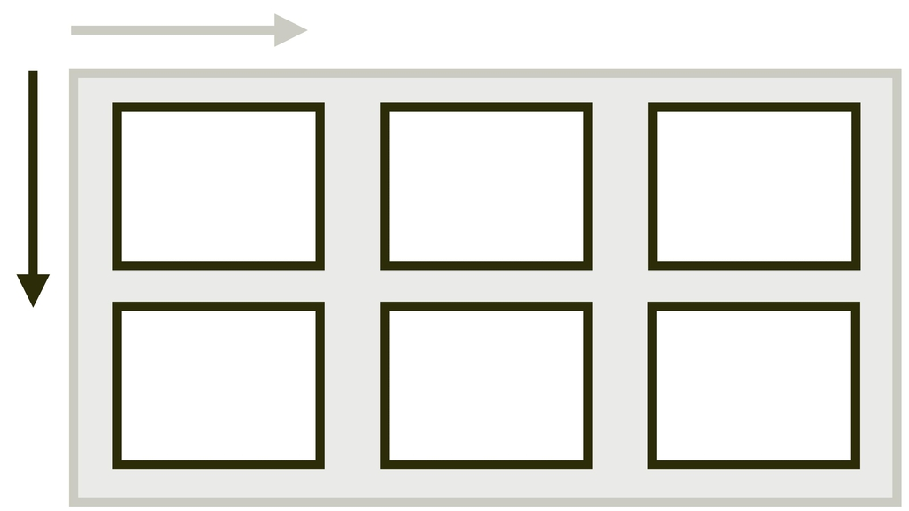
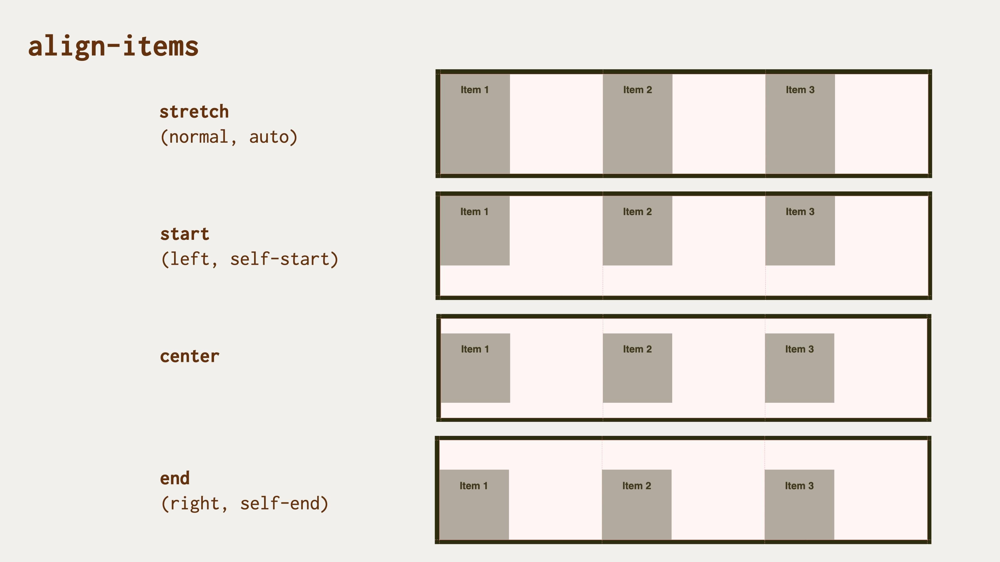

# Vlastnost align-items: Zarovnání všech položek na příčné ose

Vlastnost `align-items` definuje na kontejneru layoutu zarovnání položek na příčné ose (jinak též blokové ose).

<div class="book-index" data-book-index="align-items"></div>

<div class="connected" markdown="1">



<div class="web-only" markdown="1">

Vlastnost `align-items` patří do specifikace pro zarovnání boxů – [CSS Box Alignment](css-box-alignment.md).

Vlastnost je možné použít v layoutech tvořených [flexboxem](css-flexbox.md) a také [gridem](css-grid.md).

Můžete také použít zkratku [`place-items`](css-place-items.md).

</div>

<div class="ebook-only" markdown="1">

→ [vrdl.in/cssai](https://www.vzhurudolu.cz/prirucka/css-align-items)

</div>

</div>

Nastavuje výchozí hodnotu `align-self` pro každou položku uvnitř kontejneru.

Tuhle vlastnost není možné aplikovat na blokové elementy nebo na buňky tabulek, ale v gridu a flexboxu ji rozhodně využijete.

## Jednoduchý příklad

V naší ukázce definujeme třísloupcový kontejner gridu:

```css
.container {
  display: grid;
  grid-template-columns: repeat(3, 1fr);
  height: 10em;  
  align-items: start;  
}
```

Všechny tři položky mají omezenou výšku i šířku, aby byl hezky vidět efekt zarovnání, který způsobuje vlastnost `align-items`.

Použitá hodnota `start` umístí položky na začátek vymezeného prostoru.

CodePen: [vrdl.in/fm9sl](https://codepen.io/machal/pen/qBZRWog?editors=1100)

## Možné hodnoty

<figure>

<figcaption markdown="1">
Hodnoty vlastnosti align-items.
</figcaption>
</figure>

Vlastnosti `align-items` můžete předávat všechny hodnoty z jednotlivých obecných kategorií klíčových slov:

### Základní

- `normal` (výchozí)  
  Ve většině systémů layoutu, včetně gridu nebo flexboxu, půjde jen o jiný zápis pro hodnotu `stretch`, kterou popisujeme níže.
- `stretch`  
  Položky rozšíří své rozměry tak, aby v kontejneru nezbylo žádné volné místo. Pokud jsou položky menší než kontejner, jejich velikost se zvětší rovnoměrně (nikoliv proporcionálně), přičemž stále respektují omezení uložená vlastnostmi jako `max-width`/`max-height`.

### Poziční

- `center`  
  Centruje všechny položky doprostřed kontejneru zarovnání.
- `start`  
  Zarovnává všechny položky k hraně začátku kontejneru.
- `end`  
  Zarovnává všechny položky k hraně konce kontejneru.
- `flex-start`  
  Hodnota se chová jako `start`.
- `flex-end`  
  Hodnota se chová jako `end`.

### Podle účaří

- `first baseline`  
  Zarovnání na účaří prvního řádku. Pokud hodnotu v daném kontextu nelze použít, zarovná se jako `start`.
- `last baseline`  
  Zarovnání na účaří posledního řádku. Pokud hodnotu v daném kontextu nelze použít, zarovná se jako `end`.
- `baseline`  
  Zkratka pro `first baseline`.

### Pro přetečení

- `safe`  
  Pokud má položka v daném způsobu zarovnání přetéct z obou stran, bude zarovnání změněno takovým způsobem, aby byl vidět začátek položky, například tak, aby bylo možné přečíst začátek textu.
- `unsafe`  
  Vždy dostane přednost poziční zarovnání, bez ohledu na to, zda bude oříznutý obsah čitelný nebo ne.  

Toto v době psaní podporuje jen Firefox.

<!-- AdSnippet -->

## Podpora v prohlížečích

Stav k únoru 2022:

V rámci flexboxového layoutu nefungují ve většině prohlížečů s výjimkou Firefoxu hodnoty `left`, `right`, `safe`, `unsafe`, `start` a `end`.

V IE11 navíc nefungují ani dvouslovná pojmenování pro zarovnání na účaří: `first baseline` nebo `last baseline`.

V rámci rozvržení pomocí gridu tuto vlastnost nepodporuje jen MSIE 11, ale tam by měl její podporu nahrazovat [Autoprefixer](autoprefixer.md). Jinak je to v gridu zcela v pořádku.

I zde platí, že jde o drobnosti. Celkově vzato je možné tuhle vlastnost a její nejužitečnější hodnoty v moderních prohlížečích používat bez problémů.

Pro více informací se podívejte na [caniuse.com/align-items](https://caniuse.com/#search=align-items).

<!-- AdSnippet -->
