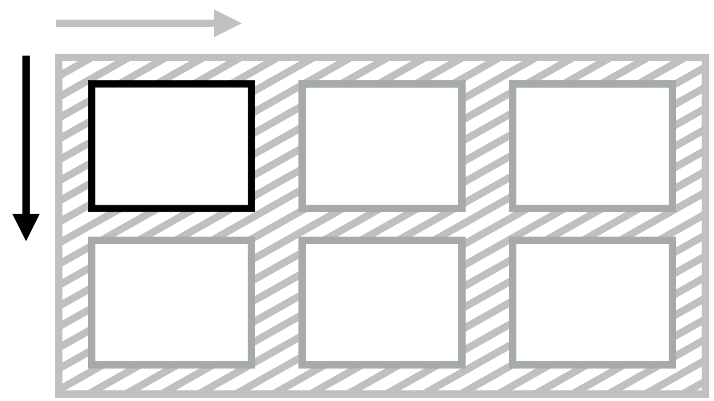
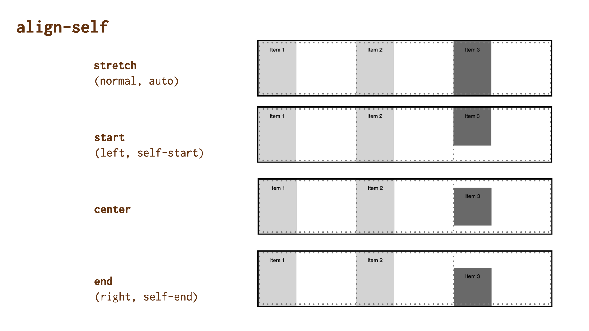

# Vlastnost align-self: Zarovnání položky na příčné ose

Vlastnost `align-self` určuje zarovnání položky na příčné ose (jinak též blokové ose).

V Grid layoutu se položka zarovnává uvnitř své oblasti, což je obvykle buňka mřížky. Ve rozvržení tvořeném flexboxem jde o zarovnání položky na v celém prostoru příčné osy.

Hodnota `auto` u vlastnosti `margin` má ostatně před `align-self` přednost ve všech systémech rozvržení v CSS.

<!-- AdSnippet -->

Vlastnost `align-self` je určená pro flexbox, grid, absolutně pozicované prvky, ale ne pro buňky tabulky nebo blokový layout.

- [CSS Box Alignment](css-box-alignment.md)

## Jednoduché příklady

V první ukázce definujeme třísloupcový kontejner Gridu.

CodePen: [cdpn.io/e/zYqwKer?editors=1100](https://codepen.io/machal/pen/zYqwKer?editors=1100)

Vysvětleme:

- Rodičovský prvek `.container` má nastavenou výšku (`height:10em`), abychom viděli efekt zarovnání na blokové ose.
- První dvě položky nemají vlastnost `align-self` nastavenou, takže získají výchozí hodnotu `stretch` a roztáhnou se do celé šířky prostoru buňky.
- Poslední položka má nastaveno `align-self:center`, takže by se měla „scvrknout“ na přirozenou výšku podle obsahu a zarovnat doprostřed prostoru buňky, což je zároveň pravá hrana kontejneru.
- Vyhrává ovšem deklarace `margin-bottom:auto`, která buňku zarovná na začátek prostoru buňky a funguje tedy stejně jako `align-self:start`.

V druhé ukázce si pohrajeme s flexboxem:

CodePen: [cdpn.io/e/zYqwKer?editors=1100](https://codepen.io/machal/pen/zYqwKer?editors=1100)

- Rodičovský kontejner má deklarováno `display:flex` položky `flex:1`, takže se roztáhnou do celé šířky.
- Na výšku jsou položky ovlivněné výchozí hodnotou `align-self:stretch`
- Třetí položka `.item--3` je pak díky `align-self:flex-end` zarovnaná ke spodní hraně kontejneru. Jsme ve flexboxu, takže hodnoty jako `end` by zde nezabraly.

## Možné hodnoty zarovnání

Také vlastnosti `align-self` můžete předávat všechny hodnoty [z jednotlivých obecných kategorií klíčových slov](css-box-alignment.md#typy-klicova-slova):

### Základní

- `auto` (výchozí)  
  Podědí se hodnota `align-items` od rodičovského elementu. Pokud zde žádný není, dostane prvek hodnotu `normal`.
- `normal`  
  V CSS Gridu, flexboxu ale i ve většině systémů pro layout bude nastavený jako hodnota `stretch`.
- `stretch`  
  Položka rozšíří své rozměry tak, aby v kontejneru nezbylo žádné volné místo. Pokud jsou položky menší než kontejner, jejich velikost se zvětší rovnoměrně (nikoli proporcionálně), přičemž stále respektují omezení uložená vlastnostmi jako `max-width`/`max-height`.

### Poziční

- `center`  
  Položka se centruje doprostřed jí určeného prostoru.
- `start`  
  Položka se zarovnává k hraně začátku jí určeného prostoru.
- `end`  
  Položka se zarovnává k hraně konce jí určeného prostoru.
- `self-start`  
  Hodnota chová jako `start`.
- `self-end`  
  Hodnota chová jako `end`.
- `left`  
  Chová se jako `start`.
- `right`  
  Chová se jako `end`.
- `flex-start`  
  Zarovná se k horní hraně flexbox kontejneru. Je použitelná jen ve flexboxu.
- `flex-end`  
  Zarovná se ke spodní hraně flexbox kontejneru. Je použitelná jen ve flexboxu.  

### Podle účaří

- `first baseline`  
  Zarovnání na účaří prvního řádku. Pokud v daném kontextu nelze použít, zarovná se jako `start`.
- `last baseline`  
  Zarovnání na účaří posledního řádku. Pokud v daném kontextu nelze použít, zarovná se jako `end`.
- `baseline`  
  Zkratka pro `first baseline`.

### Pro přetečení

- `safe`  
  Pokud má položka v daném způsobu zarovnání přetéct z obou stran, bude zarovnání změněno tak, aby byl vidět začátek položky, takže aby například bylo možné přečíst začátek textu.
- `unsafe`  
  Vždy dostane přednost poziční zarovnání, bez ohledu na to, zda bude oříznutý obsah čitelný nebo ne.  

Pokud vím, v žádném prohlížeči toto zatím nefunguje.

## Podpora v prohlížečích

Vlastnost `align-self` má prakticky plnou podporu jak pro flexbox, tak pro Grid layout. V Internet Exploreru 11 je ovšem nutné použít prefix `-ms-align-self`, což ale doplní Autoprefixer.

Více na [caniuse.com/align-self](https://caniuse.com/#search=align-self).

<!-- AdSnippet -->
