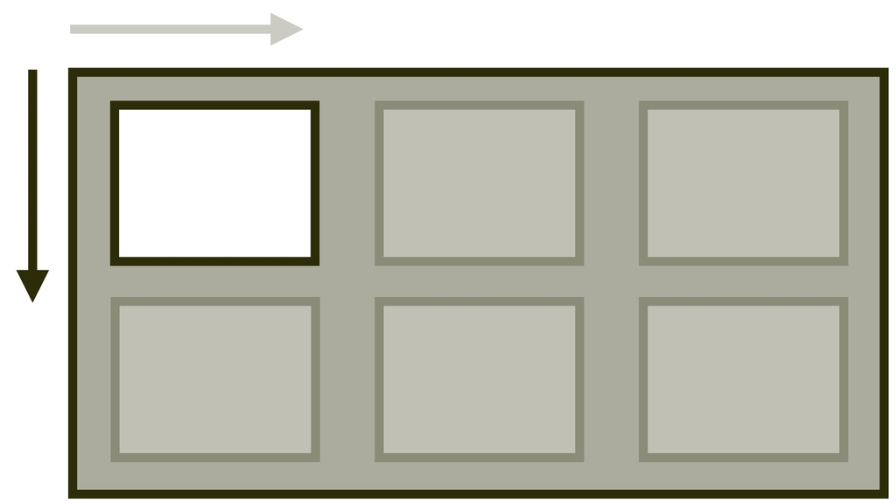

# Vlastnost align-self: Zarovnání položky na příčné ose

Vlastnost `align-self` nastavuje zarovnání položky na příčné (jinak též blokové) ose layoutu.

<div class="book-index" data-book-index="align-self"></div>

<div class="connected" markdown="1">



<div class="web-only" markdown="1">

Vlastnost `align-self` patří do specifikace pro zarovnání boxů – [CSS Box Alignment](css-box-alignment.md).

Můžete ji využít v layoutech tvořených [gridem](css-grid.md) nebo [flexboxem](css-flexbox.md).

</div>

<div class="ebook-only" markdown="1">

→ [vrdl.in/cssas](https://www.vzhurudolu.cz/prirucka/css-align-self)

</div>

</div>

V layoutu tvořeném gridem se položka zarovnává uvnitř své oblasti, což je obvykle buňka mřížky. V rozvržení flexboxem jde o zarovnání položky v celém prostoru příčné osy.

Vlastnost `align-self` je specifikací předurčená pro flexbox, grid, absolutně pozicované prvky, ale ne pro buňky tabulky nebo blokový layout tvořený například pomocí „floatů“.

<!-- AdSnippet -->

## Příklad: margin má přednost před align-self

V první ukázce definujeme třísloupcový kontejner gridu a poslední položku se snažíme zarovnat jinak než její první dvě kolegyně.

HTML už znáte:

```html
<div class="container">
  <div class="item item--1">
    Item 1
  </div>
  <div class="item item--2">
    Item 2
  </div>
  <div class="item item--3">
    Item 3
  </div>  
</div>
```

CSS pro deklaraci gridu a té naší specificky zarovnané poslední položky:

```css
.container {
  display: grid;
  grid-template-columns: repeat(3, 1fr);
  height: 10em;
}

.item--3 {
  margin-top: auto;
  align-self: start;
}
```

Stejně jako [u `justify-self`](css-justify-self.md) i tady zarovnáváme dvěma způsoby. Jednou dolů (`margin-top:auto`) a jednou nahoru (`align-self:start`). A opět platí – zarovnání pomocí vnějších okrajů zde má přednost navzdory kaskádě.

<figure>

<figcaption markdown="1">
Vlastnost margin má přednost před align-self.
</figcaption>
</figure>

Vysvětleme:

- Rodičovský prvek `.container` má nastavenou výšku (`height:10em`), abychom viděli efekt zarovnání na blokové ose.
- První dvě položky nemají vlastnost `align-self` nastavenou, takže získají výchozí hodnotu `stretch` a roztáhnou se do celé výšky prostoru buňky.
- Poslední položka má nastaveno `align-self:start`, takže by se měla „scvrknout“ na přirozenou výšku podle obsahu a zarovnat k horní hraně prostoru buňky.
- Vyhrává ovšem deklarace `margin-top:auto`, která buňku zarovná na začátek prostoru buňky, a funguje tedy stejně jako `align-self:end`.

CodePen: [cdpn.io/e/zYqwKer](https://codepen.io/machal/pen/zYqwKer?editors=1100)

## Příklad: align-self ve flexboxu

V druhé ukázce si pohrajeme s flexboxem. HTML je stejné, CSS se mění:

```css
.container {
  display: flex;
  height: 10em;
}

.item {  
  flex: 1;
}

.item--3 {
  align-self: flex-end;
}
```

<figure>

<figcaption markdown="1">
Vlastnost align-self ve flexboxu.
</figcaption>
</figure>

Nyní přichází vysvětlení:

- Rodičovský kontejner má deklarováno `display:flex` a položky `flex:1`, takže se roztáhnou do celé šířky.
- Na výšku jsou položky ovlivněné výchozí hodnotou (`align-self:stretch`).
- Třetí položka `.item--3` je pak díky `align-self:flex-end` zarovnaná ke spodní hraně kontejneru. Jsme ve flexboxu, takže hodnoty jako `end` by zde nezabraly.

CodePen: [cdpn.io/e/eYZWdoN](https://codepen.io/machal/pen/eYZWdoN?editors=1100)

## Možné hodnoty

<figure>

<figcaption markdown="1">
Hodnoty vlastnosti align-self.
</figcaption>
</figure>

Také vlastnosti `align-self` můžete předávat všechny hodnoty z jednotlivých obecných kategorií klíčových slov specifikace CSS Box Alignment:

### Základní

- `auto` (výchozí)  
  Podědí se hodnota `align-items` od rodičovského elementu. Pokud zde žádný není, dostane prvek hodnotu `normal`.
- `normal`  
  V CSS gridu, flexboxu ale i ve většině systémů pro layout půjde jen o jiný zápis pro hodnotu `stretch`.
- `stretch`  
  Položka rozšíří své rozměry tak, aby v kontejneru nezbylo žádné volné místo. Pokud jsou položky menší než kontejner, jejich velikost se zvětší rovnoměrně (nikoliv proporcionálně), přičemž stále respektují omezení uložená vlastnostmi jako `max-width`/`max-height`.

Opět platí, že v zásadě je výchozí roztažení na výšku – takže hodnota `stretch`.

### Poziční

- `center`  
  Položka se centruje doprostřed jí určeného prostoru.
- `start`  
  Položka se zarovnává k hraně začátku jí určeného prostoru.
- `end`  
  Položka se zarovnává k hraně konce jí určeného prostoru.
- `self-start`  
  Hodnota se chová jako `start`.
- `self-end`  
  Hodnota se chová jako `end`.
- `left`  
  Chová se jako `start`.
- `right`  
  Chová se jako `end`.
- `flex-start`  
  Zarovná se k horní hraně flexbox kontejneru. Je použitelná jen ve flexboxu.
- `flex-end`  
  Zarovná se ke spodní hraně flexbox kontejneru. Je použitelná jen ve flexboxu.  

### Podle účaří

- `first baseline`  
  Zarovnání na účaří prvního řádku. Pokud hodnotu v daném kontextu nelze použít, zarovná se jako `start`.
- `last baseline`  
  Zarovnání na účaří posledního řádku. Pokud hodnotu v daném kontextu nelze použít, zarovná se jako `end`.
- `baseline`  
  Zkratka pro `first baseline`.

### Pro přetečení

- `safe`  
  Pokud má položka v daném způsobu zarovnání přetéct z obou stran, bude zarovnání změněno tak, aby byl vidět začátek položky, například tak, aby bylo možné přečíst začátek textu.
- `unsafe`  
  Vždy dostane přednost poziční zarovnání, bez ohledu na to, zda bude oříznutý obsah čitelný nebo ne.  

Toto v době psaní podporuje jen Firefox.

## Podpora v prohlížečích

Vlastnost `align-self` má prakticky plnou podporu jak pro flexbox, tak pro layout do mřížky. V [Internet Exploreru 11](msie.md) je ovšem nutné použít vlastnost `-ms-grid-row-align`, což ale do `align-self` přeloží [Autoprefixer](autoprefixer.md). Více na CanIUse. [caniuse.com/align-self](https://caniuse.com/#search=align-self)

<!-- AdSnippet -->
