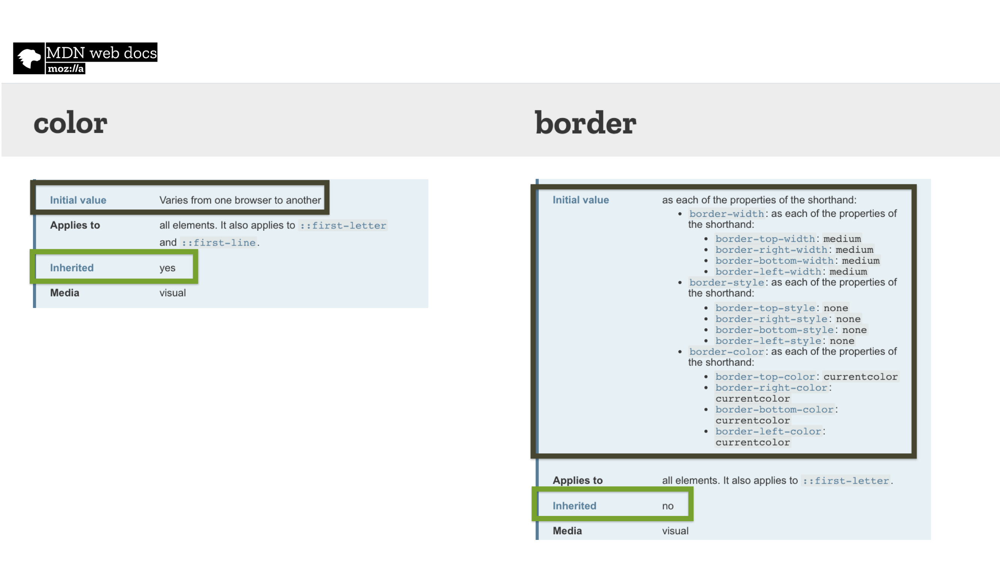

# Zděděná a výchozí hodnota v CSS, vlastnost all a klíčová slova inherit, initial, unset, revert

Pojďme zjistit, jak vracet nastavení vlastnosti k výchozí nebo poděděné hodnotě.

V předchozím textu jsme se zabývali [dědičností v CSS](css-dedicnost.md). Zjistili jsme, že se týká většinou vlastností textu, rámečků a seznamů, že je užitečná, ale že nad ní vyhrává [kaskáda](css-kaskada.md).

<!-- AdSnippet -->

Tady a teď si k teorii o CSS přidáme výchozí hodnotu a projdeme si hodnoty `inherit`, `initial`, `unset`, `revert` a vlastnost `all`.

## Zděděná a výchozí hodnota {#zdedena-vychozi}

Téma výchozích hodnot je důležité. Každá CSS vlastnost nějakou má.

<figure>

<figcaption markdown="1">
*Obrázek: V dokumentaci na [developer.mozilla.org](https://developer.mozilla.org/) nebo ve specifikaci CSS lze najít, zda se hledaná CSS vlastnost dědí a jaká je její výchozí hodnota.*
</figcaption>
</figure>

Jak je tedy vidět z obrázku:

* Vlastnost `color` se dědí a její výchozí hodnota záleží na definici v prohlížeči. Obvykle je ale černá.
* Zkratka `border` se nedědí a její výchozí záleží na jejích jednotlivých  vlastnostech. Ve výsledku je výchozí hodnota `none`, tedy žádný rámeček.

Tyhle dvě vlastnosti se nám budou hodit, budeme totiž experimentovat s nastavením dědičnosti a výchozích hodnot.

Použijeme k tomu klíčová slova `inherit`, `initial`, `unset` a `revert`, které je možné nastavovat k jakékoliv vlastnosti. Slouží ke změně výchozího způsobu přebírání zděděné nebo výchozí hodnoty vlastnosti. Před tím ale musíme udělat menší odbočku.

## Vlastnost all {#all}

Jak název napovídá, vlastnost `all` slouží ke změně způsobu přebírání hodnot všech CSS vlastností, které se aplikují na daný prvek.

Jinak řečeno: Umožňuje resetovat dědičnost nebo přebírání výchozí hodnoty.

<p class="video">
Video: <a href="https://www.youtube.com/watch?v=FX_T9_1ZrAE">CSS: Vlastnost „all“</a> ~ Demo různých nastavení vlastnosti.
</p>

Pro pořádek je dobré uvést, že ani `all` neumí změnit výchozí nastavení u vlastností `direction`, `unicode-bidi` nebo autorských vlastností, alias [CSS proměnných](css-promenne.md).

Vlastnost `all` může nabývat jen hodnoty, které se týkají práce s dědičností nebo přebíráním výchozí hodnoty:

```css
.box {
  all: inherit | initial | unset | revert;
}
```

Pojďme na ukázku. Budeme v ní vlastnost `all` už jen plnit jednotlivými hodnotami, takže potřebujeme nějaký příklad. HTML je jednoduché:

```html
<p class="box">
  Box.
</p>
```

CSS taky:

```css
body {
  color: green;
  border: 1px solid green;
}

.box {
  color: red;
}
```

Výsledkem bude stránka orámovaná zeleným rámečkem a v ní odstavec s nápisem „Box“ vysázený červeným textem. Pokud bychom nespecifikovali barvu pro `.box`, podědil by od `body` barvu, ale už ne rámeček, protože vlastnost `border` se nedědí.

CodePen: [cdpn.io/e/BaaYKKW](https://codepen.io/machal/pen/BaaYKKW?editors=1100)

## Hodnota inherit: Vynucení dědičnosti {#inherit}

Klíčové slovo `inherit` zařídí vynucení dědičnosti i u vlastností, které běžně nedědí. Aplikujme si to na další odstavec:

```html
<p class="box box--inherit">
  <em>Inherited</em> box.
</p>
```

CSS:

```css
.box--inherit {
  all: inherit;
}
```

Výsledkem bude odstavec se zeleným textem a zeleným rámečkem. Podědila se tedy nejen hodnota vlastnosti `color`, ale i `border`, která by to normálně neudělala, protože v „genech“ dědičnost nemá. Podívejte se do CodePenu na konci článku.

<!-- AdSnippet -->

Hodnota `inherit` se obvykle jako hodnota v `all` nepoužívá. Užitečná ale může být v mnoha případech, kdy si přejeme, aby prvek dědil nějakou vlastnost od rodiče.

## Hodnota initial: Vynucení výchozího nastavení {#initial}

Klíčové slovo `initial` zařídí přebrání výchozí hodnoty dané vlastnosti.

HTML dalšího odstavce v příkladu bude podobné, zaměřme se tedy na CSS:

```css
.box--inherit {
  all: initial;
}
```

Výsledkem bude černý text bez rámečku, ale raději to pojďme rozebrat:

* Černý text, protože se výchozí nastavení [vlastnosti color](https://developer.mozilla.org/en-US/docs/Web/CSS/color) nechává na prohlížečích a ty nastavují černou.
* Rámeček zde nebude, protože vlastnost `border` se nedědí a výchozí hodnotu má `none`.
* Odstavec nebude mít žádný vnější, ani vnitřní okraj, protože vlastnosti <code>[margin](https://developer.mozilla.org/en-US/docs/Web/CSS/margin)</code> a <code>[padding](https://developer.mozilla.org/en-US/docs/Web/CSS/padding)</code> mají výchozí hodnotu vždy <code>0</code>.
* Odstavec se bude zobrazovat jako <code>inline</code> prvek, protože to je výchozí nastavení [vlastnosti `display`](css-display.md).

Ano, přesně tak, pomocí <code>initial</code> odstraníme všechny styly, ať už jsou definované námi nebo ve výchozím CSS prohlížeče. I tady platí, že v CodePenu, který je na konci textu, vše uvidíte lépe.

## Hodnota unset: Odstranění všech deklarací {#unset}

Při nastavení `unset` se vlastnost, která se dědí, nastaví na `inherit` a vlastnost, která se nedědí, na `initial`.

```css
.box--unset {
  all: unset;
}
```

Výsledkem bude zelený inline textový prvek bez rámečku a okrajů:

* Zelený text, protože vlastnost `color` se dědí a proto převezme barvu z prvku `body`. Hodnota `unset` ji nastaví na `inherit`.
* Rámeček (`border`), okraje (`margin`, `padding`), ani způsob zobrazování (`display`) se nedědí, proto se nepoužijí žádné naše ani prohlížečové styly. Hodnota `unset` tyto vlastnosti nastaví na `initial`.

Hodnota `unset` se tedy chová podobně jako `initial`, ale neodstraní dědičnost u vlastností, které ji mají nastavenou.

Zápis `all:unset` je díky tomu zajímavý pro resetování vzhledu nějaké komponenty během refaktoringu. V tomto kontextu doporučuji přednášku Harryho Robertse [Refactoring CSS Without Losing Your Mind](https://slideslive.com/38898201/refactoring-css-without-losing-your-mind) nebo školení [Organizace CSS kódu](https://www.vzhurudolu.cz/kurzy/css-kod) Adama Kudrny.

## Hodnota revert: Návrat k výchozím stylům prohlížeče {#revert}

Hodnota `revert` v mnoha případech funguje stejně jako `unset`, ale je trochu složitější, protože se liší od původu stylů.

Existují tři možné původy stylů:

* _Autorské CSS_  
Píšeme jej my vývojáři. Je to nejčastější a nejvyšší vrstva.
* _Uživatelské CSS_  
Každý uživatel může vložit do prohlížeče, obvykle za pomocí nějakého rozšíření. Není to ale moc časté.
* _Prohlížečové CSS_  
Každý prohlížeč má nějaké výchozí styly a ty se mohou od sebe drobně lišit.

Jak tedy funguje hodnota `revert`?

* Pro autorské styly _revertuje_ hodnotu na to, co je v uživatelském stylopisu. Pokud ten neexistuje, použije hodnotu prohlížečového CSS.
* Pro uživatelské styly vrátí hodnotu na tu, kterou najde v prohlížečovém CSS.
* V prohlížečových stylech se chová jako hodnota `unset` – tzn. vlastnost, která se dědí, nastaví na `inherit` a vlastnost, která se nedědí, na `initial`.

Pojďme si to vysvětlit na našem příkladu:

```css
.box--revert {
  all: revert;
}
```

Když se na věc podíváme v Safari, které tuto vlastnost podporuje, uvidíme, že se zde použily výchozí styly prohlížeče s jedinou výjimkou – odstavec je zelený, protože barvu podědil od nadřazeného prvku `body`.

Ano, je to tak – díky použití prohlížečového CSS by mohla být hodnota `revert` pro refaktoring ještě použitelnější než `unset`. Jenže zatím nemá plnou podporu.

Podívejte se ještě na výsledný CodePen.

CodePen: [cdpn.io/e/qBBPXPW](https://codepen.io/machal/pen/qBBPXPW?editors=1100)

## Podpora v prohlížečích

Na [CanIUse](https://caniuse.com) můžete zjistit, že podpora pro uvedené vlastnosti je následující:

* Klíčová slova `initial` a `inherit` podporují úplně všechny prohlížeče.
* Vlastnost `all` a klíčové slovo `unset` podporují všechny kromě Internet Exploreru 11.
* Klíčové slovo `revert` podporuje Firefox a Safari. V kombinaci s vlastností `all` pak jen Safari.

<!-- AdSnippet -->
