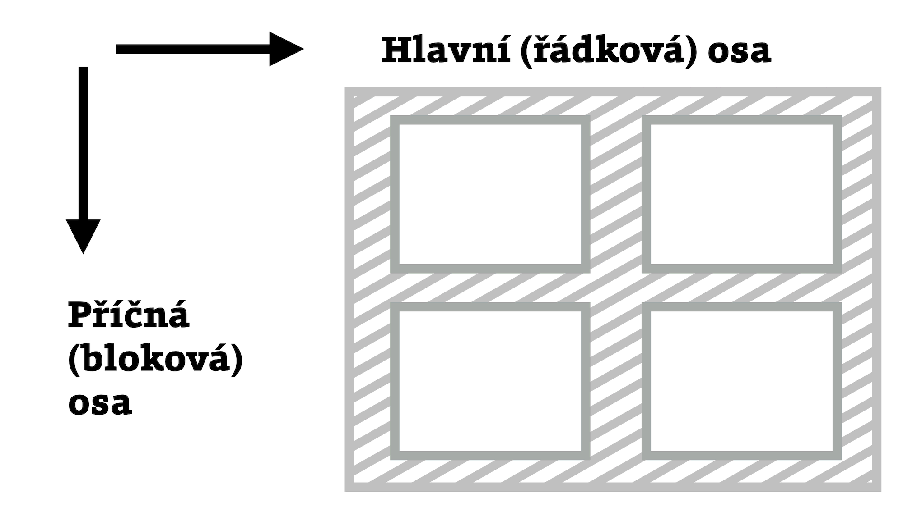
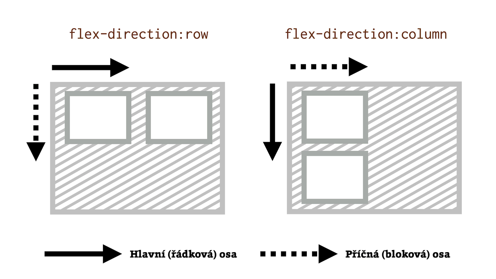
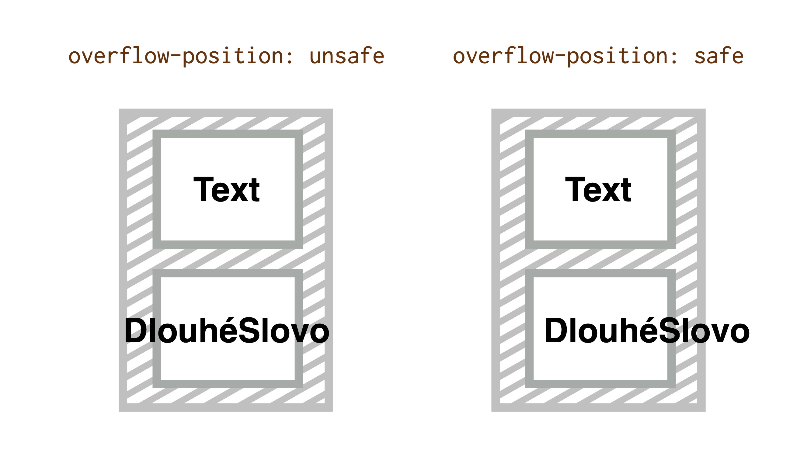

# Teorie k zarovnání boxů v CSS (Box Alignment Module)

Zde si objasníme pár konceptů k CSS Box Alignment Module. Nebojte se, nebudu to s teorií přehánět, vybral jsem jen takové pojmy, bez kterých se nemůžete obejít.

## Důležité pojmy {#pojmy}

Podíváme se na pojmy jako „směr rozvržení“, „kontejner“ a „předmět“ nebo „náhradní řešení zarovnání“.

### Směr rozvržení: bloková a řádková osa {#pojmy-osy}

Prohlížeče nám při tvorbě běžného layoutu umožňují jen dvourozměrný zážitek a tak naštěstí zarovnáváme jen na dvě osy. Vzhledem ke složitosti téhle oblasti v CSS je to moc dobrá zpráva.

<figure>

<figcaption markdown="1">
*Dvě osy v rozvržení.*
</figcaption>
</figure>

Osy pro potřeby layoutu v CSS:

- _Hlavní_ nebo-li _řádková_ osa (inline axis), ve středoevropských podmínkách obvykle vodorovná.
- _Příčná_ nebo-li _bloková_ osa (block axis), u nás obvykle svislá.

Osy se nejmenují „vodorovná“ a „svislá“, protože se jejich směr může v různých situacích měnit:

- Změníme mód psaní (`writing-mode`) nebo jazyk dokumentu. Japonština nebo arabština se čtou zcela v odlišných směrech.
- Změníme směr toku layoutu, což například ve flexboxu často děláme pomocí vlastnosti `flex-direction`.

<figure>

<figcaption markdown="1">
*Výchozí směr rozvržení můžeme změnit například pomocí vlastnosti `flex-direction`. Zdroj: [cdnp.io/e/YzGXYKb](https://codepen.io/machal/pen/YzGXYKb)*
</figcaption>
</figure>

Ze stejného důvodu nemůžeme například říci, že zarovnáváme „vlevo nahoru“, ale vždy na začátek nebo na konec určité osy. K tomu se ještě dostaneme.

### Předmět a kontejner {#pojmy-predmet-kontejner}

Pro potřeby dalších textů budeme ještě potřebovat rozlišit mezi dvěma pojmy:

- *Předmět zarovnání* (alignment subject) je samotný boxík, který zarovnáváme. V rámci textů mu zde občas budeme říkat také „položka“.
- *Kontejner zarovnání* (alignment container) je rámec, ve kterém předmět zarovnáváme. Obvykle jde o rodičovský element.

<figure>

<figcaption markdown="1">
*Kontejner a položky neboli předměty zarovnání.*
</figcaption>
</figure>

### Náhradní řešení zarovnání {#pojmy-fallback}

„Fallback alignment“, nebo také náhradní zarovnání řeší situace, kdy nejsou splněny podmínky, které určité zarovnání vyžaduje.

Například pro uplatnění hodnoty `space-between` u vlastnosti `justify-content` je nutné, aby se v kontejneru vyskytoval více než jeden předmět. Pokud tato podmínka není splněna, specifikace jako náhradní řešení předepisuje hodnotu `flex-start` nebo `start`.

## Typy zarovnání podle elementu {#typy-element}

<!-- TODO zmiňovat to, když už je to v css-box-alignment.md přehnedněji? -->

Zkusme zabřednout trošku více do hloubky a zároveň si v tom neudělat nepořádek. Vlastnosti a hodnoty zarovnání boxů v CSS můžeme dělit podle dvou klíčů.

Ten první je zaměřený na elementy, které ovlivňuje – všechny položky, samostatnou položku nebo prostor mezi nimi.

### Zarovnání položek {#polozky}

Na kontejneru definujeme, jak se budou zarovnávat položky.

Patří sem všechny vlastnosti, které v názvu obsahují `-items`:

- [`justify-items`](css-justify-items.md) – zarovnání na řádkové ose.
- [`align-items`](css-align-items.md) - zarovnání na blokové ose.
- [`place-items`](css-place-items.md) - zkratka pro obě vlastnosti.

### Zarovnání samostatné položky {#sebe-sama}

Zarovnání konkrétního subjektu uvnitř kontejneru.

Jde o všechny vlastnosti, které v názvu obsahují `-self`:

- [`justify-self`](css-justify-self.md) – zarovnání na řádkové ose.
- [`align-self`](css-align-self.md) - zarovnání na blokové ose.
- [`place-self`](css-place-self.md) - zkratka pro obě vlastnosti.

### Distribuce prostoru mezi položkami {#distribuce-prostoru}

Vlastnosti, které řídí rozdělení volného prostoru, který uvnitř kontejneru zůstává mezi položkami.

Patří sem všechny vlastnosti, které v názvu obsahují `-content`:

- [`justify-content`](css-justify-content.md) – zarovnání na řádkové ose.
- [`align-content`](css-align-content.md) - zarovnání na blokové ose.
- [`place-content`](css-place-content.md) - zkratka pro obě vlastnosti.

## Klíčová slova pro zarovnání {#typy-klicova-slova}

Druhý typ rozdělení CSS Box Alignment do skupin se zaměřuje nikoliv na vlastnosti, ale jejich hodnoty – klíčová slova.

Většinou potřebujeme vyřešit poziční zarovnání, ale známe také zarovnání na účaří, zarovnání zbylého prostoru, zarování pro možnost přetečení a nakonec definici mezery mezi položkami.

Zní to asi složitě, takže bude rovnou lepší proniknout rovnou do jednotlivých typů klíčových slov. Tentokrát si je doplníme i ukázkami.

### Poziční zarovnání {#pozicni}

Určování polohy předmětu vzhledem k jeho kontejneru zarovnání. Ve specifikaci se používá pojem „Positional Alignment“.

Týká se to už uvedených vlastností:

- Zarovnání všech položek (`justify-items`, `align-items` a `place-items`).
- Zarovnání samostatné položky (`justify-self`, `align-self` a `place-self`).
- Distribuce obsahu (`justify-content`, `align-content` a `place-content`).

Můžete použít tyto hodnoty:

- `center` <small>(použitelné pro `-self` i `-content`)</small>  
  Centruje předmět doprostřed kontejneru zarovnání.
- `start` <small>(`-self` i `-content`)</small>  
  Zarovnává předmět k hraně začátku kontejneru na patřičné ose.
- `end` <small>(`-self` i `-content`)</small>  
  Zarovnává předmět k hraně konce kontejneru na patřičné ose.
- `self-start` <small>(`-self`)</small>  
  Zarovnává předmět k hraně začátku kontejneru, která odpovídá začátku předmětu na patřičné ose.
- `self-end` <small>(`-self`)</small>  
  Zarovnává předmět k hraně konce kontejneru, která odpovídá konci předmětu na patřičné ose.
- `flex-start` <small>(`-self` i `-content`, jen pro flexbox)</small>  
  Totéž jako `start`, jen pro položky flexboxu. Mimo flexbox se hodnota chová jako `start`.
- `flex-end` <small>(`-self` i `-content`, jen pro flexbox)</small>  
  Totéž jako `end`, jen pro položky flexboxu.  Mimo flexbox se hodnota chová jako `end`.
- `left` <small>(jen `justify-*`)</small>  
  Pokud se použije na řádkové ose, chová se jako `start`.
- `right` <small>(jen `justify-*`)</small>  
  Pokud se použije na řádkové ose, chová se jako `end`.

Troufám si tvrdit, že naprostá většina z praktických použití CSS Box Alignment se týká právě pozičního zarovnání.

Mrkněme se na jednoduchý příklad. Máme následující HTML připravené pro třísloupcové rozvržení:

```html
<div class="container">
  <div class="item item--1">
    Item 1
  </div>
  <div class="item item--2">
    Item 2
  </div>
  <div class="item item--3">
    Item 3
  </div>  
</div>
```

Layout je s pomocí CSS gridu definovaný následovně:

```css
.container {
  display: grid;
  grid-template-columns: repeat(3, 1fr);
  gap: 1em;
  height: 5em;  
}  
```

A teď přichází ono zarovnání:

```css
.container {
  align-items: start;
}

.item--3 {
  align-self: end;
}
```

Na nic nečekejme a vše vysvětleme:

- Přes kontejner rozvržení (`.container`) nastavíme po hlavní ose (`align-`) všem položkám (`-items`) zarovnání k horní hraně kontejneru (`start`), dohromady tedy `align-items:start`.
- Třetí položce `.item--3` udělíme výjimku – bude zarovnaná ke spodní hradně kontejneru – `align-self:end`.

CodePen: [cdnp.io/e/qBZqGGz](https://codepen.io/machal/pen/qBZqGGz?editors=1100)

### Zarovnání na účaří {#ucari}

Zarovnání na účaří určuje polohy účaří předmětu nebo skupiny předmětů tím, že přídává vnější okraj nad box. V češtině to funguje jen pro zarovnání vedle sebe, kde lze jednotlivá účaří porovnávvat. Ve specifikaci se mluví o „Baseline Alignment“, pokud byste to chtěli hledat.

Týká se těchto vlastností:

- Zarovnání sebe sama (`justify-self`, `align-self` a `place-self`).
- Distribuce obsahu (`justify-content`, `align-content` a `place-content`).

Můžete použít tyto hodnoty:

- `first baseline`  
  Zarovnání na účaří prvního řádku. Pokud v daném kontextu nelze použít, zarovná se jako `start`.
- `last baseline`  
  Zarovnání na účaří posledního řádku. Pokud v daném kontextu nelze použít, zarovná se jako `end`.
- `baseline`  
  Zkratka pro `first baseline`.

V demíčku navážeme na strukturu HTML z předchozí ukázky.

Tentokrát ovšem přidáme tuto deklaraci:

```css
.item--2,
.item--3 {
  align-self: baseline;
}

.item--2 {
  padding-top: 3em;
}
```

Totiž:

- Na rozdíl od první položky zarovnáme druhou a třetí na účaří (`align-self:baseline`).
- Druhé položce přidáme vnitří okraj (`padding-top:3em`), takže prohlížeči zkomplikujeme jeho snahu o zarovnání.

Jak je vidět, prohlížeče jsme nenapálili. Přidáním vnějšího okraje posunou třetí položku shora tak, aby druhá i třetí lícovala na účaří.

CodePen: [cdpn.io/e/RwaozNa](https://codepen.io/machal/pen/RwaozNa?editors=1100)

### Zarovnání zbylého prostoru {#zbyly-prostor}

Určuje, co se stane s prostorem, který zbude mezi položkami na řádkové ose. Ve specifikaci hledejte jako „Distributed Alignment“.

Týká se těchto vlastnotí:

- Distribuce obsahu (`justify-content`, `align-content` a `place-content`).

Můžete použít tyto hodnoty:

- `stretch` (výchozí)  
  Položky rozšíří své rozměry tak, aby v kontejneru nezbylo žádné volné místo. Pokud jsou položky menší než kontejner, jejich velikost se zvětší rovnoměrně (nikoli proporcionálně), přičemž stále respektují omezení uložená vlastnostmi jako `max-width`/`max-height`.
- `space-between`  
  Volné místo se rovnoměrně rozdělí mezi položky, přičemž první a poslední je zarovnaná s hranou kontejneru.
- `space-around`  
  Volné místo se rovnoměrně rozdělí mezi položky a polovina mezery mezi položkami se vloží mezi hrany kontejneru a první a poslední položku.
- `space-evenly`  
  Volné místo se rovnoměrně rozdělí mezi položky i mezi první a poslední položku a okraje kontejneru.

Účinek je možné vidět v ukázce, která využívá stejné HTML jako ty předchozí. CSS jsme změnili, využijeme tentokrát flexbox:

```css
.container {
  display: flex;
  justify-content: space-between;
}

.item {
  width: 100px;
}
```

Jdeme na vysvětlování:

- Tím, že jsme omezili šířku položky na `100px`, při roztažení rodiče (`.container`) vznikne volné místo.
- Jak se s volným místem vedle položek naloží určí právě vlastnost `justify-content`. Hodnota `space-between` deklaruje, aby se volný prostor rovnoměrně rozpočítal do prostoru mezi položkami.

CodePen: [cdpn.io/e/OJNbemx](https://codepen.io/machal/pen/OJNbemx?editors=1100)

### Zarovnání pro přetečení {#overflow}

Vlastnosti a hodnoty, které pomáhají definovat chování prohlížečů, když je předmět zarovnání větší než jeho kontejner.

Co se má stát po přetečení obsahu z kontejneru, definuje vlastnost `overflow-position`, která má podle specifikace dvě možné hodnoty:

- `safe`  
  Pokud má položka v daném způsobu zarovnání přetéct z obou stran, bude zarovnání změněno tak, aby byl vidět začátek položky, takže aby například bylo možné přečíst začátek textu.
- `unsafe`  
  Vždy dostane přednost poziční zarovnání, bez ohledu na to, zda bude oříznutý obsah čitelný nebo ne.  

<figure>

<figcaption markdown="1">
*Kontejner a položky neboli předměty zarovnání.*
</figcaption>
</figure>

V době psaní textu (srpen 2020) se zdá, že naše milé prohlížeče s implementací této vlastnosti úplně nepřetrhnou. Zatím tedy užitečná `overflow-position` zůstává jen „na papíře“ specifikace od W3C.

### Definování mezer mezi položkami {#gap}

Vlastnosti a hodnoty umožňují nastavení konzistentní mezery mezi položkami v řádku nebo sloupci a hlavně uvnitř CSS gridu.

Vlastnosti:

- `row-gap` - mezera mezi řádky (na blokové ose)
- `column-gap` - mezera mezi sloupci (na inline ose)
- `gap` - zkratka pro vlastnosti `column-gap` a `row-gap`

Dříve se tytéž vlastnosti používaly s prefixem `grid-` (`grid-row-gap`, `grid-column-gap`, `grid-gap`). Prohlížeče je dodnes umí, jako synonyma pro výše uvedené. Nicméně doporučuji se vám řídit novou verzí specifikace a používat `gap`, například takto:

```css
.container {
  grid-template-columns: 1fr 1fr 1fr;
  grid-template-rows: 1fr 1fr;
  gap: 1em 0.5em;
}
```

Více [o vlastnosti `gap`](css-gap.md)

Uvedené vytvoří odkaz mřížku o třech slupcích a dvou rádcích. Mezery mezi položkami layoutu budou `1em` ve svislém směru a `0.5em` ve vodorovném.

Jako hodnoty bere vlastnost `gap` všechny možné délkové jednotky a také procenta, přičemž ty se vztahují na délku kontejneru layoutu.

## Podpora v prohlížečích {#podpora}

Na úrovni celé této velké specifikace je těžké mluvit o podpoře či nepodpoře. Různé prohlížeče mohou nepodporovat některé vlastnosti, některé mohou nepodporovat zase určité hodnoty nebo jejich kombinaci s různými systémy rozvržení, jako je grid, flexbox nebo vícesloupcový layout.

Toto řešíme v textech příručky k jednotlivým vlastnostem. Zde se ale zaměřme na konkrétní zásadnější nedostatky v podpoře, jež mají slabou podporu.

- Internet Explorer 11 – pokud ještě musíte podporovat tento prehistorický prohlížeč, je třeba vědět, že vlastnosti pro zarovnání umí jen v kombinaci s flexboxem, nikoliv gridem.
- Zkratky jako `place-self` neumí IE11, ale zatím bohužel také Safari, což je daleko nepříjemnější. Na druhou stranu, zkratku `place-content` Safari ovládá, což tuto vlastnost činí použitelnou na většině moderních projektů.
- [Vlastnosti `gap`](css-gap.md) v grid layoutu umí všechny prohlížeče, kromě IE11, ale v kombinaci s jinými systémy rozvržení je to daleko složitější.
- Vlastnost `overflow-position` v době psaní textu neumí žádný prohlížeč.

Nenechte se ale odradit, toto jsou jen malé věci. Celková podpora zarovnávání v gridu a flexboxu je vynikající a ty nejužitečnější vlastnosti jsou plně podporovány.

## Odkazy pro další studium {#odkazy}

Udělal jsem maximum pro to, aby vám tento průvodce vystačil a jiné zdroje jste hledat nemuseli. Přesto si neodpustím několik odkazů jinam:

- Specifikace W3C pro CSS Box Alignment Module Level 3 – [w3.org/TR/css-align-3](https://www.w3.org/TR/css-align-3/)
- Ahmad Shaheed: hra „Learn Box Alignment“ – [ishadeed.com/article/learn-box-alignment/](https://ishadeed.com/article/learn-box-alignment/)
- Rachel Andrew: stručný tahák „Box Alignment Cheatsheet“ – [rachelandrew.co.uk/css/cheatsheets/box-alignment](https://rachelandrew.co.uk/css/cheatsheets/box-alignment)
