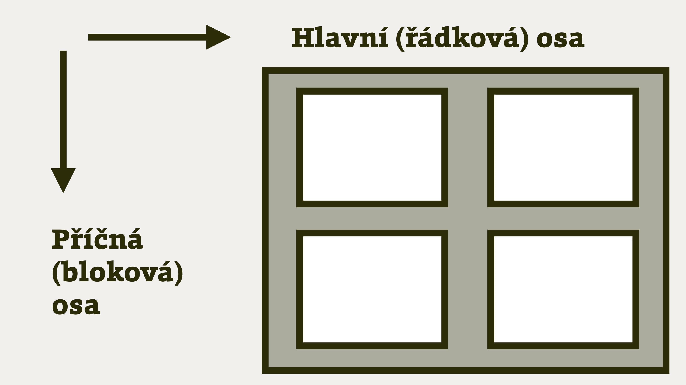
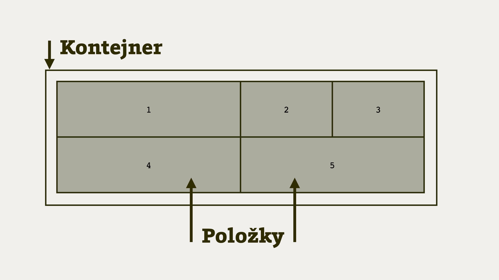
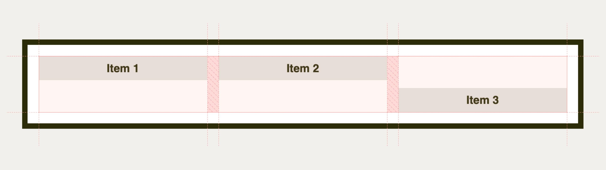
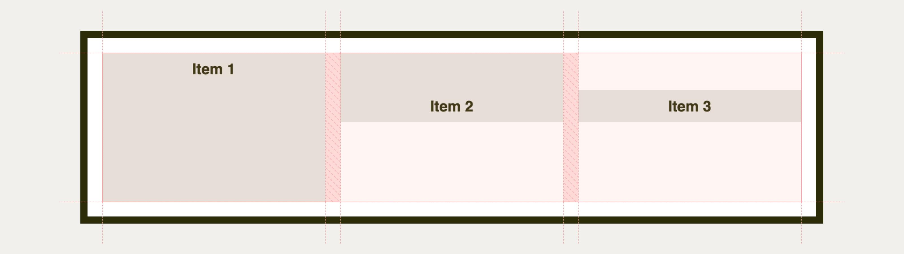
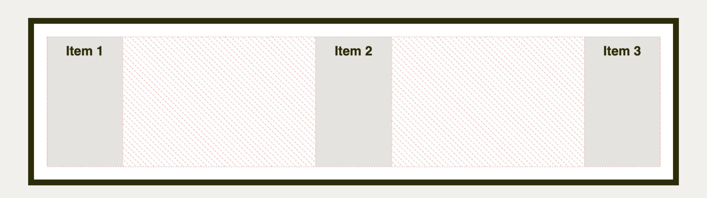
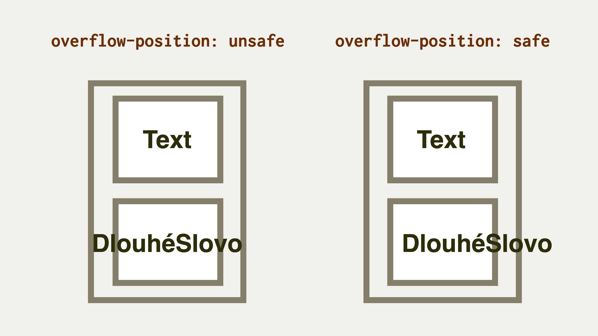

# Teorie k zarovnání boxů v CSS (Box Alignment Module)

Zde si představíme pár konceptů k CSS Box Alignment Module.

Nebojte se, nebudu to s teorií přehánět. Vybral jsem jen takové části teorie, bez kterých se nemůžete obejít.

Jde o jakousi zobecněnou esenci referenční příručky k jednotlivým vlastnostem. Pokud to tady vstřebáte, nemusíte zase tak moc studovat konkrétní vlastnosti zarovnání boxů v CSS.

## Důležité pojmy {#pojmy}

Podíváme se na pojmy jako „směr rozvržení“, „kontejner“ a „předmět“ nebo „náhradní řešení zarovnání“.

### Směr rozvržení: bloková a řádková osa {#pojmy-osy}

<div class="book-index" data-book-index="Bloková osa"></div>
<div class="book-index" data-book-index="Inline osa"></div>
<div class="book-index" data-book-index="Hlavní osa"></div>
<div class="book-index" data-book-index="Příčná osa"></div>

Prohlížeče nám při tvorbě běžného layoutu umožňují jen dvourozměrný zážitek, a tak naštěstí zarovnáváme na dvě osy. Vzhledem ke složitosti téhle oblasti v CSS je to moc dobrá zpráva.

<figure class="figure-thirds">

<figcaption markdown="1">
*Dvě osy v rozvržení.*
</figcaption>
</figure>

Osy pro potřeby layoutu v CSS:

- _Hlavní_ neboli řádková osa (inline axis), ve středoevropských podmínkách obvykle vodorovná.
- _Příčná_ neboli bloková osa (block axis), u nás obvykle svislá.

Osy se nejmenují „vodorovná“ a „svislá“, protože se jejich směr může v různých situacích měnit, když upravíme mód psaní (`writing-mode`) nebo jazyk dokumentu. Taková arabština nebo některé asijské jazyky se čtou ve zcela odlišných směrech.

<div class="web-only" markdown="1">

O směru psaní dokumentu a tvorbě layoutu pro jazyky sázené v jiných směrech píšu více v textu o [CSS logical properties](css-logical.md), logických vlastnostech a hodnotách.

</div>

<div class="ebook-only" markdown="1">

Mimochodem, v poslední „přílohové“ kapitole píšu o [CSS logical properties](css-logical.md), logických vlastnostech a hodnotách a obecně o možnosti sázení dokumentu v jazycích, které mají jiný směr toku než ten náš.

</div>

<figure class="figure-thirds">

<figcaption markdown="1">
Výchozí směr rozvržení můžeme změnit například pomocí vlastnosti flex-direction. Zdroj: [vrdl.in/uy9of](https://codepen.io/machal/pen/YzGXYKb)
</figcaption>
</figure>

Ze stejného důvodu nemůžeme například říci, že zarovnáváme „vlevo nahoru“, ale vždy na začátek nebo na konec určité osy. K tomu se ještě dostaneme.

### Předmět a kontejner {#pojmy-predmet-kontejner}

<div class="book-index" data-book-index="Předmět zarovnání"></div>
<div class="book-index" data-book-index="Kontejner zarovnání"></div>

Pro potřeby dalších textů budeme ještě potřebovat rozlišit mezi dvěma pojmy:

- *Předmět zarovnání* (alignment subject) je samotný boxík, který zarovnáváme. Zde mu občas budeme říkat také „položka“.
- *Kontejner zarovnání* (alignment container) je rámec, ve kterém předmět zarovnáváme. Obvykle jde o rodičovský element.

<figure class="figure-thirds">

<figcaption markdown="1">
*Kontejner a položky neboli předměty zarovnání.*
</figcaption>
</figure>

### Náhradní řešení zarovnání {#pojmy-fallback}

<div class="book-index" data-book-index="Náhradní zarovnání"></div>
<div class="book-index" data-book-index="Fallback alignment"></div>

„Fallback alignment“, nebo také náhradní zarovnání řeší situace, kdy nejsou splněny podmínky, které určité zarovnání vyžaduje.

Například pro uplatnění hodnoty `space-between` u vlastnosti [`justify-content`](css-justify-content.md) (tedy rozprostření volného prostoru spravedlivě mezi položky) je nutné, aby se v kontejneru vyskytoval více než jeden předmět neboli položka.

Pokud tato podmínka není splněna, specifikace předepisuje jako náhradní řešení hodnotu `flex-start` nebo `start`.

To asi dává smysl, že?

## Klíčová slova pro zarovnání {#typy-klicova-slova}

Už víme, že vlastnosti [CSS Box Alignment](css-box-alignment.md) je možné dělit podle toho, zda ovlivňují všechny položky, jednu položku, anebo prostor mezi nimi.

Druhý typ rozdělení vlastností pro zarovnávání se zaměřuje nikoliv na vlastnosti, ale jejich hodnoty – klíčová slova.

### Poziční zarovnání {#pozicni}

<div class="book-index" data-book-index="Poziční zarovnání"></div>
<div class="book-index" data-book-index="Positional Alignment"></div>

Určí polohu položky vzhledem ke kontejneru. (Ve specifikaci je používán pojem „Positional Alignment“.)

Týká se to už uvedených vlastností:

- Zarovnání všech položek ([`justify-items`](css-justify-items.md), [`align-items`](css-align-items.md) a [`place-items`](css-place-items.md)).
- Zarovnání samostatné položky ([`justify-self`](css-justify-self.md), [`align-self`](css-align-self.md) a [`place-self`](css-place-self.md)).
- Distribuce obsahu ([`justify-content`](css-justify-content.md), [`align-content`](css-align-content.md) a [`place-content`](css-place-content.md)).

V obecné rovině můžeme použít tyto hodnoty:

- `center` <small>(použitelné pro `-self` i `-content`)</small>  
  Centruje předmět doprostřed kontejneru zarovnání.
- `start` <small>(`-self` i `-content`)</small>  
  Zarovnává předmět k hraně začátku kontejneru na patřičné ose.
- `end` <small>(`-self` i `-content`)</small>  
  Zarovnává předmět k hraně konce kontejneru na patřičné ose.
- `self-start` <small>(`-self`)</small>  
  Zarovnává předmět k hraně začátku kontejneru, která odpovídá začátku předmětu na patřičné ose.
- `self-end` <small>(`-self`)</small>  
  Zarovnává předmět k hraně konce kontejneru, která odpovídá konci předmětu na patřičné ose.
- `flex-start` <small>(`-self` i `-content`, jen pro flexbox)</small>  
  Totéž jako `start`, jen pro položky flexboxu. Mimo flexbox se hodnota chová jako `start`.
- `flex-end` <small>(`-self` i `-content`, jen pro flexbox)</small>  
  Totéž jako `end`, jen pro položky flexboxu.  Mimo flexbox se hodnota chová jako `end`.
- `left` <small>(jen `justify-*`)</small>  
  Pokud hodnotu použijeme na řádkové ose, chová se jako `start`.
- `right` <small>(jen `justify-*`)</small>  
  Pokud hodnotu použijeme na řádkové ose, chová se jako `end`.

Troufám si tvrdit, že naprostá většina z možností praktického použití CSS Box Alignment se týká právě pozičního zarovnání.

Mrkněme se na jednoduchý příklad. Máme následující HTML připravené pro třísloupcové rozvržení:

```html
<div class="container">
  <div class="item item--1">
    Item 1
  </div>
  <div class="item item--2">
    Item 2
  </div>
  <div class="item item--3">
    Item 3
  </div>  
</div>
```

Layout je s pomocí CSS gridu definovaný následovně:

```css
.container {
  display: grid;
  grid-template-columns: repeat(3, 1fr);
  gap: 1em;
  height: 5em;
}
```

Jen pro pořádek: Každá položka layoutu bude mít výšku `5em`, spravedlivě si rozdělí prostor (`1fr`) a mezera mezi nimi bude `1em`.

A teď přichází ke slovu ono zarovnání:

```css
.container {
  align-items: start;
}

.item--3 {
  align-self: end;
}
```

Na nic nečekejme a vše vysvětleme:

- Kontejneru rozvržení (`.container`) nastavíme po příčné ose (`align-`) zarovnání všech položek (`-items`)  k horní hraně kontejneru (`start`). Dohromady tedy `align-items:start`.
- Třetí položce `.item--3` udělíme výjimku. Bude zarovnaná ke spodní hraně kontejneru – `align-self:end`.

Pokud si to neumíte představit, podívejte se na živý CodePen, ale asi to nebude těžké.

<div class="ebook-only" markdown="1">

<figure>

<figcaption markdown="1">
Poziční zarovnání s neposednou poslední položkou layoutu.
</figcaption>
</figure>

</div>

CodePen: [vrdl.in/i3v7a](https://codepen.io/machal/pen/qBZqGGz?editors=1100)

### Zarovnání na účaří {#ucari}

<div class="book-index" data-book-index="Zarovnání na účaří"></div>
<div class="book-index" data-book-index="Baseline Alignment"></div>

Zarovnání na účaří určuje polohu účaří položky nebo skupiny položek tím, že nad ni nebo nad ně přidává vnější okraj.

Zní to asi trochu zašmodrchaně, že? Ještě to chvíli vydržte, ono to není úplně neužitečné.

Při sazbě dokumentů v češtině (nebo jiných evropských jazycích) to funguje jen pro zarovnání položek vedle sebe, kde lze jednotlivá účaří porovnávat. (Ve specifikaci se mluví o „Baseline Alignment“, pokud byste to chtěli hledat.)

Týká se těchto vlastností:

- Zarovnání sebe sama ([`justify-self`](css-justify-self.md), [`align-self`](css-align-self.md) a [`place-self`](css-place-self.md)).
- Distribuce obsahu ([`justify-content`](css-justify-content.md), [`align-content`](css-align-content.md) a [`place-content`](css-place-content.md)).

Můžete použít tyto hodnoty:

- `first baseline`  
  Zarovnání na účaří prvního řádku. Pokud ale v daném kontextu nelze použít, zarovná se jako `start`.
- `last baseline`  
  Zarovnání na účaří posledního řádku. Pokud ale v daném kontextu nelze použít, zarovná se jako `end`.
- `baseline`  
  Zkratka pro `first baseline`.

V demíčku navážeme na strukturu HTML z předchozí ukázky.

Tentokrát ovšem přidáme tuto deklaraci:

```css
.item--2,
.item--3 {
  align-self: baseline;
}

.item--2 {
  padding-top: 3em;
}
```

Čili:

- Na rozdíl od první položky zarovnáme druhou a třetí na účaří (`align-self:baseline`).
- Druhé položce přidáme vnitřní okraj (`padding-top:3em`), takže prohlížeči zkomplikujeme jeho snahu o zarovnání.

<div class="ebook-only" markdown="1">

<figure>

<figcaption markdown="1">
Jak je vidět, prohlížeče jsme nenapálili. Přidáním vnějšího okraje posunou třetí položku shora tak, aby druhá i třetí lícovala na účaří.
</figcaption>
</figure>

</div>

CodePen: [vrdl.in/9etio](https://codepen.io/machal/pen/RwaozNa?editors=1100)

### Zarovnání zbylého prostoru {#zbyly-prostor}

<div class="book-index" data-book-index="Zarovnání prostoru"></div>
<div class="book-index" data-book-index="Distributed Alignment"></div>

Určuje, co se stane s prostorem, který zbude mezi položkami na řádkové ose. (Ve specifikaci hledejte jako „Distributed Alignment“.)

Týká se to jen vlastností pro nastavení distribuce obsahu, tedy volného místa uvnitř kontejneru – [`justify-content`](css-justify-content.md), [`align-content`](css-align-content.md) a [`place-content`](css-place-content.md).

Můžete použít tyto hodnoty:

- `stretch` (výchozí)  
  Položky rozšíří své rozměry tak, aby v kontejneru nezbylo žádné volné místo. Pokud jsou položky menší než kontejner, jejich velikost se zvětší rovnoměrně (nikoli proporcionálně), přičemž stále respektují omezení uložená vlastnostmi jako `max-width`/`max-height`.
- `space-between`  
  Volné místo se rovnoměrně rozdělí mezi položky, přičemž první a poslední je zarovnaná s hranou kontejneru.
- `space-around`  
  Volné místo se rovnoměrně rozdělí mezi položky a polovina mezery mezi položkami se vloží mezi hrany kontejneru a první a poslední položku.
- `space-evenly`  
  Volné místo se rovnoměrně rozdělí mezi položky i mezi první a poslední položku a okraje kontejneru.

Účinek je možné vidět v ukázce, která využívá stejné HTML jako ty předchozí. CSS jsme změnili, využijeme tentokrát flexbox:

```css
.container {
  display: flex;
  justify-content: space-between;
}

.item {
  width: 100px;
}
```

Jdeme na vysvětlování:

- Tím, že jsme omezili šířku položky na `100px`, vznikne při roztažení rodiče (`.container`) volné místo.
- Jak se s volným místem vedle položek naloží, určí právě vlastnost `justify-content`. Hodnota `space-between` deklaruje, aby se volný prostor rovnoměrně rozpočítal do prostoru mezi položkami.

<figure>

<figcaption markdown="1">
Účinek zarovnání zbylého prostoru pomocí vlastnosti justify-content.
</figcaption>
</figure>

CodePen: [vrdl.in/f5vsg](https://codepen.io/machal/pen/OJNbemx?editors=1100)

### Zarovnání pro přetečení (bez podpory prohlížečů) {#overflow}

<div class="book-index" data-book-index="Zarovnání pro přetečení"></div>
<div class="book-index" data-book-index="Overflow Alignment"></div>

Jde o vlastnosti a hodnoty, které pomáhají definovat chování prohlížečů, když je předmět zarovnání větší než jeho kontejner.

Co se má stát po přetečení obsahu z kontejneru, definuje vlastnost `overflow-position`, která má podle specifikace dvě možné hodnoty:

- `safe`  
  Pokud má položka v daném způsobu zarovnání přetéct z obou stran, bude zarovnání změněno tak, aby byl vidět začátek položky, například tak, aby bylo možné přečíst začátek textu.
- `unsafe`  
  Vždy dostane přednost poziční zarovnání, bez ohledu na to, zda bude oříznutý obsah čitelný nebo ne.  

<figure class="figure-thirds">

<figcaption markdown="1">
V případě hodnoty unsafe se použije poziční zarovnání. Alespoň teoreticky.
</figcaption>
</figure>

V době dokončování textu (únor 2022) se zdá, že naše milé prohlížeče se s implementací této vlastnosti úplně nepřetrhnou. Zatím tedy užitečná `overflow-position` zůstává jen „na papíře“ specifikace od W3C.

### Definování mezer mezi položkami {#gap}

<div class="book-index" data-book-index="gap"></div>
<div class="book-index" data-book-index="Mezera v layoutu"></div>

Vlastnosti a hodnoty umožňují nastavení konzistentní mezery mezi položkami v řádku nebo sloupci a hlavně uvnitř CSS gridu.

Jde o různé varianty [vlastnosti `gap`](css-gap.md):

- `row-gap` - mezera mezi řádky (na blokové ose)
- `column-gap` - mezera mezi sloupci (na řádkové ose)
- `gap` - zkratka pro vlastnosti `column-gap` a `row-gap`

Dříve se tytéž vlastnosti používaly s prefixem `grid-` (`grid-row-gap`, `grid-column-gap`, `grid-gap`). Prohlížeče je dodnes umí, jako synonyma pro výše uvedené. Nicméně vám doporučuji řídit se novou verzí specifikace a používat `gap`, například takto:

```css
.container {
  grid-template-columns: 1fr 1fr 1fr;
  grid-template-rows: 1fr 1fr;
  gap: 1em 0.5em;
}
```

Uvedené vytvoří odkaz na mřížku o třech sloupcích a dvou řádcích. Mezery mezi položkami layoutu budou `1em` ve svislém směru a `0.5em` ve vodorovném. Jako hodnoty bere vlastnost `gap` všechny možné délkové jednotky a také procenta, přičemž ty se vztahují na délku kontejneru layoutu.
