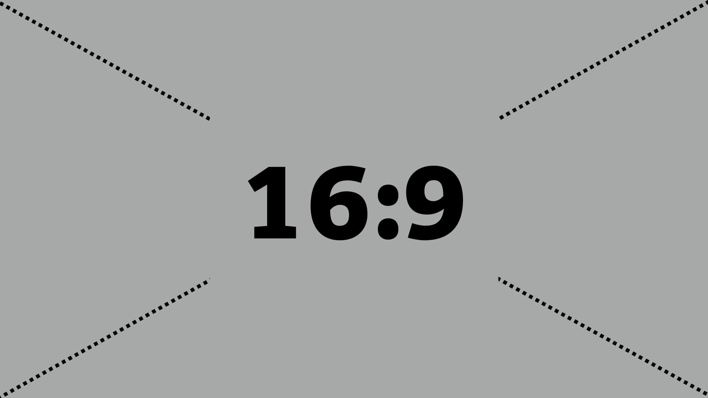

# Zarovnání boxů v CSS

Box Alignment v CSS specifikuje zarovnání boxů v různých modelech rozvržení CSS: blokovém, tabulkovém, vícesloupcovém, flexboxu nebo Gridu.

Specifikace [Box Alignment Module Level 3](https://www.w3.org/TR/css-align-3/) v podstatě vzala všechna zarovnání a rozdělení prostoru definovaná ve flexboxu a zpřístupnila ji ostatním modulům.

Nijak se zde nezabýváme zarovnáváním textu (vlastnosti jako `text-align`, `vertical-align`), ani staršími metodami zarovnávání boxů (`margin`, `float`…).

## Rychlý tahák k vlastnostem {#tahak}

Vlastností, které obstarávají zarovnávání v CSS, je na jednu webařskou hlavu opravdu hodně. Naštěstí jsou ale ty nejdůležitější pojmenované podle jednoduchého klíče. Než vyberete tu správnou, musíte si ujasnit:

- Směr zarovnávání (inline je obvykle vodorovný, block svislý).
- Co budete zarovnávat (všechny položky, jednu položku nebo obsah mezi nimi).

<div class="rwd-scrollable f-6"  markdown="1">

|                                     | **Inline** (`justify-*`) | **Block** (`align-*`) |
| **Zarovnání položek** (`*-items`)   |  `justify-items`     | `align-items`     |
| **Zarovnání sebe sama** (`*-self`)  |  `justify-self`      | `align-self`      |
| **Distribuce obsahu** (`*-content`) |  `justify-content`   | `align-content`   |

</div>

Je dobré vědět, že v tabulce nejsou obsaženy zdaleka všechny zarovnávací vlastnosti. Ty méně známé najdete v textu u jednotlivých typů zarovnávání.

## Důležité pojmy {#pojmy}

Než začneme, musíme si objasnit pár konceptů. Nebojte se, nebudu to s teorií přehánět, vybral jsem jen takové pojmy, bez kterých se nemůžete obejít.

### Směr rozvržení: bloková a řádková osa {#pojmy-osy}

Prohlížeče nám většinou umožňují jen dvourozměrný zážitek a tak zarovnáváme na dvě osy.

Osy se nejmenují „vodorovná“ a „svislá“, protože se jejich směr může v různých situacích měnit:

- Změníme mód psaní (`writing-mode`) nebo jazyk dokumentu. Japonština nebo arabština se čtou zcela v odlišných směrech.
- Změníme směr toku layoutu, což například ve flexboxu často děláme pomocí vlastnosti `flex-direction`.

<figure>

<figcaption markdown="1">
*TODO: Obrázek s výchozím směrem a pak změněným pomocí flex-direction, změny jazyka…*
</figcaption>
</figure>

Osy se proto pro potřeby layoutu v CSS nejmenují „vodorovná“ a „svislá“, ale:

- „bloková“ (block), u nás obvykle svislá
- „řádková“ (inline), u nás obvykle vodorovná

Ze stejného důvodu nemůžeme například říci, že zarovnáváme „vlevo nahoru“, ale vždy na začátek nebo na konec určité osy. K tomu se ještě dostaneme.

### Předmět a kontejner {#pojmy-predmet-kontejner}

Pro potřeby dalších textů budeme ještě potřebovat rozlišit mezi dvěma pojmy:

- *Předmět zarovnání* (alignment subject) je samotný boxík, který zarovnáváme. V rámci textů mu zde občas budeme říkat také „položka“.
- *Kontejner zarovnání* (alignment container) je rámec, ve kterém předmět zarovnáváme. Obvykle jde o rodičovský element.

*TODO příklad s obrázkem, alespoň viz https://developer.mozilla.org/en-US/docs/Web/CSS/CSS_Box_Alignment*

### Náhradní řešení zarovnání {#pojmy-fallback}

„Fallback alignment“ nebo-li náhradní zarovnání řeší situace, kdy nejsou splněny podmínky, které určité zarovnání vyžaduje.

Například pro uplatnění hodnoty `space-between` u vlastnosti `justify-content` je nutné, aby se v kontejneru vyskytoval více než jeden předmět. Pokud tato podmínka není splněna, specifikace jako náhradní řešení předepisuje hodnotu `flex-start` nebo `start`.

## Typy zarovnání podle elementu {#typy-element}

<!-- TODO vysvetleni -->

### Zarovnání položek {#polozky}

Na kontejneru definujeme, jak se budou zarovnávat položky.

Patří sem všechny vlastnosti, které v názvu obsahují `-items`:

- `justify-items` – zarovnání na řádkové ose
- `align-items` - zarovnání na blokové ose
- `place-items` - zkratka pro obě vlastnosti

### Zarovnání sebe sama {#sebe-sama}

Zarovnání konkrétního subjektu uvnitř kontejneru.

Jde o všechny vlastnosti, které v názvu obsahují `-self`:

- `align-self` - zarovnání na blokové ose
- `justify-self` – zarovnání na řádkové ose
- `place-self` - zkratka pro obě vlastnosti

### Distribuce obsahu {#distribuce-obsahu}

Distribuce obsahu řídí zarovnání obsahu uvnitř boxu.

<!-- TODO nerozumim -->

Patří sem všechny vlastnosti, které v názvu obsahují `-content`:

- `justify-content` – zarovnání na řádkové ose
- `align-content` - zarovnání na blokové ose
- `place-content` - zkratka pro obě vlastnosti

## Klíčová slova pro zarovnání {#typy-klicova-slova}

<!-- TODO uvod a vysvětleni -->

### Poziční zarovnání {#pozicni}

Určování polohy předmětu vzhledem k jeho kontejneru zarovnání. Ve specifikaci se používá pojem „Positional Alignment“.

Týká se těchto vlastností:

- Zarovnání sebe sama (`justify-self`, `align-self` a `place-self`).
- Distribuce obsahu (`justify-content`, `align-content` a `place-content`).

Můžete použít tyto hodnoty:

- `center` <small>(použitelné pro `-self` i `-content`)</small>  
  Centruje předmět doprostřed kontejneru zarovnání.
- `start` <small>(`-self` i `-content`)</small>  
  Zarovnává předmět k hraně začátku kontejneru na patřičné ose.
- `end` <small>(`-self` i `-content`)</small>  
  Zarovnává předmět k hraně konce kontejneru na patřičné ose.
- `self-start` <small>(`-self`)</small>  
  Zarovnává předmět k hraně začátku kontejneru, která odpovídá začátku předmětu na patřičné ose.
- `self-end` <small>(`-self`)</small>  
  Zarovnává předmět k hraně začátku kontejneru, která odpovídá konci předmětu na patřičné ose.
- `flex-start` <small>(`-self` i `-content`, jen pro flexbox)</small>  
  *TODO.* Mimo flexbox se hodnota chová jako `start`.
- `flex-end` <small>(`-self` i `-content`, jen pro flexbox)</small>  
  *TODO.* Mimo flexbox se hodnota chová jako `end`.
- `left` <small>(jen `justify-*`)</small>  
  *TODO.* Pokud se použije na řádkové ose, chová se jako `start`.
- `right` <small>(jen `justify-*`)</small>  
  *TODO.* Pokud se použije na řádkové ose, chová se jako `end`.

### Zarovnání na účaří {#ucari}

Zarovnání na účaří určuje polohy účaří předmětu nebo skupiny předmětů tím, že přídává vnější okraj nad box. V češtině to funguje jen pro zarovnání vedle sebe, kde lze jednotlivá účaří porovnávvat. Ve specifikaci se mluví o „Baseline Alignment“, pokud byste to chtěli hledat.

Týká se těchto vlastností:

- Zarovnání sebe sama (`justify-self`, `align-self` a `place-self`).
- Distribuce obsahu (`justify-content`, `align-content` a `place-content`).

Můžete použít tyto hodnoty:

- `first baseline`  
  Zarovnání na účaří prvního řádku. *TODO fallback?*
- `last baseline`  
  Zarovnání na účaří posledního řádku. *TODO fallback?*
- `baseline`  
  Zkratka pro `first baseline`.

### Zarovnání zbylého prostoru {#zbyly-prostor}

Určuje, co se stane s prostorem, který zbude mezi položkami na řádkové ose. Ve specifikaci hledejte jako „Distributed Alignment“.

Týká se těchto vlastnotí:

- Distribuce obsahu (`justify-content`, `align-content` a `place-content`).

Můžete použít tyto hodnoty:

- `space-between`  
  Volné místo se rovnoměrně rozdělí mezi položky, přičemž první a poslední je zarovnaná s hranou kontejneru.
- `space-around`  
  Volné místo se rovnoměrně rozdělí mezi položky a polovina mezery mezi položkami se vloží mezi hrany kontejneru a první a poslední položku.
- `space-evenly`  
  Volné místo se rovnoměrně rozdělí mezi položky i mezi první a poslední položku a okraje kontejneru.
- `stretch`  
  Položky rozšíří své rozměry tak, aby v kontejneru nezbylo žádné volné místo. Pokud jsou položky menší než kontejner, jejich velikost se zvětší rovnoměrně (nikoli proporcionálně), přičemž stále respektují omezení uložená vlastnostmi jako `max-width`/`max-height`.

### Zarovnání pro přetečení {#overflow}

Vlastnosti a hodnoty, které pomáhají definovat chování prohlížečů, když je předmět zarovnání větší než jeho kontejner.

Co se má stát po přetečení obsahu z kontejneru, definuje vlastnost `overflow-position`, která má podle specifikace dvě možné hodnoty:

- `safe`  
  Pokud má položka v daném způsobu zarovnání přetéct z obou stran, bude zarovnání změněno tak, aby byl vidět začátek položky, takže aby například bylo možné přečíst začátek textu.
- `unsafe`  
  Vždy dostane přednost poziční zarovnání, bez ohledu na to, zda bude oříznutý obsah čitelný nebo ne.  

<!-- TODO obrázek: (https://www.w3.org/TR/css-align-3/#overflow-values -->

V době psaní textu (srpen 2020) se zdá, že naše milé prohlížeče s implementací této vlastnosti úplně nepřetrhnou. Zatím tedy užitečná `overflow-position` zůstává jen „na papíře“ specifikace od W3C.

### Definování mezer mezi položkami {#gap}

Vlastnosti a hodnoty umožňují nastavení konzistentní mezery mezi položkami v řádku nebo sloupci a hlavně uvnitř CSS Gridu.

Vlastnosti:

- `row-gap` - mezera mezi řádky (na blokové ose)
- `column-gap` - mezera mezi sloupci (na inline ose)
- `gap` - zkratka pro vlastnosti `column-gap` a `row-gap`

Dříve se tytéž vlastnosti používaly s prefixem `grid-` (`grid-row-gap`, `grid-column-gap`, `grid-gap`). Prohlížeče je dodnes umí, jako synonyma pro výše uvedené. Nicméně doporučuji se vám řídit novou verzí specifikace a používat `gap`, například takto:

```css
.container {
  grid-template-columns: 1fr 1fr 1fr;
  grid-template-rows: 1fr 1fr;
  gap: 1em 0.5em;
}
```

Více [o vlastnosti `gap`](css-gap.md)

Uvedené vytvoří odkaz mřížku o třech slupcích a dvou rádcích. Mezery mezi položkami layoutu budou `1em` ve svislém směru a `0.5em` ve vodorovném.

Jako hodnoty bere vlastnost `gap` všechny možné délkové jednotky a také procenta, přičemž ty se vztahují na délku kontejneru layoutu.

## Podpora v prohlížečích {#podpora}

Na úrovni celé této velké specifikace je těžké mluvit o podpoře či nepodpoře. Různé prohlížeče mohou nepodporovat některé vlastnosti, některé mohou nepodporovat zase určité hodnoty nebo jejich kombinaci s různými systémy rozvržení, jako je Grid, flexbox nebo vícesloupcový layout.

Toto řešíme v textech příručky k jednotlivým vlastnostem. Zde se ale zaměřme na konkrétní zásadnější nedostatky v podpoře, jež mají slabou podporu.

- Internet Explorer 11 – pokud ještě musíte podporovat tento prehistorický prohlížeč, je třeba vědět, že vlastnosti pro zarovnání umí jen v kombinaci s flexboxem, nikoliv Gridem.
- Zkratky jako `place-self` neumí IE11, ale zatím bohužel také Safari, což je daleko nepříjemnější. Na druhou stranu, zkratku `place-content` Safari ovládá, což tuto vlastnost činí použitelnou na většině moderních projektů.
- [Vlastnosti `gap`](css-gap.md) v Grid layoutu umí všechny prohlížeče, kromě IE11, ale v kombinaci s jinými systémy rozvržení je to daleko složitější.
- Vlastnost `overflow-position` v době psaní textu neumí žádný prohlížeč.

Nenechte se ale odradit, toto jsou jen malé věci. Celková podpora zarovnávání v Gridu a flexboxu je vynikající a ty nejužitečnější vlastnosti jsou plně podporovány.

## Odkazy pro další studium {#odkazy}

Udělal jsem maximum pro to, aby vám tento průvodce vystačil a jiné zdroje jste hledat nemuseli. Přesto si neodpustím několik odkazů jinam:

- Specifikace W3C pro CSS Box Alignment Module Level 3 – [w3.org/TR/css-align-3](https://www.w3.org/TR/css-align-3/)
- Ahmad Shaheed: hra „Learn Box Alignment“ – [ishadeed.com/article/learn-box-alignment/](https://ishadeed.com/article/learn-box-alignment/)
- Rachel Andrew: stručný tahák „Box Alignment Cheatsheet“ – [rachelandrew.co.uk/css/cheatsheets/box-alignment](https://rachelandrew.co.uk/css/cheatsheets/box-alignment)
