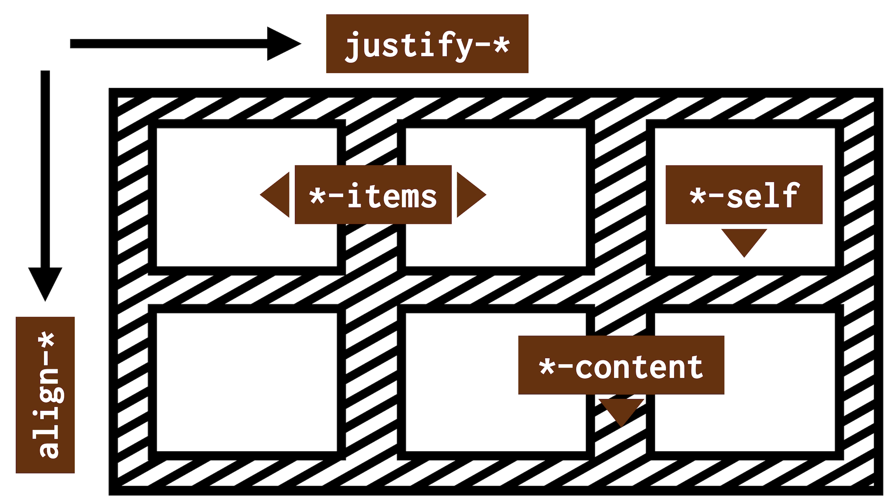
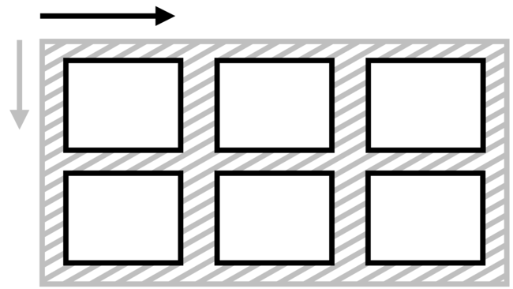
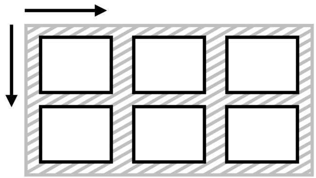
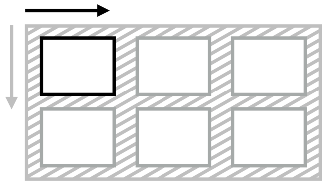
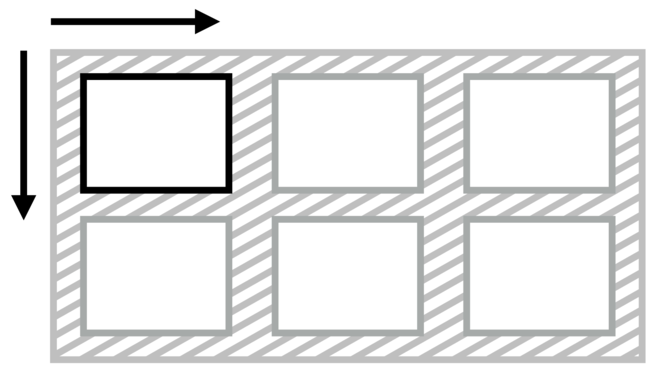
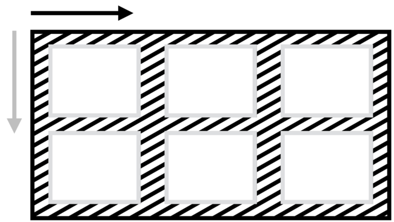
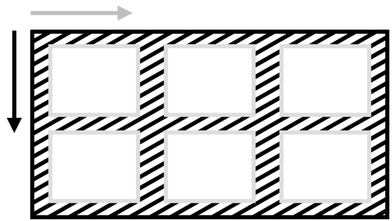
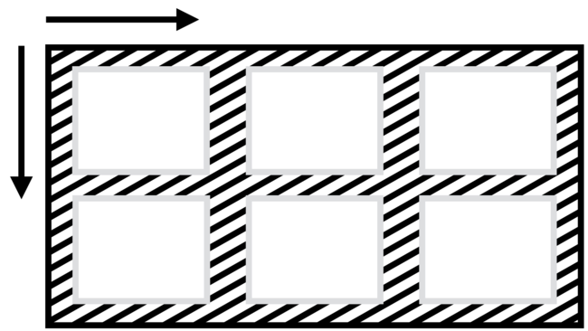

# Zarovnání boxů v CSS (Box Alignment Module)

Modul Box Alignment v CSS specifikuje zarovnání boxů v různých modelech rozvržení CSS: blokovém, tabulkovém, vícesloupcovém, flexboxu nebo gridu.

- [CSS grid](css-grid.md)
- [Flexbox](css-flexbox.md)
- [Vícesloupcový layout](css-multicolumn.md)

Specifikace [Box Alignment Module Level 3](https://www.w3.org/TR/css-align-3/) v podstatě vzala všechna zarovnání a rozdělení prostoru definovaná ve flexboxu, něco přidala a zpřístupnila ji ostatním systémům pro layout, což nás zajímá hlavně pro potřeby CSS gridu. O tom je tato příručka na Vzhůru dolů.

<!-- AdSnippet -->

Nijak se zde nezabýváme zarovnáváním textu (vlastnosti jako `text-align`, `vertical-align`), ani staršími (ale stále funkčními) metodami zarovnávání boxů s pomocí `margin` a tak dále.

## Rychlý tahák k vlastnostem {#tahak}

Vlastností, které obstarávají zarovnávání v CSS, je na jednu webařskou hlavu opravdu hodně.

Naštěstí jsou ale ty nejdůležitější vlastnosti pojmenované podle jednoduchého klíče. Než vyberete tu správnou, musíte si ujasnit:

- Směr zarovnávání (hlavní osa je obvykle vodorovná, jinak též řádková; příčná osa svislá, jinak též bloková).
- Co budete zarovnávat (všechny položky, jednu položku nebo obsah mezi nimi).

|                                     | **Hlavní osa** (`justify-*`) | **Příčná osa** (`align-*`) |
|-------------------------------------|------------------------------|----------------------------|
| **Zarovnání položek** (`*-items`)   |  `justify-items`     | `align-items`     |
| **Zarovnání sebe sama** (`*-self`)  |  `justify-self`      | `align-self`      |
| **Distribuce obsahu** (`*-content`) |  `justify-content`   | `align-content`   |

Jen připomínám, že směr hlavní a příčné osy se může změnit – například pomocí vlastnosti [`flex-direction` nastavené na `column`](css3-flexbox-kontejner.md).

V tabulce nejsou obsaženy zdaleka všechny zarovnávací vlastnosti, na ty se pojďme podívat hned v další části textu.

Každou vlastnost si zde můžete rozkliknout a dostat se tak na její specifikaci.

## Zarovnání položek (`*-items`) {#polozky}

Na kontejneru definujeme, jak se budou zarovnávat jednotlivé položky.

  <article role="article">
    <h4 id="justify-items"><a href="css-justify-items.md"><code>justify-items</code></a></h4>
    

    
Zarovnání na řádkové ose (obvykle vodorovně).   Např. <code>justify-items:center</code> centruje všechny položky.

  </article>

  <article role="article">
    <h4 id="align-items"><a href="css-align-items.md"><code>align-items</code></a></h4>
    

    
Zarovnání na blokové ose (obvykle svisle).   Např. <code>align-items:end</code> zarovná položky ke spodní hraně kontejneru.

  </article>

  <article role="article">
    <h4 id="place-items"><a href="css-place-items.md"><code>place-items</code></a></h4>
    

    
Zkratka pro zarovnání položek v obou směrech.   Např. <code>place-items:end center</code> zarovná položky ke spodní hraně a vodorovně na střed.

  </article>

## Zarovnání samostatné položky (`*-self`) {#sebe-sama}

Pro konkrétní položku definujeme, jak se bude zarovnávat.

  <article role="article">
    <h4 id="justify-self"><a href="css-justify-self.md"><code>justify-self</code></a></h4>
    

    
Zarovnání na řádkové ose (obvykle vodorovně).   Např. <code>justify-self:center</code> vodorovně centruje položku.

  </article>
  <article role="article">
    <h4 id="align-self"><a href="css-align-self.md"><code>align-self</code></a></h4>
    

    
Zarovnání na blokové ose (obvykle svisle).   Např. <code>align-self:end</code> zarovná položku ke spodní hraně.

  </article>
  <article role="article">
    <h4 id="place-self"><a href="css-place-self.md"><code>place-self</code></a></h4>
    

    
Zkratka pro zarovnání jednotlivé položky v obou směrech.   Např. <code>place-self:end center</code> zarovná položku ke spodní hraně a vodorovně doprostřed.

  </article>

## Distribuce prostoru mezi položkami (`*-content`) {#distribuce-prostoru}

Vlastnosti, které řídí rozdělení volného prostoru, který uvnitř kontejneru zůstává mezi položkami.

  <article role="article">
    <h4 id="justify-content"><a href="css-justify-content.md"><code>justify-content</code></a></h4>
    

    
Rozdělení prostoru na řádkové ose (obvykle vodorovně).   Např. <code>justify-content:space-between</code> rozdělí prostor mezi položky.

  </article>
  <article role="article">
    <h4 id="align-content"><a href="css-align-content.md"><code>align-content</code></a></h4>
    

    
Rozdělení prostoru na blokové ose (obvykle svisle).   Např. <code>align-content:start</code> zajistí zarovnání položek k horní hraně kontejneru.

  </article>
  <article role="article">
    <h4 id="place-content"><a href="css-place-content.md"><code>place-content</code></a></h4>
    

    
Zkratka pro rozdělení prostoru v obou směrech.   Např. <code>place-content:start space-between</code> zarovná položky k horní hraně a vodorovné dělí prostor.

  </article>

## Odkazy pro další studium {#odkazy}

Na závěr si neodpustím několik odkazů jinam:

- Specifikace W3C pro CSS Box Alignment Module Level 3 – [w3.org/TR/css-align-3](https://www.w3.org/TR/css-align-3/)
- Ahmad Shaheed: hra „Learn Box Alignment“ – [ishadeed.com/article/learn-box-alignment/](https://ishadeed.com/article/learn-box-alignment/)
- Rachel Andrew: stručný tahák „Box Alignment Cheatsheet“ – [rachelandrew.co.uk/css/cheatsheets/box-alignment](https://rachelandrew.co.uk/css/cheatsheets/box-alignment)

## Podpora v prohlížečích {#podpora}

Z textu [o podpoře CSS layoutu](css-layout-bugy.md) v prohlížečích už víte, že Box Alignment v CSS má dva zádrhele:

1. Ne všechny vlastnosti je možné použít ve všech systémech layoutu. Například `justify-items` a `justify-self` nefungují ve flexboxu.
2. [Internet Explorer](msie.md) těch vlastností nepodporuje více, ale je to problematické hlavně u gridu.

<!-- AdSnippet -->

<!--  

## A co teorie? {#teorie}

V této části se pokouším být co nejvíce praktický. Poskytnout snadno použitelný rozcestník pro použití vlastností CSS Box Alignment. Cíleně jsem vám ale zamlčel teoretickou část, která je důležitá pro pochopení problematiky zarovnání v CSS. 

Pro pochopení zarovnání layoutu v CSS byste totiž ideálně měli znát:

- Pojmy jako je kontejner, položka, „fallback alignment“ a další.
- Všechny možné typy zarovnání.
- Problematiku podporu v prohlížečích.
- Odkazy pro další studium.

Tohle všechno jsem schoval [do teorie kolem CSS Box Alignment](css-box-alignment-teorie.md).

-->
