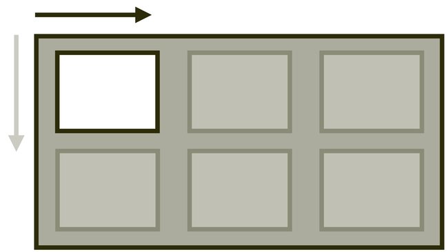
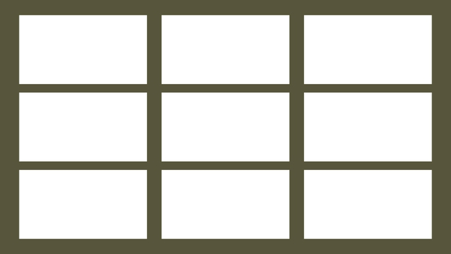
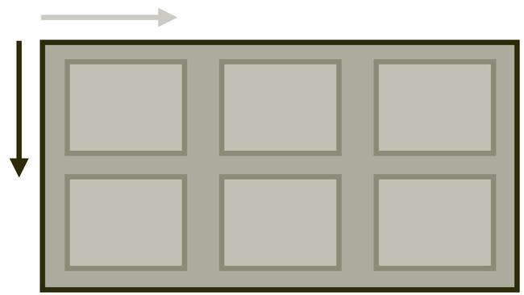
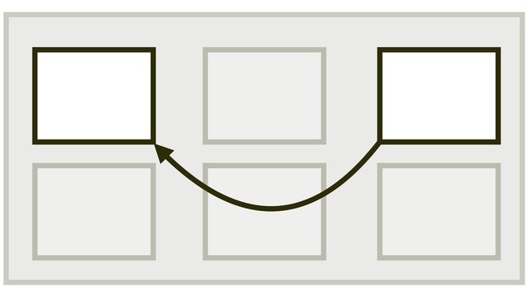

# Zarovnání boxů v CSS (Box Alignment Module)

„Box Alignment“ je modul specifikace CSS, který definuje zarovnání boxů v různých modelech rozvržení CSS: blokovém, tabulkovém, vícesloupcovém, flexboxu nebo gridu.

- [CSS grid](css-grid.md)
- [Flexbox](css-flexbox.md)
- [Vícesloupcový layout](css-multicolumn.md)

V tomto textu se podíváme na jednotlivé vlastnosti pro zarovnávání layoutů.

Specifikace „Box Alignment Module Level 3“ v podstatě převzala všechna zarovnání a rozdělení prostoru definovaného ve flexboxu, něco přidala a zpřístupnila je ostatním systémům pro layout.

<!-- AdSnippet -->

Nijak se zde nezabýváme zarovnáváním textu (vlastnosti jako `text-align`, `vertical-align`) ani staršími (ale stále funkčními) metodami zarovnávání boxů pomocí `margin` a tak dále.

## Rychlý tahák k vlastnostem {#tahak}

Vlastností, které obstarávají zarovnávání v CSS, je na jednu webařskou hlavu opravdu hodně.

Naštěstí jsou ale ty nejdůležitější z nich pojmenované podle jednoduchého klíče.

<figure>

<figcaption markdown="1">
Tahák k vlastnostem pro zarovnání boxů v CSS.
</figcaption>
</figure>

Než vyberete tu správnou, musíte si ujasnit:

1. Směr zarovnávání (hlavní osa je obvykle vodorovná, jinak též řádková; příčná osa svislá, jinak též bloková). Na obrázku výše se podívejte k šipkám.
2. Co budete zarovnávat (všechny položky, jednu položku, nebo obsah mezi nimi). Na obrázku výše se podívejte do layoutu.

|                                     | **Hlavní osa** (`justify-*`) | **Příčná osa** (`align-*`) |
|-------------------------------------|------------------------------|----------------------------|
| **Zarovnání položek** (`*-items`)   |  `justify-items`     | `align-items`     |
| **Zarovnání sebe sama** (`*-self`)  |  `justify-self`      | `align-self`      |
| **Distribuce obsahu** (`*-content`) |  `justify-content`   | `align-content`   |

Jen připomínám, že směr hlavní a příčné osy rozvržení se může změnit – například pomocí vlastnosti [`flex-direction` nastavené na `column`](css-flex-direction.md).

V tabulce nejsou obsaženy zdaleka všechny zarovnávací vlastnosti, na ty se pojďme podívat hned v další části textu.

### Jak si zapamatovat správný směr?

Docela dlouho se trápím s tím, jak si bez taháku zapamatovat správný směr zarovnání. „Justify“ je totiž většinou vodorovný, „align“ pak svislý směr.

Na asi nejlepší trik mě v jedné diskuzi přivedl David Grudl. Přitom je to tak prosté, podívat se do anglicko-českého slovníku:

- „justify“ znamená „zarovnat“ (text)
- „align“ znamená „srovnat“ (do roviny)

Další mnemotechnickou pomůckou může být, že „justify“ je typ zarovnání, který se vždy používá pro text, tedy u nás vodorovný směr.

Musíme ovšem zapomenout na to, že nejen různé textové editory, ale i samotné CSS (`text-align`) nás to léta učily špatně.

Vzpomeňme si opět na mistra Yodu. „Musíš se teď odnaučit, co tě dřív učili.“

Následuje už referenční příručka k jednotlivým vlastnostem. Každou vlastnost si zde můžete rozkliknout a dostat se tak na její specifikaci.

Následuje už stručná referenční příručka k jednotlivým vlastnostem a později v kapitole jejich detailní popis.

## Zarovnání položek (*-items) {#polozky}

Na kontejneru definujeme, jak se budou zarovnávat jednotlivé položky.

  <article role="article">
    <h4 id="justify-items"><a href="css-justify-items.md"><code>justify-items</code></a></h4>
    

    
Zarovnání na řádkové ose (obvykle vodorovně).   Např. <code>justify-items:center</code> centruje všechny položky.

  </article>

  <article role="article">
    <h4 id="align-items"><a href="css-align-items.md"><code>align-items</code></a></h4>
    

    
Zarovnání na blokové ose (obvykle svisle).   Např. <code>align-items:end</code> zarovná položky ke spodní hraně kontejneru.

  </article>

  <article role="article">
    <h4 id="place-items"><a href="css-place-items.md"><code>place-items</code></a></h4>
    

    
Zkratka pro zarovnání položek v obou směrech.   Např. <code>place-items:end center</code> zarovná položky ke spodní hraně a vodorovně na střed.

  </article>

## Zarovnání samostatné položky (*-self) {#sebe-sama}

Pro konkrétní položku definujeme, jak se bude zarovnávat.

  <article role="article">
    <h4 id="justify-self"><a href="css-justify-self.md"><code>justify-self</code></a></h4>
    

    
Zarovnání na řádkové ose (obvykle vodorovně).   Např. <code>justify-self:center</code> vodorovně centruje položku.

  </article>
  <article role="article">
    <h4 id="align-self"><a href="css-align-self.md"><code>align-self</code></a></h4>
    

    
Zarovnání na blokové ose (obvykle svisle).   Např. <code>align-self:end</code> zarovná položku ke spodní hraně.

  </article>
  <article role="article">
    <h4 id="place-self"><a href="css-place-self.md"><code>place-self</code></a></h4>
    

    
Zkratka pro zarovnání jednotlivé položky v obou směrech.   Např. <code>place-self:end center</code> zarovná položku ke spodní hraně a vodorovně doprostřed.

  </article>

## Distribuce prostoru mezi položkami (*-content) {#distribuce-prostoru}

Vlastnosti, které řídí rozdělení volného prostoru, jenž uvnitř kontejneru zůstává mezi položkami.

  <article role="article">
    <h4 id="gap"><a href="css-gap.md"><code>gap</code></a></h4>
    

    

      Definice mezery mezi buňkami.  
      Např. <code>gap:1rem</code> definuje mezeru <code>1rem</code> v obou směrech.
    

  </article>  
  <article role="article">
    <h4 id="justify-content"><a href="css-justify-content.md"><code>justify-content</code></a></h4>
    

    
Rozdělení prostoru na řádkové ose (obvykle vodorovně).   Např. <code>justify-content:space-between</code> rozdělí prostor mezi položky.

  </article>
  <article role="article">
    <h4 id="align-content"><a href="css-align-content.md"><code>align-content</code></a></h4>
    

    
Rozdělení prostoru na blokové ose (obvykle svisle).   Např. <code>align-content:start</code> zajistí zarovnání položek k horní hraně kontejneru.

  </article>
  <article role="article">
    <h4 id="place-content"><a href="css-place-content.md"><code>place-content</code></a></h4>
    

    
Zkratka pro rozdělení prostoru v obou směrech.   Např. <code>place-content:start space-between</code> zarovná položky k horní hraně a vodorovně dělí prostor.

  </article>

## Změna pořadí {#zmena-poradi}

  <article role="article">
    <h4 id="order"><a href="css-order.md"><code>order</code></a></h4>
    

    

      Změna pořadí prvků layoutu.  
      Např. <code>order:-1</code> přesune položku před všechny ostatní.
    

  </article>  

## Některé zarovnávací vlastnosti nefungují ve flexboxu

Vlastnosti [`justify-items`](css-justify-items.md) i [`justify-self`](css-justify-self.md) nejsou dostupné pro layouty tvořené flexboxem.

Namísto `justify-items` můžeme použít starý dobrý `margin` nebo pro centrování třeba `justify-content`.

Stejně tak nebudou fungovat zkratky [`place-items`](css-place-items.md) a [`place-self`](css-place-self.md).

|                                     | **Hlavní osa** (`justify-*`) | **Příčná osa** (`align-*`) | **Oba směry** (`place-*`) |
|-------------------------------------|------------------------------|----------------------------|--------------------------|
| **Zarovnání položek** (`*-items`)   |  [`justify-items`](css-justify-items.md) ~~flex~~, grid     | [`align-items`](css-align-items.md) flex, grid      | [`place-items`](css-place-items.md) ~~flex~~, grid |
| **Zarovnání sebe sama** (`*-self`)  |  [`justify-self`](css-justify-self.md) ~~flex~~, grid      | [`align-self`](css-align-self.md) flex, grid       | [`place-self`](css-place-self.md)  ~~flex~~, grid |
| **Distribuce obsahu** (`*-content`) |  [`justify-content`](css-justify-content.md) flex, grid    | [`align-content`](css-align-content.md) flex, grid    | [`place-content`](css-place-content.md)  flex, grid |

## Podpora v prohlížečích {#podpora}

Na úrovni celé této velké specifikace je těžké mluvit o podpoře či nepodpoře. Různé prohlížeče mohou nepodporovat některé vlastnosti, některé mohou nepodporovat zase určité hodnoty nebo jejich kombinaci s různými systémy rozvržení, jako je grid, flexbox nebo vícesloupcový layout.

Toto řešíme v textech příručky k jednotlivým vlastnostem. Zde se ale zaměřme na konkrétní zásadnější nedostatky v podpoře.

- Internet Explorer 11 – pokud ještě musíte podporovat tento prehistorický prohlížeč, je třeba vědět, že vlastnosti pro zarovnání umí jen v kombinaci s flexboxem, nikoliv gridem.
- Zkratky jako [`place-self`](css-place-self.md) neumí MSIE 11, ale zatím bohužel také Safari, což je daleko nepříjemnější. Na druhou stranu, zkratku [`place-content`](css-place-content.md) Safari ovládá, takže tato vlastnost je použitelná ve většině moderních projektů.
- [Vlastnosti `gap`](css-gap.md) v layoutu tvořeném gridem a flexboxem umí všechny prohlížeče, kromě MSIE 11, ale v kombinaci s vícesloupcovým layoutem to je složitější.
- Vlastnost `overflow-position` neumí v době psaní textu žádný prohlížeč.

Aby vás to ale neodradilo – celkově vzato jde o část CSS s velmi dobrou podporou a není nutné moc dumat, zda ji jako celek používat nebo ne. Prostě to používejte. Nic jiného vám stejně nezbývá, pokud chcete vytvářet nějaké ty layouty.

Konkrétněji o podpoře v prohlížečích píšu v textech o jednotlivých vlastnostech.

## Odkazy pro další studium {#odkazy}

Udělal jsem maximum pro to, aby vám tento průvodce vystačil a jiné zdroje jste hledat nemuseli. Přesto si neodpustím několik odkazů jinam:

- Specifikace W3C pro CSS Box Alignment Module Level 3 – [w3.org/TR/css-align-3](https://www.w3.org/TR/css-align-3/)
- Ahmad Shaheed: hra „Learn Box Alignment“ – [ishadeed.com/article/learn-box-alignment/](https://ishadeed.com/article/learn-box-alignment/)
- Rachel Andrew: stručný tahák „Box Alignment Cheatsheet“ – [rachelandrew.co.uk/css/cheatsheets/box-alignment](https://rachelandrew.co.uk/css/cheatsheets/box-alignment)

<!-- AdSnippet -->
