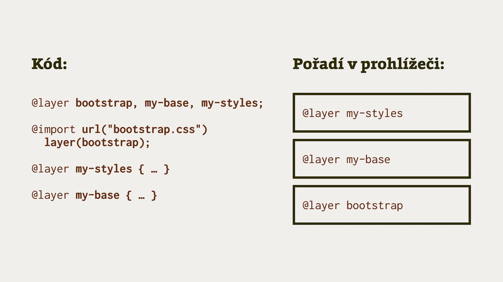
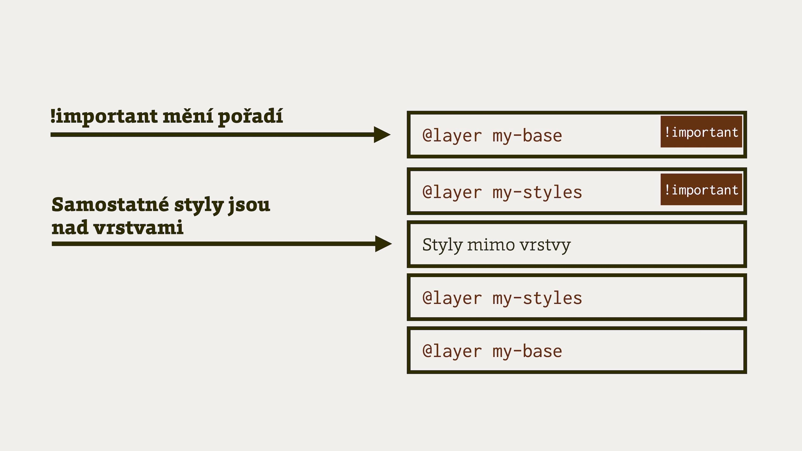

# CSS Cascade Layers

Kaskádové vrstvy v CSS slouží k zjednodušení práce s kaskádou v CSS.
Lidsky řečeno nám umožňují měnit platnosti pořadí deklarací bez nutnosti deklarace uvádět na konkrétní místo v CSS souboru.

Kaskádové vrstvy (Cascade Layers) nám poskytnou strukturovaný způsob uspořádání.

Vývojářky a vývojáři mohou nyní vytvářet vrstvy pro reprezentaci výchozích nastavení prvků, knihoven třetích stran, motivů vzhledu nebo komponent.
Není přitom nutné přizpůsobovat tomu selektory v rámci jednotlivých vrstev nebo se spoléhat na pořadí zdrojů při řešení konfliktů.

Dejme si jednoduchý příklad:

```css
@layer framework {
  /* Styly pro framework… */
}

@layer override {
  /* Styly pro pravidla, která framework přepisují… */ 
}

/* Přidáme styly do vrstvy frameworku: */
@layer framework {
  .btn {
    color: red;
  }
}
```

Zároveň nám kaskádové vrstvy poskytují možnost přeskupovat pořadí platnosti deklarací:

```css
@layer base, framework, override;

@layer framework {
  /* Styly pro framework… */
}

@layer base {
  /* Styly pro základnu… */ 
}
```

Podpora této části specifikace CSS Cascade Layers ve všech moderních prohlížečích je plná.
To hlavně díky tomu, že prohlížeče aktuálně [velmi dobře spolupracují](https://www.vzhurudolu.cz/blog/215-webexpo-2022-prohlizece).

V textu vám ukážu několik příkladů, jak to pro vás může být užitečné.
Nejprve vám ale zkusím vysvětlit, proč si myslím, že kaskádové vrstvy jsou skoro až revolučně užitečné.

## Věčný boj s kaskádou {#kaskada-boj}

Už od vzniku CSS před více než [více než čtvrt stoletím](https://www.vzhurudolu.cz/blog/10-17-narozeniny-css) se uživatelé CSS dělí do dvou skupin:
Menší skupina (z velké části [kodérů a frontend designérů](https://www.vzhurudolu.cz/blog/62-frontend-pozice)), která CSS miluje i se všemi nedostatky.
V druhé skupině sedí drtivá většina běžných vývojářů, kteří CSS používají, protože nemají jinou možnost.
Kaskádové styly je více či méně štvou a principy návrhu CSS obvykle nechápou.

Dělící linkou mezi těmito skupinami je většinou chápání [kaskády v CSS](css-kaskada.md) a jejich vlastností – dědičnosti, důležitosti (`!important`) a hlavně specificity selektorů.

Myslím, že příchod kaskádových vrstev je dobrá zpráva pro tu první skupinu.
A skvělá zpráva pro tu druhou.

Obvyklý vývoj a hlavně úpravy CSS probíhají v první skupině vývojářek a vývojářů podle [metodik](css-metodiky.md), z nichž je pro tyto účely nejdůležitější [ITCSS](https://frontend.garden/clanky/proc-je-itcss-nejpokrocilejsi-metodika-organizace-css/).
V druhé skupině se často prostě přidávají deklarace na konec souboru a doufá se, že to pomůže:

```css
/* Deklarace má vysokou specificitu selektoru… */
#content .btn {
  color: black;
}

/* … proto přidání této deklarace nepřetíží tu původní… */
.btn { 
  color: red;
}

/* … a tak si autoři CSS často pomohou důležitostí…  */
.btn {
  color: red !important;
}
```

Poznáváte svůj kód?
(Klídek, já takového napsal taky hodně.)
Jenže klíčové slovo `!important` a důležitost v cSS je určena pro jiné účely a tudíž tohle je trošku prasárna.
No, možná i více než trošku…

CodePen: [cdpn.io/e/jOKYdZE](https://codepen.io/machal/pen/jOKYdZE?editors=1100)

Řešení s kaskádovými vrstvami je jednoduché. Prostě si jednotlivé části CSS izolujeme do relativně nezávislých vrstev:

```css
/* V základu máme sice vysokou specificitu selektoru… */
@layer base {
  #content .btn {
    color: black;
  }
}

/* … ale v další vrstvě ji můžeme klidně přepsat nízkou specificitou: */
@layer override {
  .btn {
    color: red;
  }
}
```

Ano, je to přesně tak, kaskáda platí jen uvnitř konkrétních kaskádových vrstev.
Rozhoduje jen pořadí vrstev, tak jak jsou uvedené v CSS nebo jak jej specifikujete na začátku CSS souboru pomocí pravidla `@layer`.

CodePen: [cdpn.io/e/VwdygQx](https://codepen.io/machal/pen/VwdygQx?editors=1100)

## Jeden původ, jeden origin

Je dobré akcentovat, že kaskádové vrstvy organizují styly v rámci jednoho původu (originu). V CSS jich může být více – prohlížečové styly, autorské styly (ty naše), uživatelské styly. 

Tzn. pomocí `@layer` nelze například z autorských stylů „vstoupit“ do prohlížečového originu.


<figure>

<figcaption markdown="1">
TODO
</figcaption>
</figure>

<figure>

<figcaption markdown="1">
TODO
</figcaption>
</figure>
