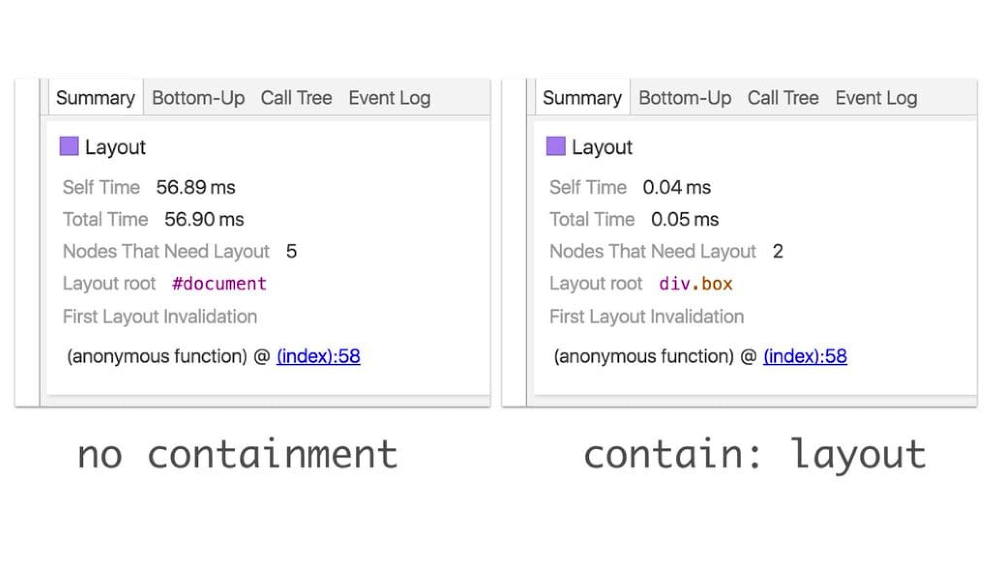

# CSS vlastnost contain

Vlastností `contain` označujeme části stránky, které jsou izolované od zbytku.
Izolujeme je proto, aby prohlížeč nemusel při změnách překreslovat celou stránku.
Ušetříme tím výkon na stránkách s komplexním DOMem.

<!-- AdSnippet -->

Prohlížeče se už dlouho různými způsoby snaží nepřepočítávát vzhled celé stránky při každé změně samy.

Kromě toho existují kodérské triky jak to udělat v běžném CSS (viz [Layout Boundaries](http://blog.wilsonpage.co.uk/introducing-layout-boundaries/)).
No a relativně novou možnosí je použít pro tyhle účely vlastnost `contain`.

→ *Celá problematika „CSS Containmentu“ je nejzajímavější ve [vlastnosti `content-visibility`](css-content-visibility.md), ale silně se využívá také v [Container Queries](element-queries.md)*.

## Dva příklady {#priklad}

Vlastnost `contain` může ušetřit čas potřebný pro vykreslování hlavně v případech, kdy DOM obsahuje tisíce uzlů.
Následující příklady proto berte jako schématické a hodně zjednodušené.

### Přidání prvku do DOMu {#priklad-pridani}

Tuhle ukázku jsem převzal [z dokumentace od Googlu](https://developers.google.com/web/updates/2016/06/css-containment). Máme následující HTML:

```html
<section class="view">
  Home
</section>

<section class="view">
  About
</section>

<section class="view">
  Contact
</section>
```

A teď JavaScriptem přidáme nový prvek:

```html
<section class="view">
  Home
</section>

<section class="view">
  About
  <div class="newly-added-element">Check me out!</div>
</section>

<section class="view">
  Contact
</section>
```

Přidání nového prvku spouští rovnou tři kroky procesu překreslování – styl, layout a paint.
Blbé ovšem je, že se ten proces spouští pro celý DOM a celou stránku.
Může pak pomoci přidání vlastnosti `contain`.

<figure>

<figcaption markdown="1">
*Ilustrační obrázek: Čas potřebný pro fázi layout můžeme snížit díky omezení na konkrétní boxík menšímu počtu prvku k přepočítání. Zdroj [developers.google.com](https://developers.google.com/web/updates/2016/06/css-containment).*
</figcaption>
</figure>

Podívejme se ještě na jednu ukázku.

### Výpis článků mimo viditelnou část obrazovky {#priklad-vypis}

Vezměme, že na stránce máme stovky či tisíce položek typu články, produkty nebo třeba tweety.
Většinu z nich uživatelé neuvidí v prvním vykresleném [viewportu](viewport.md).
Zároveň jde o samostatné a izolované prvky, které se se zbytkem stránky nijak vzájemně neovlivňují.

Takhle může vypadat jejich výpis ve stránce:

```html
<h1>Výpis článků</h1>
<article class="article"> … </article>
<article class="article"> … </article>
```

Představme si, že prvků `.article` jsou zde stovky a zároveň mají složitou vnitřní DOM strukturu.

Pomocí vlastnosti `contain` můžeme prohlížeč informovat, ať tyto prvky vyjme z celkového vykreslování stránky:

```css
.element {
  contain: content;
}
```

Prohlížeči tak dáváme instrukci, že prvky `.element`, které „nevidí“ ve viewportu může v klidu vynechat z počítání vzhledu celé stránky.

Ušetříme tím v některých situacích slušný renderovací čas.

## Typy „containmentu“ {#typy}

Zatím se mi nepovedlo najít vhodné české slovíčko pro teorii, o které se [ve specifikaci](https://www.w3.org/TR/css-contain-2/) mluví jako o „CSS containmentu“.
Jde o soběstačné a nezávislé zapouzdření prvku, což je ale poněkud kostrbaté označení.

Známe čtyři typy zapouzdření, které jsou zároveň možné hodnoty vlastnosti `contain`:

<div class="rwd-scrollable prop-table f-6"  markdown="1">

| Hodnota `contain`      | Typ zapouzdření |
|:-----------------------|:----------------|
| `size`   |  Zapouzdření pro velikost. Prohlížeči říkám, že velikost prvku nijak neovlivní jeho potomci. Pokud nastavíme `contain:size`, je potřeba v CSS také tomuto prvku nastavit nějakou velikost. Jinak prohlížeč počítá, že velikost je nulová, což nechceme. Zapouzdření velikosti samo o sobě zase tak moc výkonu při renderování neušetří. |
| `layout` |  Zapouzdření pro rozvržení. Říkáme tím, že se layout potomků prvku a zbytku stránky nijak vzájemně neovlivňují. Díky tomu může při zápise `contain:layout` prohlížeč vynechat počítání layoutu vnitřních prvků elementu a zaměřit se jen na prvek, který tuto vlastnost má nastavenou. |
| `paint` |  Zapouzdření pro vykreslení. Informujeme tímto, že žádný vnitřní prvek nevyčnívá ze svého rodiče. Uvedení `contain:paint` prohlížeči umožňuje potenciálně přeskočit vykreslení potomků, pokud je prvek mimo obrazovku.   |
| `style` |  Zapouzdření pro styly. Říkáme, že ovlivněný prvek vyjímáme z počítání hodnot napříč dokumentem, které provádějí vlastnosti jako `counter-increment`, `counter-set` nebo `quotes`.    |
</div>

Hodnoty vlastnosti `contain` jde kombinovat, takže můžete například uvést `contain: style paint`.

## Speciální hodnoty {#specialni-hodnoty}

Za účelem zjednodušení problematiky pro nás, autory webů, přichází specifikace se speciálními hodnotami vlastnosti `contain`:

<div class="rwd-scrollable prop-table f-6"  markdown="1">

| Hodnota `contain`      | Typ zapouzdření |
|:-----------------------|:----------------|
| `strict`   |  Všechny typy zapouzdření, kromě stylů. Totéž jako zápis `contain: size layout paint`. |
| `content`   |  Všechny typy zapouzdření, kromě stylů a velikosti. Totéž jako `contain: layout paint`. |

Hodnota `strict` ušetří prohlížeči více času, ale zase musíme znát a definovat velikost prvku.

<!-- AdSnippet -->

Jak to použít v praxi? Pojďme se zde vrátit k druhé ukázce – renderování desítek či stovek článků mimo viditelnou část obrazovky:

- Pokud bychom použili `contain:content`, nemusíme definovat výšku jednotlivých bloků. Na druhou stranu bude prohlížeč při prvním vykreslení považovat výšku za nulovou a nevykreslí například správně velká rolovátka.
- Pokud bychom použili `contain:strict`, prohlížeči musíme výšku sdělit, ale zase nenastane přepočítání velikosti rolovátka.

## Podpora je plná {#podpora}

Vlastnost `contain` nepodporuje [Internet Explorer](msie.md), což vůbec nevadí. Všechny moderní prohlížeče v containmentu jedou s námi.

Viz také [CanIUse.com](https://caniuse.com/mdn-css_properties_contain)

## Odkazy {#odkazy}

Pokud vás problematika containmentu zajímá více, zde je pár tipů k dalšímu studiu:

- [CSS Containment](https://developer.mozilla.org/en-US/docs/Web/CSS/CSS_Containment)  na MDN.
- [Smashing Magazine: Helping Browsers Optimize With The CSS Contain Property](https://www.smashingmagazine.com/2019/12/browsers-containment-css-contain-property/)

<small markdown="1">Za připomínky autor děkuje [Michalovi Matuškovi](https://www.vzhurudolu.cz/lektori/michal-matuska).</small>

<!-- AdSnippet -->
