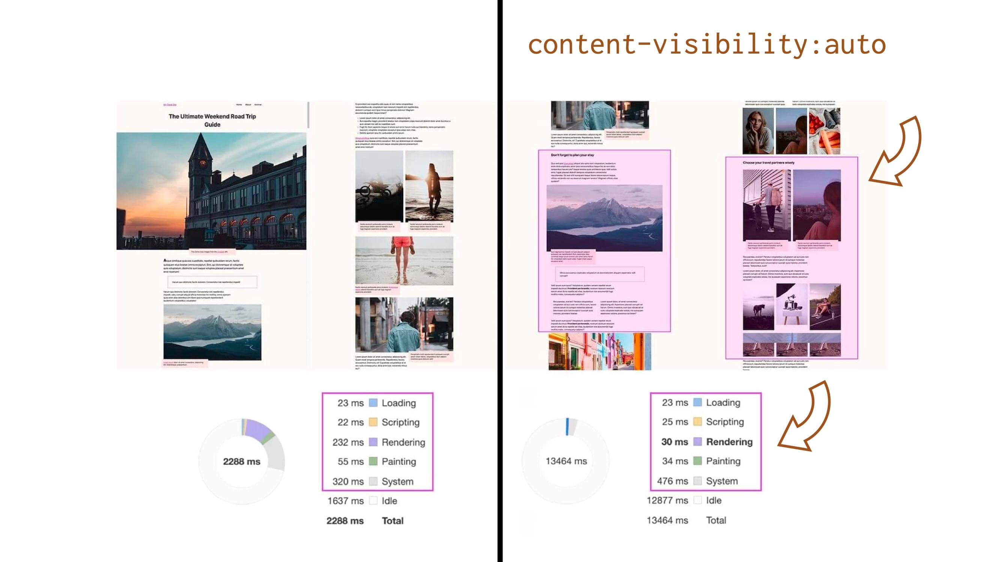

# CSS vlastnost content-visibility

Už víme, že cílem CSS containmentu (a [vlastnosti `contain`](css-contain.md)) je umožnit vylepšení výkonu prohlížeče poskytnutím předvídatelné izolace části DOMu od zbytku stránky.

Vlastnost `content-visibility` je na tom postavená a vývojáři zjednodušuje práci a nenutí ho chápat CSS containment do detailů.

Na rozdíl od vlastnosti `contain` umožňuje určit, zda prohlížeče vůbec vykreslí obsah dotčeného prvku. Její použití jim tak dovolí při počítání renderingu přeskočit náročné [fáze *layout* a *paint*](css-contain.md#typy).

<!-- AdSnippet -->

Je to víceméně jako [lazy loading](lazy-loading.md) pro vykreslení velkých obsahových celků. Obvykle může vhodné použití `content-visibility` například vylepšit čas úvodního zpracování stránky tím, že přeskočí vykreslování obsahu, který není vidět na obrazovce.

## Hodnoty {#hodnoty}

<div class="rwd-scrollable f-6"  markdown="1">

| Hodnota      | Co dělá?                        |
|:-------------|:--------------------------------|
| `visible`    |  Bez efektu. Obsah elementu se vykreslí běžným způsobem. (Výchozí hodnota.)|
| `hidden`     |  Obsah elementu není vidět. Je to podobné jako `visibility:hidden`. Element není dosupný pro funkce jako najít na stránce, procházení tabulátory; nelze jej označit ani jinak zaměřit přes `:focus`.  |
| `auto`       |  Zapíná layout, style a paint containment. Na rozdíl od `hidden` jsou `auto` prvky stále k dispozici pro hledání, tabulátory i zaměření.  |

</div>  

Výchozí hodnota `visible` nás zase tak moc nezajímá. Pojďme si však něco říct o těch dalších dvou.

Dobře, prozradím to – nejzajímavější je hodnota `auto`, ale nejprve něco k té hodnotě zbývající.

## Hodnota `hidden` {#hodnota-hidden}

Deklaraci `content-visibility:hidden` použijte, když chcete, aby obsah nebyl vyrenderován a zároveň využívat výhody uložení stavu vykreslování v mezipaměti a [CSS containmentu](css-contain.md).

Nebyl vyrenderován, nebyl vyrenderován… počkat nemáme pro tohle v CSS už jiné vlastnosti?

### Srovnání s jinými typy schovávání {#hodnota-hidden-schovavani}

- `display:none`  
  Skryje prvek a zahodí jeho vykreslovací stav. To znamená, že skrytí prvku je z pohledu výkonu stejně drahé jako vykreslení nového prvku se stejným obsahem. `display:none` navíc neumožňuje na dotčeném obsahu realizovat akce typu vyhledání na stránce atd.
- `visibility:hidden`  
  Skryje prvek a udržuje jeho vykreslovací stav. Aktualizuje také stav vykreslování, kdykoli je to třeba, i když je skrytý. Nicméně, potomci prvku s `visibility:hidden` si mohou kdykoliv nastavit `visibility:visible` a začít se zobrazovat, což v případě `content-visibility:hidden` nehrozí.  Prvky s `visibility:hidden` stále zabírají původní prostor na stránce, což prvek s `content-visibility:hidden` nedělá, šetří rendering díky containmentu. `content-visibility` navíc nepodléhá průběžnému přepočítávání layoutu. Prohlížeč musí spočítat vzhled prvku s `content-visibility` až v momentě, kdy jej potřebuje znovu zobrazit.

<figure>

<div class="rwd-scrollable f-6"  markdown="1">

|                      | `display:none` | `visibility:hidden` | `content-visibility:hidden` |
|:---------------------|:--------------:|:-------------------:|:---------------------------:|
| Rezervace plochy     |  Neudržuje     | Udržuje             |  Udržuje                    |
| Stav renderingu      |  Smaže         | Udržuje             |  Udržuje jen část           |
| Mohou přebít potomci |  Ne            | Ano                 |  Ne                         |

</div>  

<figcaption markdown="1">
*Tabulka: Srovnání vlastností pro schovávání obsahu v CSS*
</figcaption>

</figure>

Podle specifikace pro `content-visibility` platí, že pokud jsou jeho omezení přijatelná, může to být spolehlivější a konzistentnější způsob jak skrýt obsah prvku než vlastnost `visibility`.

### Příklad použití `content-visibility:hidden` {#hodnota-hidden-priklad}

Chcete mít v DOMu připravený kus obsahu, který uživatel nevidí a zároveň už DOM není příliš složitý, takže není nutné jej načítat AJAXem?

<!-- AdSnippet -->

Může se to týkat různých pohledů v JS aplikacích (SPA), zobrazování panelů záložek a tak dále.

Pokud byste použili přepínání `display:none`/`display:block`, prohlížeč musí pokaždé prvek znovu celý přepočítat pro vykreslování a nebude k dispozici například pro hledání nebo tabulátorovou navigaci.

Pokud byste prvek umístili mimo obrazovku přes `position:absolute`, k dispozici pro tyhle akce bude, ale zase tyto prvky bude muset prohlížeč při každé změně ve stránce přepočítávat.

Tohle je tedy příklad, kdy `content-visibility:hidden` využijete.

## Hodnota `auto` {#hodnota-auto}

Hodnota `auto` zapíná něco jako líný rendering pro části stránky, které nejsou na první pohled vidět.

Element, který má `content-visibility:auto` spouští [containment pro vykreslovací fáze *layout*, *style* a *paint*](css-contain.md#typy), takže může ušetřit docela dost výkonu.

<figure>

<figcaption markdown="1">
*Obrázek: Vlastnost content-visibility s hodnotou auto může ušetřit dost renderovacícho výkonu. Zdroj: [web.dev](https://web.dev/content-visibility/).*
</figcaption>
</figure>

Pokud je prvek mimo obrazovku (a není pro uživatele jinak relevantní - například tedy nemá fokus nebo není vybraný), získá také [*size* containment](css-contain.md#typy).

Pokud je na stránce velké množství obsahu, které bude často mimo obrazovku (například dlouhý rolovatelný seznam komplexnějších prvků), je v pořádku to na tento obsah aplikovat.

### Příklad s Twitterem {#hodnota-auto-twitter}

Ve [specifikaci](https://www.w3.org/TR/css-contain-2/#using-cv-auto) uvádějí příklad s Twitterem. Jednotlivé tweety jsou relativně komplexní prvky DOMu, které prohlížeč nemusí nutně vykreslovat, když jsou mimo viditelný [viewport](viewport.md).

Nebylo by v úplně pořádku aplikovat `content-visibility:auto` na celý rodičovský prvek pro tweety, ale na jednotlivé tweety se to naopak velmi hodí.

Připomeňme si ale, že `content-visibility:auto` zapíná *size* containment, takže prohlížeč prvkům nerezervuje prostor ve stránce.

Takto označeným prvkům ale nějak musíme nastavit alespoň odhadovanou výšku pro vykreslení, aby prohlížeč věděl, jaké rozměry mají mít rolovací lišty. K tomu slouží vlastnost `contain-intristic-size`.

## Vlastnost contain-intristic-size {#contain-intristic-size}

Vlastnost, která určuje přirozenou velikost prvku, pokud je prvek ovlivněn size containmentem.

To jsou právě prvky, které mají nastaveno `content-visibility:auto` a vyskytují se mimo viditelnou část stránky.

Prohlížeč je vynechá z renderování, ale nezná jejich velikost (chová se jako by měly `height:0`), což může při posunu stránky ovlivňovat právě například velikost rolovátek.

Deklarace vypadá takto:

```css
contain-intrinsic-size: <šířka> <výška>;
```

První hodnota definuje vnitřní šířku prvku, druhá vnitřní výšku. Pokud je druhá hodnota vynechána, bude výchozí výška nastavená na stejnou hodnotu jako je šířka.

Na výše uvedeném příkladu Twitteru si např. můžeme říct, že průměrný tweet je zhruba 200px vysoký a 500px široký:

```css
.tweet {
  contain-intrinsic-size: 500px 200px
}
```

## Podpora v prohlížečích a nástrojích {#podpora}

Vlastnost `content-visibility` podporuje Chrome od verze 85. Přepodkládáme, že se to vztáhne na všechny prohlížeče založené na Chromiu, jako je Edge nebo Opera.

Firefox se jeví, že by vlastnost [rád naimplementoval](https://github.com/mozilla/standards-positions/issues/135). Safari se [neozývá](https://lists.webkit.org/pipermail/webkit-dev/2020-May/031217.html).

V tuto chvíli je pro nás ale podstatná podpora vlastnosti na pomalejších zařízeních, hlavně těch mobilních. A na těch běží právě Chrome. Z *nepodpory* v ostatních prohlížečích si tedy těžkou hlavu dělat nemusíme. Tato vlastnost zařídí malé vylepšení pro majitele Chrome, ostatní zůstanou na původním stavu.

Je dobré si uvědomit, že externí [měřící nástroje](rychlost-nastroje.md) ([PageSpeed Insights](pagespeed-insights.md), [SpeedCurve](speedcurve.md)) obvykle běží na starších jádrech prohlížečů, takže v době psaní textu vám žádné pokroky neukáží a radost neudělají.

## Příklady a testy {#testy}

Vlastnost prý může ušetřit desítky až stovky milisekund při počítání vykreslování stránky. [Una Kravets](https://web.dev/content-visibility/) udělala demo, kde je vidět sedmkrát méně času, spotřebovaného při renderingu. [Jan Šablatura](https://www.zdrojak.cz/clanky/content-visibility-jedna-css-vlastnost-vsem-rychle-vykresleni-kaze/) to vyzkoušel na webu českých Novinek a teoreticky by tam prý došlo k ušetření více než 40 % renderovacího času.

### Moje testy {#testy-moje}

Moje testy takto dobře ovšem nedopadly. Na sedminásobné ušetření renderingu se ne a ne dostat. Ale nějaká úspora zde být může, to ne že ne.

Testoval jsem například homepage Novinky.cz a iRozhlas.cz:

<div class="rwd-scrollable f-6"  markdown="1">

|   Stránka     | Rendering před   | Rendering po     |
|:--------------|-----------------:|-----------------:|
|  Novinky.cz   |           113 ms |            82 ms |
|  iRozhlas.cz  |           330 ms |           235 ms |

</div>

Udělal jsem tři testy před a tři po nasazení `content-visibility:auto` přes Lighthouse v DevTools Chromu. Podívejte se na [tabulku](https://docs.google.com/spreadsheets/d/16RrVQn2C6ILugZ0fTdj3yiV2btYPAgdJbqQ5Tp0-YDE/edit#gid=0).

<small>

Zde je kompletní metodika:

- Testuji stránku v Chrome DevTools, záložce Lighthouse.
- Z výsledků rozklikávám „View Trace“ a hodnoty tedy čtu ze záložky Performance.
- Pomocí Local Overrides upravuji kód hlavního CSS souboru.
- Obě verze testuji s Local Overrides, aby se neprojevilo zkreslení způsobené načtením stylů z lokálního adresáře. Ve verzi testů „před“ prostě jen deklaraci zakomentuji.
- Pro nasazení `content-visibility:auto` jsem vybral vždy velké části skryté mimo obrazovku na mobilech.
- Ve výsledném profilu vybírám celou časovou osu, nikoliv předvolený výběr.

</small>

## Kam se to hodí? {#kam}

Určitě bych `content-visibility:auto` nenasazoval bezhlavě na cokoliv, o čem víte, že se bude vykreslovat mimo obrazovku. V některých mých testech vyšlo spíše zhoršení času renderingu.

Určitě je vhodné se nad nasazením zamyslet v těchto případech:

- Stránka má velmi komplexní DOM, např. nad 3 tisíce uzlů.
- Čísla pro rendering jsou vysoká, obzvlášť na mobilech.
- Mimo obrazovku jsou umístěné prvky, které spouští zlobivý JavaScript, například různé vkládané prvky sociálních sítí.

Jako efektivnější alternativu zvažte [líné načtení](lazy-loading.md) celé oblasti DOMu s čekáním na narolování uživatele do dané oblasti pomocí [Intersection Observer](intersection-observer.md). Tahle metoda může ušetřit také datový objem stránky, zmenšit DOM a často také ulehčit backendu.

V mnoha případech bude ale `content-visibility:auto` fungovat dobře a velmi ulehčí renderingu, hlavně na pomalých mobilech. Jen nezapomeňte testovat, testovat a testovat.

<!-- AdSnippet -->

Budu rád za každé vaše zjištění, neváhejte využít komentáře.

<small markdown="1">Za připomínky autor děkuje [Michalovi Matuškovi](https://www.vzhurudolu.cz/lektori/michal-matuska).</small>
