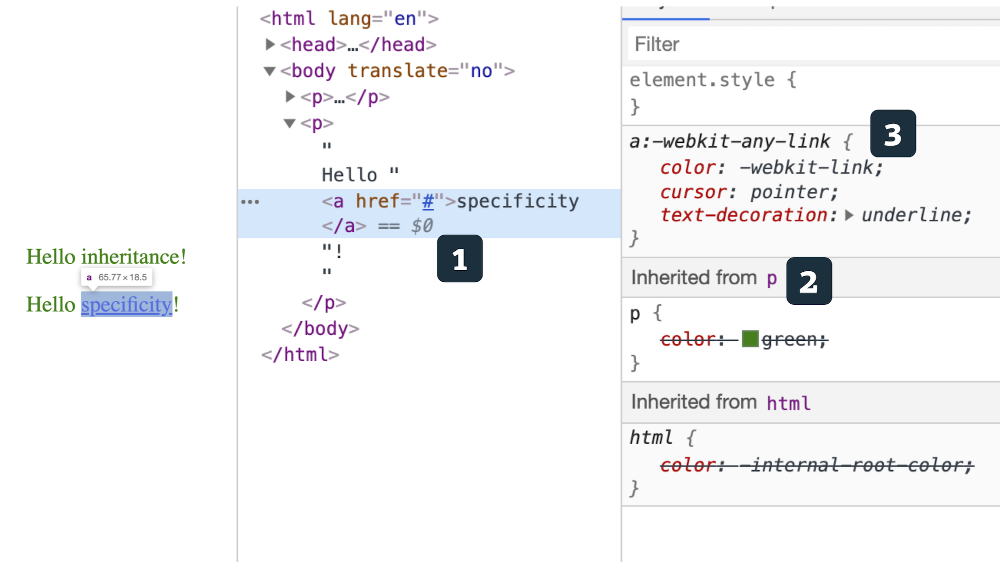
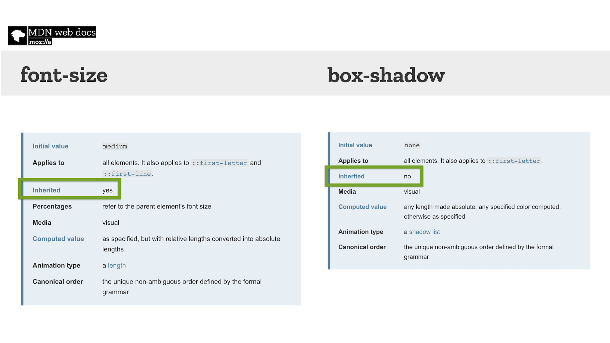

# Dědičnost v CSS: Co to je a kterých vlastností se týká?

Dědičnost je spolu s [kaskádou](css-kaskada.md) jako dvě sestry. A my, weboví vývojáři, jejich rodiče.

Občas nás děti dost zlobí, jindy se mezi sebou mlátí… prostě nám jednou za čas lezou na nervy. Jenže – co s tím naděláme?

Nezbývá než se s nimi smířit, pochopit je a najít způsob, jak spolu všichni můžeme vycházet.

## Co je dědičnost? {#co-je}

Dědičnost v CSS je způsob, jakým se dostávají hodnoty vlastností od rodičovských elementů k potomkům.

Podívejte se na video „Základy CSS: Dědičnost“.

YouTube: [youtu.be/bRZzF0rzfDw](https://www.youtube.com/watch?v=bRZzF0rzfDw)

Dědičnost umožňuje skvělou věc, kterou si už často ani zkušenější mezi námi neuvědomují – nemusíme totiž v každé deklaraci uvádět všechny vlastnosti, které mají element stylovat.

Vezměme jednoduchý příklad:

```html
<p>
  Hello <span>inheritance</span>!
</p>
```

Chci, aby byl celý text zelený, včetně obsahu prvku `<span>`. Stačí uvést:

```css
p {
  color: green;
}
```

Obsah prvku `<span>` prostě podědí obsah vlastnosti `color` definované na rodiči.

CodePen: [https://codepen.io/machal/pen/eYYEOEd](https://codepen.io/machal/pen/eYYEOEd?editors=1100)

To nejjednodušší bychom měli za sebou. Co když se do toho ale připletou vlastnosti kaskády?

## Kaskáda je jako starší sestra, vždycky vyhraje {#dedicnost-vs-kaskada}

Připomeňme si, že [kaskádu](css-kaskada.md) v CSS definují tři pravidla:

1. pořadí rozhoduje a poslední vyhrává
2. selektor s vyšší váhou (specificitou) vyhrává
3. pravidlo označené jako důležité (`!important`) vyhrává

A teď to důležité – pokud je možné se k hodnotě dopočítat kaskádou, vždy dostane přednost před dědičností.

<!-- AdSnippet -->

Podívejme se na další příklad, abychom si to vizualizovali.

```html
<p>
  Hello <a href="#">specificity</a>!
</p>
```

Ačkoliv opět definujeme styl všech odstavců zelenou barvou, prvek `<a>` se zde obarví výchozí modrou pro odkazy. Co se stalo?

<figure>

<figcaption markdown="1">
*Obrázek: Vybraný prvek [1] sice zdědí barvu od rodičovského prvku [2], jenže vyhraje to selektor definovaný v kaskádě [3].*
</figcaption>
</figure>

Prohlížeč zde sice správně podědil deklaraci od rodiče…

```css
p {
  color: green;
}
```

… jenže zároveň má ve svých výchozích stylech definován tento předpis:

```css
a:-webkit-any-link {
  color: -webkit-link;
  cursor: pointer;
  text-decoration: underline;
}
```

Do hry tady, jako skoro vždy, tedy vstupuje kaskáda. Je to větší sestra, která skoro vždy přepere tu menší.

CodePen: [https://codepen.io/machal/pen/dyyzbWd](https://codepen.io/machal/pen/dyyzbWd?editors=1100)

Je ale dobré vědět, že kaskáda se týká vždy jen aktuálního prvku. Například rodič s vyšší váhou [selektoru](css-selektory.md) nepřebije styl potomka. Náš pokus o odstranění kurzívy na vnitřním prvku pomocí zvýšení specificity rodiče proto nemohl být úspěšný. Však se podívejte na ukázku.

CodePen: [https://codepen.io/machal/pen/GRRvYgQ](https://codepen.io/machal/pen/GRRvYgQ?editors=1100)

## Vlastnosti, které dědí: styly textu, rámečků, seznamů a viditelnost {#vlastnosti}

V CSS se nedědí všechny vlastnosti. Jejich seznam najdete níže. Teď řekněme, že máme tenhle příklad:

```html
<div class="box">
  Hello
  <div>
    inheritance!
  </div>
</div>
```

A CSS:

```css
.box {
  color: green;
  padding: 1rem;
  border: 1px solid grey;
}
```

Výsledkem bude, že vnitřní `<div>` sice podědí barvu, ale už ne nastavení vlastností `padding`, ani `border`. Je to snad chyba? Ne, došli jsme k tomu, že v CSS se dědí jen některé vlastnosti.

Jsou to snad všechny vlastnosti textu, některé vlastnosti rámečků, některé vlastnosti odrážkových seznamů, vlastnosti pro zvukové vyjádření obsahu (jako `volume`) také viditelnost (`visibility`).

<!-- AdSnippet -->

Následuje kompletní seznam, ze kterého jsou vyloučené vlastnosti pro zvukové vyjádření obsahu, které jsou méně používané.

* `border-collapse`
* `border-spacing`
* `caption-side`
* `color`
* `cursor`
* `direction`
* `empty-cells`
* `font-family`
* `font-size`
* `font-style`
* `font-variant`
* `font-weight`
* `font-size-adjust`
* `font-stretch`
* `font`
* `letter-spacing`
* `line-height`
* `list-style-image`
* `list-style-position`
* `list-style-type`
* `list-style`
* `orphans`
* `quotes`
* `tab-size`
* `text-align`
* `text-align-last`
* `text-decoration-color`
* `text-indent`
* `text-justify`
* `text-shadow`
* `text-transform`
* `visibility`
* `white-space`
* `widows`
* `word-break`
* `word-spacing`
* `word-wrap`

Vycházím zde [z kompletního seznamu](https://www.w3.org/TR/CSS21/propidx.html) CSS vlastností ve specifikaci.

<figure>

<figcaption markdown="1">
*Obrázek: V dokumentaci na [developer.mozilla.org](https://developer.mozilla.org/) nebo ve specifikaci CSS lze najít, zda se hledaná CSS vlastnost dědí a jaká je její výchozí hodnota.*
</figcaption>
</figure>

<div class="related" markdown="1">

- [„Problémy“ CSS](css-jazyk-problemy.md)
- [Kaskáda a specificita](css-kaskada.md)
- Dědičnost v CSS
- [Selektory v CSS](css-selektory.md)
- [Pseudotřídy v CSS](css-pseudotridy.md)

</div>

Pojďme si tedy zopakovat, co víme o dědičnost, jedné ze dvou základních vlastností CSS:

* Díky dědičnosti není nutné psát ke každému elementu všechny jeho vlastnosti. Část se přebere od rodičovských prvků.
* Kaskáda (a hlavně specificita selektorů) nad dědičností vždycky vyhrává.
* Dědičnost se vztahuje jen na vlastnosti textu, barvu, některé vlastnosti seznamů a rámečků a viditelnost.

V dalším textu se podíváme na nastavování zděděných a výchozích hodnot pomocí klíčových slov `inherit`, `initial`, `unset`, `revert` a [vlastnosti `all`](css-all-inherit-initial-unset-revert.md).

<!-- AdSnippet -->
