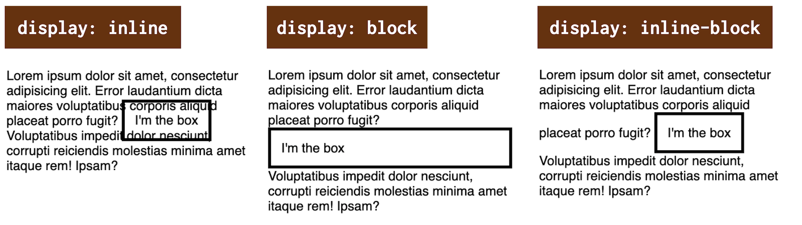
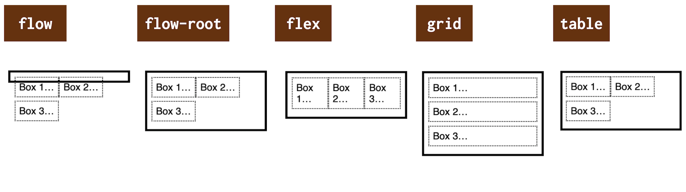
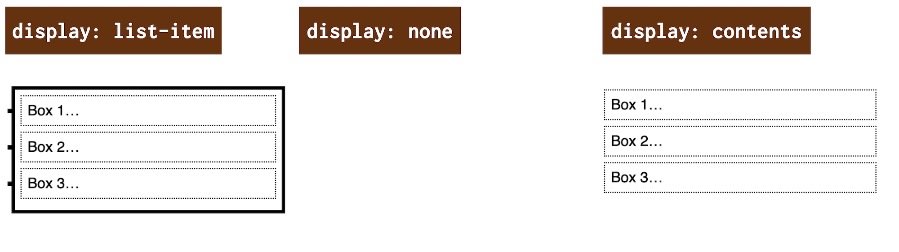

# CSS vlastnost display

Vlastnost `display` slouží k určení způsobu vykreslení prvku. Může to být i relativně komplikovaná věc a má spoustu nových hodnot.

<div class="ebook-only" markdown="1">

Abyste totiž mohli začít vytvářet nějaký typ rozvržení v CSS, musíte většinou nejprve rodičovskému prvku nastavit určitý typ „formátovacícho kontextu“. K tomu právě obvykle slouží vlastnost `display`.

</div>

Vy, kteří znáte její základní hodnoty jako `block` nebo `inline` možná budete překvapení, že od roku 2020 zde máme novou verzi specifikace, která přidává řadu dalších možností – „CSS Display Module Level 3“. [vrdl.in/w3disp](https://www.w3.org/TR/css-display-3/)

Ale víte co? Začneme jednoduchým přehledem nejužitečnějších hodnot. Většinu z nich asi znáte.

<div class="rwd-scrollable f-6" markdown="1">

| Hodnota                   |  Jak se zobrazuje |
|---------------------------|-------------------|
| `inline`                  |  Řádkový element, který netvoří zalomení před sebou nebo po sobě. (výchozí)        |
| `block`                   |  Blokový element. Zalomí řádky před sebou i po sobě. |
| `inline-block`            |  Vnitřně se jedná o blokový element, zvnějšku inline, který netvoří zalomení.                 |
| `flex`, `inline-flex`     |  Vytvoří [flexboxové rozvržení](css-flexbox.md). Inline varianta nezalomí řádky před a po.  |
| `grid`, `inline-grid`     |  Vytvoří [rozvržení do mřížky](css-grid.md). Inline varianta opět nezalomí řádky.  |
| `table`, `inline-table`   |  Rozvržení do tabulky. Inline varianta opět tvoří tabulku v řádce.  |
| `none`                    |  Nevykreslí prvek, ale ani jeho potomky.  |

</div>

V tabulce zdaleka nejsou všechny možnosti a popsány všechny jejich specifické vlastnosti, nástrahy a vychytávky. Proto čtěte dál.

Víte například, že…?

- S pomocí [hodnoty `flow-root`](#vnejsi) nemusíte pro „floaty“ používat „clearfix“, tedy reset plovoucího layoutu?
- Firefox podporuje [víceslovná označení](#viceslovna) jako `inline flex`?
- Pro schovávání prvku existuje kromě hodnoty `none` také [hodnota `contents`](#none-contents)?

V CSS je stále těžší najít vlastnost, která by byla snadná k pochopení a naučení.

<!-- AdSnippet -->

Možná to překvapí i vás, zkušenější, ale jak vidíte nebo brzy uvidíte docela široký záběr člověk potřebuje i pro vstřebání vlastnosti `display`. Pojďme se teď podívat do jejího světa.

## Vnitřní a vnější zobrazení {#typy}

První věc, kterou si musíme uvědomit, je holý fakt, že nově podle specifikace existují dva typy zobrazení:

- _Vnitřní zobrazení_  
Hodnota vlastnosti `display` určuje, jak prohlížeče rozloží potomky prvku. Sem patří hodnoty jako `flex`, `grid` nebo `table`.
- _Vnější zobrazení_  
Hodnota definuje, jak se sám prvek podílí na rozložení stránky. Pohled zvenčí. Toto určují hodnoty jako `inline`, `block` nebo `none`.

Máte? Výborně. Toto se nám bude hodit, až budeme hovořit o hodnotách pro více klíčových slov.

## Vnější zobrazení {#vnejsi}

Vnější zobrazení v podstatě určuje roli stylovaného boxu v uspořádání toku stránky.

<figure>

<figcaption markdown="1">
*Hodnoty pro vnější zobrazení jsou naši staří známí.*
</figcaption>
</figure>

Do tohoto typu zobrazení patří následující hodnoty:

- `inline`  
Vytvoří boxík, který je „inline-level“, řádkový. Před sebou a po sobě nic nezalomí, prostě se vykreslí do řádky.
- `block`  
Vygeneruje boxík, který je „block-level“. Zjednodušeně to znamená, že se vykreslí do celé šířky rodiče a zalomí řádky před sebou i po sobě.
- `inline-block`  
Generuje boxík, která se zvenčí chová jako řádkový a uvnitř generuje vždy nový blokový kontext. Mimochodem, specifikace s touto hodnotou do budoucna počítá jen jako jiným zápisem pro dvojici klíčových slov `inline flow-root`. O tom píšu později.
- `run-in`  
Vygeneruje typ „inline-level“ boxu se zvláštním chováním – pokusí se sloučit do následujícího blokového prvku. Pokud za „run-in“ prvkem následuje blokový prvek, „run-in“ se stane jeho prvním inline boxem. Pokud bude následovat inline pole, stane se z „run-in“ prvku blokový.

V CodePenu si můžete vyzkoušet všechny možnosti.

CodePen: [cdpn.io/e/wvzYXeg](https://codepen.io/machal/pen/wvzYXeg?editors=0000)

Varianta s display `run-in` v mé ukázce chybí, není totiž podporovaná jinde než v [Internet Exploreru](msie.md) (!). V tomto dědečkovi mezi prohlížeči nefunguje CodePen, takže byste z ukázky nic neměli. Viz podpora na CanIUse.com. [caniuse.com/run-in](https://caniuse.com/run-in)

## Vnitřní zobrazení {#vnitrni}

Hodnoty vnitřního zobrazení zapínají uvnitř dotčeného prvku nový kontext formátování (k tomu se v CSS používá pojem „formatting context“). No a ten mívá vliv na způsob vykreslení vnitřních prvků, případně na použití dalších vlastností na nich.

- `flow`  
Hodnota `flow` zapíná formátování tokem („flow layout“), což je běžný způsob zobrazení, který automaticky zapnou hodnoty `block`, `inline` a `inline-block`. Pokud vím, toto zatím není v prohlížečích podporováno, nicméně jde o výchozí režim rozvržení v CSS.
- `flow-root`  
Vytvoří kontejner blokového kontextu (jako `display:block`) a rozloží jeho obsah pomocí toku (flow layout). Hodnota `flow-root` ale vždy generuje nový kontext formátování bloku pro svůj obsah, takže není například nutné mazat „floaty“ pomocí „clearfixu“. Na této hodnotě je zajímavé, že ji podporují všechny moderní prohlížeče. Internet Explorer nikoliv. [caniuse.com/flow-root](https://caniuse.com/flow-root)
- `flex`  
Zapíná formátovací kontext [flexboxu](css-flexbox.md). Ze stylovaného prvku udělá flex kontejner a z přímých potomků flex položky. Podporováno všude.
- `grid`  
Spouští formátovací kontext [gridu](css-grid.md). Ze stylovaného prvku udělá  kontejner mřížky a z přímých potomků její položky. Podporováno všude.
- `table`  
Udělá z prvku tabulku. V tomto případě jsou zde ale dva „kontejnery“. `display:table` generuje kontejner tabulky, který vytvoří kontext formátování bloku a obsahuje dodatečně vygenerovaný rámeček tabulky, který vytvoří její kontext formátování.
- `ruby`  
Tohle je exotické a pro středoevropské prostředí nepotřebné. „Ruby anotace“ jsou krátké řady znaků umístěné vedle základního textu, které se  používají ve východoasijské typografii jako vodítko pro výslovnost.

Připravil jsem dva vysvětlující CodePeny, na kterých si můžete otestovat to, co vidíte na obrázku.

V prvním máme jednoduše a bez layoutu umístěné tři prvky v jednom rodiči.

CodePen: [cdpn.io/e/KKgGeQQ](https://codepen.io/machal/pen/KKgGeQQ?editors=0000)

`display:flow` zatím nemá v prohlížečích podporu, ale jako by tam byla… „Tokové“ je totiž výchozí zobrazení.

Zajímavější bude druhý CodePen. Všechny tři vnitřní prvky jsou „tekoucí“, floatové:

```css
.container p {
  float: left;
}
```

Výsledek vidíte na obrázku.

<figure>

<figcaption markdown="1">
*Možnosti hodnot vnitřního zobrazení s vnitřními plovoucími prvky.*
</figcaption>
</figure>

- Běžné tokové zobrazení (`display:flow`) floaty obalit neumí, potřebovali bychom už zmíněný „clearfix“.
- `display:flow-root` floaty obalí, vždy vytvoří nový kontext formátování bloku.
- Na `display:flex` a `display:grid` nemají floaty žádný vliv.
- Na vnitřní prvky v `display:table` floaty vliv mají, protože rodič je zde v běžném tokovém kontextu formátování bloku.

CodePen: [cdpn.io/e/WNGayad](https://codepen.io/machal/pen/WNGayad?editors=0000)

Pojďme ještě projít několik specifických hodnot.

## Generování boxů se značkami: `list-item` {#list-item}

Zápis `display:list-item` způsobí, že element vygeneruje pseudoprvek `::marker`.

Pokud není zadána žádná hodnota typu vnitřního zobrazení, výchozí bude tokové – jako `display:flow`. Pokud není zadána žádná hodnota typu vnějšího zobrazení, bude výchozí typ blokový – `display:block`.

Náš kontejner díky tomu můžeme stylovat, jako by to byl prvek `<ul>` nebo `<ol>`:

```css
.container {
  list-style-type: square;
}
```

Podpora `display:list-item` jde napříč všemi prohlížeči. [caniuse.com](https://caniuse.com/mdn-css_properties_display_list-item)

CodePen: [cdpn.io/e/gOwqJmq](https://codepen.io/machal/pen/gOwqJmq?editors=0000)

První příklad na následujícím obrázku ukazuje zobrazení typu `list-item`.

<figure>

<figcaption markdown="1">
*Další typy (ne)zobrazení v CSS.*
</figcaption>
</figure>

Druhou a třetí hodnotu z obrázku probereme hned v následující části.

## Schování prvků: `none` a `contents` {#none-contents}

Ke všem možným metodám ovlivnění vykreslování boxíků na obrazovku musíme přidat i metody _nevykreslování_. K tomu slouží následující dvě hodnoty vlastnosti `display`.

- `none`  
Element ani jeho potomkové se na obrazovku prostě nevykreslí.
- `contents`  
Element se na obrazovku nevykreslí, ale jeho potomkové ano.

Zobrazení typu `contents` funguje tak, jako by byl ve DOM stromu nahrazen jeho obsahem (včetně pseudoprvků jako `::before` a `::after`). Podle všeho však toto zatím není správně implementováno ve všech prohlížečích.

CodePen: [cdpn.io/e/zYKmaMb](https://codepen.io/machal/pen/zYKmaMb?editors=0000)

Podpora nezobrazení pomocí `none` je samozřejmě plná. Hodnotu `contents` zvládají všechny prohlížeče kromě Internet Exploreru, ale podle webu CanIUse je s ní spojeno několik chyb v prohlížečích vycházejících z jádra Chromium, které souvisejí s přístupností.  [caniuse.com](https://caniuse.com/css-display-contents)

## Typy zobrazení pro vnitřní rozvržení: `table-*` a `ruby-*` {#table-ruby}

Modely zobrazení, které vynucují vnitřní rozvržení, jako je `display:table` a `display:ruby`, mají složitou strukturu s několika různými rolemi, které mohou jejich  potomci plnit.

Jak je uvedeno výše, zápis `display:table` sice vytvoří kontejner tabulky, ale ten vytvoří kontext formátování bloku. Nedosáhneme tím tedy tabulkového zobrazení. K tomu bychom potřebovali další prvky, které reprezentují řádky a buňky tabulky se správnými hodnotami vlastnosti `display` (`table-row`, `table-cell`…).

Podobné je to `display:ruby`, jen ty vnitřní prvky jsou jiné.

## Hodnoty s více klíčovými slovy {#viceslovna}

Tohle je nová věc, do specifikace přidaná v druhé polovině roku 2020. Zatím to zvládá jen Firefox, ale věnovat se tomu musíme. Proč? Protože se mi to líbí.

Vzpomínáte si, když jsem psal o různých typech zobrazení – vnitřním a vnějším? Pokud ne, rychle proskenujte začátek tohoto textu nebo jeho nadpisy. Pak pochopíte, proč mi víceslovné hodnoty pro vlastnost `display` dávají smysl.

Výše uvedené hodnoty lze totiž brát jako zkratky pro víceslovná označení vnitřního, vnějšího nebo speciálního zobrazení.

<div class="rwd-scrollable f-6" markdown="1">

| Zkratka            | Plný zápis              | Co se generuje                                                 |
| ------------------ | ----------------------- | -------------------------------------------------------------- |
| `none`             | -                       | nic                                                            |
| `contents`         | -                       | prvek vynechán, generují se potomkové                         |
| `block`            | `block flow`            | blokový box                                                    |
| `flow-root`        | `block flow-root`       | blokový box, který vždy vytváří nový kontext formátování bloku |
| `inline`           | `inline flow`           | inline (řádkový) box                                           |
| `inline-block`     | `inline flow-root`      | inline (řádkový) box, který vždy vytváří nový blokový kontext  |
| `run-in`           | `run-in flow`           | run-in box (inline box se speciálními pravidly)                |
| `list-item`        | `block flow list-item`  | blokový box s přídavnou značkou položky seznamu                |
| `inline list-item` | `inline flow list-item` | inline box s přídavnou značkou položky seznamu                 |
| `flex`             | `block flex`            | blokový kontejner flexu                                        |
| `inline-flex`      | `inline flex`           | inline kontejner flexu                                         |
| `grid`             | `block grid`            | blokový kontejner mřížky                                       |
| `inline-grid`      | `inline grid`           | inline kontejner mřížky                                        |
| `table`            | `block table`           | blokový obalový rámeček tabulky                                |
| `inline-table`     | `inline table`          | inline obalový rámeček tabulky                                 |

</div>

Z tabulky je to asi zřejmé, ale pro jistotu ještě uvádím tři příklady:

- `display:block` označuje blokový prvek (`block`), který je umístěný v běžném toku dokumentu (`flow`).
- `display:inline-flex` definuje kontejner flexboxu (`flex`), který je umístěný v řádku (`inline`).
- `display:list-item` vykreslí prvek seznamu (`list-item`), který je umístěný v běžném toku (`flow`) a zároveň je blokový (`block`).

Také se těšíte, až to budou umět všechny prohlížeče? Zatím jen Firefox, na ostatní se čeká. Podporu sledujte na CanIUse. [caniuse.com](https://caniuse.com/mdn-css_properties_display_multi-keyword_values) (hledejte „display: Multi-keyword“)

<!-- AdSnippet -->

A to je k vlastnosti `display` vše, děkuji za pozornost.

<div class="web-only" markdown="1">

Text časem doplním o příklady z praxe a ještě rozvedu ten tabulkový layout. Pokud máte po ruce zajímavá využití novějších hodnot – jako `flow-root`, `contents` nebo `run-in`, budu rád, když je přidáte do komentářů.

</div>
