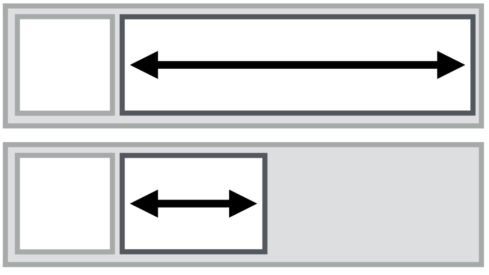
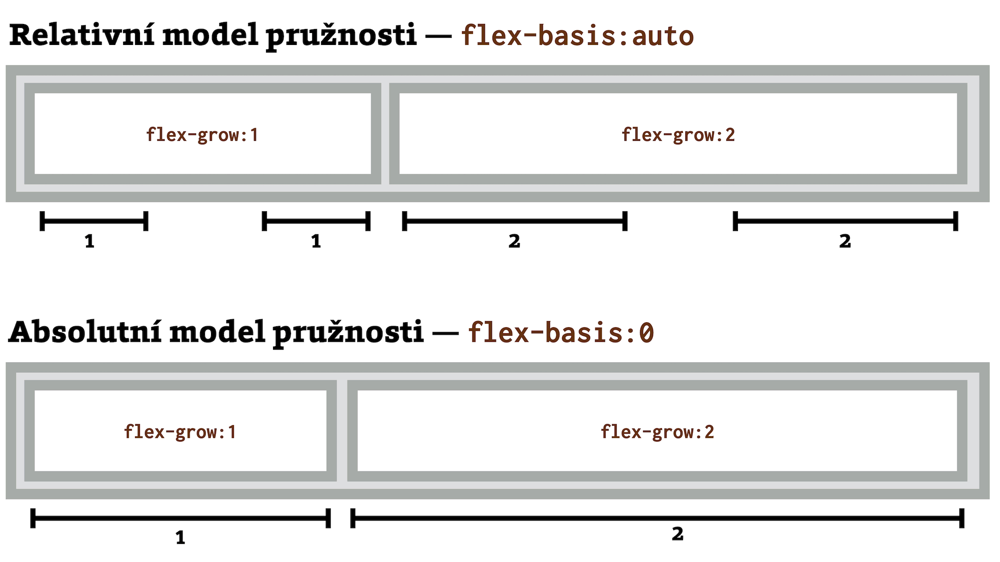
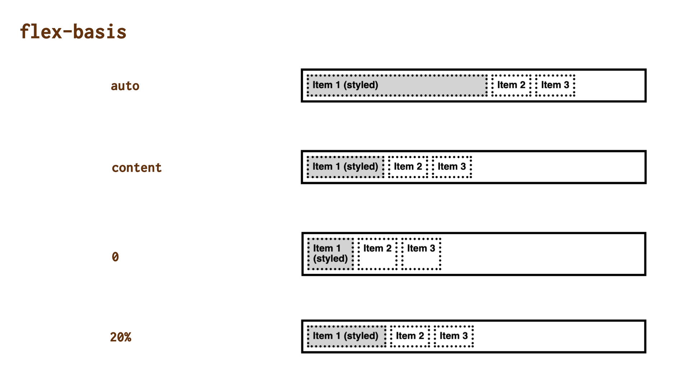

# CSS vlastnost flex-basis: velikost položky flexboxu

Vlastnost `flex-basis` určuje výchozí velikost prvku v rámci rozvržení postaveném na flexboxu.

<div class="connected" markdown="1">



<div class="web-only" markdown="1">

`flex-basis` je jedna z vlastností [flexboxu](css-flexbox.md).

</div>

<div class="ebook-only" markdown="1">

→ [vrdl.cz/p/css-flex-basis](https://www.vzhurudolu.cz/prirucka/css-flex-basis)

</div>

</div>

Je to velice podobné jako vlastnosti `width` nebo `height`, ale s tím, že velikost definovaná ve `flex-basis` má vždy přednost.

Doslovně se definuje jako šířka nebo výška před rozdělením volného prostoru v kontejneru flexboxu.

Většinou `flex-basis` určuje výchozí šířku položky, tedy jako `width`. Alternativně výšku, pokud je směr rozvržení flexboxu svislý, například pomocí nastavení [`flex-direction:column`](css-flex-direction.md).

Možné hodnoty:

- `auto` (výchozí)  
Přebírá rozměr podle `width` a `height`.  Pokud ten je také `auto`, pak platí, že rozměr určuje obsah, tedy se použije dále uvedená hodnota `content`. Distribuce volného místa pomocí [`flex-grow`](css-flex-grow.md) a [`flex-shrink`](css-flex-shrink.md) se pak bude týkat jen místa, které položky obsadily nad rámec svého obsahu – „relativní model“ pružnosti rozebírám také níže.
- `content`  
Velikost na základě obsahu položky. Toto klíčové slovo ještě není dobře podporováno. V mých CodePenech níže jsou vidět rozdíly mezi `content` a `auto` jen ve Firefoxu. Podobného efektu jako s  `flex-basis:content` dosáhnete nastavením `flex-basis:auto` a vlastností `width`/`height` také na hodnotu `auto`.
- `0`  
Nehledí se na rozměr obsahu. Distribuce volného místa pomocí `flex-grow` a `flex-basis` se bude týkat celé šířky položky – „absolutní model“ pružnosti.
- Jakýkoliv CSS rozměr, např. `20%`, `100px`, `15em`… – toto je naštěstí nejčastější a tedy ne tak komplikované.

Firefox podporuje ještě další hodnoty – `max-content` a `min-content`. O obou pak píšu v kontextu [funkce `minmax()`](css-minmax.md).

<!-- AdSnippet -->

Mimochodem, dokumentační stránka MDN zmiňuje vtipnou historii nastavení `flex-basis:auto`. Původně znamenalo „vezmi rozměry z `width`/`height`“, pak bylo změněno na „vezmi rozměry z obsahu“, aby pak bylo znovu změněno na „vezmi rozměry z `width`/`height`“. Ale nevím, zda jste zrovna tohle chtěli vědět… [mdn.io/flex-basis](https://developer.mozilla.org/en-US/docs/Web/CSS/flex-basis)

## Různé typy dělení volného prostoru {#pruznost}

Zmínil jsem dva možné způsoby počítání zvětšování nebo zmenšování velikosti položky flexboxu. Je to důležité, takže to zde vysvětlím:

- *Relativní pružnost*  
Pokud uvedeme `flex-basis:auto`, velikost boxu se počítá z obsahu a pak se teprve přičtou nebo odečtou faktory růstu (`flex-grow`) nebo smršťování (`flex-shrink`).
- *Absolutní pružnost*  
Pokud uvedeme `flex-basis:0`, nezohlední se velikost textového nebo jiného obsahu. Růst nebo smršťování se vypočítává z celé šířky boxu.

<figure>

<figcaption markdown="1">
*Není pružnost jako pružnost. Není model jako model.*
</figcaption>
</figure>

Na horním části obrázku se pružnost počítá relativně k obsahu, takže se vezme šířka obsahu a k němu se po stranách připočte volný prostor odpovídající podílu.

Na dolním části je vidět absolutní pružnost – obsah se vůbec nebere v úvahu a podíl na celku se počítá z celé šířky elementu.

Standardní je samozřejmě relativní model pružnosti, ale je potřeba vědět, co nám způsobí `flex-basis:0` nebo třeba nastavení [vlastnosti `flex`](css-flex.md) na konkrétní číslo: `flex:1`.

## Ukázky {#ukazky}

Máme zde opět jednoduché HTML:

```html
<div class="container">
  <p class="box box--one">
    <strong>Item 1 (styled)</strong>
  </p>
  <p class="box box--two">
    <strong>Item 2</strong>
  </p>
  <p class="box box--three">
    <strong>Item 3</strong>
  </p>  
</div>
```

Kontejner je nastavený jako `display:flex` a pomocí přepínačů stylujeme první položku – `.box--one`.

Ukázky jsem připravil dvě – v jedné využívám vlastnosti `flex-basis` samotnou a v druhé zároveň s `width`.

### Ukázka bez použití `width` {#ukazka-bez-width}

<figure>

<figcaption markdown="1">
*Různé možnosti hodnot. Vysvětlujeme je v textu pod obrázkem.*
</figcaption>
</figure>

Můžete zde vidět, mezi hodnotami `auto` a `content` žádné rozdíly nejsou. V Chrome, Safari ani ve Firefoxu, který `content` počítá správně. Položky `.box` totiž nemají nastavené rozměry pomocí vlastností `width` či `height`.

V případě nastavení `flex-basis:0` se použije nejmenší možný obsahový rozměr, což je v případě textu šířka nejdelšího slova.

Jakmile nastavíme rozměr (`flex-basis:20%`), chová se vlastnost stejně jako `width`.

CodePen: [cdpn.io/e/vYyNBLr](https://codepen.io/machal/pen/vYyNBLr?editors=0000)

### Ukázka s použitím `width` {#ukazka-s-width}

V druhém CodePenu jsme to zkomplikovali přidáním tohoto stylu:

```css
.box--one {
  width: 50%;
}
```

Nejdříve se možná zkuste podle výše uvedeného zamyslet, co přesně se přidáním vlastnosti `width` změní.

<!-- AdSnippet -->

Tady je potřeba si uvědomit důležitou věc, kterou už jsem zmiňoval – `flex-basis` je nadřazená vlastnost k `width` nebo `height`. Takže i když máme `width` nastavenu později, a měla by tudíž přebít `flex-basis`, nestane se tak.

Rozeberme si, proč a jak se to celé změnilo:

- `auto` – má převzít hodnotu z `width`, což se tady stalo.
- `content` – má vynutit šířku podle obsahu. Vzhledem k podpoře jen ve Firefoxu to na živo uvidíte právě jen tam.
- `0` – nejmenší obsahová šířka, přebíjí `width`.
- `20%` – konkrétní rozměr, opět přebíjí `width`.

CodePen: [cdpn.io/e/poNjzwg](https://codepen.io/machal/pen/poNjzwg?editors=0000)

## Vlastnost flex-basis a width/height {#flexbasis-width}

Z již uvedeného leccos vyplývá, ale myslím, že nebude od věci si přehledně připomenout, jak se liší nastavování rozměrů pomocí `flex-basis` od téhož s použitím `width` a `height`.

### 1) `flex-basis` má přednost {#flexbasis-width-1}

Platí, že při použití obou metod nastavení výšky nebo šířky dostane hodnota ve `flex-basis` přednost, bez ohledu na pořadí uvedení. Zkuste si to případně v ukázce.

CodePen: [cdpn.io/e/vRZWqa](https://codepen.io/machal/pen/vRZWqa?editors=1100)

### 2) `flex-basis` je obousměrné {#flexbasis-width-2}

Lze jej použít jako pro výšku, tak pro šířku. Vždy podle směru layoutu a ten určuje nejčastěji vlastnost [`flex-direction`](css-flex-direction.md).

CodePen: [cdpn.io/e/bvLOMv](https://codepen.io/machal/pen/bvLOMv?editors=1100)

### 3) `flex-basis` se nezmenší pod minimální velikost obsahu {#flexbasis-width-3}

Na rozdíl od `width` a `height` nemůže být `flex-basis` menší než minimální šířka obsahu, což je například u textu šířka nejdelšího slova.

CodePen: [cdpn.io/e/OvgYZm](https://codepen.io/machal/pen/OvgYZm?editors=1100)

### 4) Minimální a maximální velikost platí {#flexbasis-width-4}

Pokud byste chtěli omezit velikost prvku minimemem nebo maximem, můžete využít vlastností `min-width`/`height` a `max-width`/`height`.

Toto platí právě proto, že:

- rozměry prvku ve flexboxu se berou z `flex-basis`,
- pokud není definováno, pak z `width`/`height`,
- pokud ani jedno není definováno, pak z obsahu.

```
flex-basis > width/height > obsah
```

`flex-basis` má přednost před `width`/`height` a ty mají přednost před obsahem.

## Používejte vlastnost flex {#pouzivejte-flex}

Obecně navíc platí, že [vlastnost `flex`](css-flex.md) je lepší než `flex-basis` a to je lepší než `width`/`height`.

Vlastnost `flex-basis` totiž zvládne jak výšku, tak šířku, což se při změně směru rozvržení může hodit.

Vlastnost `flex` je ještě praktičtější, protože má chytře vymyšlené výchozí hodnoty a zároveň pomocí ní můžete definovat další důležité vlastnosti – smršťování pomocí [`flex-shrink`](css-flex-shrink.md) nebo rozpínání pomocí [`flex-grow`](css-flex-grow.md).

## Podpora v prohlížečích {#podpora}

Základní podpora pro `flex-basis` je v prohlížečích výborná. Výjimku si nárokuje jen Internet Explorer, který při jiném nastavení než `flex-basis:auto` počítá velikost prvku podle box modelu `content-box`.

<div class="web-only" markdown="1">
→ *Související: [`box-sizing:content-box`](css3-box-sizing.md) a další hodnoty pro změnu počítání šířky boxů*
</div>

No a pak tady máme ošemetné klíčové slovo `content`. Podle chování mých demíček usuzuji, že správně ji ke dni psaní interpretuje jen Firefox, stejně jako klíčová slova `max-content` a `min-content`.

Více najdete na [CanIUse.com](https://caniuse.com/mdn-css_properties_flex-basis).

<!-- AdSnippet -->
