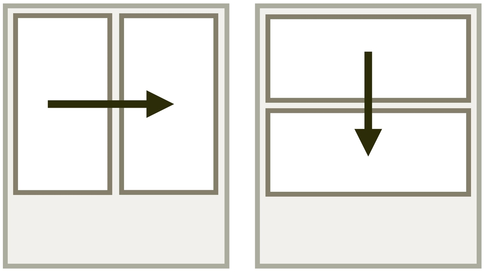

# CSS vlastnost flex-direction: směr vyskládání položek flexboxu

Vlastnost `flex-direction` se aplikuje na kontejner flexboxu a určí způsob vyskládání položek tím, že nastaví směr hlavní osy flexboxu.

<div class="connected" markdown="1">



<div class="web-only" markdown="1">

`flex-direction` je jedna z vlastností [flexboxu](css-flexbox.md).

</div>

<div class="ebook-only" markdown="1">

→ [vrdl.cz/p/css-flex-direction](https://www.vzhurudolu.cz/prirucka/css-flex-direction)

</div>

</div>

Toto jsou možné hodnoty:

- `row`  
(Výchozí hodnota.) Vyskládá flex položky do řádky.
- `row-reverse`  
Do řádky, ale v opačném směru, tedy zprava doleva.
- `column`  
Položky flexboxu se skládají shora dolů, do sloupce.
- `column-reverse`  
Do sloupce, ale v opačném směru, tedy zdola nahoru.

<figure>

<figcaption markdown="1">
*Jakým směrem se flexboxové rozvržení vykreslí?*
</figcaption>
</figure>

V živé ukázce je možné interaktivě zkoušet všechny varianty hodnot vlastnosti.

CodePen: [cdpn.io/e/NWREVGG](https://codepen.io/machal/pen/NWREVGG?editors=0000)

## Zkratka flex-flow {#flex-flow}

Také u této vlastnosti můžete použít [zkratku `flex-flow`](css-flex-flow.md):

```css
.box {
  flex-flow: column; /* = flex-direction: column */
}
```

## Záludnosti změny pořadí {#poradi}

Je potřeba říci, že směr layout ve flexboxu vždy vychází ze zvyklostí daného jazyka – u nás tedy zleva doprava, v arabštině zprava doleva, v některých verzích zápisu japonštiny shora dolů. Jak jsem [psal jinde](css-flexbox-dobre-vedet.md), záleží to také na nastavení vlastností `writing-mode` a `direction`.

<div class="web-only" markdown="1">

O směru psaní dokumentu a tvorbě layoutu pro jazyky sázené v jiných směrech píšu více v textu o [CSS logical properties](css-logical.md), logických vlastnostech a hodnotách.

</div>

<div class="ebook-only" markdown="1">

Mimochodem, v poslední „přílohové“ kapitole píšu o [CSS logical properties](css-logical.md), logických vlastnostech a hodnotách a obecně možnosti sázení dokumentu v jazycích, které mají jiný směr toku než ten náš.

</div>

<!-- AdSnippet -->

Pořadí vykreslení položek se v případě vlastností `row` a `column` bere z pořadí v kódu. Pokud chcete pořadí otočit, prostě zvolte hodnoty `row-reverse` nebo `column-reverse`. Pozorní si asi všimli, že vlastnost `flex-direction` lze tím pádem použít i pro změnu řazení seznamů.

Změna pořadí má ale vliv jen na výsledek vykreslení, nikoliv např. na pořadí vykreslování a na procházení při navigaci klávesou `Tab` nebo čtečkami pro slabozraké.

Proto si na změnu směru dávejte velký pozor a vždy si představte, zda „čtení“ dokumentu bude dávat smysl i při pořadí uvedeném v DOMu. Je to ostatně podobné jako u [vlastnosti `order`](css-order.md) a více to rozebírám v textu [CSS layout a přístupnost](css-layout-pristupnost.md).

## Vliv na `flex-basis` {#flex-basis}

Pokud je `flex-direction` nastaveno na hodnotu `column`, [vlastností `flex-basis`](css-flex-basis.md) nastavujete výšku, tedy vlastnost `height`, nikoliv šířku a tedy `width`.

## Podpora v prohlížečích {#podpora}

Vlastnost `flex-direction` funguje dobře. Jedinou mě známou výjimkou je flexbug číslo 14, kdy při použití `display:inline-flex` a `flex-flow:column wrap` prohlížeče neumí správně roztáhnout kontejner do celé šířky položek. Ale to je drobnost, na kterou často lidé ani nenarazí. Více o tom píšu v textu [o chybách v CSS layoutech](css-layout-bugy.md).

Více o podpoře je na  [CanIUse.com](https://caniuse.com/mdn-css_properties_flex-direction).

<!-- AdSnippet -->
