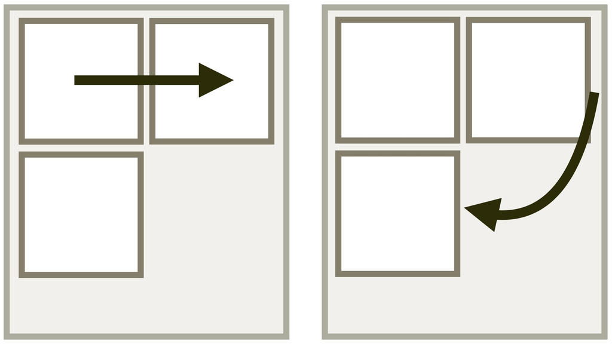
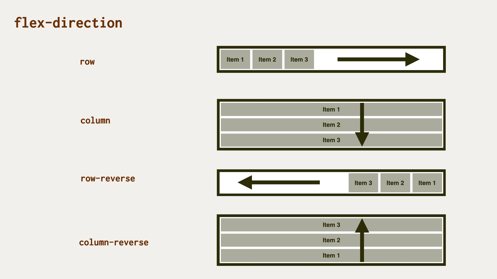
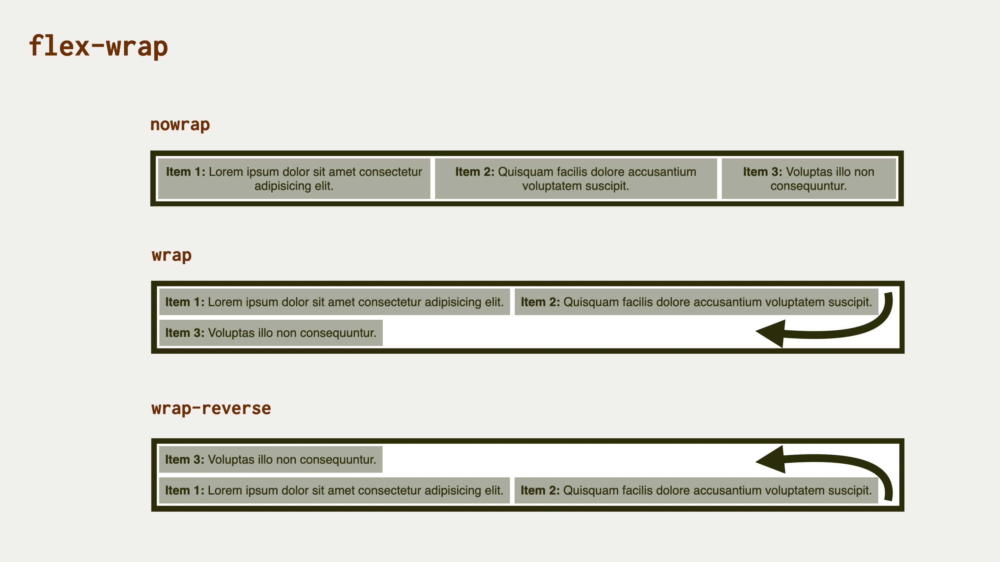

# CSS vlastnost flex-flow: zkratka pro určení směru a zalamování flexboxu

Vlastnost `flex-flow` určuje směr a způsob zalamování položek flexboxu.

<div class="connected" markdown="1">



<div class="web-only" markdown="1">

`flex-flow` je jedna z vlastností [flexboxu](css-flexbox.md).

</div>

<div class="ebook-only" markdown="1">

<div class="book-index" data-book-index="flex-flow"></div>

→ [vrdl.in/cssff](https://www.vzhurudolu.cz/prirucka/css-flex-flow)

</div>

</div>

Jde o zkratku pro dvě vlastnosti, které jsme uváděli již dříve:

- [`flex-direction`](css-flex-direction.md) – směr vykreslování flexboxového rozvržení.
- [`flex-wrap`](css-flex-wrap.md) – zalamování položek layoutu na více řádků.

V obecné rovině je zápis následující:

```css
flex-flow: <hodnota flex-direction> <hodnota flex-wrap>;
```

Vzhledem k tomu, že obě vlastnosti používají jiná klíčová slova pro své hodnoty, je možné je uvádět v libovolném pořadí a samozřejmě úplně v klidu jednu z nich vynechat.

<!-- AdSnippet -->

<div class="web-only" markdown="1">

Níže to v textu rozebereme více, ale obrázky napoví. Jako vždy. Nejprve k `flex-direction`.

<figure>

<figcaption markdown="1">
*Vlastnost `flex-direction` přikáže flexboxovému rozvržení směr vykreslování.*
</figcaption>
</figure>

A co vlastnost `flex-wrap`? Tramtadadá, tady ji máme!

<figure>

<figcaption markdown="1">
*Bude se to zalamovat, a pokud ano jakým směrem? Tomu velí vlastnost `flex-wrap`.*
</figcaption>
</figure>

<!-- .web-only -->
</div>

Toto jsou příklady možných hodnot:

- `column`  
Jako `flex-direction:column`. Položky flexboxu se skládají do sloupce.
- `wrap`  
Odpovídá `flex-wrap:wrap`. Kontejner flexboxu umožní položkám, aby se zalomily na další řádek.
- `column wrap`  
Ekvivalentní k `flex-direction:column;flex-wrap:wrap`.
- `row-reverse wrap`  
Ekvivalentní k `flex-direction:row-reverse;flex-wrap:wrap`.

Všechno je to dobře vidět v online ukázce na CodePenu, kde si také můžete měnit velikost písma, šířku viewportu nebo to jinak rozbíjet a při tom se to všechno naučit.

CodePen: [vrdl.in/3zji8](https://codepen.io/machal/pen/JjReqbB?editors=0000)

## Podpora v prohlížečích {#podpora}

Podpora vlastnosti `flex-flow` je přímo luxusní. Podívejte se na CanIUse a uvidíte samá zelená políčka, včetně Internet Exploreru. [CanIUse.com](https://caniuse.com/mdn-css_properties_flex-flow)

Jedinou vadou na kráse je kombinace hodnot `display:inline-flex` a `flex-flow:column wrap`, nepříliš známá a nepříliš omezující chyba, kterou jsme se zabývali už [u vlastnosti `flex-direction`](css-flex-direction.md).

<!-- AdSnippet -->
