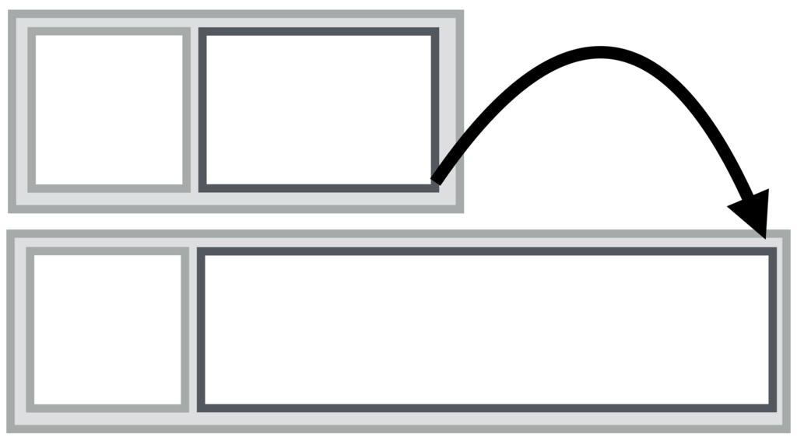
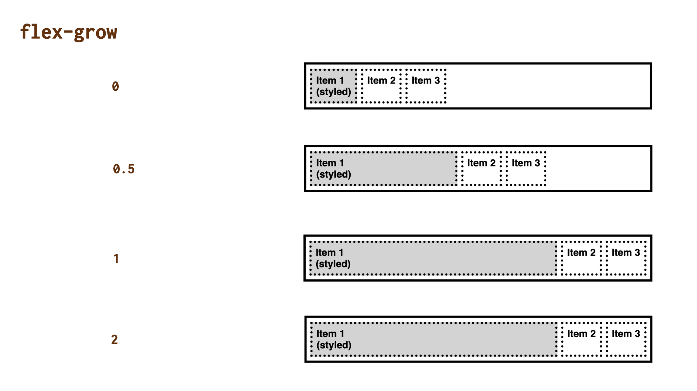

# CSS vlastnost flex-grow: faktor zvětšování položky flexboxu

Jak moc může položka růst relativně k dalším položkám, pokud je k dispozici volné místo – například když uživatel zvětší okno prohlížeče? To určuje vlastnost `flex-grow`.

<div class="connected" markdown="1">



<div class="web-only" markdown="1">

`flex-grow` je jedna z vlastností [flexboxu](css-flexbox.md).

</div>

<div class="ebook-only" markdown="1">

→ [vrdl.cz/p/css-flex-grow](https://www.vzhurudolu.cz/prirucka/css-flex-grow)

</div>

</div>

Specifikace a praktická zkušenost nás – namísto používání vlastnosti `flex-grow` – navádejí spíše ke [zkratce `flex`](css-flex.md), ale přesto považuji za nutné se o této vlastnosti zmínit.

Možné hodnoty:

- `0` (výchozí)  
Znamená, že položka s přibývajícím volným místem nijak neroste.
- Kladná čísla (např. `0.5`, `1`, `2`…)  
Položky si rozdělují podíly z nově získaného místa nad rámec výchozí šířky.

Záporné hodnoty zde nejsou validní, ale desetinná čísla jsou povolená, což už jste viděli.

<!-- AdSnippet -->

## Demo {#demo}

V interaktivní ukázce máme kontejner flexboxu (`display:flex`) a první položce přidáváme různě hodnoty vlastnosti `flex-grow`:

<figure>

<figcaption markdown="1">
*Jak se bude položka flexboxu roztahovat do volného místa?*
</figcaption>
</figure>

Druhé a třetí položce jsme jsme nenastavili žádnou šířku. HTML vypadá následovně:

```html
<div class="container">
  <p class="box box--one">
    <strong>Item 1<br>(styled)</strong>
  </p>
  <p class="box box--two">
    <strong>Item 2</strong>
  </p>
  <p class="box box--three">
    <strong>Item 3</strong>
  </p>  
</div>
```

Ve výchozím stavu se všechny tři položky roztáhnou podle své přirozené velikosti.
Pokud bude v rodičovském kontejneru dostatek volného místa, pak si první položka, stylovaná přepínači nahoře, vezme tolik zbývajícího prostoru, kolik jsme jí ochotní dát právě nastavením vlastnosti `flex-grow`:

- `0` – zůstane na výchozí šířce.
- `0.5` – vezme si polovinu volného prostoru.
- `1` – roztáhne se do celé šířky volného prostoru.
- `2` – opět se jen roztáhne do celé šířky volného prostoru.

U poslední možnosti, nastavení na `2` se pozastavme. Je zde vidět, že `flex-grow` hospodaří vždy jen s prostorem uvnitř kontejneru flexboxu, takže neumožní položce zabrat dvojnásobek zbytku a vyrůst tedy mimo kontejner.

<!-- AdSnippet -->

Hodnota `2` by měla efekt pokud bychom v demu změnili nastavení růstu ostatních položek, například na `flex-grow:1`. V takovém případě by se stala poněkud obézní a zabrala by ze zbylého prostoru dvojnásobek oproti jejím dvěma sestrám.

CodePen: [cdpn.io/e/XWNbNQE](https://codepen.io/machal/pen/XWNbNQE?editors=0000)

## Podpora v prohlížečích {#podpora}

Podpora CSS vlastnosti `flex-grow` je plná. Jen pro zajímavost zmiňuji, že v Internet Exploreru 10 byla tato vlastnost pojmenována ještě jako `-ms-flex-positive`. Více o podpoře v prohlížečích najdete na webu [CanIUse](https://caniuse.com/mdn-css_properties_flex-grow).

<!-- AdSnippet -->
