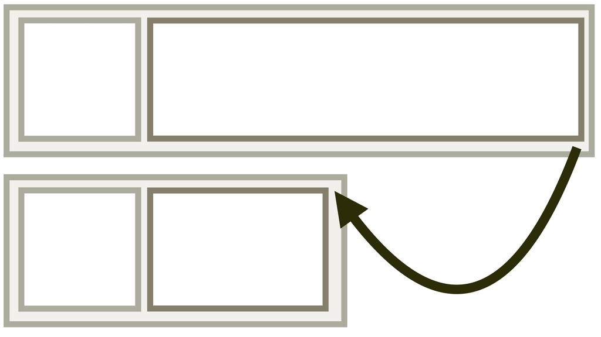
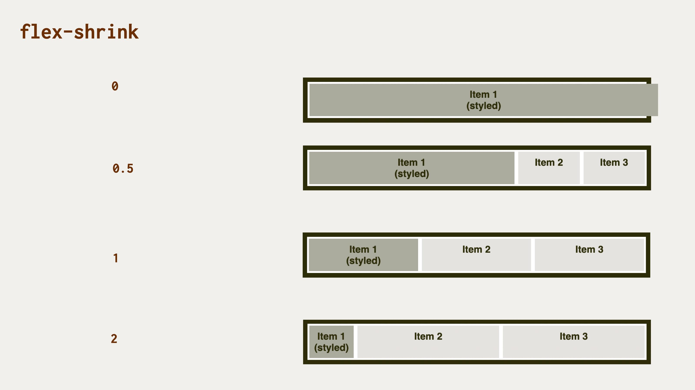

# CSS vlastnost flex-shrink: faktor smršťování položky flexboxu

Jakým podílem se může položka flexboxu zmenšovat, pokud v rodičovském kontejneru místo ubylo? Od toho tady máme vlastnost `flex-shrink`.

<div class="connected" markdown="1">



<div class="web-only" markdown="1">

`flex-shrink` je jedna z vlastností [flexboxu](css-flexbox.md).

</div>

<div class="ebook-only" markdown="1">

→ [vrdl.cz/p/css-flex-shrink](https://www.vzhurudolu.cz/prirucka/css-flex-shrink)

</div>

</div>

Také v jejím případě platí, že je obecně lepší místo ní používat [zkratku `flex`](css-flex.md). Problematikou smršťování položek flexboxu se tady ale zabývat budeme, to si pište, že ano.

Možné hodnoty:

- `1` (výchozí)  
Položka si z vlastní šířky ubere část odpovídající celé velikosti smrštění.
- Kladná čísla (např. `0.5`, `1`, `2`…)  
Položka si ze své šířky vezme podíl z ubrané části kontejneru odpovídající tomuto číslu.
- `0`  
Položka je tvrdohlavá a smršťovat se nebude. A nebude!

Možná to celé zní trošku zašmodrchaně a bude lepší ukázat si to na obrázku a interaktivním demu.

## Demo {#demo}

Pevně doufám, že když se podíváte na obrázek, problematiku smršťování a vlastnosti `flex-shrink` snáze pochopíte.

<figure>

<figcaption markdown="1">
*Různé hodnoty vlastnosti na první položce dělají různé smršťování.*
</figcaption>
</figure>

Na rodiči (`.container` s nastavením `display:flex`) zde leží tíha udržet na uzdě tři potomky (`.box`):

```html
<div class="container">
  <p class="box box--one">
    <strong>Item 1<br>(styled)</strong>
  </p>
  <p class="box box--two">
    <strong>Item 2</strong>
  </p>
  <p class="box box--three">
    <strong>Item 3</strong>
  </p>  
</div>
```

Demo jsme obohatili ještě o nastavení každého potomka tak, aby se pokoušel urvat co nejvíce prostoru z rodiče:

```css
.box {
  width: 100%;
}
```

Ta paralela se skutečným rodičovstvím je zde až mrazivá. Mámy a tátové mezi čtenáři vědí, že takhle rozpínavé děti, bojující o každé volné místo naší pozornosti, nechceme, ale nakonec jsou takové nějakou chvíli všechny. Ale nic, zpět k CSS…

<!-- AdSnippet -->

Podívejme se na různé možnosti nastavení `flex-shrink`, které dostává první dítě  (nebo raději _potomek_) jménem `.box`:

- `0` – nesmršťuje se. Nebude se za žádnou cenu omezovat. Jednou jsme řekli `width:100%`, tak co bychom také chtěli…? Podřídí se tomuto pravidlu a oba ostatní sourozence vytlačí ven. Vzhledem k tomu, že výchozí hodnota `flex-shrink` je `1`, sourozenci si poctivě ze své šířky ubrali.
- `0.5` – ubere si polovinu oproti sourozencům, takže při zmenšování rodičovského prvku zabírá stále více místa.
- `1` – v tomto případě se všichni potomkové spravedlivě smršťují stejným podílem. (Z pohledu rodiče ideální stav.)
- `2` – první položka si ubírá dvojnásobek oproti zbylým dvěma.

Je to trochu jasnější? Snad ano. Živou ukázku hledejte na následujícím odkaze.

CodePen: [cdpn.io/e/GRNJNVg](https://codepen.io/machal/pen/GRNJNVg?editors=0000)

## Podpora v prohlížečích {#podpora}

Podpora vlastnosti `flex-shrink` je plná. Internet Explorer 10 jako výchozí hodnotu chybně používá `0`, ale tuto informaci už ve 21. století potřebovat nebudete. Vše o podpoře najdete na webu [CanIUse.com](https://caniuse.com/mdn-css_properties_flex-shrink).

<!-- AdSnippet -->
