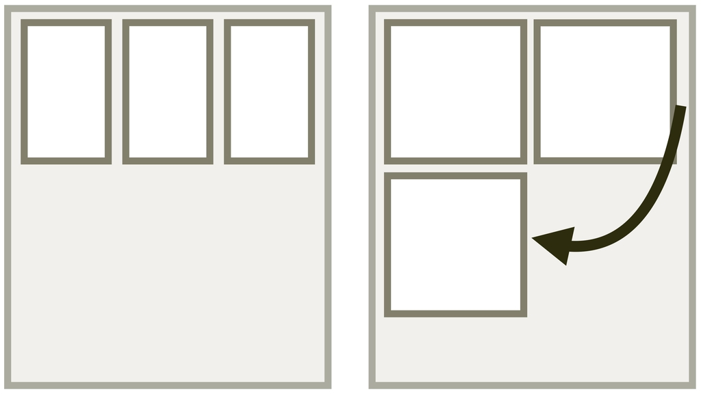
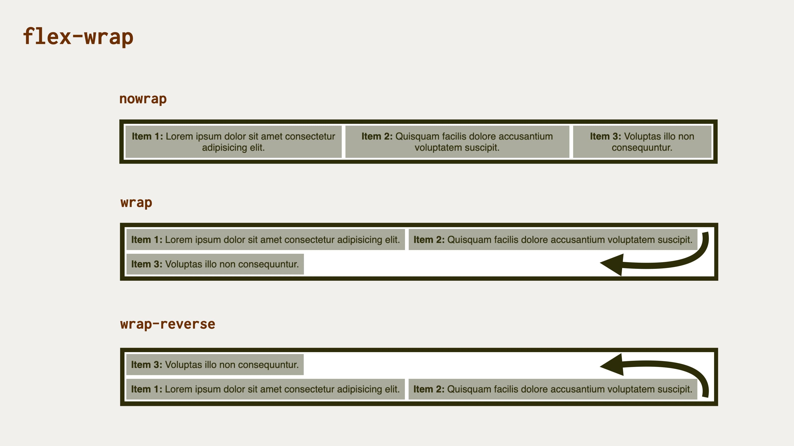

# CSS vlastnost flex-wrap: zalamování položek flexboxu

Vlastnost `flex-wrap` aplikujeme na kontejner flexboxu, abychom definovali, zda se položky rozvržení mohou zalamovat na více řádků, nebo nikoliv.

<div class="connected" markdown="1">



<div class="web-only" markdown="1">

`flex-wrap` je jedna z vlastností [flexboxu](css-flexbox.md).

</div>

<div class="ebook-only" markdown="1">

<span class="book-index" data-book-index="flex-wrap"></div>

→ [vrdl.cz/p/css-flex-wrap](https://www.vzhurudolu.cz/prirucka/css-flex-wrap)

</div>

</div>

Hodnotou `wrap-reverse` také můžeme otočit pořadí vyskládání prvků na příčné ose layoutu.

Toto jsou možné hodnoty:

- `nowrap`  
Výchozí hodnota. Flexbox bude jednořádkový.
- `wrap`  
Kontejner flexboxu umožní položkám, aby se zalomily na další řádek.
- `wrap-reverse`  
Položky se mohou zalomit do více řádků a zároveň se pořadí řádků otočí.

<figure>

<figcaption markdown="1">
Může se layout zalamovat? A pokud ano, jakým směrem?
</figcaption>
</figure>

<div class="web-only" markdown="1">

## Dva příklady {#priklady}

V obou demech máme jednoduché HTML…

```html
<div class="container">
  <p>
    <strong>Item 1</strong> …
  </p>
  <p>
    <strong>Item 2</strong> …
  </p>
  <p>
    <strong>Item 3</strong> …
  </p>  
</div>
```

… a ještě jednodušší základní CSS:

```css
.container {
  display: flex;
  flex-wrap: nowrap; /* nebo wrap, wrap-reverse */
}
```

<!-- .web-only -->
</div>

V online ukázce si můžete interaktivně vyzkoušet jednotlivé hodnoty vlastnosti `flex-wrap`:

CodePen: [cdpn.io/e/OJRaYXJ](https://codepen.io/machal/pen/OJRaYXJ?editors=0000)

<div class="web-only" markdown="1">

Připravil jsem ještě jedno demo, ve kterém jsou položky flexboxu obsahově velmi stručné a je jich daleko více, aby bylo vidět, že jde o _nepovinné_ zalamování.

<!-- AdSnippet -->

I po nastavení hodnoty na `wrap` nebo `wrap-reverse` prohlížeč uvažuje, zda vůbec zalamovat potřebuje. Je to asi jako když vypisujete text do řádku.

CodePen: [cdpn.io/e/WNoNrbB](https://codepen.io/machal/pen/WNoNrbB?editors=0000)

<!-- .web-only -->
</div>

## Nezalamuje hodnota wrap-reverse naopak?

Všimněte si prosím chování hodnoty `wrap-reverse` – položky se vyskládají dle očekávání zdola, ale zleva doprava, nikoliv naopak, jak by mohl někdo očekávat.

Dává to ale smysl. Hodnota `wrap-reverse` totiž zalamuje naopak. Poslední položka řádku skočí nahoru a zařadí se nad první položku.

## Zkratka flex-flow {#flex-flow}

Možná už víte, že můžete použít [vlastnost `flex-flow`](css-flex-flow.md), zkratku pro vlastnosti [`flex-direction`](css-flex-wrap.md) a právě `flex-wrap`.

```css
.box {
  flex-flow: wrap; /* = flex-wrap: wrap */
}
```

## Podpora v prohlížečích {#podpora}

Podpora vlastnosti `flex-wrap` je velmi dobrá a o chybách nevím.  Na webu CanIUse se u Internet Exploreru 11 v době psaní uvádí částečná podpora s poznámkou, že to je kvůli velkému počtu chyb. Trošku horší je, že je tento web neuvádí – a dle mého ani neexistují.  [CanIUse.com](https://caniuse.com/mdn-css_properties_flex-wrap)

<!-- AdSnippet -->
