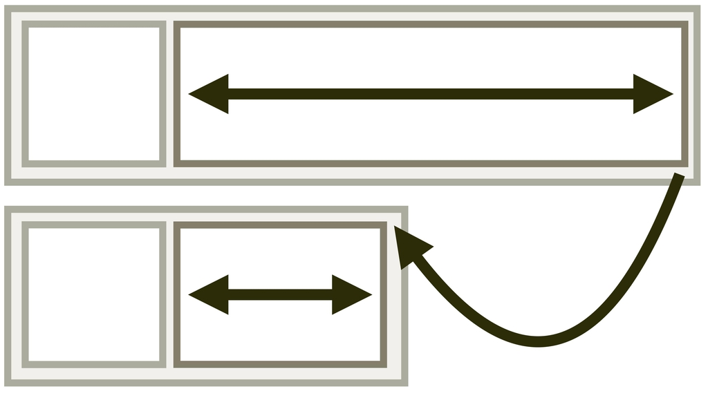
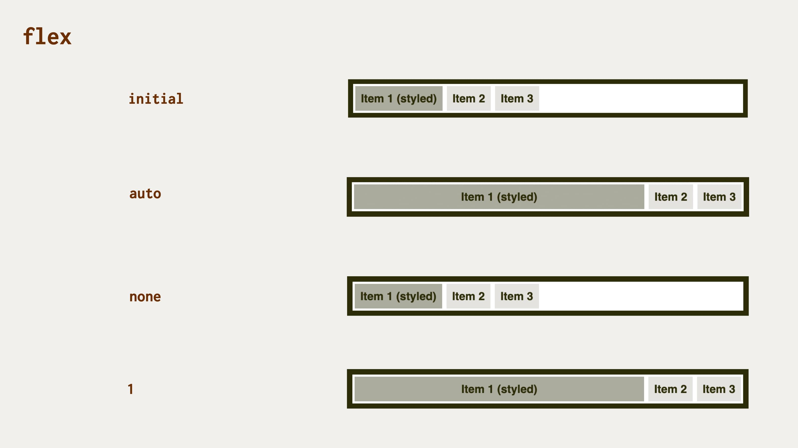

# CSS vlastnost flex: nastavení pružnosti položky flexboxu

Vlastnost `flex` nastaví výchozí velikost elementu a způsob, jakým se smí zvětšovat a zmenšovat v rámci flexboxového layoutu.

<div class="connected" markdown="1">



<div class="web-only" markdown="1">

`flex` je jedna z vlastností [flexboxu](css-flexbox.md).

</div>

<div class="ebook-only" markdown="1">

<div class="book-index" data-book-index="flex (zkratka)"></div>

→ [vrdl.in/cssf](https://www.vzhurudolu.cz/prirucka/css-flex)

</div>

</div>

Jde o zkratku pro všechny vlastnosti definující pružnost flexboxové položky:

- [`flex-grow`](css-flex-grow.md) – faktor zvětšování.
- [`flex-shrink`](css-flex-shrink.md) – faktor smršťování.
- [`flex-basis`](css-flex-basis.md) – základní velikost.

Zapsáno obecně vypadá složení hodnot vlastnosti `flex` takto:

```css
flex: 
  <flex-grow> <flex-shrink> <flex-basis>
```

Výchozí hodnota je `initial` a můžete ji zapsat následujícím způsobem:

```css
.box {
  flex: 0 1 auto;
}
```

- `flex-grow:0` – nebude se nijak roztahovat do volného místa.
- `flex-shrink:1` – smršťovat se bude stejně jako ostatní položky.
- `flex-basis:auto` – zabere prostor, který jí určí vlastní obsah.

Pokud chcete například nastavit, aby vaše položky zabíraly minimálně `150px`, v případě dostupnosti volného prostoru se rovnoměrně zvětšily a v případě zmenšení prostoru zase rovnoměrně smrštily, uděláte to takto:

```css
.box {
  flex: 1 1 150px;
}
```

## Používejte flex raději než konkrétní vlastnosti {#pouzivejte-flex}

Je dobré vědět, že autoři specifikace doporučují upřednostňovat zkratku `flex` před konkrétními vlastnostmi, které zastupuje.

<!-- AdSnippet -->

Důvodem je mimo jiné to, že zkratka umí inteligentně nastavovat výchozí hodnoty.

## Přednastavené hodnoty {#prednastavene}

Jednoslovné hodnoty se vám budou hodit asi nejčastěji. Podívejte se na první sloupec tabulky:

<div class="rwd-scrollable f-6" markdown="1">

| **Hodnota**      | `flex-grow`   | `flex-shrink`   | `flex-basis`  |
|------------------|:-----------:|:-------------:|:------------:|
| `flex:initial`  |     `0`     |     `1`       |   `auto`     |
| `flex:auto`     |     `1`     |     `1`       |   `auto`     |
| `flex:none`     |     `0`     |     `0`       |   `auto`     |
| `flex:1`        |     `1`     |     `1`       |   `0`        |

</div>

Teď si vysvětlíme dopad přednastavených hodnot zkratky `flex`:

- `flex:initial`  
Nastavení výchozí hodnoty, tedy `flex:0 1 auto`. Položky se s ubývajícím místem zmenšují, ale nezvětšují se nad velikost svého obsahu.
- `flex:auto`  
Odpovídá `flex:1 1 auto`. Dotčené položky se stanou plně pružnými s výchozím rozměrem podle svého obsahu. Asi nejčastější případ, který potřebujete.
- `flex:none`  
Odpovídá `flex:0 0 auto` a zcela ruší pružnost položky. Druhá nejčastější situace.
- `flex:<kladné-číslo>`  
U jednočíselného zápisu pozor! `flex:1` znamená `flex:1 1 0`, takže se vám změní výchozí velikost položky a model pružnosti, jak jsme zmiňovali [u vlastnosti `flex-basis`](css-flex-basis.md).

<figure>

<figcaption markdown="1">
*Přednastavené hodnoty vlastnosti flex a jejich dopad na velikost položky. Zapište si je za uši, jsou hodně důležité.*
</figcaption>
</figure>

Je také dobré vědět, že se flexboxové položky nikdy nezmenší pod minimální šířku obsahu. Ta je dána šířkou nejdelšího slova nebo vnitřního elementu fixní šířky – třeba obrázku. Lze to změnit nastavením `min-width` nebo `min-height` tohoto prvku na nějakou nízkou hodnotu.

Vyzkoušet si to opět můžete na našem interaktivním CodePenu.

CodePen: [vrdl.in/wrntf](https://codepen.io/machal/pen/vYyKaEp?editors=0000)

## Podpora v prohlížečích {#podpora}

Internet Explorer ve verzích 10 a 11 tuto vlastnost implementoval jako `-ms-flexbox`, ale s pomocí [Autoprefixeru](autoprefixer.md) <span class="ebook-only">(více v deváté kapitole)</span> není nutné na toto myslet. Všechny informace o podpoře jsou na [CanIUse](https://caniuse.com/mdn-css_properties_display_flex).

<!-- AdSnippet -->
