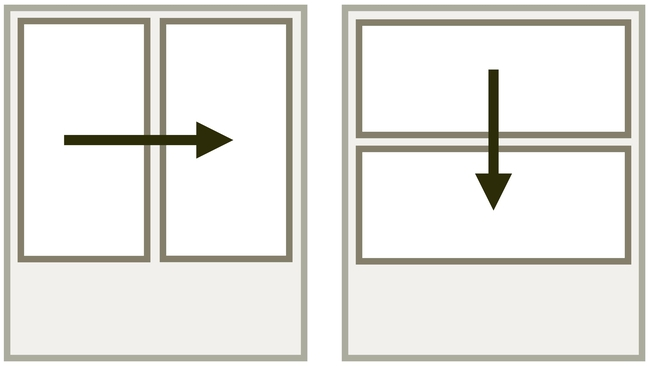
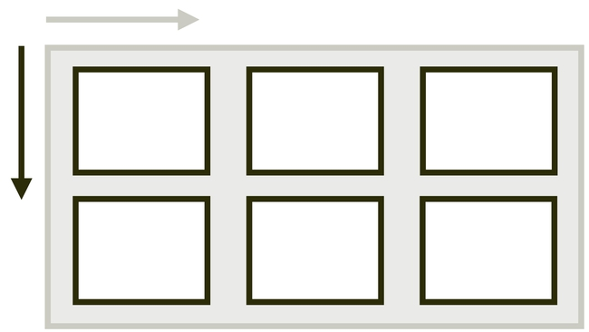
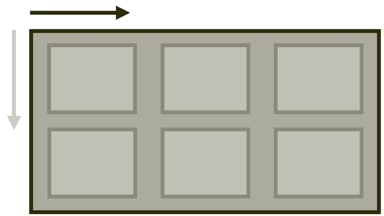
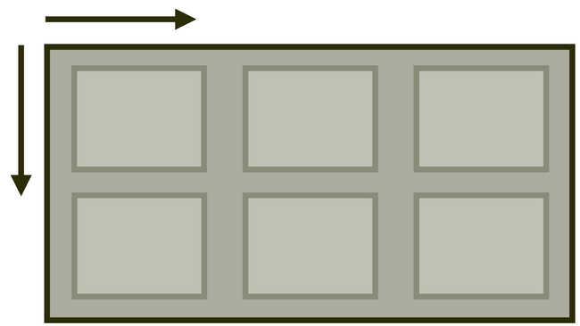
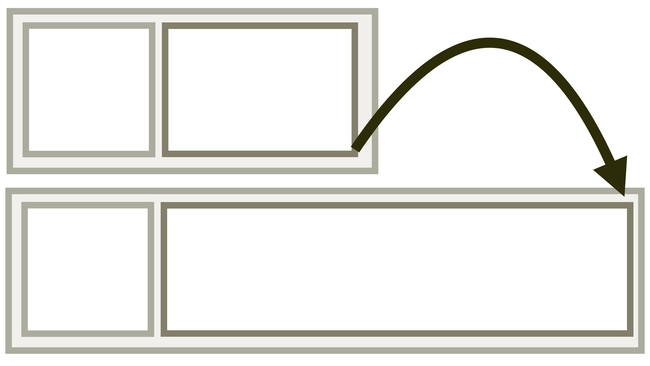
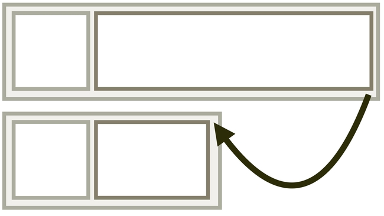
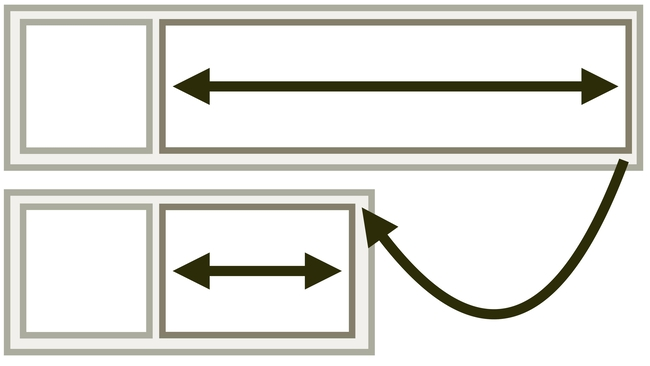
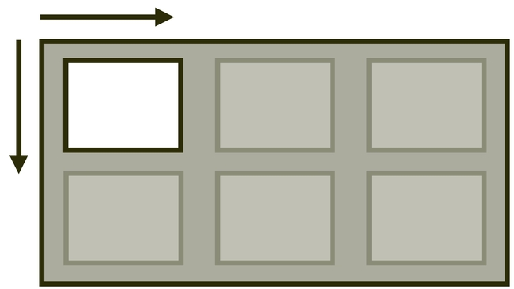

# Flexbox: referenční příručka všech vlastností

<div class="book-index" data-book-index="Flexbox"></div>

Flex v češtině znamená pružný, přizpůsobivý. Flexboxy jsou tedy pružné elementy layoutu. Jednou z hlavních předností flexboxu je totiž schopnost vyplňovat zbylý prostor.

<div class="related web-only" markdown="1">
- [CSS grid](css-grid.md)
- [CSS Multi-column](css-multicolumn.md)
- [CSS Box Alignment](css-box-alignment.md)
</div>

Toto je referenční příručka s příklady pro všechny vlastnosti, které ve flexboxu můžete používat.

## Vlastnosti flexboxu {#vlastnosti}

Vlastnosti se týkají buď kontejneru, tedy rodičovského prvku, nebo položek.

<div class="pbi-avoid" markdown="1">

### Kontejner flexboxu {#vlastnosti-kontejner}

Hodnota [vlastnosti `display`](css-display.md) `flex` nastaví prvku formátovací kontext flexboxu, takže jeho přímí potomci mohou mít specifické vlastnosti.

Můžete také použít „inline“ hodnotu: `inline-flex`, která se chová jako `inline-block`, tedy uvnitř je možné dělat rozvržení, zvenčí jde o součást řádku textu.

<div class="reference-items">

  <article role="article">
    <h4><a href="css-flex-wrap.md">flex-wrap</a></h4>
    <p><a href="css-flex-wrap.md"></a></p>
    <p>Mohou se položky zalamovat? Výchozí stav je nezalamovat. <br>Např. <code>flex-wrap:wrap</code> – položky se mohou vykreslit na další řádek.</p>
  </article>

  <article role="article">
    <h4><a href="css-flex-direction.md">flex-direction</a></h4>
    <p><a href="css-flex-direction.md"></a></p>
    <p>Určí směr toku rozvržení. Výchozí stav je zleva doprava, do řádku. <br>Např. <code>flex-direction:column</code> – položky se skládají shora dolů, do sloupce.</p>
  </article>

  <article role="article">
    <h4><a href="css-flex-flow.md">flex-flow</a></h4>
    <p><a href="css-flex-flow.md"></a></p>
    <p>Zkratka pro <code>flex-wrap</code> a <code>flex-direction</code>. <br>Např. <code>flex-flow:wrap column</code> – položky se zalamují a skládají shora dolů.</p>
  </article>

</div>
<!-- .reference-items -->

</div>
<!-- .pbi-avoid -->

<div class="web-only" markdown="1">
<!-- Kopie z css-multicolumn.md -->

Dále lze na kontejner flexboxu aplikovat také vlastnosti [zarovnání boxů (CSS Box Alignment)](css-box-alignment.md):

<div class="reference-items">

  <article role="article">
    <h4 id="gap"><a href="css-gap.md">gap</a></h4>
    <p><a href="css-gap.md"></a></p>
    <p>
      Definice mezery mezi buňkami. <br>
      <code>gap:1rem;</code>
    </p>
  </article>

  <article role="article">
    <h4><a href="css-align-items.md">align-items</a></h4>
    <p><a href="css-align-items.md"></a></p>
    <p>Zarovnání na blokové ose (obvykle svisle). <br> Např. <code>align-items: end</code> zarovná položky ke spodní hraně kontejneru.</p>
  </article>

  <article role="article">
    <h4><a href="css-place-items.md">place-items</a></h4>
    <p><a href="css-place-items.md"></a></p>
    <p>Zkratka pro zarovnání položek v obou směrech. <br> Např. <code>place-items: end center</code> zarovná položky ke spodní hraně a vodorovně na střed.</p>
  </article>

</div>
<!-- .reference-items -->

K dispozici máme i vlastnosti CSS Box Align, řídící rozdělení volného prostoru, který uvnitř kontejneru zůstává mezi položkami.

<div class="reference-items">

  <article role="article">
    <h4><a href="css-justify-content.md">justify-content</a></h4>
    <p><a href="css-justify-content.md"></a></p>
    <p>Rozdělení prostoru na řádkové ose (obvykle vodorovně). <br> Např. <code>justify-content:space-between</code> rozdělí prostor mezi položky.</p>
  </article>

  <article role="article">
    <h4><a href="css-align-content.md">align-content</a></h4>
    <p><a href="css-align-content.md"></a></p>
    <p>Rozdělení prostoru na blokové ose (obvykle svisle). <br> Např. <code>align-content:start</code> zajistí zarovnání položek k horní hraně kontejneru.</p>
  </article>

  <article role="article">
    <h4><a href="css-place-content.md">place-content</a></h4>
    <p><a href="css-place-content.md"></a></p>
    <p>Zkratka pro rozdělení prostoru v obou směrech. <br> Např. <code>place-content:start space-between</code> zajistí zarovnání položek k horní hraně kontejneru a vodorovné dělení prostoru mezi položky.</p>
  </article>

</div>
<!-- .reference-items -->

<!-- /Kopie z css-multicolumn.md -->
</div>

<div class="pbi-avoid" markdown="1">

### Položky flexboxu {#vlastnosti-polozky}

<div class="reference-items">

  <article role="article">
    <h4><a href="css-flex-grow.md">flex-grow</a></h4>
    <p><a href="css-flex-grow.md"></a></p>
    <p>Jak moc může položka růst. Výchozí je <code>0</code>. <br>Např. <code>flex-grow: 1</code> – podíl na celku hodnoty <code>1</code> z volného prostoru.</p>
  </article>

  <article role="article">
    <h4><a href="css-flex-shrink.md">flex-shrink</a></h4>
    <p><a href="css-flex-shrink.md"></a></p>
    <p>Faktor smršťování položky. Výchozí je <code>1</code>. <br>Např. <code>flex-shrink:0</code> – položka se nesmršťuje.</p>
  </article>

  <article role="article">
    <h4><a href="css-flex-basis.md">flex-basis</a></h4>
    <p><a href="css-flex-basis.md"></a></p>
    <p>Výchozí velikost položky. Výchozí je <code>auto</code>. <br>Např. <code>flex-basis:0</code> – nehledí se na rozměr obsahu ani <code>width</code> či <code>height</code>.</p>
  </article>

  <article role="article">
    <h4><a href="css-flex.md">flex</a></h4>
    <p><a href="css-flex.md"></a></p>
    <p>Zkratka pro vlastnosti <code>flex-grow</code>, <code>flex-shrink</code> a <code>flex-basis</code>. <br>Např. <code>flex:auto</code> – roste, smršťuje se a rozměr je nastavený na <code>auto</code>.</p>
  </article>

</div>
<!-- .reference-items -->

</div>
<!-- .pbi-avoid -->

<div class="web-only" markdown="1">
<!-- Kopie z css-multicolumn.md -->

Také na položky flexboxu můžeme aplikovat vlastnosti [zarovnání boxů](css-box-alignment.md):

Následujícími vlastnostmi pro konkrétní položku definujeme, jak se bude zarovnávat.

<div class="reference-items">

  <article role="article">
    <h4><a href="css-align-self.md">align-self</a></h4>
    <p><a href="css-align-self.md"></a></p>
    <p>Zarovnání na blokové ose (obvykle svisle). <br> Např. <code>align-self:end</code> zarovná položku ke spodní hraně.</p>
  </article>

  <article role="article">
    <h4><a href="css-place-self.md">place-self</a></h4>
    <p><a href="css-place-self.md"></a></p>
    <p>Zkratka pro zarovnání jednotlivé položky v obou směrech. <br> Např. <code>place-self:end center</code> zarovná položku ke spodní hraně a vodorovně doprostřed.</p>
  </article>

</div>
<!-- .reference-items -->

<!-- /Kopie z css-multicolumn.md -->
</div>

Nyní známe vlastnosti a pojďme prozkoumat použití flexboxu v konkrétní situaci.

## Základy v jednoduchém příkladu {#priklad}

Představme si triviální třísloupcový layout:

```html
<div class="container">
  <p class="col col-1">First is loooooong.</p>
  <p class="col col-2">Second is looooonger.<br>…<br>…</p>
  <p class="col col-3">Third is short.</p>
</div>
```

HTML je jednoduché. O to přísnější máme požadavky na design:

- Všechny sloupce mají být stejně vysoké.
- Layout se při nedostatku místa zalomí.
- První dva sloupce jsou pružné, třetí nikoliv.
- Druhý sloupec se zvětšuje a zmenšuje dvakrát tolik než první.
- Na menších displejích do `400px` se prvky vyskládají pod sebe.

<div class="colored-box" markdown="1">

Zkuste si to nakódovat sami, stačí forknout následující CodePen: [vrdl.in/f18lo](https://cdpn.io/e/BaRYjya).

</div>
<!-- .colored-box -->

V dalším textu si ukážeme, jak bych postupoval já.

<!-- AdSnippet -->

### Všechny sloupce mají být stejně vysoké {#priklad-sloupce}

Stejná výška prvků platí i v případech, kdy má jeden sloupec delší obsah než zbylé dva. To je to nejjednodušší. Stačí z rodiče pomocí [vlastnosti `display`](css-display.md) udělat kontejner flexboxu:

```css
.container {
  display: flex;
}
```

### Layout se při nedostatku místa zalomí {#priklad-zalamovani}

V případě, že zde nebude dost prostoru pro všechny položky, zalomíme. To definujeme pomocí [vlastnosti `flex-wrap`](css-flex-wrap.md):

```css
.container {
  flex-wrap: wrap;
}
```

### První dva sloupce jsou pružné, třetí nikoliv {#priklad-treti}

Dále jsme si vymysleli, že první dva sloupce se budou zmenšovat a zvětšovat, přičemž druhý dvakrát více než první. Třetí naopak nikoliv, zůstane vždy na svém. Tady pomůže [zkratka vlastností položky flexboxu, `flex`](css-flex.md):

```css
/* Pružná položka, zabírá jednu část volného místa: */
.col-1 {
  flex: 1;
}

/* Pružná položka, zabírá dvě části volného místa: */
.col-2 {
  flex: 2;
}  

/* Fixně široká položka: */
.col-3 {
  flex: none;
}
```

### Na menších displejích se změní směr {#priklad-smer}

Na mobilech zpravidla není pro rozvržení prvků vedle sebe prostor. Přidáme proto změnu směru layoutu, což zajistíme [vlastností `flex-direction`](css-flex-direction.md):

```css
@media (max-width: 25em) {
  .container {
    flex-direction: column;
  }
}
```

Na obrázku je vidět, k čemu jsme se dopracovali:

<figure class="figure-thirds">

<figcaption markdown="1">
*Je to layout. Je pružný. Je to flexbox.*
</figcaption>
</figure>

Výsledný příklad si utíkejte vyzkoušet naživo:

CodePen: [vrdl.in/lcew2](https://codepen.io/machal/pen/jOVVeVL)

## Základní pojmy: flexboxový kontejner, položka flexboxu, hlavní a příčná osa {#pojmy}

Flexbox tvoří nerozlučná dvojice dvou typů elementů – flexboxový kontejner a položka flexboxu. Flexboxovou položkou se stává každý přímý potomek kontejneru.

```html
<ul class="flex-container">
  <li>…</li>
  <li>…</li>
</ul>
```

Flexbox nadefinujeme snadno jen pomocí kontejneru flexboxu:

```css
.flex-container {
  display: flex;
}
```

Všechny `<li>` se tady stávají položkami flexboxu.

Kromě flexboxových kontejnerů a položek nás v dalším textu budou zajímat ještě osy. Ukažme si je na zjednodušeném schématu:

<figure>

<figcaption markdown="1">
*Schéma vnitřních struktur flexboxu.*
</figcaption>
</figure>

- kontejner flexboxu – rodičovský element
- flexboxová položka – všichni přímí potomci kontejneru
- hlavní osa – výchozí je vodorovná, ale toto lze změnit
- příčná osa – vždy příčná k hlavní, takže ve výchozí podobě je svislá
- hlavní rozměr – výchozí je šířka, ale řídí se nastavením hlavní osy
- příčný rozměr – výchozí je výška

## Podpora {#podpora}

Dostupnost vlastností flexboxu v prohlížečích je velmi dobrá, vždyť s podporou přišel už [Internet Explorer](msie.md) 10! Grafy na CanIUse jsou tedy pěkně zelené. [caniuse.com/flexbox](https://caniuse.com/flexbox)

<figure class="figure-thirds">

<figcaption markdown="1">
*Paráda. Podpora flexboxu v moderních prohlížečích je takřka bezchybná. Zdroj: [CanIUse.com](https://caniuse.com/flexbox).*
</figcaption>
</figure>

Konkrétní podporu je ale potřeba rozdělit podle jednotlivých vlastností uvedených výše v tabulce. Tam už je situace různorodější.

<div class="web-only" markdown="1">

Bojem s více či méně příjemnými chybami je provázena práce v Internet Exploreru, protože jde o nejstarší dnes sloužící prohlížeč. Detailně se tím zabýváme v textu [o podpoře CSS layoutu](css-layout-bugy.md) v prohlížečích. Není to ale nic vážného, tento prohlížeč od Microsoftu už prakticky vymřel a chyby v něm nejsou tak velké.

</div>

<div class="ebook-only" markdown="1">

Bojem s více či méně příjemnými chybami je provázena práce v Internet Exploreru, protože jde o nejstarší dnes sloužící prohlížeč. Detailně se tím zabýváme v textu [o podpoře CSS layoutu](css-layout-bugy.md) v osmé kapitole.

</div>

<!-- AdSnippet -->
